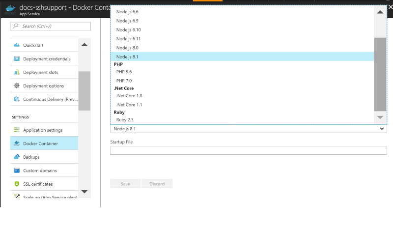
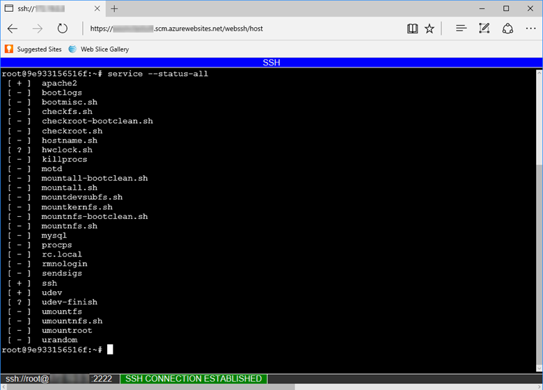

# SSH support for Azure App Service on Linux

[Secure Shell (SSH)](https://wikipedia.org/wiki/Secure_Shell) is commonly used to execute administrative commands remotely from a command-line terminal. App Service on Linux provides SSH support into the app container with each of the built-in Docker images used for the Runtime Stack of new web apps. 



For custom Docker images, by configuring SSH server in your custom image.

You can also connect to the container directly from your local development machine using SSH and SFTP.

## Open SSH session in browser

To make an SSH client connection with your container, your app should be running.

Paste the following URL into your browser and replace \<app_name> with your app name:

```
https://<app_name>.scm.azurewebsites.net/webssh/host
```

If you are not already authenticated, you are required to authenticate with your Azure subscription to connect. Once authenticated, you see an in-browser shell, where you can run commands inside your container.



## Use SSH support with custom Docker images

In order for a custom Docker image to support SSH communication between the container and the client in the Azure portal, perform the following steps for your Docker image.

These steps are shown in the Azure App Service repository as [an example](https://github.com/Azure-App-Service/node/blob/master/6.9.3/).

1. Include the `openssh-server` installation in [`RUN` instruction](https://docs.docker.com/engine/reference/builder/#run) in the Dockerfile for your image and set the password for the root account to `"Docker!"`.

    > [!NOTE]
    > This configuration does not allow external connections to the container. SSH can only
    > be accessed via the Kudu / SCM Site, which is authenticated using the publishing
    > credentials.

    ```docker
    # ------------------------
    # SSH Server support
    # ------------------------
    RUN apt-get update \
    	&& apt-get install -y --no-install-recommends openssh-server \
    	&& echo "root:Docker!" | chpasswd
    ```

1. Add a [`COPY` instruction](https://docs.docker.com/engine/reference/builder/#copy) to the Dockerfile to copy a [sshd_config](http://man.openbsd.org/sshd_config) file to the */etc/ssh/* directory. Your configuration file should be based on the sshd_config file in the Azure-App-Service GitHub repository [here](https://github.com/Azure-App-Service/node/blob/master/8.2.1/sshd_config).

    > [!NOTE]
    > The *sshd_config* file must include the following or the connection fails: 
    > * `Ciphers` must include at least one of the following: `aes128-cbc,3des-cbc,aes256-cbc`.
    > * `MACs` must include at least one of the following: `hmac-sha1,hmac-sha1-96`.

    ```docker
    COPY sshd_config /etc/ssh/
    ```

1. Include port 2222 in the [`EXPOSE` instruction](https://docs.docker.com/engine/reference/builder/#expose) for the Dockerfile. Although the root password is known, port 2222 cannot be accessed from the internet. It is an internal only port accessible only by containers within the bridge network of a private virtual network.

    ```docker
    EXPOSE 2222 80
    ```

1. Make sure to start the SSH service using a shell script (see example at [init_container.sh](https://github.com/Azure-App-Service/node/blob/master/6.9.3/startup/init_container.sh)).

    ```bash
    #!/bin/bash
    service ssh start
    ```

The Dockerfile uses the [`ENTRYPOINT` instruction](https://docs.docker.com/engine/reference/builder/#entrypoint) to run the script.

```docker
COPY init_container.sh /opt/startup
...
RUN chmod 755 /opt/startup/init_container.sh
...
ENTRYPOINT ["/opt/startup/init_container.sh"]
```

## Open SSH session from remote shell

> [!NOTE]
> This feature is currently in Preview.
>

Using TCP tunneling you can create a network connection between your development machine and Web App for Containers over an authenticated WebSocket connection. It enables you to open an SSH session with your container running in App Service from the client of your choice.

To get started, you need to install [Azure CLI](/cli/azure/install-azure-cli?view=azure-cli-latest). To see how it works without installing Azure CLI, open [Azure Cloud Shell](../../cloud-shell/overview.md). 

Add the latest App Service extension by running [az extension add](/cli/azure/extension?view=azure-cli-latest#az-extension-add):

```azurecli-interactive
az extension add --name webapp
```

If you've already run `az extension add` before, run [az extension update](/cli/azure/extension?view=azure-cli-latest#az-extension-update) instead:

```azurecli-interactive
az extension update --name webapp
```

Open a remote connection to your app using the [az webapp remote-connection create](/cli/azure/ext/webapp/webapp/remote-connection?view=azure-cli-latest#ext-webapp-az-webapp-remote-connection-create) command. Specify _\<subscription\_id>_, _\<group\_name>_ and \_<app\_name>_ for your app, and replace \<port> with a local port number.

```azurecli-interactive
az webapp remote-connection create --subscription <subscription_id> --resource-group <group_name> -n <app_name> -p <port> &
```

> [!TIP]
> `&` at the end of the command is just for convenience if you are using Cloud Shell. It runs the process in the background so that you can run the next command in the same shell.

The command output gives you the information you need to open an SSH session.

```
Port 21382 is open
SSH is available { username: root, password: Docker! }
Start your favorite client and connect to port 21382
```

Open an SSH session with your container with the client of your choice, using the local port. The following example uses the default [ssh](https://ss64.com/bash/ssh.html) command:

```azurecli-interactive
ssh root@127.0.0.1 -p <port>
```

When being prompted, type `yes` to continue connecting. You are then prompted for the password. Use `Docker!`, which was shown to you earlier.

```
Warning: Permanently added '[127.0.0.1]:21382' (ECDSA) to the list of known hosts.
root@127.0.0.1's password:
```

Once you're authenticated, you should see the session welcome screen.

```
  _____
  /  _  \ __________ _________   ____
 /  /_\  \___   /  |  \_  __ \_/ __ \
/    |    \/    /|  |  /|  | \/\  ___/
\____|__  /_____ \____/ |__|    \___  >
        \/      \/                  \/
A P P   S E R V I C E   O N   L I N U X

0e690efa93e2:~#
```

You are now connected to your connector. 

Try running the [top](https://ss64.com/bash/top.html) command. You should be able to see your app's process in the process list. In the example output below, it's the one with `PID 263`.

```
Mem: 1578756K used, 127032K free, 8744K shrd, 201592K buff, 341348K cached
CPU:   3% usr   3% sys   0% nic  92% idle   0% io   0% irq   0% sirq
Load average: 0.07 0.04 0.08 4/765 45738
  PID  PPID USER     STAT   VSZ %VSZ CPU %CPU COMMAND
    1     0 root     S     1528   0%   0   0% /sbin/init
  235     1 root     S     632m  38%   0   0% PM2 v2.10.3: God Daemon (/root/.pm2)
  263   235 root     S     630m  38%   0   0% node /home/site/wwwroot/app.js
  482   291 root     S     7368   0%   0   0% sshd: root@pts/0
45513   291 root     S     7356   0%   0   0% sshd: root@pts/1
  291     1 root     S     7324   0%   0   0% /usr/sbin/sshd
  490   482 root     S     1540   0%   0   0% -ash
45539 45513 root     S     1540   0%   0   0% -ash
45678 45539 root     R     1536   0%   0   0% top
45733     1 root     Z        0   0%   0   0% [init]
45734     1 root     Z        0   0%   0   0% [init]
45735     1 root     Z        0   0%   0   0% [init]
45736     1 root     Z        0   0%   0   0% [init]
45737     1 root     Z        0   0%   0   0% [init]
45738     1 root     Z        0   0%   0   0% [init]
```

## Next steps

You can post questions and concerns on the [Azure forum](https://social.msdn.microsoft.com/forums/azure/home?forum=windowsazurewebsitespreview).

For more information on Web App for Containers, see:

* [Introducing remote debugging of Node.js apps on Azure App Service from VS Code](https://medium.com/@auchenberg/introducing-remote-debugging-of-node-js-apps-on-azure-app-service-from-vs-code-in-public-preview-9b8d83a6e1f0)
* [How to use a custom Docker image for Web App for Containers](quickstart-docker-go.md)
* [Using .NET Core in Azure App Service on Linux](quickstart-dotnetcore.md)
* [Using Ruby in Azure App Service on Linux](quickstart-ruby.md)
* [Azure App Service Web App for Containers FAQ](app-service-linux-faq.md)
