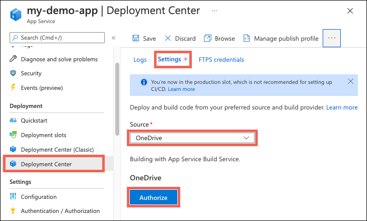

# Sync content from a cloud folder to Azure App Service
This article shows you how to sync your content to [Azure App Service](./overview.md) from Dropbox and OneDrive. 

With the content sync approach, your work with your app code and content in a designated cloud folder to make sure it's in a ready-to-deploy state, and then sync to App Service with the click of a button. 

Because of underlying differences in the APIs, **OneDrive for Business** is not supported at this time.

> [!NOTE]
> The **Development Center (Classic)** page in the Azure portal, which is the old deployment experience, will be deprecated in March, 2021. This change will not affect any existing deployment settings in your app, and you can continue to manage app deployment in the **Deployment Center** page.

## Enable content sync deployment

1. In the [Azure portal](https://portal.azure.com), navigate to the management page for your App Service app.

1. From the left menu, click **Deployment Center** > **Settings**. 

1. In **Source**, select **OneDrive** or **Dropbox**.

1. Click **Authorize** and follow the authorization prompts. 

    

    You only need to authorize with OneDrive or Dropbox once for your Azure account. To authorize a different OneDrive or Dropbox account for an app, click **Change account**.

1. In **Folder**, select the folder to synchronize. This folder is created under the following designated content path in OneDrive or Dropbox. 
   
    * **OneDrive**: `Apps\Azure Web Apps`
    * **Dropbox**: `Apps\Azure`
    
1. Click **Save**.

## Synchronize content

# [Azure portal](#tab/portal)

1. In the [Azure portal](https://portal.azure.com), navigate to the management page for your App Service app.

1. From the left menu, click **Deployment Center** > **Redeploy/Sync**. 

    
   
1. Click **OK** to confirm the sync.

# [Azure CLI](#tab/cli)

Start a sync by running the following command and replacing \<group-name> and \<app-name>:

```azurecli-interactive
az webapp deployment source sync --resource-group <group-name> --name <app-name>
```

# [Azure PowerShell](#tab/powershell)

Start a sync by running the following command and replacing \<group-name> and \<app-name>:

```azurepowershell-interactive
Invoke-AzureRmResourceAction -ResourceGroupName <group-name> -ResourceType Microsoft.Web/sites -ResourceName <app-name> -Action sync -ApiVersion 2019-08-01 -Force –Verbose
```

-----

## Disable content sync deployment

1. In the [Azure portal](https://portal.azure.com), navigate to the management page for your App Service app.

1. From the left menu, click **Deployment Center** > **Settings** > **Disconnect**. 

    

[!INCLUDE [What happens to my app during deployment?](../../includes/app-service-deploy-atomicity.md)]

## OneDrive and Dropbox integration retirements

On September 30th, 2023 the integrations for Microsoft OneDrive and Dropbox for Azure App Service and Azure Functions will be retired. If you are using OneDrive or Dropbox, you should [disable content sync deployments](#disable-content-sync-deployment) from OneDrive and Dropbox. Then, you can set up deployments from any of the following alternatives

- [GitHub Actions](deploy-github-actions.md)
- [Azure DevOps Pipelines](/azure/devops/pipelines/targets/webapp?view=azure-devops)
- [Azure CLI](./deploy-zip.md?tabs=cli)
- [VS Code](./deploy-zip.md?tabs=cli)
- [Local Git Repository](./deploy-local-git.md?tabs=cli)

## Next steps

> [!div class="nextstepaction"]
> [Deploy from local Git repo](deploy-local-git.md)