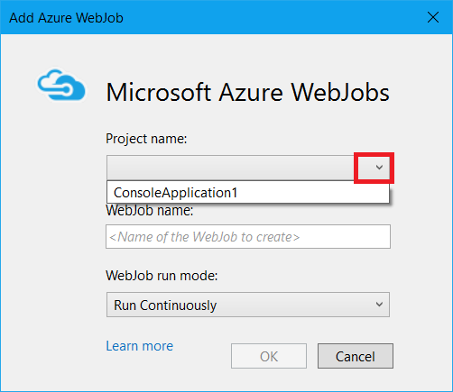
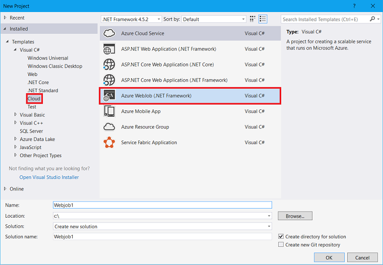
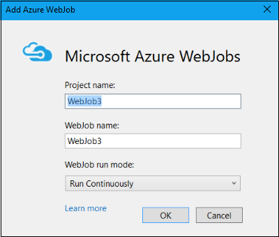

# Develop and deploy WebJobs using Visual Studio - Azure App Service

## Overview

This topic explains how to use Visual Studio to deploy a Console Application project to a web app in [App Service](app-service-web-overview.md) as an [Azure WebJob](http://go.microsoft.com/fwlink/?LinkId=390226). For information about how to deploy WebJobs by using the [Azure portal](https://portal.azure.com), see [Run Background tasks with WebJobs](web-sites-create-web-jobs.md).

When Visual Studio deploys a WebJobs-enabled Console Application project, it performs two tasks:

* Copies runtime files to the appropriate folder in the web app (*App_Data/jobs/continuous* for continuous WebJobs, *App_Data/jobs/triggered* for scheduled and on-demand WebJobs).
* Sets up [Azure Scheduler](https://docs.microsoft.com/azure/scheduler/) jobs for WebJobs that are scheduled to run at particular times. (This is not needed for continuous WebJobs.)

A WebJobs-enabled project has the following items added to it:

* The [Microsoft.Web.WebJobs.Publish](http://www.nuget.org/packages/Microsoft.Web.WebJobs.Publish/) NuGet package.
* A [webjob-publish-settings.json](#publishsettings) file that contains deployment and scheduler settings. 

You can add these items to an existing Console Application project or use a template to create a new WebJobs-enabled Console Application project. 

You can deploy a project as a WebJob by itself, or link it to a web project so that it automatically deploys whenever you deploy the web project. To link projects, Visual Studio includes the name of the WebJobs-enabled project in a [webjobs-list.json](#webjobslist) file in the web project.

## Prerequisites

If you're using Visual Studio 2015, install the [Azure SDK for .NET (Visual Studio 2015)](https://azure.microsoft.com/downloads/).

If you're using Visual Studio 2017, install the [Azure development workload](https://docs.microsoft.com/visualstudio/install/install-visual-studio#step-4---select-workloads).

##  Enable WebJobs deployment for an existing Console Application project

You have two options:

* [Enable automatic deployment with a web project](#convertlink).

  Configure an existing Console Application project so that it automatically deploys as a WebJob when you deploy a web project. Use this option when you want to run your WebJob in the same web app in which you run the related web application.

* [Enable deployment without a web project](#convertnolink).

  Configure an existing Console Application project to deploy as a WebJob by itself, with no link to a web project. Use this option when you want to run a WebJob in a web app by itself, with no web application running in the web app. You might want to do this in order to be able to scale your WebJob resources independently of your web application resources.

###  Enable automatic WebJobs deployment with a web project

1. Right-click the web project in **Solution Explorer**, and then click **Add** > **Existing Project as Azure WebJob**.
   
    
   
    The [Add Azure WebJob](#configure) dialog box appears.
2. In the **Project name** drop-down list, select the Console Application project to add as a WebJob.
   
    
3. Complete the [Add Azure WebJob](#configure) dialog, and then click **OK**. 

###  Enable WebJobs deployment without a web project
1. Right-click the Console Application project in **Solution Explorer**, and then click **Publish as Azure WebJob...**. 
   
    
   
    The [Add Azure WebJob](#configure) dialog box appears, with the project selected in the **Project name** box.
2. Complete the [Add Azure WebJob](#configure) dialog box, and then click **OK**.
   
   The **Publish Web** wizard appears.  If you do not want to publish immediately, close the wizard. The settings that you've entered are saved for when you do want to [deploy the project](#deploy).

## Create a new WebJobs-enabled project
To create a new WebJobs-enabled project, you can use the Console Application project template and enable WebJobs deployment as explained in [the previous section](#convert). As an alternative, you can use the WebJobs new-project template:

* [Use the WebJobs new-project template for an independent WebJob](#createnolink)
  
    Create a project and configure it to deploy by itself as a WebJob, with no link to a web project. Use this option when you want to run a WebJob in a web app by itself, with no web application running in the web app. You might want to do this in order to be able to scale your WebJob resources independently of your web application resources.
* [Use the WebJobs new-project template for a WebJob linked to a web project](#createlink)
  
    Create a project that is configured to deploy automatically as a WebJob when a web project in the same solution is deployed. Use this option when you want to run your WebJob in the same web app in which you run the related web application.

> [!NOTE]
> The WebJobs new-project template automatically installs NuGet packages and includes code in *Program.cs* for the [WebJobs SDK](http://www.asp.net/aspnet/overview/developing-apps-with-windows-azure/getting-started-with-windows-azure-webjobs). If you don't want to use the WebJobs SDK, remove or change the `host.RunAndBlock` statement in *Program.cs*.
> 
> 

###  Use the WebJobs new-project template for an independent WebJob
1. Click **File** > **New Project**, and then in the **New Project** dialog box click **Cloud** > **Azure WebJob (.NET Framework)**.
   
    
2. Follow the directions shown earlier to [make the Console Application project an independent WebJobs project](#convertnolink).

###  Use the WebJobs new-project template for a WebJob linked to a web project
1. Right-click the web project in **Solution Explorer**, and then click **Add** > **New Azure WebJob Project**.
   
    
   
    The [Add Azure WebJob](#configure) dialog box appears.
2. Complete the [Add Azure WebJob](#configure) dialog box, and then click **OK**.

## The Add Azure WebJob dialog
The **Add Azure WebJob** dialog lets you enter the WebJob name and run mode setting for your WebJob. 

The fields in this dialog correspond to fields on the **Add WebJob** dialog of the Azure portal. For more information, see [Run Background tasks with WebJobs](web-sites-create-web-jobs.md).

> [!NOTE]
> * For information about command-line deployment, see [Enabling Command-line or Continuous Delivery of Azure WebJobs](https://azure.microsoft.com/blog/2014/08/18/enabling-command-line-or-continuous-delivery-of-azure-webjobs/).
> * If you deploy a WebJob and then decide you want to change the type of WebJob and redeploy, you'll need to delete the *webjobs-publish-settings.json* file. This will make Visual Studio show the publishing options again, so you can change the type of WebJob.
> * If you deploy a WebJob and later change the run mode from continuous to non-continuous or vice versa, Visual Studio creates a new WebJob in Azure when you redeploy. If you change other scheduling settings but leave run mode the same or switch between Scheduled and On Demand, Visual Studio updates the existing job rather than create a new one.
> 
> 

## webjob-publish-settings.json
When you configure a Console Application for WebJobs deployment, Visual Studio installs the [Microsoft.Web.WebJobs.Publish](http://www.nuget.org/packages/Microsoft.Web.WebJobs.Publish/) NuGet package 
and stores scheduling information in a *webjob-publish-settings.json* file in the project *Properties* folder of the WebJobs project. Here is an example of that file:

        {
          "$schema": "http://schemastore.org/schemas/json/webjob-publish-settings.json",
          "webJobName": "WebJob1",
          "startTime": "null",
          "endTime": "null",
          "jobRecurrenceFrequency": "null",
          "interval": null,
          "runMode": "Continuous"
        }

You can edit this file directly, and Visual Studio provides IntelliSense. The file schema is stored at [http://schemastore.org](http://schemastore.org/schemas/json/webjob-publish-settings.json) and can be viewed there.  

## webjobs-list.json
When you link a WebJobs-enabled project to a web project, Visual Studio stores the name of the WebJobs project in a *webjobs-list.json* file in the web project's *Properties* folder. The list might contain multiple WebJobs projects, as shown in the following example:

        {
          "$schema": "http://schemastore.org/schemas/json/webjobs-list.json",
          "WebJobs": [
            {
              "filePath": "../ConsoleApplication1/ConsoleApplication1.csproj"
            },
            {
              "filePath": "../WebJob1/WebJob1.csproj"
            }
          ]
        }

You can edit this file directly, and Visual Studio provides IntelliSense. The file schema is stored at [http://schemastore.org](http://schemastore.org/schemas/json/webjobs-list.json) and can be viewed there.

## Deploy a WebJobs project
A WebJobs project that you have linked to a web project deploys automatically with the web project. For information about web project deployment, see **How-to guides** > **Deploy app** in the left navigation.

To deploy a WebJobs project by itself, right-click the project in **Solution Explorer** and click **Publish as Azure WebJob...**. 

For an independent WebJob, the same **Publish Web** wizard that is used for web projects appears, but with fewer settings available to change.
