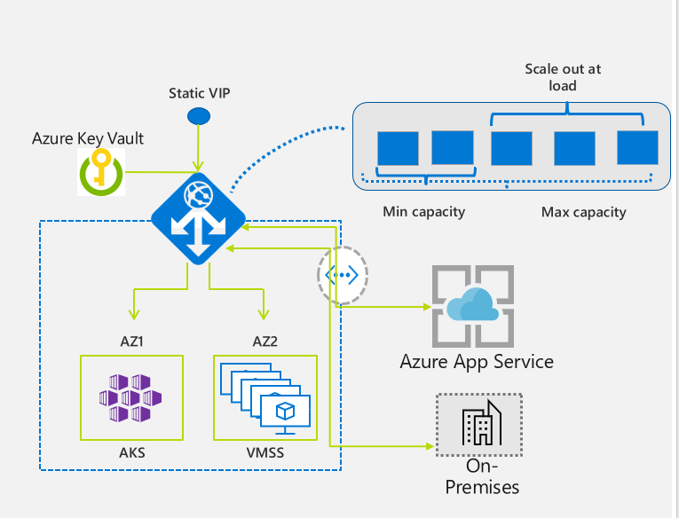

# Autoscaling and Zone-redundant Application Gateway (Public Preview)

Application Gateway and Web Application Firewall (WAF) are now available in Public Preview under a new v2 SKU that offers performance enhancements and adds support for critical new features like autoscaling, zone redundancy, and support for static VIPs. Existing features under the generally available SKU continue to be supported in the new v2 SKU, with a few exceptions listed in known limitations section. The new v2 SKUs include the following enhancements:

- **Autoscaling**: Application Gateway or WAF deployments under the autoscaling SKU can scale up or down based on changing traffic load patterns. Autoscaling also removes the requirement to choose a deployment size or instance count during provisioning. This SKU offers true elasticity. In the new SKU, Application Gateway can operate both in fixed capacity (autoscaling disabled) and in autoscaling enabled mode. Fixed capacity mode is useful for scenarios with consistent and predictable workloads. Autoscaling mode is beneficial in applications that see lots of variances in the application traffic.

- **Zone redundancy**: An Application Gateway or WAF deployment can span multiple Availability Zones, removing the need to provision and spin separate Application Gateway instances in each zone with a Traffic Manager. You can choose a single zone or multiple zones where Application Gateway instances are deployed, thus ensuring zone failure resiliency. The backend pool for applications can be similarly distributed across availability zones.
- **Performance enhancements**: The autoscaling SKU offers up to 5X better SSL offload performance as compared to the generally available SKU.
- **Faster deployment and update time** The autoscaling SKU provides faster deployment and update time as compared to the generally available SKU.
- **Static VIP**: The application gateway VIP now supports the static VIP type exclusively. This ensures that the VIP associated with application gateway doesn't change even after a restart.

> [!IMPORTANT]
> The autoscaling and zone-redundant application gateway SKU is currently in public preview. This preview is provided without a service level agreement and is not recommended for production workloads. Certain features may not be supported or may have constrained capabilities. See the [Supplemental Terms of Use for Microsoft Azure Previews](https://azure.microsoft.com/support/legal/preview-supplemental-terms/) for details.

## Feature comparison between v1 SKU and v2 SKU

The following table compares the features available with each SKU.

|                                                   | v1 SKU   | v2 SKU   |
| ------------------------------------------------- | -------- | -------- |
| Autoscaling                                       |          | &#x2713; |
| Zone redundancy                                   |          | &#x2713; |
| &nbsp;Static VIP&nbsp;&nbsp;                      |          | &#x2713; |
| URL-based routing                                 | &#x2713; | &#x2713; |
| Multiple-site hosting                             | &#x2713; | &#x2713; |
| Traffic redirection                               | &#x2713; | &#x2713; |
| Web application firewall (WAF)                    | &#x2713; | &#x2713; |
| Secure Sockets Layer (SSL) termination            | &#x2713; | &#x2713; |
| End-to-end SSL encryption                         | &#x2713; | &#x2713; |
| Session affinity                                  | &#x2713; | &#x2713; |
| Custom error pages                                | &#x2713; | &#x2713; |
| Rewrite HTTP(S) headers                           |          | &#x2713; |
| WebSocket support                                 | &#x2713; | &#x2713; |
| HTTP/2 support                                    | &#x2713; | &#x2713; |
| Connection draining                               | &#x2713; | &#x2713; |
| Azure Kubernetes Service (AKS) Ingress controller |          | &#x2713; |

## Supported regions

The autoscaling SKU is available in the following regions: North Central US, South Central US, West US, West US 2, East US, East US 2, Central US, North Europe, West Europe, Southeast Asia, France Central, UK West, Japan East, Japan West.

## Pricing

During preview, there's no charge. You are billed for resources other than application gateway, such as Key Vault, virtual machines, and so on.

## Known issues and limitations

|Issue|Details|
|--|--|
|Authentication certificate|Not supported. For more information, see [Overview of end to end SSL with Application Gateway](ssl-overview.md#end-to-end-ssl-with-the-v2-sku).|
|Mixing Standard_v2 and Standard Application Gateway on the same subnet|Not supported|
|User Defined Route (UDR) on Application Gateway subnet|Not supported|
|NSG for Inbound port range| - 65200 to 65535 for Standard_v2 SKU - 65503 to 65534 for Standard SKU. For more information, see the [FAQ](application-gateway-faq.md#are-network-security-groups-supported-on-the-application-gateway-subnet).|
|Performance logs in Azure diagnostics|Not supported. Azure metrics should be used.|
|Billing|There is no billing currently.|
|FIPS mode|These are currently not supported.|
|ILB only mode|This is currently not supported. Public and ILB mode together is supported.|
|Netwatcher integration|Not supported in the Public Preview.|

## Next steps
- [Create an autoscaling, zone redundant application gateway with a reserved virtual IP address using Azure PowerShell](tutorial-autoscale-ps.md)
- Learn more about [Application Gateway](overview.md).
- Learn more about [Azure Firewall](../firewall/overview.md).
