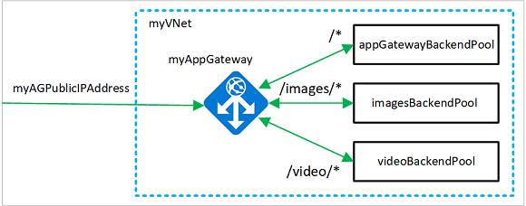
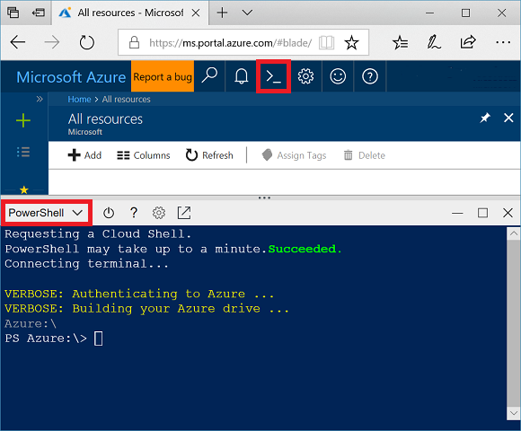

# Create an application gateway with path-based routing rules using the Azure portal

You can use the Azure portal to configure [URL path-based routing rules](application-gateway-url-route-overview.md) when you create an [application gateway](application-gateway-introduction.md). In this tutorial, you create backend pools using virtual machines. You then create routing rules that make sure web traffic arrives at the appropriate servers in the pools.

In this article, you learn how to:

> [!div class="checklist"]
> * Create an application gateway
> * Create virtual machines for backend servers
> * Create backend pools with the backend servers
> * Create a backend listener
> * Create a path-based routing rule



If you don't have an Azure subscription, create a [free account](https://azure.microsoft.com/free/?WT.mc_id=A261C142F) before you begin.

[!INCLUDE [updated-for-az](../../includes/updated-for-az.md)]

## Sign in to Azure

Sign in to the Azure portal at [https://portal.azure.com](https://portal.azure.com)

## Create virtual machines

In this example, you create three virtual machines to be used as backend servers for the application gateway. You also install IIS on the virtual machines to verify that the application gateway works as expected.

1. On the Azure portal, select **Create a resource**.
2. Select **Windows Server 2016 Datacenter** in the Popular list.
3. Enter these values for the virtual machine:

    - **Resource group**, select **Create new**, and then type *myResourceGroupAG*.
    - **Virtual machine name**: *myVM1*
    - **Region**: *(US) East US*
    - **Username**: *azureuser*
    - **Password**: *Azure123456!*


4. Select **Next:Disks**.
5. Select **Next:Networking**
6. For **Virtual network**, select **Create new** and then type these values for the virtual network:

   - *myVNet* - for the name of the virtual network.
   - *10.0.0.0/16* - for the virtual network address space.
   - *myBackendSubnet* for the first subnet name
   - *10.0.1.0/24* - for the subnet address space.
   - *myAGSubnet* - for the second subnet name.
   - *10.0.0.0/24* - for the subnet address space.
7. Select **OK**.

8. Ensure that under **Network Interface**, **myBackendSubnet** is selected for the subnet, and then select **Next: Management**.
9. Select **Off** to disable boot diagnostics.
10. Click **Review + Create**, review the settings on the summary page, and then select **Create**.
11. Create two more virtual machines, *myVM2* and *myVM3* and place them in the *MyVNet* virtual network and the *myBackendSubnet* subnet.

### Install IIS

1. Open the interactive shell and make sure that it's set to **PowerShell**.

    

2. Run the following command to install IIS on the virtual machine: 

    ```azurepowershell
         $publicSettings = @{ "fileUris" = (,"https://raw.githubusercontent.com/Azure/azure-docs-powershell-samples/master/application-gateway/iis/appgatewayurl.ps1");  "commandToExecute" = "powershell -ExecutionPolicy Unrestricted -File appgatewayurl.ps1" }

        Set-AzVMExtension `
         -ResourceGroupName myResourceGroupAG `
         -Location eastus `
         -ExtensionName IIS `
         -VMName myVM1 `
         -Publisher Microsoft.Compute `
         -ExtensionType CustomScriptExtension `
         -TypeHandlerVersion 1.4 `
         -Settings $publicSettings
    ```

3. Create two more virtual machines and install IIS using the steps that you just finished. Enter the names of *myVM2* and *myVM3* for the names and for the values of VMName in Set-AzVMExtension.

## Create an application gateway

1. Select **Create a resource** on the left menu of the Azure portal. The **New** window appears.

2. Select **Networking** and then select **Application Gateway** in the **Featured** list.

### Basics tab

1. On the **Basics** tab, enter these values for the following application gateway settings:

   - **Resource group**: Select **myResourceGroupAG** for the resource group.
   - **Application gateway name**: Enter *myAppGateway* for the name of the application gateway.
   - **Region** - Select **(US) East US**.

        

2.  Under **Configure virtual network**, select **myVNet** for the name of the virtual network.
3. Select **myAGSubnet** for the subnet.
3. Accept the default values for the other settings and then select **Next: Frontends**.

### Frontends tab

1. On the **Frontends** tab, verify **Frontend IP address type** is set to **Public**.

   > [!NOTE]
   > For the Application Gateway v2 SKU, you can only choose **Public** frontend IP configuration. Private frontend IP configuration is currently not enabled for this v2 SKU.

2. Choose **Create new** for the **Public IP address** and enter *myAGPublicIPAddress* for the public IP address name, and then select **OK**. 
3. Select **Next: Backends**.

### Backends tab

The backend pool is used to route requests to the backend servers that serve the request. Backend pools can be composed of NICs, virtual machine scale sets, public IPs, internal IPs, fully qualified domain names (FQDN), and multi-tenant back-ends like Azure App Service.

1. On the **Backends** tab, select **+Add a backend pool**.

2. In the **Add a backend pool** window that opens, enter the following values to create an empty backend pool:

    - **Name**: Enter *myBackendPool* for the name of the backend pool.
3. Under **Backend Targets**, **Target type**, select **Virtual machine** from the drop-down list.

5. Under **Target** select the network interface for **myVM1**.
6. Select **Add**.
7. Repeat to add an *Images* backend pool with *myVM2* as the target, and a *Video* backend pool with *myVM3* as the target.
8. Select **Add** to save the backend pool configuration and return to the **Backends** tab.

4. On the **Backends** tab, select **Next: Configuration**.

### Configuration tab

On the **Configuration** tab, you'll connect the frontend and backend pool you created using a routing rule.

1. Select **Add a rule** in the **Routing rules** column.

2. In the **Add a routing rule** window that opens, enter *myRoutingRule* for the **Rule name**.

3. A routing rule requires a listener. On the **Listener** tab within the **Add a routing rule** window, enter the following values for the listener:

    - **Listener name**: Enter *myListener* for the name of the listener.
    - **Frontend IP**: Select **Public** to choose the public IP you created for the frontend.
    - **Port**: Type *8080*
  
        Accept the default values for the other settings on the **Listener** tab, then select the **Backend targets** tab to configure the rest of the routing rule.

4. On the **Backend targets** tab, select **myBackendPool** for the **Backend target**.

5. For the **HTTP setting**, select **Create new** to create a new HTTP setting. The HTTP setting will determine the behavior of the routing rule. 

6. In the **Add an HTTP setting** window that opens, enter *myHTTPSetting* for the **HTTP setting name**. Accept the default values for the other settings in the **Add an HTTP setting** window, then select **Add** to return to the **Add a routing rule** window.
7. Under **Path-based routing**, select **Add multiple targets to create a path-based rule**.
8. For **Path**, type */images/*\*.
9. For **Path rule name**, type *Images*.
10. For **HTTP setting**, select **myHTTPSetting**
11. For **Backend target**, select **Images**.
12. Select **Add** to save the path rule and return to the **Add a routing rule** tab.
13. Repeat to add another rule for Video.
14. Select **Add** to add the routing rule and return to the **Configuration** tab.
15. Select **Next: Tags** and then **Next: Review + create**.

> [!NOTE]
> You do not need to add a custom */** path rule to handle default cases. This is automatically handled by the default backend pool.

### Review + create tab

Review the settings on the **Review + create** tab, and then select **Create** to create the virtual network, the public IP address, and the application gateway. It may take several minutes for Azure to create the application gateway. Wait until the deployment finishes successfully before moving on to the next section.


## Test the application gateway

1. Select **All resources**, and then select **myAppGateway**.

    

2. Copy the public IP address, and then paste it into the address bar of your browser. Such as, http:\//52.188.72.175:8080.

    

   The listener on port 8080 routes this request to the default backend pool.

3. Change the URL to *http://&lt;ip-address&gt;:8080/images/test.htm*, replacing &lt;ip-address&gt; with your IP address, and you should see something like the following example:

    

   The listener on port 8080 routes this request to the *Images* backend pool.

4. Change the URL to *http://&lt;ip-address&gt;:8080/video/test.htm*, replacing &lt;ip-address&gt; with your IP address, and you should see something like the following example:

    

   The listener on port 8080 routes this request to the *Video* backend pool.


## Next steps

- [Enabling end to end SSL on Azure Application Gateway](application-gateway-backend-ssl.md)
