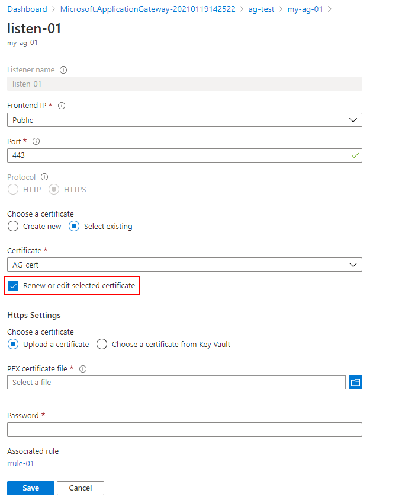

# Renew Application Gateway certificates

At some point, you'll need to renew your certificates if you configured your application gateway for SSL encryption.

You can renew a certificate associated with a listener using either the Azure portal or Azure PowerShell:

## Azure portal

To renew a listener certificate from the portal, navigate to your application gateway listeners. Click the listener that has a certificate that needs to be renewed, and then click **Renew or edit selected certificate**.



Upload your new PFX certificate, give it a name, type the password, and then click **Save**.

## Azure PowerShell

To renew your certificate using Azure PowerShell, use the following cmdlet:

```PowerShell
$appgw = Get-AzureRmApplicationGateway `
  -ResourceGroupName <ResourceGroup> `
  -Name <AppGatewayName>

$password = ConvertTo-SecureString `
  -String "<password>" `
  -Force `
  -AsPlainText

set-azureRmApplicationGatewaySSLCertificate -Name <oldcertname> `
-ApplicationGateway $appgw -CertificateFile <newcertPath> -Password $password
```

## Next steps

To learn how to configure SSL Offloading with Azure Application Gateway, see [Configure SSL Offload](application-gateway-ssl-portal.md)
