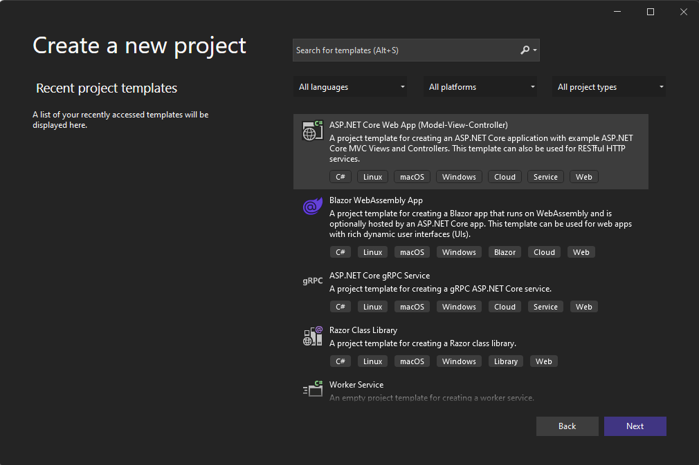
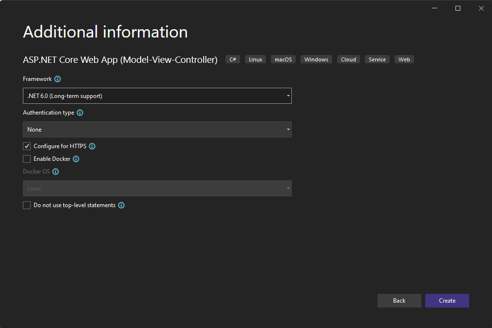
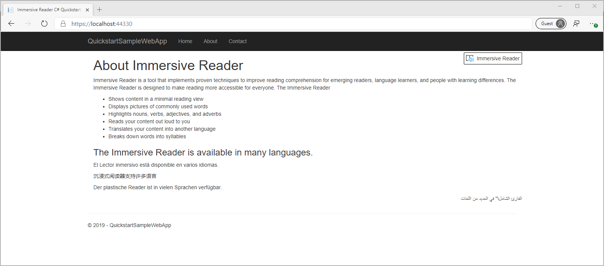
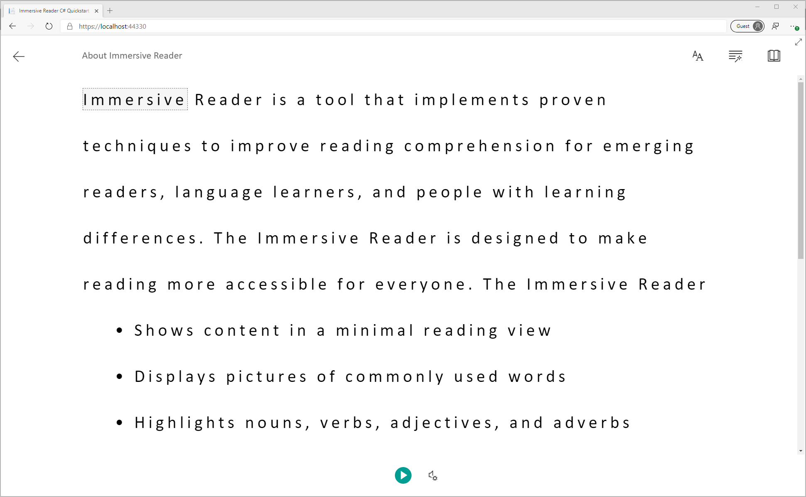

[Immersive Reader](https://www.onenote.com/learningtools) is an inclusively designed tool that implements proven techniques to improve reading comprehension for new readers, language learners, and people with learning differences such as dyslexia. You can use Immersive Reader in your applications to isolate text to improve focus, display pictures for commonly used words, highlight parts of speech, read selected text out loud, translate words and phrases in real-time, and more.

In this quickstart, you build a web app from scratch and integrate Immersive Reader using the Immersive Reader client library. A full working sample of this quickstart is available [on GitHub](https://github.com/microsoft/immersive-reader-sdk/tree/master/js/samples/quickstart-csharp).

## Prerequisites

* Azure subscription - [Create one for free](https://azure.microsoft.com/free/cognitive-services)
* [Visual Studio 2019](https://visualstudio.microsoft.com/downloads)
* An Immersive Reader resource configured for Azure Active Directory authentication. Follow [these instructions](../../how-to-create-immersive-reader.md) to get set up. You will need some of the values created here when configuring the sample project properties. Save the output of your session into a text file for future reference.

## Create a web app project

Create a new project in Visual Studio, using the ASP.NET Core Web Application template with built-in Model-View-Controller, and ASP.NET Core 2.1. Name the project "QuickstartSampleWebApp".






## Set up authentication

### Configure authentication values

Right-click on the project in the _Solution Explorer_ and choose **Manage User Secrets**. This will open a file called _secrets.json_. This file isn't checked into source control. Learn more [here](/aspnet/core/security/app-secrets?tabs=windows). Replace the contents of _secrets.json_ with the following, supplying the values given when you created your Immersive Reader resource.

```json
{
  "TenantId": "YOUR_TENANT_ID",
  "ClientId": "YOUR_CLIENT_ID",
  "ClientSecret": "YOUR_CLIENT_SECRET",
  "Subdomain": "YOUR_SUBDOMAIN"
}
```

### Install Active Directory NuGet package

The following code uses objects from the **Microsoft.IdentityModel.Clients.ActiveDirectory** NuGet package so you'll need to add a reference to that package in your project.

Open the NuGet Package Manager Console from **Tools -> NuGet Package Manager -> Package Manager Console** and run the following command:

```powershell
    Install-Package Microsoft.IdentityModel.Clients.ActiveDirectory -Version 5.2.0
```

### Update the controller to acquire the token 

Open _Controllers\HomeController.cs_, and add the following code after the _using_ statements at the top of the file.

```csharp
using Microsoft.IdentityModel.Clients.ActiveDirectory;
```

Now, we'll configure the controller to obtain the Azure AD values from _secrets.json_. At the top of the _HomeController_ class, after ```public class HomeController : Controller {```, add the following code.

```csharp
private readonly string TenantId;     // Azure subscription TenantId
private readonly string ClientId;     // Azure AD ApplicationId
private readonly string ClientSecret; // Azure AD Application Service Principal password
private readonly string Subdomain;    // Immersive Reader resource subdomain (resource 'Name' if the resource was created in the Azure portal, or 'CustomSubDomain' option if the resource was created with Azure CLI PowerShell. Check the Azure portal for the subdomain on the Endpoint in the resource Overview page, for example, 'https://[SUBDOMAIN].cognitiveservices.azure.com/')

public HomeController(Microsoft.Extensions.Configuration.IConfiguration configuration)
{
    TenantId = configuration["TenantId"];
    ClientId = configuration["ClientId"];
    ClientSecret = configuration["ClientSecret"];
    Subdomain = configuration["Subdomain"];

    if (string.IsNullOrWhiteSpace(TenantId))
    {
        throw new ArgumentNullException("TenantId is null! Did you add that info to secrets.json?");
    }

    if (string.IsNullOrWhiteSpace(ClientId))
    {
        throw new ArgumentNullException("ClientId is null! Did you add that info to secrets.json?");
    }

    if (string.IsNullOrWhiteSpace(ClientSecret))
    {
        throw new ArgumentNullException("ClientSecret is null! Did you add that info to secrets.json?");
    }

    if (string.IsNullOrWhiteSpace(Subdomain))
    {
        throw new ArgumentNullException("Subdomain is null! Did you add that info to secrets.json?");
    }
}

/// <summary>
/// Get an Azure AD authentication token
/// </summary>
private async Task<string> GetTokenAsync()
{
    string authority = $"https://login.windows.net/{TenantId}";
    const string resource = "https://cognitiveservices.azure.com/";

    AuthenticationContext authContext = new AuthenticationContext(authority);
    ClientCredential clientCredential = new ClientCredential(ClientId, ClientSecret);

    AuthenticationResult authResult = await authContext.AcquireTokenAsync(resource, clientCredential);

    return authResult.AccessToken;
}

[HttpGet]
public async Task<JsonResult> GetTokenAndSubdomain()
{
    try
    {
        string tokenResult = await GetTokenAsync();

        return new JsonResult(new { token = tokenResult, subdomain = Subdomain });
    }
    catch (Exception e)
    {
        string message = "Unable to acquire Azure AD token. Check the debugger for more information.";
        Debug.WriteLine(message, e);
        return new JsonResult(new { error = message });
    }
}
```

## Add sample content
First, open _Views\Shared\Layout.cshtml_. Before the line ```</head>```, add the following code:

```html
@RenderSection("Styles", required: false)
```

Now, we'll add sample content to this web app. Open _Views\Home\Index.cshtml_ and replace all automatically generated code with this sample:

```html
@{
    ViewData["Title"] = "Immersive Reader C# Quickstart";
}

@section Styles {
    <style type="text/css">
        .immersive-reader-button {
            background-color: white;
            margin-top: 5px;
            border: 1px solid black;
            float: right;
        }
    </style>
}

<div class="container">
    <button class="immersive-reader-button" data-button-style="iconAndText" data-locale="en"></button>

    <h1 id="ir-title">About Immersive Reader</h1>
    <div id="ir-content" lang="en-us">
        <p>
            Immersive Reader is a tool that implements proven techniques to improve reading comprehension for emerging readers, language learners, and people with learning differences.
            The Immersive Reader is designed to make reading more accessible for everyone. The Immersive Reader
            <ul>
                <li>
                    Shows content in a minimal reading view
                </li>
                <li>
                    Displays pictures of commonly used words
                </li>
                <li>
                    Highlights nouns, verbs, adjectives, and adverbs
                </li>
                <li>
                    Reads your content out loud to you
                </li>
                <li>
                    Translates your content into another language
                </li>
                <li>
                    Breaks down words into syllables
                </li>
            </ul>
        </p>
        <h3>
            The Immersive Reader is available in many languages.
        </h3>
        <p lang="es-es">
            El Lector inmersivo está disponible en varios idiomas.
        </p>
        <p lang="zh-cn">
            沉浸式阅读器支持许多语言
        </p>
        <p lang="de-de">
            Der plastische Reader ist in vielen Sprachen verfügbar.
        </p>
        <p lang="ar-eg" dir="rtl" style="text-align:right">
            يتوفر \"القارئ الشامل\" في العديد من اللغات.
        </p>
    </div>
</div>
```

Notice that all of the text has a **lang** attribute, which describes the languages of the text. This attribute helps the Immersive Reader provide relevant language and grammar features.

## Add JavaScript to handle launching Immersive Reader

The Immersive Reader library provides functionality such as launching the Immersive Reader, and rendering Immersive Reader buttons. Learn more [here](../../reference.md).

At the bottom of _Views\Home\Index.cshtml_, add the following code:

```html
@section Scripts
{
    <script src="https://ircdname.azureedge.net/immersivereadersdk/immersive-reader-sdk.1.2.0.js"></script>
    <script>
        function getTokenAndSubdomainAsync() {
            return new Promise(function (resolve, reject) {
                $.ajax({
                    url: "@Url.Action("GetTokenAndSubdomain", "Home")",
                    type: "GET",
                    success: function (data) {
                        if (data.error) {
                            reject(data.error);
                        } else {
                            resolve(data);
                        }
                    },
                    error: function (err) {
                        reject(err);
                    }
                });
            });
        }
    
        $(".immersive-reader-button").click(function () {
            handleLaunchImmersiveReader();
        });
    
        function handleLaunchImmersiveReader() {
            getTokenAndSubdomainAsync()
                .then(function (response) {
                    const token = response["token"];
                    const subdomain = response["subdomain"];
    
                    // Learn more about chunk usage and supported MIME types https://docs.microsoft.com/en-us/azure/cognitive-services/immersive-reader/reference#chunk
                    const data = {
                        title: $("#ir-title").text(),
                        chunks: [{
                            content: $("#ir-content").html(),
                            mimeType: "text/html"
                        }]
                    };
    
                    // Learn more about options https://docs.microsoft.com/en-us/azure/cognitive-services/immersive-reader/reference#options
                    const options = {
                        "onExit": exitCallback,
                        "uiZIndex": 2000
                    };
    
                    ImmersiveReader.launchAsync(token, subdomain, data, options)
                        .catch(function (error) {
                            alert("Error in launching the Immersive Reader. Check the console.");
                            console.log(error);
                        });
                })
                .catch(function (error) {
                    alert("Error in getting the Immersive Reader token and subdomain. Check the console.");
                    console.log(error);
                });
        }
    
        function exitCallback() {
            console.log("This is the callback function. It is executed when the Immersive Reader closes.");
        }
    </script>
}
```

## Build and run the app

From the menu bar, select **Debug > Start Debugging**, or press **F5** to start the application.

In your browser, you should see:



## Launch the Immersive Reader

When you click on the "Immersive Reader" button, you'll see the Immersive Reader launched with the content on the page.



## Next steps

> [!div class="nextstepaction"]
> [Create a resource and configure AAD](../../how-to-create-immersive-reader.md)