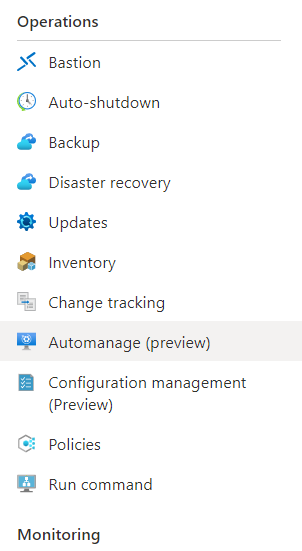
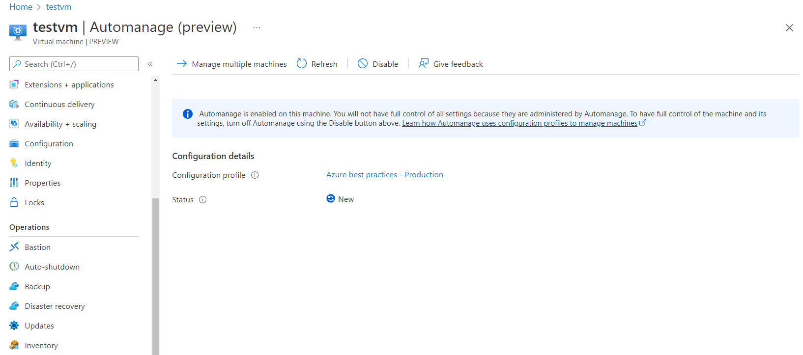

# Tutorial: Create a virtual machine and assign an Automanage profile to it

In this tutorial, you'll create a resource group and a virtual machine. You'll then assign an Automanage Best Practices configuration profile to the new machine using the Python SDK.

## Prerequisites 

- [Python](https://www.python.org/downloads/)
- [Azure CLI](/cli/azure/install-azure-cli-windows?tabs=azure-cli) or [Azure PowerShell](/powershell/azure/install-az-ps)

## Create resources

### Sign in to Azure 

Sign in to Azure by using following command:

# [Azure CLI](#tab/azure-cli)
```azurecli
az login
```
# [Azure PowerShell](#tab/azure-powershell)
```azurepowershell
Connect-AzAccount
```
---

### Create resource group

Create a resource group:

# [Azure CLI](#tab/azure-cli)
```azurecli
az group create --name "test-rg" --location "eastus"
```
# [Azure PowerShell](#tab/azure-powershell)
```azurepowershell
new-azResourceGroup -Name "test-rg" -Location "eastus"
```

---
### Create virtual machine

Create a Windows virtual machine:

# [Azure CLI](#tab/azure-cli)
```azurecli
az vm create `
    --resource-group "test-rg" `
    --name "testvm" `
    --location "eastus" `
    --image win2016datacenter `
    --admin-username testUser `
    --size Standard_D2s_v3 `
    --storage-sku Standard_LRS
```
# [Azure PowerShell](#tab/azure-powershell)
```azurepowershell
New-AzVm `
    -ResourceGroupName 'test-rg' `
    -Name 'testvm' `
    -Location 'eastus' `
    -VirtualNetworkName 'testvm-vnet' `
    -SubnetName 'testvm-subnet' `
    -SecurityGroupName 'test-vm-nsg'
```

---
## Assign best practices profile to virtual machine

Now that we've successfully created a resource group and a virtual machine, it's time to set up a Python project and assign an Automanage Best Practices configuration profile to the newly created virtual machine.

### Install Python packages

Install the Azure Identity and Azure Automanage packages using `pip`:

```
pip install azure-mgmt-automanage
pip install azure-identity
```

### Import packages

Create an `app.py` file and import the installed packages within it:

```python
from azure.identity import DefaultAzureCredential
from azure.mgmt.automanage import AutomanageClient
```

Set some local variables: 

```python
sub = "<sub ID>"
rg = "test-rg"
vm = "testvm"
```

### Authenticate to Azure and create an Automanage client

Use the **DefaultAzureCredential** within the `azure-identity` package to **authenticate** to Azure. Then, use the credential to create an **Automanage Client**.

```python
credential = DefaultAzureCredential()
client = AutomanageClient(credential, sub)
```

### Create a best practices profile assignment 

Now we'll create an assignment between our new virtual machine and a Best Practices profile: 

```python
assignment = {
    "properties": {
        "configurationProfile": "/providers/Microsoft.Automanage/bestPractices/AzureBestPracticesProduction",
    }
}

# assignment name must be 'default'
client.configuration_profile_assignments.create_or_update(
    "default", rg, vm, assignment)
```

Run the python file: 

`python app.py`

---
## View Assignment in the portal

Navigate to the virtual machine and select the **Automanage** blade: 


View the Automanage Profile now enabled on the virtual machine:


## Next steps

For more information on the Automanage Python SDK, please visit the [azure-samples-python-management repo](https://github.com/Azure-Samples/azure-samples-python-management/tree/main/samples/automanage).
