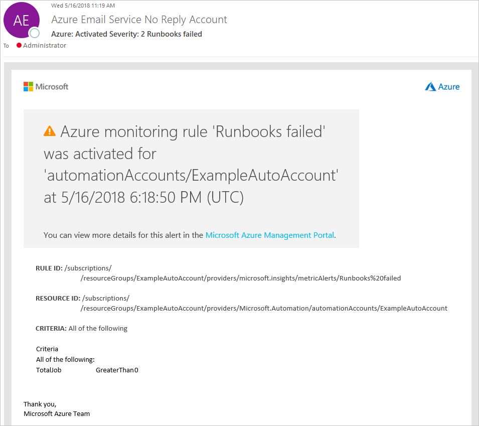

# Monitor runbooks with metric alerts

In this article, you learn how to create a [metric alert](../azure-monitor/alerts/alerts-metric-overview.md) based on runbook completion status.

## Sign in to Azure

Sign in to the [Azure portal](https://portal.azure.com)

## Create alert

Alerts allow you to define a condition to monitor for and an action to take when that condition is met.

1. Launch the Azure Automation service in the Azure portal by clicking **All services**, then searching for and selecting **Automation Accounts**.

2. In your list of Automation accounts, select the account you want to create an alert for. 

3. Under **Monitoring**, select **Alerts** and then select **+ New Alert Rule**. The scope for the target is already defined and associated with your Automation account.

### Configure alert criteria

1. Click **Select Condition**. Select **Metrics** for the **Signal type**, and choose **Total Jobs** from the list.

2. The **Configure signal logic** page is where you define the logic that triggers the alert. Under the historical graph you are presented with two dimensions, **Runbook Name** and **Status**. Dimensions are different properties for a metric that can be used to filter results. For **Runbook Name**, select the runbook you want to alert on or leave blank to alert on all runbooks. For **Status**, select a status from the drop-down you want to monitor for. The runbook name and status values that appear in the dropdown are only for jobs that have ran in the past week.

   If you want to alert on a status or runbook that isn't shown in the dropdown, click the **Add custom value** option next to the dimension. This action opens a dialog that allows you to specify a custom value, which hasn't emitted for that dimension recently. If you enter a value that doesn't exist for a property your alert won't be triggered.For list of job statuses, see [Job statuses](automation-runbook-execution.md#job-statuses).

   > [!NOTE]
   > If you don't specify a name for the **Runbook Name** dimension, if there are any runbooks that meet the status criteria, which includes hidden system runbooks, you will receive an alert.

    For example, to alert when a runbook returns a _Failed_ status, in addition to specifying the runbook name, for the **Status** dimension add the custom dimension value **Failed**.

    :::image type="content" source="./media/automation-alert-metric/specify-dimension-custom-value.png" alt-text="Specify custom dimension value" border="false":::

3. Under **Alert logic**, define the condition and threshold for your alert. A preview of your condition defined is shown underneath.

4. Under **Evaluated based on**, select the timespan for the query and how often you want that query to run. For example, if you choose **Over the last 5 minutes** for **Period**, and **Every 1 Minute** for **Frequency**, the alert looks for the number of runbooks that met your criteria over the past 5 minutes. This query is run every minute, and once the alert criteria you defined is no longer found in a 5-minute window, the alert resolves itself. When finished, click **Done**.

   

### Define the action to take

1. Under **Action group**, select **Specify action group**. An action group is a group of actions that you can use across more than one alert. These can include but aren't limited to, email notifications, runbooks, webhooks, and many more. To learn more about action groups and steps to create one that sends an email notification, see [Create and manage action groups](../azure-monitor/alerts/action-groups.md).

### Define alert details

1. Under **Alert rule details**, give the alert a friendly name and description. Set the **Severity** to match your alert condition. There are five severities ranging from 0 to 5. The alerts are treated the same independent of the severity, you can match the severity to match your business logic.

1. By default rules are enabled at creation, unless you select **No** for the option **Enable alert rule upon creation**. For alerts created in a disabled state, you can enable them in the future when you are ready. Select **Create alert rule** to save your changes.

## Receive notification

When the alert criteria is met, the action group runs the action defined. In this article's example, an email is sent. The following image is an example of an email you receive after the alert is triggered:

Once the metric is no longer outside of the threshold defined, the alert is deactivated and the action group runs the action defined. If an email action type is selected, a resolution email is sent stating it has been resolved.

## Next steps

* For more information, see [Use an alert to trigger an Azure Automation runbook](automation-create-alert-triggered-runbook.md).
