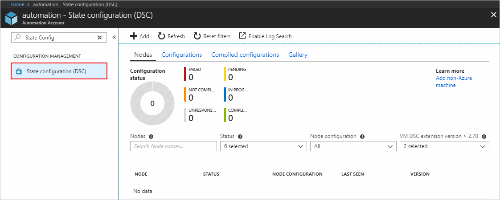

---
title: Azure Automation DSC Overview | Microsoft Docs
description: An Overview of Azure Automation Desired State Configuration (DSC), its terms, and known issues
services: automation
documentationcenter: dev-center-name
author: georgewallace
manager: carmonm
keywords: powershell dsc, desired state configuration, powershell dsc azure

ms.assetid: fd40cb68-c1a6-48c3-bba2-710b607d1555
ms.service: automation
ms.devlang: NA
ms.topic: article
ms.tgt_pltfrm: powershell
ms.workload: TBD
ms.date: 06/15/2017
ms.author: gwallace
---

# Azure Automation DSC Overview

Azure Automation DSC is an Azure service that allows you to write, manage, and compile PowerShell Desired State Configuration (DSC)
[configurations](https://msdn.microsoft.com/powershell/dsc/configurations), import [DSC Resources](https://msdn.microsoft.com/powershell/dsc/resources),
and assign configurations to target nodes, all in the cloud.

## Why use Azure Automation DSC

Azure Automation DSC provides several advantages over using DSC outside of Azure.

### Built-in pull server

Azure Automation provides a [DSC pull server](https://msdn.microsoft.com/en-us/powershell/dsc/pullserver) so that target nodes automatically receive configurations, conform to the desired state, and report back on their compliance.
The built-in pull server in Azure Automation eliminates the need to set up and maintain your own pull server.
Azure Automation can target virtual or physical Windows or Linux machines, in the cloud or on-premises.

### Management of all your DSC artifacts

Azure Automation DSC brings the same management layer to [PowerShell Desired State Configuration](https://msdn.microsoft.com/powershell/dsc/overview) as Azure Automation offers for PowerShell scripting.

From the Azure portal, or from PowerShell, you can manage all your DSC configurations, resources, and target nodes.

### Import reporting data into Log Analytics

Nodes that are managed with Azure Automation DSC send detailed reporting status data to the built-in pull server.
You can configure Azure Automation DSC to send this data to your Log Analytics workspace.
To learn how to send DSC status data to your Log Analytics workspace, see [Forward Azure Automation DSC reporting data to Log Analytics](automation-dsc-diagnostics.md).

## Introduction video

Prefer watching to reading? Have a look at the following video from May 2015, when Azure Automation DSC was first announced.

>[!NOTE]
>While the concepts and life cycle discussed in this video are correct, Azure Automation DSC has progressed a lot since this video was recorded.
>It is now generally available, has a much more extensive UI in the Azure portal, and supports many additional capabilities.

> [!VIDEO https://channel9.msdn.com/Events/Ignite/2015/BRK3467/player]

## Next steps

* To learn how to onboard nodes to be managed with Azure Automation DSC, see [Onboarding machines for management by Azure Automation DSC](automation-dsc-onboarding.md)
* To get started using Azure Automation DSC, see [Getting started with Azure Automation DSC](automation-dsc-getting-started.md)
* To learn about compiling DSC configurations so that you can assign them to target nodes, see [Compiling configurations in Azure Automation DSC](automation-dsc-compile.md)
* For PowerShell cmdlet reference for Azure Automation DSC, see [Azure Automation DSC cmdlets](/powershell/module/azurerm.automation/#automation)
* For pricing information, see [Azure Automation DSC pricing](https://azure.microsoft.com/pricing/details/automation/)
* To see an example of using Azure Automation DSC in a continuous deployment pipeline, see 
   [Continuous Deployment to IaaS VMs Using Azure Automation DSC and Chocolatey](automation-dsc-cd-chocolatey.md)