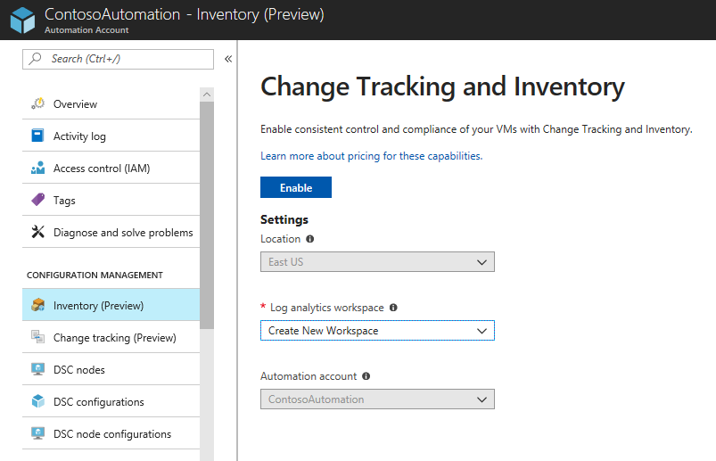
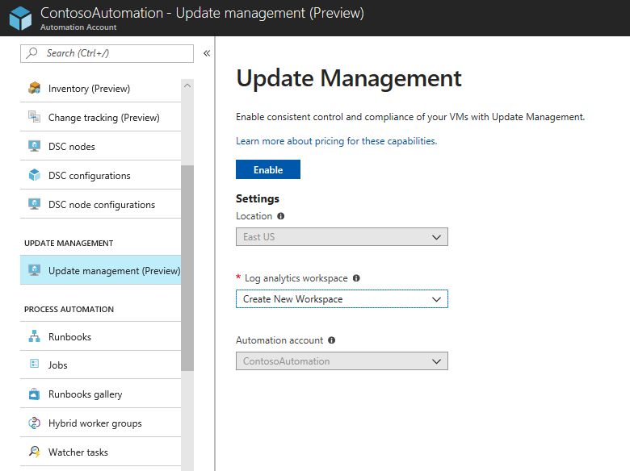

# Onboard update and change tracking solutions to Azure Automation

In this tutorial, you learn how to automatically onboard Update, Change Tracking, and Inventory solutions for VMs to Azure Automation:

> [!div class="checklist"]
> * Onboard an Azure VM
> * Enable solutions
> * Install and update modules
> * Import the onboarding runbook
> * Start the runbook

## Prerequisites

To complete this tutorial, the following are required:

* Azure subscription. If you don't have one yet, you can [activate your MSDN subscriber benefits](https://azure.microsoft.com/pricing/member-offers/msdn-benefits-details/) or sign up for a [free account](https://azure.microsoft.com/free/?WT.mc_id=A261C142F).
* [Automation account](automation-offering-get-started.md) to manage machines.
* A [virtual machine](../virtual-machines/windows/quick-create-portal.md) to onboard.

## Onboard an Azure VM

There are multiple ways to onboard machines, you can onboard the solution [from a virtual machine](automation-onboard-solutions-from-vm.md), [from your Automation account](automation-onboard-solutions-from-automation-account.md), or by runbook. This tutorial walks through through enabling Update Management through a runbook. To onboard Azure Virtual Machines at scale, an existing VM must be onboarded with the Change tracking or Update management solution. In this step, you onboard a virtual machine with Update management, and Change tracking.

### Enable Change Tracking and Inventory

The Change Tracking and Inventory solution provides the ability to [track changes](automation-vm-change-tracking.md) and [inventory](automation-vm-inventory.md) on your virtual machines. In this step, you enable the solution on a virtual machine.

1. From the left menu, select **Automation Accounts**, and then select your automation account in the list.
1. Select **Inventory** under **CONFIGURATION MANAGEMENT**.
1. Select an existing Log Analytics workspace or create new. Click the **Enable** button.

When the change tracking and inventory solution onboarding notification completes, click on **Update Management** under **CONFIGURATION MANAGEMENT**.

### Enable Update Management

The Update Management solution allows you to manage updates and patches for your Azure Windows VMs. You can assess the status of available updates, schedule installation of required updates, and review deployment results to verify updates were applied successfully to the VM. In this step, you enable the solution for your VM.

1. From your Automation Account, select **Update management** under **UPDATE MANAGEMENT**.
1. The Log analytics workspace selected is the same workspace used in the preceding step. Click **Enable** to onboard the Update management solution.

While the Update management solution is being installed, a blue banner is shown. When the solution is enabled select **Change tracking** under **CONFIGURATION MANAGEMENT** to go to the next step.

### Select Azure VM to be managed

Now that the solutions are enabled, you can add an Azure VM to onboard to those solutions.

1. From your Automation Account, on the **Change tracking** page, select **+ Add Azure VM** to add your virtual machine.

1. Select your VM from the list and select **Enable**. This action enables the Change tacking and Inventory solution for the virtual machine.

   

1. When the VM onboarding notification completes, from your Automation Account select **Update management** under **UPDATE MANAGEMENT**.

1. Select **+ Add Azure VM** to add your virtual machine.

1. Select your VM from the list and select **Enable**. This action enables the Update management solution for the virtual machine.

   

> [!NOTE]
> If you do not wait for the other solution to complete, when Enabling the next solution you receive a message stating: *Installation of another solution is in progress on this or a different virtual machine. When that installation completes the Enable button is enabled, and you can request installation of the solution on this virtual machine.*

## Install and update modules

It is required to update to the latest Azure modules and import `AzureRM.OperationalInsights` to successfully automate solution onboarding.

## Update Azure Modules

From your Automation Account, select **Modules** under **SHARED RESOURCES**. Select **Update Azure Modules** to update the Azure modules to the latest version. Select **Yes** on the prompt to update all existing Azure modules to the latest version.

### Install AzureRM.OperationalInsights module

From the **Modules** page, select **Browse gallery** to open up the module gallery. Search for AzureRM.OperationalInsights and import this module into the Automation account.

## Import the onboarding runbook

1. From your Automation Account, select on **Runbooks** under the **PROCESS AUTOMATION**.
1. Select **Browse gallery**.
1. Search for **update and change tracking**, click the runbook and select **Import** on the **View Source** page. Select **OK** to import the runbook into the Automation account.

  

1. On the **Runbook** page, select **Edit**, then select **Publish**. On the **Publish Runbook** dialog, select **Yes** to publish the runbook.

## Start the runbook

You must have onboarded either change tracking or update solutions to an Azure VM in order to start this runbook. It requires an existing virtual machine and resource group with the solution onboarded for parameters.

1. Open the Enable-MultipleSolution runbook.

   

1. Click the start button and enter the following values for parameters.

   * **VMNAME** - Leave blank. The name of an existing VM to onboard to update or change tracking solution. By leaving this value blank, all VMs in the resource group are onboarded.
   * **VMRESOURCEGROUP** - The name of the resource group for the VMs to be onboarded.
   * **SUBSCRIPTIONID** - Leave blank. The subscription ID of the new VM to be onboarded. If left blank, the subscription of the workspace is used. When a different subscription ID is given, the RunAs account for this automation account should be added as a contributor for this subscription also.
   * **ALREADYONBOARDEDVM** - The name of the VM that was manually onboarded to either the Updates or ChangeTracking solution.
   * **ALREADYONBOARDEDVMRESOURCEGROUP** - The name of the resource group that the VM is a member of.
   * **SOLUTIONTYPE** - Enter **Updates** or **ChangeTracking**

   

1. Select **OK** to start the runbook job.
1. Monitor progress and any errors on the runbook job page.

## Next steps

In this tutorial, you learned how to:

> [!div class="checklist"]
> * Onboard an Azure virtual machine manually.
> * Install and update required Azure modules.
> * Import a runbook that onboards Azure VMs.
> * Start the runbook that onboards Azure VMs automatically.

Follow this link to learn more about scheduling runbooks.

> [!div class="nextstepaction"]
> [Scheduling runbooks](automation-schedules.md).
