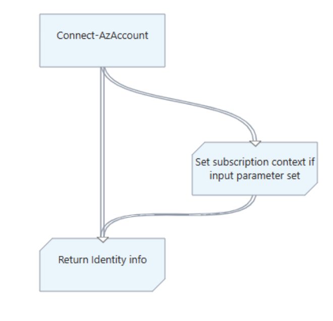
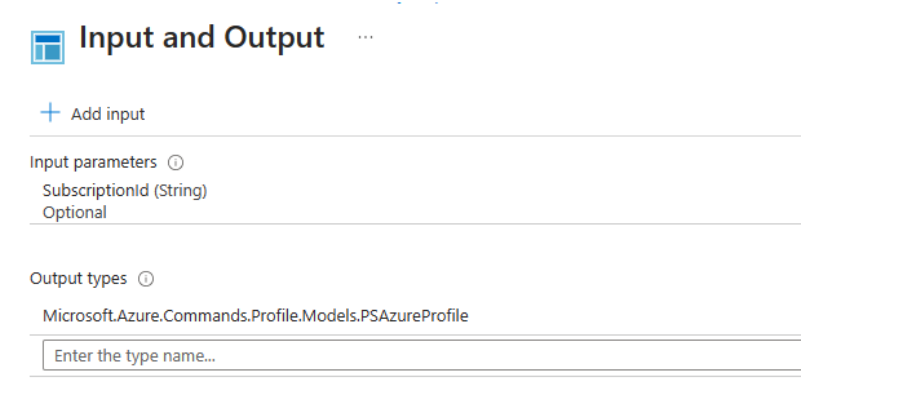
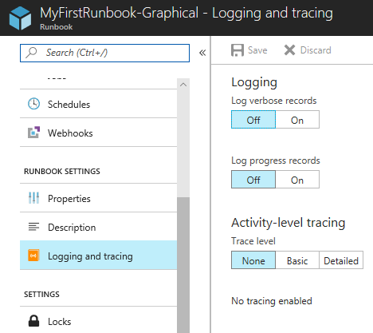

# Runbook output and messages in Azure Automation
Most Azure Automation runbooks have some form of output such as an error message to the user or a complex object intended to be consumed by another workflow. Windows PowerShell provides [multiple streams](https://blogs.technet.com/heyscriptingguy/archive/2014/03/30/understanding-streams-redirection-and-write-host-in-powershell.aspx) to send output from a script or workflow. Azure Automation works with each of these streams differently, and you should follow best practices for how to use each when you are creating a runbook.

The following table provides a brief description of each of the streams and their behavior in the Azure portal both when running a published runbook and when [testing a runbook](automation-testing-runbook.md). Further details on each stream are provided in subsequent sections.

| Stream | Description | Published | Test |
|:--- |:--- |:--- |:--- |
| Output |Objects intended to be consumed by other runbooks. |Written to the job history. |Displayed in the Test Output Pane. |
| Warning |Warning message intended for the user. |Written to the job history. |Displayed in the Test Output Pane. |
| Error |Error message intended for the user. Unlike an exception, the runbook continues after an error message by default. |Written to the job history. |Displayed in the Test Output Pane. |
| Verbose |Messages providing general or debugging information. |Written to job history only if verbose logging is turned on for the runbook. |Displayed in the Test Output pane only if $VerbosePreference is set to Continue in the runbook. |
| Progress |Records automatically generated before and after each activity in the runbook. The runbook should not attempt to create its own progress records since they are intended for an interactive user. |Written to job history only if progress logging is turned on for the runbook. |Not displayed in the Test Output Pane. |
| Debug |Messages intended for an interactive user. Should not be used in runbooks. |Not written to job history. |Not written to Test Output Pane. |

## Output stream
The Output stream is intended for output of objects created by a script or workflow when it runs correctly. In Azure Automation, this stream is primarily used for objects intended to be consumed by [parent runbooks that call the current runbook](automation-child-runbooks.md). When you [call a runbook inline](automation-child-runbooks.md#invoking-a-child-runbook-using-inline-execution) from a parent runbook, it returns data from the output stream to the parent. You should only use the output stream to communicate general information back to the user if you know the runbook is never called by another runbook. As a best practice, however, you should typically use the [Verbose Stream](#verbose-stream) to communicate general information to the user.

You can write data to the output stream using [Write-Output](https://technet.microsoft.com/library/hh849921.aspx) or by putting the object on its own line in the runbook.

```PowerShell
#The following lines both write an object to the output stream.
Write-Output –InputObject $object
$object
```

### Output from a function
When you write to the output stream in a function that is included in your runbook, the output is passed back to the runbook. If the runbook assigns that output to a variable, then it is not written to the output stream. Writing to any other streams from within the function writes to the corresponding stream for the runbook.

Consider the following sample runbook:

```PowerShell
Workflow Test-Runbook
{
  Write-Verbose "Verbose outside of function" -Verbose
  Write-Output "Output outside of function"
  $functionOutput = Test-Function
  $functionOutput

  Function Test-Function
  {
    Write-Verbose "Verbose inside of function" -Verbose
    Write-Output "Output inside of function"
  }
}
```

The output stream for the runbook job would be:

```output
Output inside of function
Output outside of function
```

The verbose stream for the runbook job would be:

```output
Verbose outside of function
Verbose inside of function
```

Once you have published the runbook and before you start it, you must also turn on Verbose logging in the runbook settings in order to get the Verbose stream output.

### Declaring output data type
A workflow can specify the data type of its output using the [OutputType attribute](https://technet.microsoft.com/library/hh847785.aspx). This attribute has no effect during runtime, but it provides an indication to the runbook author at design time of the expected output of the runbook. As the toolset for runbooks continues to evolve, the importance of declaring output data types at design time increases in importance. As a result, it is a best practice to include this declaration in any runbooks that you create.

Here is a list of example output types:

* System.String
* System.Int32
* System.Collections.Hashtable
* Microsoft.Azure.Commands.Compute.Models.PSVirtualMachine

The following sample runbook outputs a string object and includes a declaration of its output type. If your runbook outputs an array of a certain type, then you should still specify the type as opposed to an array of the type.

```PowerShell
Workflow Test-Runbook
{
  [OutputType([string])]

  $output = "This is some string output."
  Write-Output $output
}
 ```

To declare an output type in Graphical or Graphical PowerShell Workflow runbooks, you can select the **Input and Output** menu option and type in the name of the output type. It is recommended you use the full .NET class name to make it easily identifiable when referencing it from a parent runbook. This exposes all the properties of that class to the data bus in the runbook and provides much flexibility when using them for conditional logic, logging, and referencing as values for other activities in the runbook.<br> 

In the following example, you have two graphical runbooks to demonstrate this feature. If you apply the modular runbook design model, you have one runbook, which serves as the *Authentication Runbook template* managing authentication with Azure using the Run As account. Our second runbook, which would normally perform the core logic to automate a given scenario, in this case is going to execute the *Authentication Runbook template* and display the results to your **Test** output pane. Under normal circumstances, you would have this runbook do something against a resource leveraging the output from the child runbook.    

Here is the basic logic of the **AuthenticateTo-Azure** runbook.<br> .  

It includes the output type *Microsoft.Azure.Commands.Profile.Models.PSAzureContext*, which returns the authentication profile properties.<br>  

While this runbook is straight forward, there is one configuration item to call out here. The last activity is executing the **Write-Output** cmdlet and writes the profile data to a $_ variable using a PowerShell expression for the **Inputobject** parameter, which is required for that cmdlet.  

For the second runbook in this example, named *Test-ChildOutputType*, you simply have two activities.<br>  

The first activity calls the **AuthenticateTo-Azure** runbook and the second activity is running the **Write-Verbose** cmdlet with the **Data source** of **Activity output** and the value for **Field path** is **Context.Subscription.SubscriptionName**, which is specifying the context output from the **AuthenticateTo-Azure** runbook.<br>     

The resulting output is the name of the subscription.<br> 

One note about the behavior of the Output Type control. When you type a value in the Output Type field on the Input and Output properties blade, you have to click outside of the control  after you type it, in order for your entry to be recognized by the control.  

## Message streams
Unlike the output stream, message streams are intended to communicate information to the user. There are multiple message streams for different kinds of information, and each is handled differently by Azure Automation.

### Warning and error streams
The Warning and Error streams are intended to log problems that occur in a runbook. They are written to the job history when a runbook is executed, and are included in the Test Output Pane in the Azure portal when a runbook is tested. By default, the runbook will continue executing after a warning or error. You can specify that the runbook should be suspended on a warning or error by setting a [preference variable](#preference-variables) in the runbook before creating the message. For example, to cause a runbook to suspend on an error as it would an exception, set **$ErrorActionPreference** to Stop.

Create a warning or error message using the [Write-Warning](https://technet.microsoft.com/library/hh849931.aspx) or [Write-Error](https://technet.microsoft.com/library/hh849962.aspx) cmdlet. Activities may also write to these streams.

```PowerShell
#The following lines create a warning message and then an error message that will suspend the runbook.

$ErrorActionPreference = "Stop"
Write-Warning –Message "This is a warning message."
Write-Error –Message "This is an error message that will stop the runbook because of the preference variable."
```

### Verbose stream
The Verbose message stream is for general information about the runbook operation. Since the [Debug Stream](#debug-stream) is not available in a runbook, verbose messages should be used for debug information. By default, verbose messages from published runbooks is not stored in the job history. To store verbose messages, configure published runbooks to Log Verbose Records on the Configure tab of the runbook in the Azure portal. In most cases, you should keep the default setting of not logging verbose records for a runbook for performance reasons. Turn on this option only to troubleshoot or debug a runbook.

When [testing a runbook](automation-testing-runbook.md), verbose messages are not displayed even if the runbook is configured to log verbose records. To display verbose messages while [testing a runbook](automation-testing-runbook.md), you must set the $VerbosePreference variable to Continue. With that variable set, verbose messages are displayed in the Test Output Pane of the Azure portal.

Create a verbose message using the [Write-Verbose](https://technet.microsoft.com/library/hh849951.aspx) cmdlet.

```PowerShell
#The following line creates a verbose message.

Write-Verbose –Message "This is a verbose message."
```

### Debug stream
The Debug stream is intended for use with an interactive user and should not be used in runbooks.

## Progress records
If you configure a runbook to log progress records (on the Configure tab of the runbook in the Azure portal), then a record will be written to the job history before and after each activity is run. In most cases, you should keep the default setting of not logging progress records for a runbook in order to maximize performance. Turn on this option only to troubleshoot or debug a runbook. When testing a runbook, progress messages are not displayed even if the runbook is configured to log progress records.

The [Write-Progress](https://technet.microsoft.com/library/hh849902.aspx) cmdlet is not valid in a runbook, since this is intended for use with an interactive user.

## Preference variables
Windows PowerShell uses [preference variables](https://technet.microsoft.com/library/hh847796.aspx) to determine how to respond to data sent to different output streams. You can set these variables in a runbook to control how it responds to data sent into different streams.

The following table lists the preference variables that can be used in runbooks with their valid and default values. This table only includes the values that are valid in a runbook. Additional values are valid for the preference variables when used in Windows PowerShell outside of Azure Automation.

| Variable | Default Value | Valid Values |
|:--- |:--- |:--- |
| WarningPreference |Continue |Stop<br>Continue<br>SilentlyContinue |
| ErrorActionPreference |Continue |Stop<br>Continue<br>SilentlyContinue |
| VerbosePreference |SilentlyContinue |Stop<br>Continue<br>SilentlyContinue |

The following table lists the behavior for the preference variable values that are valid in runbooks.

| Value | Behavior |
|:--- |:--- |
| Continue |Logs the message and continues executing the runbook. |
| SilentlyContinue |Continues executing the runbook without logging the message. This has the effect of ignoring the message. |
| Stop |Logs the message and suspends the runbook. |

## Retrieving runbook output and messages
### Azure portal
You can view the details of a runbook job in the Azure portal from the Jobs tab of a runbook. The Summary of the job displays the input parameters and the [Output Stream](#output-stream) in addition to general information about the job and any exceptions if they occurred. The History includes messages from the [Output Stream](#output-stream) and [Warning and Error Streams](#warning-and-error-streams) in addition to the [Verbose Stream](#verbose-stream) and [Progress Records](#progress-records) if the runbook is configured to log verbose and progress records.

### Windows PowerShell
In Windows PowerShell, you can retrieve output and messages from a runbook using the [Get-AzureAutomationJobOutput](https://docs.microsoft.com/powershell/module/servicemanagement/azure/get-azureautomationjoboutput) cmdlet. This cmdlet requires the ID of the job and has a parameter called Stream where you specify which stream to return. You can specify **Any** to return all streams for the job.

The following example starts a sample runbook and then waits for it to complete. Once completed, its output stream is collected from the job.

```PowerShell
$job = Start-AzureRmAutomationRunbook -ResourceGroupName "ResourceGroup01" `
  –AutomationAccountName "MyAutomationAccount" –Name "Test-Runbook"

$doLoop = $true
While ($doLoop) {
  $job = Get-AzureRmAutomationJob -ResourceGroupName "ResourceGroup01" `
    –AutomationAccountName "MyAutomationAccount" -Id $job.JobId
  $status = $job.Status
  $doLoop = (($status -ne "Completed") -and ($status -ne "Failed") -and ($status -ne "Suspended") -and ($status -ne "Stopped"))
}

Get-AzureRmAutomationJobOutput -ResourceGroupName "ResourceGroup01" `
  –AutomationAccountName "MyAutomationAccount" -Id $job.JobId –Stream Output

# For more detailed job output, pipe the output of Get-AzureRmAutomationJobOutput to Get-AzureRmAutomationJobOutputRecord
Get-AzureRmAutomationJobOutput -ResourceGroupName "ResourceGroup01" `
  –AutomationAccountName "MyAutomationAccount" -Id $job.JobId –Stream Any | Get-AzureRmAutomationJobOutputRecord
``` 

### Graphical Authoring
For graphical runbooks, extra logging is available in the form of activity-level tracing. There are two levels of tracing: Basic and Detailed. In Basic tracing, you can see the start and end time of each activity in the runbook plus information related to any activity retries, such as number of attempts and start time of the activity. In Detailed tracing, you get Basic tracing plus input and output data for each activity. Currently the trace records are written using the verbose stream, so you must enable Verbose logging when you enable tracing. For graphical runbooks with tracing enabled, there is no need to log progress records, because the Basic tracing serves the same purpose and is more informative.


You can see from the preceding screenshot that when you enable Verbose logging and tracing for Graphical runbooks, much more information is available in the production Job Streams view. This extra information can be essential for troubleshooting production problems with a runbook, and therefore you should only enable it for that purpose and not as a general practice. The Trace records can be especially numerous. With Graphical runbook tracing, you can get two to four records per activity depending on whether you have configured Basic or Detailed tracing. Unless you need this information to track the progress of a runbook for troubleshooting, you might want to keep Tracing turned off.

**To enable activity-level tracing, perform the following steps:**

1. In the Azure portal, open your Automation account.
2. Under **Process Automation**, select **Runbooks** to open the list of runbooks.
3. On the Runbooks page, click to select a graphical runbook from your list of runbooks.
4. Under **Settings**, click **Logging and tracing**.
5. On the Logging and Tracing page, under Log verbose records, click **On** to enable verbose logging and under Activity-level tracing, change the trace level to **Basic** or **Detailed** based on the level of tracing you require.<br>
   
   

### Microsoft Azure Log Analytics
Automation can send runbook job status and job streams to your Log Analytics workspace. With Log Analytics you can,

* Get insight on your Automation jobs 
* Trigger an email or alert based on your runbook job status (for example, failed or suspended) 
* Write advanced queries across your job streams 
* Correlate jobs across Automation accounts 
* Visualize your job history over time    

For more information on how to configure integration with Log Analytics to collect, correlate and act on job data, see [Forward job status and job streams from Automation to Log Analytics](automation-manage-send-joblogs-log-analytics.md).

## Next steps
* To learn more about runbook execution, how to monitor runbook jobs, and other technical details, see [Track a runbook job](automation-runbook-execution.md)
* To understand how to design and use child runbooks, see [Child runbooks in Azure Automation](automation-child-runbooks.md)

