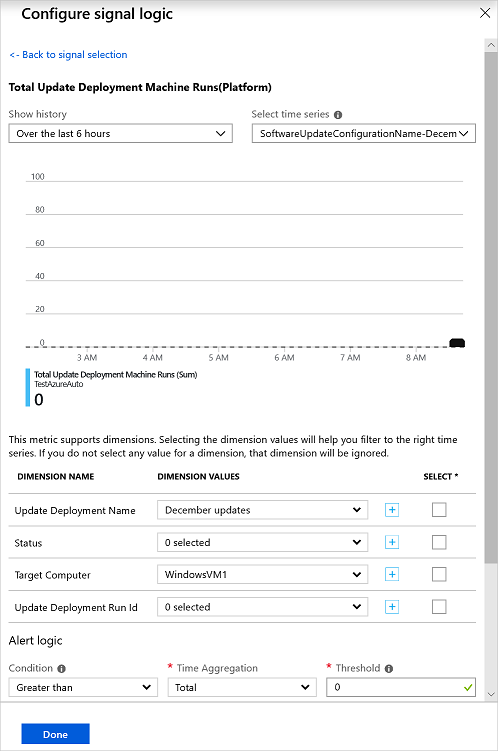
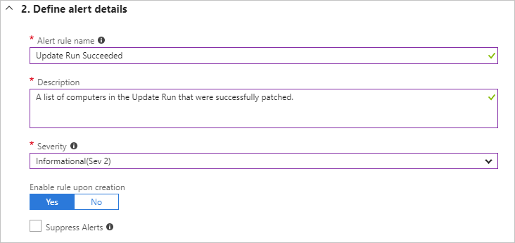
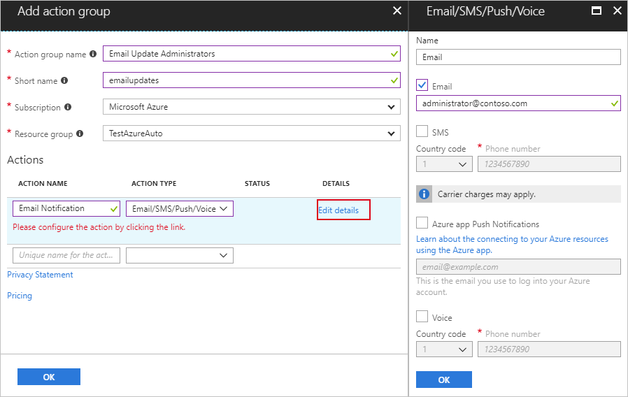
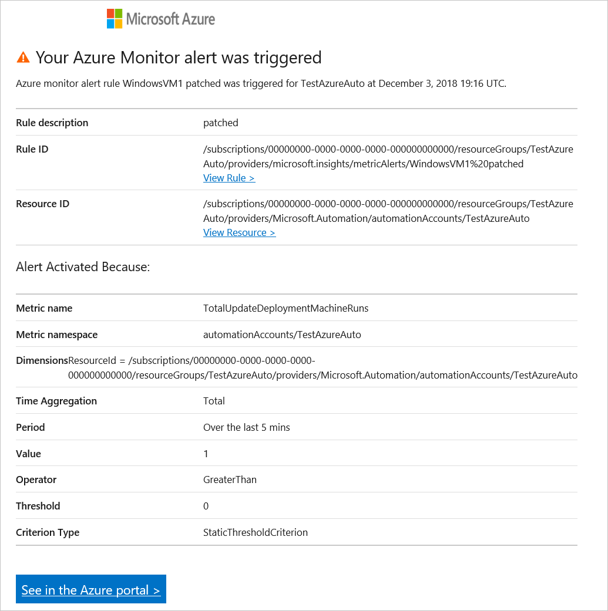

# Manage updates and patches for your Azure VMs

You can use the Update Management solution to manage updates and patches for your virtual machines. In this tutorial, you learn how to quickly assess the status of available updates, schedule installation of required updates, review deployment results, and create an alert to verify that updates apply successfully.

For pricing information, see [Automation pricing for Update Management](https://azure.microsoft.com/pricing/details/automation/).

In this tutorial, you learn how to:

> [!div class="checklist"]
> * View an update assessment
> * Configure alerting
> * Schedule an update deployment
> * View the results of a deployment

## Prerequisites

To complete this tutorial, you need:

* The [Update Management](automation-update-management.md) solution enabled for one or more of your VMs.
* A [virtual machine](../virtual-machines/windows/quick-create-portal.md) to onboard.

## Sign in to Azure

Sign in to the Azure portal at https://portal.azure.com.

## View update assessment

After you enable Update Management, the **Update management** page opens. If any updates are identified as missing, a list of missing updates is shown on the **Missing updates** tab.

Under **Information link**, select the update link to open the support article for the update. You can learn important information about the update.

Click anywhere else on the update to open the **Log search** pane for the selected update. The query for the log search is predefined for that specific update. You can modify this query or create your own query to view detailed information about updates deployed or missing in your environment.

## Configure alerts

In this step, you learn to set up an alert to let you know the status of an update deployment.

### Alert conditions

In your Automation account, go to **Alerts** under **Monitoring**, then click **New alert rule**.

Your Automation account is already selected as the resource. If you want to change it, click **Select**. On the **Select a resource** page, choose **Automation Accounts** from the **Filter by resource type** dropdown menu. Select your Automation account, and then click **Done**.

Click **Add condition** to select the signal that is appropriate for your update deployment. The following table shows the details of the two available signals.

|Signal Name|Dimensions|Description|
|---|---|---|
|`Total Update Deployment Runs`|- Update Deployment Name - Status|This signal alerts on the overall status of an update deployment.|
|`Total Update Deployment Machine Runs`|- Update Deployment Name - Status - Target Computer - Update Deployment Run ID|This signal alerts on the status of an update deployment targeted at specific machines.|

For a dimension, select a valid value from the list. If the value you want isn't in the list, click the **\+** sign next to the dimension and type in the custom name. Then select the value to look for. If you want to select all values for a dimension, click the **Select \*** button. If you do not choose a value for a dimension, Update Management ignores that dimension.

Under **Alert logic**, for **Threshold**, enter **1**. When you're finished, select **Done**.

### Alert details

Under **2. Define alert details**, enter a name and description for the alert. Set **Severity** to **Informational(Sev 2)** for a successful run, or **Informational(Sev 1)** for a failed run.

Under **Action groups**, select **Create New**. An action group is a group of actions that you can use across multiple alerts. The actions can include email notifications, runbooks, webhooks, and many more. To learn more about action groups, see [Create and manage action groups](../azure-monitor/platform/action-groups.md).

In the **Action group name** field, enter a name for the alert and a short name. Update Management uses the short name in place of a full action group name when sending notifications using the specified group.

Under **Actions**, enter a name for the action, like **Email Notification**. For **Action Type**, select **Email/SMS/Push/Voice**. For **Details**, select **Edit details**.

In the **Email/SMS/Push/Voice** pane, enter a name. Select the **Email** check box, and then enter a valid email address.

In the **Email/SMS/Push/Voice** pane, click **OK**. In the **Add action group** pane, click **OK**.

To customize the subject of the alert email, under **Create rule**, under **Customize actions**, select **Email subject**. When you're finished, select **Create alert rule**. The alert tells you when an update deployment succeeds, and which machines were part of the update deployment run.

## Schedule an update deployment

Next, schedule a deployment that follows your release schedule and service window to install updates. You can choose the update types to include in the deployment. For example, you can include critical or security updates and exclude update rollups.

>[!NOTE]
>Scheduling an update deployment creates a [schedule](shared-resources/schedules.md) resource linked to the **Patch-MicrosoftOMSComputers** runbook that handles the update deployment on the target machines. If you delete the schedule resource from the Azure portal or using PowerShell after creating the deployment, the deletion breaks the scheduled update deployment and presents an error when you attempt to reconfigure the schedule resource from the portal. You can only delete the schedule resource by deleting the corresponding deployment schedule.  

To schedule a new update deployment for the VM, go to **Update management**, and then select **Schedule update deployment**.

Under **New update deployment**, specify the following information:

* **Name**: Enter a unique name for the update deployment.

* **Operating system**: Select the OS to target for the update deployment.

* **Groups to update (preview)**: Define a query that combines subscription, resource groups, locations, and tags to build a dynamic group of Azure VMs to include in your deployment. To learn more, see [Dynamic Groups](automation-update-management-groups.md).

* **Machines to update**: Select a Saved search, Imported group, or pick **Machines** from the dropdown menu and select individual machines. If you choose **Machines**, the readiness of each machine is shown in the **Update agent readiness** column. To learn about the different methods of creating computer groups in Azure Monitor logs, see [Computer groups in Azure Monitor logs](../azure-monitor/platform/computer-groups.md).

* **Update classification**: For each product, deselect all supported update classifications but the ones to include in your update deployment. For this tutorial, leave all types selected for all products.

  The classification types are:

   |OS  |Type  |
   |---------|---------|
   |Windows     | Critical updates Security updates Update rollups Feature packs Service packs Definition updates Tools Updates Driver        |
   |Linux     | Critical and security updates Other updates       |

   For descriptions of the classification types, see [Update classifications](automation-view-update-assessments.md#update-classifications).

* **Updates to include/exclude** - Opens the Include/Exclude page. Updates to be included or excluded are on separate tabs.

> [!NOTE]
> It's important to know that exclusions override inclusions. For instance, if you define an exclusion rule of `*`, Update Management installs no patches or packages, as they're all excluded. Excluded patches still show as missing from the machine. For Linux machines, if you include a package that has a dependent package that has been excluded, Update Management doesn't install the main package.

> [!NOTE]
> You can't specify updates that have been superseded for inclusion with the update deployment.
>

* **Schedule settings**: The **Schedule Settings** pane opens. The default start time is 30 minutes after the current time. You can set the start time to any time from 10 minutes in the future.

   You can also specify whether the deployment occurs once, or set up a recurring schedule. Under **Recurrence**, select **Once**. Leave the default as 1 day and click **OK**. These entries set up a recurring schedule.

* **Pre-scripts + Post-scripts**: Select the scripts to run before and after your deployment. To learn more, see [Manage Pre and Post scripts](pre-post-scripts.md).

* **Maintenance window (minutes)**: Leave the default value. Maintenance windows control the amount of time allowed for updates to install. Consider the following details when specifying a maintenance window:

  * Maintenance windows control how many updates are installed.
  * Update Management doesn't stop installing new updates if the end of a maintenance window is approaching.
  * Update Management doesn't terminate in-progress updates if the maintenance window is exceeded.
  * If the maintenance window is exceeded on Windows, it's often because a service pack update is taking a long time to install.

  > [!NOTE]
  > To avoid updates being applied outside of a maintenance window on Ubuntu, reconfigure the Unattended-Upgrade package to disable automatic updates. For information about how to configure the package, see [Automatic Updates topic in the Ubuntu Server Guide](https://help.ubuntu.com/lts/serverguide/automatic-updates.html).

* **Reboot options**: Use to specify options for handling reboots. The following options are available:
  * Reboot if necessary (default)
  * Always reboot
  * Never reboot
  * Only reboot - doesn't install updates

> [!NOTE]
> The registry keys listed under [Registry keys used to manage restart](/windows/deployment/update/waas-restart#registry-keys-used-to-manage-restart) can cause a reboot event if **Reboot options** is set to **Never reboot**.

When you're finished configuring the schedule, click **Create**.

You're returned to the status dashboard. Select **Scheduled Update deployments** to show the deployment schedule just created.

> [!NOTE]
> Update Management supports deploying first-party updates and pre-downloading patches. This support requires changes on the systems being patched. See [First party and pre-download support](automation-configure-windows-update.md) to learn how to configure these settings on your systems.

You can also create update deployments programmatically. To learn how to create an update deployment with the REST API, see [Software Update Configurations - Create](/rest/api/automation/softwareupdateconfigurations/create). There is also a sample runbook that you can use to create a weekly update deployment. To learn more about this runbook, see [Create a weekly update deployment for one or more VMs in a resource group](https://gallery.technet.microsoft.com/scriptcenter/Create-a-weekly-update-2ad359a1).

## View results of an update deployment

After the scheduled deployment starts, you can see the status for that deployment on the **Update deployments** tab under **Update management**. The status is **In progress** when the deployment is currently running. When the deployment finishes successfully, the status changes to **Succeeded**. If there are failures with one or more updates in the deployment, the status is **Partially failed**.

Select the completed update deployment to see its dashboard.

Under **Update results**, a summary provides the total number of updates and deployment results on the VM. The table on the right shows a detailed breakdown of each update and the installation results.

The available values are:

* **Not attempted**: The update wasn't installed because there was insufficient time available, based on the maintenance window duration defined.
* **Succeeded**: The update succeeded.
* **Failed**: The update failed.

Select **All logs** to see all log entries that the deployment has created.

Select **Output** to see the job stream of the runbook responsible for managing the update deployment on the target VM.

Select **Errors** to see detailed information about any errors from the deployment.

When your update deployment succeeds, you receive a confirming email similar to the following:

## Next steps

In this tutorial, you learned how to:

> [!div class="checklist"]
> * Onboard a VM for Update Management
> * View an update assessment
> * Configure alerting
> * Schedule an update deployment
> * View the results of a deployment

Continue to the overview for the Update Management solution.

> [!div class="nextstepaction"]
> [Update Management solution](automation-update-management.md)