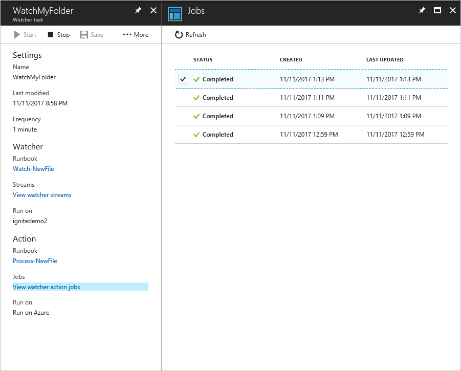

# Create an Azure Automation watcher tasks to track file changes on a local machine

Azure Automation uses watcher tasks to watch for events and trigger actions with PowerShell runbooks. This tutorial walks you through creating a watcher task to monitor when a new file is added to a directory.

In this tutorial, you learn how to:

> [!div class="checklist"]
> * Import a watcher runbook
> * Create an Automation variable
> * Create an action runbook
> * Create a watcher task
> * Trigger a watcher
> * Inspect the output

## Prerequisites

To complete this tutorial, the following are required:

* Azure subscription. If you don't have one yet, you can [activate your MSDN subscriber benefits](https://azure.microsoft.com/pricing/member-offers/msdn-benefits-details/) or sign up for a [free account](https://azure.microsoft.com/free/?WT.mc_id=A261C142F).
* [Automation account](automation-offering-get-started.md) to hold the watcher and action runbooks and the Watcher Task.
* A [hybrid runbook worker](automation-hybrid-runbook-worker.md) where the watcher task runs.

## Import a watcher runbook

This tutorial uses a watcher runbook called **Watch-NewFile** to look for new files in a directory. The watcher runbook retrieves the last known write time to the files in a folder and looks at any files newer than that watermark. In this step, you import this runbook into your automation account.

1. Open your Automation account, and click on the **Runbooks** page.
2. Click on the **Browse gallery** button.
3. Search for "Watcher runbook", select **Watcher runbook that looks for new files in a directory** and select **Import**.
  
1. Give the runbook a name and description and select **OK** to import the runbook into your Automation account.
1. Select **Edit** and then click **Publish**. When prompted select **Yes** to publish the runbook.

## Create an Automation variable

An [automation variable](automation-variables.md) is used to store the timestamps that the preceding runbook reads and stores from each file.

1. Select **Variables** under **SHARED RESOURCES** and select **+ Add a variable**.
1. Enter "Watch-NewFileTimestamp" for the name
1. Select DateTime for Type.
1. Click on the **Create** button. This creates the automation variable.

## Create an action runbook

An action runbook is used in a watcher task to act on the data passed to it from a watcher runbook. PowerShell Workflow runbooks are not supported by watcher tasks, you must use PowerShell runbooks. In this step, you update import a pre-defined action runbook called "Process-NewFile".

1. Navigate to your automation account and select **Runbooks** under the **PROCESS AUTOMATION** category.
1. Click on the **Browse gallery** button.
1. Search for "Watcher action" and select **Watcher action that processes events triggered by a watcher runbook** and select **Import**.
  
1. Give the runbook a name and description and select **OK** to import the runbook into your Automation account.
1. Select **Edit** and then click **Publish**. When prompted select **Yes** to publish the runbook.

## Create a watcher task

The watcher task contains two parts. The watcher and the action. The watcher runs at an interval defined in the watcher task. Data from the watcher runbook is passed onto the action runbook. In this step, you configure the watcher task referencing the watcher and action runbooks defined in the preceding steps.

1. Navigate to your automation account and select **Watcher tasks** under the **PROCESS AUTOMATION** category.
1. Select the Watcher tasks page and click on **+ Add a watcher task** button.
1. Enter "WatchMyFolder" as the name.

1. Select **Configure watcher** and select the **Watch-NewFile** runbook.

1. Enter the following values for the parameters:

   * **FOLDERPATH** - A folder on the hybrid worker where new files get created. d:\examplefiles
   * **EXTENSION** - Leave blank to process all file extensions.
   * **RECURSE** - Leave this value as the default.
   * **RUN SETTINGS** - Pick the hybrid worker.

1. Click OK, and then Select to return to the watcher page.
1. Select **Configure action** and select "Process-NewFile" runbook.
1. Enter the following values for parameters:

   ***EVENTDATA** - Leave blank. Data is passed in from the watcher runbook.  
   ***Run Settings** - Leave as Azure as this runbook runs in the Automation service.

1. Click **OK**, and then Select to return to the watcher page.
1. Click **OK** to create the watcher task.


## Trigger a watcher

To test the watcher is working as expected, you need to create a test file.

Remote into the hybrid worker. Open **PowerShell** and create a test file in the folder.
  
   ```PowerShell-interactive
   New-Item -Name ExampleFile1.txt
   ```

The following example shows the expected output.

```
    Directory: D:\examplefiles


Mode                LastWriteTime         Length Name
----                -------------         ------ ----
-a----       12/11/2017   9:05 PM              0 ExampleFile1.txt
```

## Inspect the output

1. Navigate to your automation account and select **Watcher tasks** under the **PROCESS AUTOMATION** category.
1. Select the watcher task "WatchMyFolder".
1. Click on **View watcher streams** under **Streams** to see that the watcher found the new file and started the action runbook.
1. To see the action runbook jobs, click on the **View watcher action jobs**. Each job can be selected the view the details of the job.

   

The expected output when the new file is found can be seen in the following example:

```
Message is Process new file...


Passed in data is @{FileName=D:\examplefiles\ExampleFile1.txt; Length=0}
```

## Next steps

In this tutorial, you learned how to:

> [!div class="checklist"]
> * Import a watcher runbook
> * Create an Automation variable
> * Create an action runbook
> * Create a watcher task
> * Trigger a watcher
> * Inspect the output

Follow this link to learn more about authoring your own runbook.

> [!div class="nextstepaction"]
> [My first PowerShell runbook](automation-first-runbook-textual-powershell.md).
