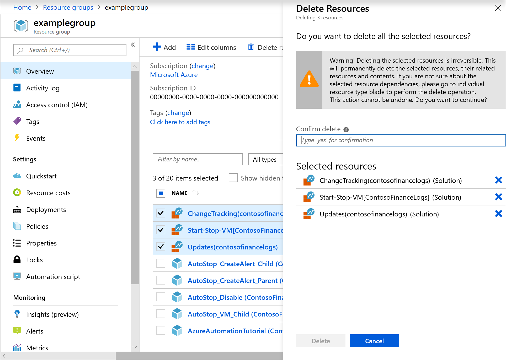
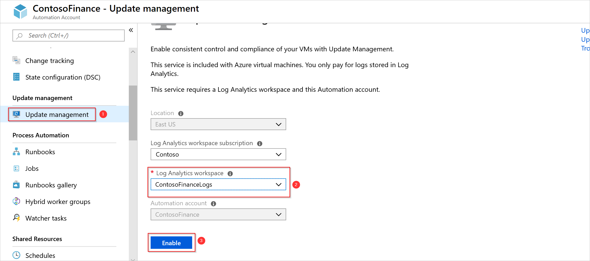
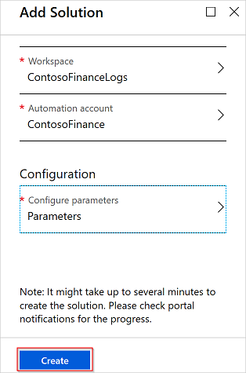

# Move your Automation Account to another subscription

Azure provides you the ability to move some resources to a new resource group or subscription with the same tenant natively through the Azure portal, PowerShell, Azure CLI, or REST API. To learn more about the process, see [move resources to a new resource group or subscription](../../azure-resource-manager/resource-group-move-resources.md). Automation Accounts are one of the resources that can be moved but there are special steps needed when moving your Automation Account.

The high-level steps to moving your Automation Account to are:

* Remove your solutions
* Unlink your workspace
* Move the Automation Account
* Delete and Re-create the Run As Accounts
* Re-enable your Solutions

## Remove solutions

To unlink your workspace from your Automation Account, the Change and Inventory, Update Management and the Start/Stop VMs during off hours solutions must be removed from your workspace.

In your Resource Group, select each **Solution** and click **Delete**. On the **Delete Resources** page, confirm the resources to be removed, and click **Delete**.



You can accomplish the same task with the [Remove-AzureRmResource](/powershell/module/azurerm.resources/remove-azurermresource) cmdlet as shown in the following example:

```azurepowershell-interactive
$workspaceName = <myWorkspaceName>
$resourceGroupName = <myResourceGroup>
Remove-AzureRmResource -ResourceType 'Microsoft.OperationsManagement/solutions' -ResourceName "ChangeTracking($workspaceName)" -ResourceGroupName $resourceGroupName
Remove-AzureRmResource -ResourceType 'Microsoft.OperationsManagement/solutions' -ResourceName "Updates($workspaceName)" -ResourceGroupName $resourceGroupName
Remove-AzureRmResource -ResourceType 'Microsoft.OperationsManagement/solutions' -ResourceName "Start-Stop-VM($workspaceName)" -ResourceGroupName $resourceGroupName
```

### Additional steps for Start/Stop VMs

For the **Start/Stop VM** solution, you also need to remove the alert rules created by the solution.

In the Azure portal, navigate to your resource group and select **Alerts** under **Monitoring**. On the **Alerts** page, select **Manage alert rules**


On the **Rules** page, you should see a listing of all of the alerts configured in that resource group. The **Start/Stop VMs** solution creates 3 alert rules

* AutoStop_VM_Child
* ScheduledStartStop_Parent
* SequencedStartStop_Parent

Select these 3 alert rules and click **Delete**. This action will remove these alert rules.


> [!NOTE]
> If you do not see any alert rules on the **Rules** page, change the **Status** to show **Disabled** alerts as you may have disabled them.

Once the alert rules are removed, you need to remove the Action group that was created for notifications for the Start/Stop VM Solution.

In the Azure portal go to **Monitor**, select **Alerts**, and click **Manage action groups**.

Select your Action group from the list, it will have the name **StartStop_VM_Notification**. On the Action groups page, click **Delete**


Similarly, you can delete your Action group with PowerShell. This action is done with the [Remove-AzureRmActionGroup](/powershell/module/azurerm.insights/remove-azurermactiongroup) cmdlet as seen in the following example:

```azurepowershell-interactive
Remove-AzureRmActionGroup -ResourceGroupName <myResourceGroup> -Name StartStop_VM_Notification
```

## Unlink your workspace

In the Azure portal, go to your **Automation Account**. Under **Related Resources**, click **Linked workspace**. Click **Unlink workspace** to unlink the workspace from your Automation Account.


## Move your Automation Account

Once all the previous items have been removed, you can continue to remove your Automation Account and its runbooks. In the Azure portal, navigate to the resource group of your Automation Account. Select **Move** and then **Move to another subscription**.


Select the resources in your Resource Group that you want to move. Ensure you include your **Automation Account**, **Runbook**, and **Log Analytics workspace** resources.

Once the move is complete, there are additional steps that must be taken to get everything working.

## Recreate Run As Accounts

[Run As Accounts](../manage-runas-account.md) create a service principal in Azure Active Directory to authenticate with Azure resources. When you change subscriptions, the existing Run As account is no longer usable by the Automation Account.

Navigate to your Automation Account in the new subscription and select **Run as accounts** under **Account Settings**. You'll see that the Run As Accounts show as incomplete now.


Click each Run As Account and on the **Properties** page, click **Delete** to delete the Run As Account.

> ![NOTE]
> If you do not have permissions to create or view the Run As accounts you'll see the following message `You do not have permissions to create an Azure Run As account (service principal) and grant the Contributor role to the service principal.`. To learn about the permissions required to configure a Run As account, see [Permissions required to configure Run As accounts](../manage-runas-account.md#permissions).

Once the Run As Accounts are deleted, click **Create** on the **Azure Run As Account**. On the **Add Azure Run As Account** page, click **Create** to create the Run As Account and service principal. Repeat the preceding steps with the **Azure Classic Run As Account**.

## Enable solutions

After the Run As Accounts have been recreated, you'll re-enable the solutions that you remove before the move. To enable **Change Tracking and Inventory** and **Update Management**, select the respective capability in your Automation Account. Choose the Log Analytics workspace you moved over and click **Enable**.



Your machines that are onboarded with your solutions will show up again since you're connecting the existing Log Analytics workspace.

To re-enable the Start/Stop VMs during off-hours solution, you'll need to redeploy the solution. Under **Related Resources**, select **Start/Stop VM**. Click **Learn more about and enable the solution** and click **Create** to start the deployment.

On the **Add Solution** page, choose your Log Analytics Workspace and Automation Account.  



For detailed instructions on configuring the solution, see [Start/Stop VMs during off-hours solution in Azure Automation](../automation-solution-vm-management.md)

## Post move verification

Once the move is complete, make sure to verify the different scenarios in your Automation Account to ensure everything is working as expected. The following table shows a list of tasks that should be verified after the move has been completed:

|Capability|Tests|Troubleshooting link|
|---|---|---|
|Runbooks|A Runbook can successfully run and connect to Azure resources.|[Troubleshoot runbooks](../troubleshoot/runbooks.md)
| Source Control|You can run a manual sync on your source control repo.|[Source Control integration](../source-control-integration.md)|
|Change Tracking and Inventory|Verify you see current inventory data from your machines.|[Troubleshoot Change Tracking](../troubleshoot/change-tracking.md)|
|Update Management|Verify you see your machines and they're healthy</br>Run a test software update deployment.|[Troubleshoot Update Management](../troubleshoot/update-management.md)|

## Next steps

To learn more about moving resources in Azure, see [Move resources in Azure](../../azure-resource-manager/move-support-resources.md)
