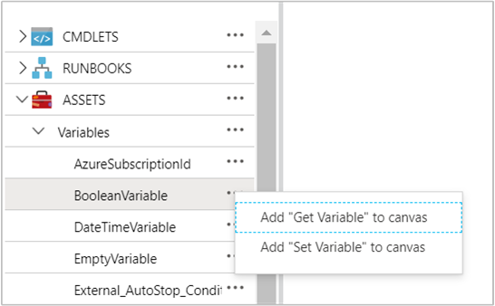
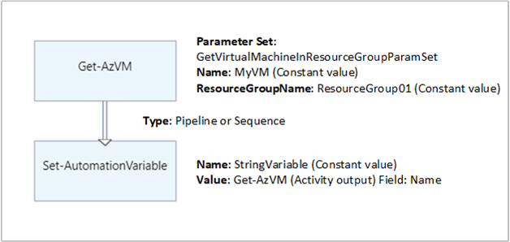

# Variable assets in Azure Automation

Variable assets are values that are available to all runbooks and DSC configurations in your Automation account. You can manage them from the Azure portal, from PowerShell, within a runbook, or in a DSC configuration.

Automation variables are useful for the following scenarios:

- Sharing a value among multiple runbooks or DSC configurations.

- Sharing a value among multiple jobs from the same runbook or DSC configuration.

- Managing a value used by runbooks or DSC configurations from the portal or from the PowerShell command line. An example is a set of common configuration items, such as a specific list of VM names, a specific resource group, an AD domain name, and more.  

Azure Automation persists variables and makes them available even if a runbook or DSC configuration fails. This behavior allows one runbook or DSC configuration to set a value that is then used by another runbook, or by the same runbook or DSC configuration the next time it runs.

Azure Automation stores each encrypted variable securely. When creating a variable, you can specify its encryption and storage by Azure Automation as a secure asset. Other secure assets include credentials, certificates, and connections. Azure Automation encrypts these assets and stores them using a unique key that is generated for each Automation account. The key is stored in a system-managed Key Vault. Before storing a secure asset, Azure Automation loads the key from the Key Vault and then uses it to encrypt the asset. 

>[!NOTE]
>This article has been updated to use the new Azure PowerShell Az module. You can still use the AzureRM module, which will continue to receive bug fixes until at least December 2020. To learn more about the new Az module and AzureRM compatibility, see [Introducing the new Azure PowerShell Az module](https://docs.microsoft.com/powershell/azure/new-azureps-module-az?view=azps-3.5.0). For Az module installation instructions on your Hybrid Runbook Worker, see [Install the Azure PowerShell Module](https://docs.microsoft.com/powershell/azure/install-az-ps?view=azps-3.5.0). For your Automation account, you can update your modules to the latest version using [How to update Azure PowerShell modules in Azure Automation](../automation-update-azure-modules.md).

## Variable types

When you create a variable with the Azure portal, you must specify a data type from the dropdown list so that the portal can display the appropriate control for entering the variable value. The following are variable types available in Azure Automation:

* String
* Integer
* DateTime
* Boolean
* Null

The variable isn't restricted to the designated data type. You must set the variable using Windows PowerShell if you want to specify a value of a different type. If you indicate `Not defined`, the value of the variable is set to Null, and you must set the value with the [Set-AzAutomationVariable](https://docs.microsoft.com/powershell/module/az.automation/set-azautomationvariable?view=azps-3.5.0) cmdlet or the `Set-AutomationVariable` activity.

You can't use the Azure portal to create or change the value for a complex variable type. However, you can provide a value of any type using Windows PowerShell. Complex types are retrieved as a [PSCustomObject](/dotnet/api/system.management.automation.pscustomobject).

You can store multiple values to a single variable by creating an array or hashtable and saving it to the variable.

## PowerShell cmdlets that create and manage variable assets

For the Az module, the cmdlets in the following table are used to create and manage Automation variable assets with Windows PowerShell. They ship as part of the [Az.Automation module](/powershell/azure/overview), which is available for use in Automation runbooks and DSC configurations.

| Cmdlet | Description |
|:---|:---|
|[Get-AzAutomationVariable](https://docs.microsoft.com/powershell/module/az.automation/get-azautomationvariable?view=azps-3.5.0) | Retrieves the value of an existing variable. You can't use this cmdlet to retrieve the value of an encrypted variable. The only way to do this is by using the `Get-AutomationVariable` activity in a runbook or DSC configuration. |
|[New-AzAutomationVariable](https://docs.microsoft.com/powershell/module/az.automation/new-azautomationvariable?view=azps-3.5.0) | Creates a new variable and sets its value.|
|[Remove-AzAutomationVariable](https://docs.microsoft.com/powershell/module/az.automation/remove-azautomationvariable?view=azps-3.5.0)| Removes an existing variable.|
|[Set-AzAutomationVariable](https://docs.microsoft.com/powershell/module/az.automation/set-azautomationvariable?view=azps-3.5.0)| Sets the value for an existing variable. |

## Activities to access variables in runbooks and DSC configurations

The activities in the following table are used to access variables in runbooks and DSC configurations. The cmdlets for these activities come with the global module `Orchestrator.AssetManagement.Cmdlets`.

| Activity | Description |
|:---|:---|
|`Get-AutomationVariable`|Retrieves the value of an existing variable.|
|`Set-AutomationVariable`|Sets the value for an existing variable.|

> [!NOTE]
> Avoid using variables in the `Name` parameter of `Get-AutomationVariable` in a runbook or DSC configuration. Use of this parameter can complicate the discovery of dependencies between runbooks or DSC configurations and Automation variables at design time.

Note that `Get-AutomationVariable` does not work in PowerShell, but only in a runbook or DSC configuration. For example, to see the value of an encrypted variable, you might create a runbook to get the variable and then write it to the output stream:
 
```powershell
$mytestencryptvar = Get-AutomationVariable -Name TestVariable
Write-output "The encrypted value of the variable is: $mytestencryptvar"
```

## Functions to access variables in Python 2 runbooks

The functions in the following table are used to access variables in a Python 2 runbook.

|Python 2 Functions|Description|
|:---|:---|
|`automationassets.get_automation_variable`|Retrieves the value of an existing variable. |
|`automationassets.set_automation_variable`|Sets the value for an existing variable. |

> [!NOTE]
> You must import the `automationassets` module at the top of your Python runbook to access the asset functions.

## Working with Automation variables

>[!NOTE]
>If you want to remove the encryption for a variable, you must delete the variable and recreate it as unencrypted.

### Create a new variable using the Azure portal

1. From your Automation account, click the **Assets** tile, then the **Assets** blade, and select **Variables**.
2. On the **Variables** tile, select **Add a variable**.
3. Complete the options on the **New Variable** blade and then click **Create** to save the new variable.

> [!NOTE]
> Once you have saved an encrypted variable, it can't be viewed in the portal. It can only be updated.

### Create and use a variable in Windows PowerShell

A PowerShell script uses the `New-AzAutomationVariable` cmdlet, or its AzureRM module equivalent, to create a new variable and set its initial value. If the variable is encrypted, the call should use the `Encrypted` parameter.

The script retrieves the value of the variable using [Get-AzAutomationVariable](https://docs.microsoft.com/powershell/module/az.automation/get-azautomationvariable?view=azps-3.5.0). If the value is a simple type, the cmdlet retrieves that same type. If it's a complex type, a `PSCustomObject` type is retrieved.

>[!NOTE]
>A PowerShell script can't retrieve an encrypted value. The only way to do this is to use a `Get-AutomationVariable` activity in a runbook or DSC configuration.

The following example shows how to create a variable of type String and then return its value.

```powershell
New-AzAutomationVariable -ResourceGroupName "ResourceGroup01" 
–AutomationAccountName "MyAutomationAccount" –Name 'MyStringVariable' `
–Encrypted $false –Value 'My String'
$string = (Get-AzAutomationVariable -ResourceGroupName "ResourceGroup01" `
–AutomationAccountName "MyAutomationAccount" –Name 'MyStringVariable').Value
```

The following example shows how to create a variable with a complex type and then retrieve its properties. In this case, a virtual machine object from [Get-AzVM](https://docs.microsoft.com/powershell/module/Az.Compute/Get-AzVM?view=azps-3.5.0) is used.

```powershell
$vm = Get-AzVM -ResourceGroupName "ResourceGroup01" –Name "VM01"
New-AzAutomationVariable –AutomationAccountName "MyAutomationAccount" –Name "MyComplexVariable" –Encrypted $false –Value $vm

$vmValue = (Get-AzAutomationVariable -ResourceGroupName "ResourceGroup01" `
–AutomationAccountName "MyAutomationAccount" –Name "MyComplexVariable").Value
$vmName = $vmValue.Name
$vmIpAddress = $vmValue.IpAddress
```

### Create and use a variable in a runbook or DSC configuration

The only way to create a new variable from within a runbook or DSC configuration is to use the `New-AzAutomationVariable` cmdlet or its AzureRM module equivalent. The script uses this cmdlet to set the initial value of the variable. The script can then retrieve the value using `Get-AzAutomationVariable`. If the value is a simple type, that same type is retrieved. If it's a complex type, then a `PSCustomObject` type is retrieved.

>[!NOTE]
>The only way to retrieve an encrypted value is by using the `Get-AutomationVariable` activity in the runbook or DSC configuration. 

### Textual runbook samples

#### Set and retrieve a simple value from a variable

The following sample commands show how to set and retrieve a variable in a textual runbook. This sample assumes the creation of integer variables named `NumberOfIterations` and `NumberOfRunnings` and a string variable named `SampleMessage`.

```powershell
$NumberOfIterations = Get-AzAutomationVariable -ResourceGroupName "ResourceGroup01" –AutomationAccountName "MyAutomationAccount" -Name 'NumberOfIterations'
$NumberOfRunnings = Get-AzAutomationVariable -ResourceGroupName "ResourceGroup01" –AutomationAccountName "MyAutomationAccount" -Name 'NumberOfRunnings'
$SampleMessage = Get-AutomationVariable -Name 'SampleMessage'

Write-Output "Runbook has been run $NumberOfRunnings times."

for ($i = 1; $i -le $NumberOfIterations; $i++) {
    Write-Output "$i`: $SampleMessage"
}
Set-AzAutomationVariable -ResourceGroupName "ResourceGroup01" –AutomationAccountName "MyAutomationAccount" –Name NumberOfRunnings –Value ($NumberOfRunnings += 1)
```

#### Set and retrieve a variable in a Python 2 runbook

The following sample shows how to use a variable, set a variable, and handle an exception for a nonexistent variable in a Python 2 runbook.

```python
import automationassets
from automationassets import AutomationAssetNotFound

# get a variable
value = automationassets.get_automation_variable("test-variable")
print value

# set a variable (value can be int/bool/string)
automationassets.set_automation_variable("test-variable", True)
automationassets.set_automation_variable("test-variable", 4)
automationassets.set_automation_variable("test-variable", "test-string")

# handle a non-existent variable exception
try:
    value = automationassets.get_automation_variable("nonexisting variable")
except AutomationAssetNotFound:
    print "variable not found"
```

### Graphical runbook samples

In a graphical runbook, you can add the `Get-AutomationVariable` or `Set-AutomationVariable` activity. Simply right-click the variable in the Library pane of the graphical editor and select the activity that you want.



#### Set values in a variable

The following image shows sample activities to update a variable with a simple value in a graphical runbook. In this sample, `Get-AzVM`  retrieves a single Azure virtual machine and saves the computer name to an existing Automation string variable. It doesn't matter whether the [link is a pipeline or sequence](../automation-graphical-authoring-intro.md#links-and-workflow) since the code only expects a single object in the output.



## Next steps

- To learn more about connecting activities in graphical authoring, see [Links in graphical authoring](../automation-graphical-authoring-intro.md#links-and-workflow).
- To get started with graphical runbooks, see [My first graphical runbook](../automation-first-runbook-graphical.md).
