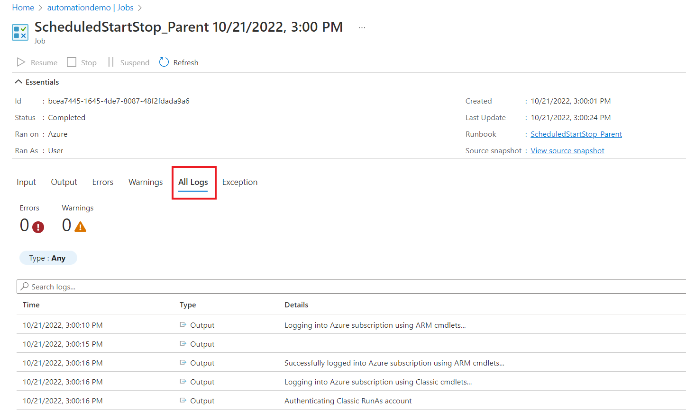

# Data to collect when you open a case for Microsoft Azure Automation

This article describes some of the basic information that you should gather before you open a case for Azure Automation with Microsoft Azure Support. This information is not required to open the case. However, it can help Microsoft resolve your problem more quickly. Also, you may be asked for this data by the support engineer after you open the case.

## Collect basic data

Collect the basic data described in the Knowledge Base article [4034605 - How to capture Azure Automation-scripted diagnostics](https://support.microsoft.com/help/4034605/how-to-capture-azure-automation-scripted-diagnostics).

## Collect data depending on issue
 
### Collect data Update Management issues on Linux

1. In addition to the items that are listed in KB [4034605](https://support.microsoft.com/help/4034605/how-to-capture-azure-automation-scripted-diagnostics), run the following log collection tool:

   [OMS Linux Agent Log Collector](https://github.com/Microsoft/OMS-Agent-for-Linux/blob/master/tools/LogCollector/OMS_Linux_Agent_Log_Collector.md)
 
2. Compress the contents of the following folder, then send the compressed file to Azure Support:

   ``/var/opt/microsoft/omsagent/run/automationworker/``
 
3. Verify that the workspace ID the OMS Linux Agent is reporting to, is the same as the workspace being monitored for updates.

### Collect data for Update Management issues on Windows

In addition to the items that are listed in [4034605](https://support.microsoft.com/help/4034605/how-to-capture-azure-automation-scripted-diagnostics), do the following:

1. Export the following event logs into the EVTX format:

   * System
   * Application
   * Security
   * Operations Manager
   * Microsoft-SMA/Operational

2. Verify that the workspace ID the agent is reporting to, is the same as the workspace being monitored by Windows Updates.

### Collect data for job issues

In addition to the items that are listed in [4034605](https://support.microsoft.com/help/4034605/how-to-capture-azure-automation-scripted-diagnostics), collect the following information:

1. Collect the **JobID** number (for the job that is experiencing an issue):

   1. In the Azure portal, go to **Automation Accounts**.
   2. Select the Automation account that you are troubleshooting, and note the name.
   3. Select **Jobs**.
   4. Choose the job that you are troubleshooting.
   5. In the Job Summary pane, look for the GUID value in **Job ID**.

   

2. Collect a sample of the script that you are running.

3. Collect the log files:

   1. In the Azure portal, go to **Automation Accounts**.
   2. Select the Automation account that you are troubleshooting.
   3. Select **Jobs**.
   4. Choose the job that you are troubleshooting.
   5. Select **All Logs**.
   6. In the resulting pane, collect the data.

   

### Collect data for module issues

In addition to the [basic data items](#collect-basic-data), gather the following information:

* The steps you have followed, so that the problem can be reproduced.
* Screenshots of any error messages.
* Screenshots of the current modules and their version numbers.

## Next steps

If you need more help, contact the Azure experts on [the MSDN Azure and Stack Overflow forums](https://azure.microsoft.com/support/forums/).

Alternatively, file an Azure support incident. Go to the [Azure support site](https://azure.microsoft.com/support/options/) and select **Get Support**.
