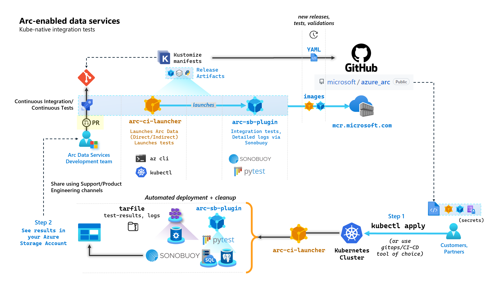
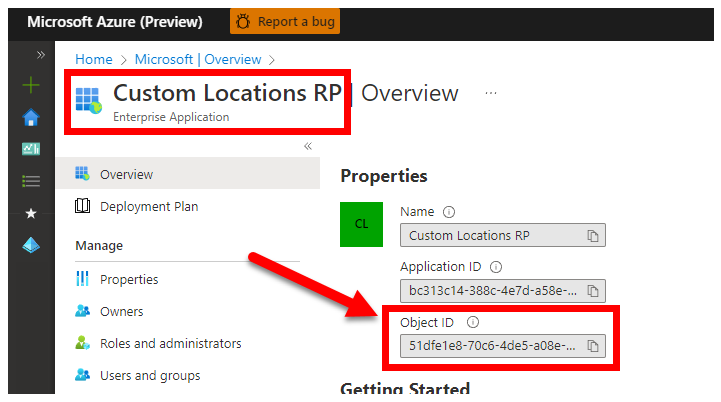
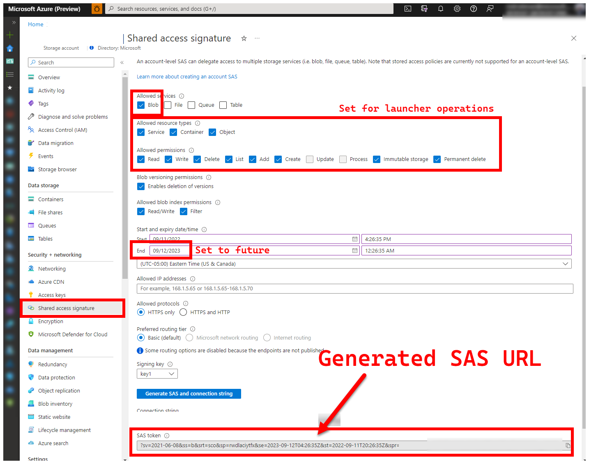
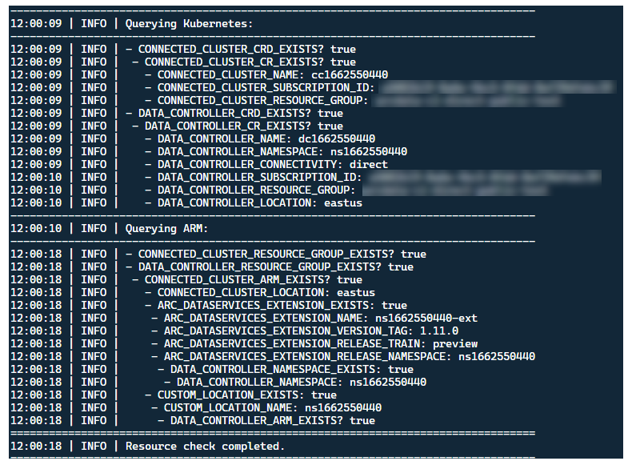
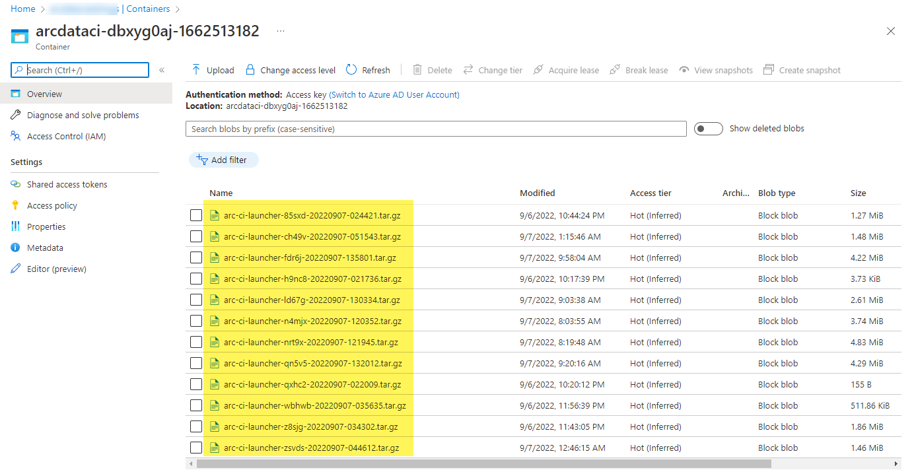

# Tutorial: Automated validation testing

As part of each commit that builds up Arc-enabled data services, Microsoft runs automated CI/CD pipelines that perform end-to-end tests. These tests are orchestrated via two containers that are maintained alongside the core-product (Data Controller, Azure Arc-enabled SQL Managed Instance & PostgreSQL server). These containers are:

- `arc-ci-launcher`: Containing deployment dependencies (for example, CLI extensions), as well product deployment code (using Azure CLI) for both Direct and Indirect connectivity modes. Once Kubernetes is onboarded with the Data Controller, the container leverages [Sonobuoy](https://sonobuoy.io/) to trigger parallel integration tests.
-  `arc-sb-plugin`: A [Sonobuoy plugin](https://sonobuoy.io/plugins/) containing [Pytest](https://docs.pytest.org/en/7.1.x/)-based end-to-end integration tests, ranging from simple smoke-tests (deployments, deletes), to complex high-availability scenarios, chaos-tests (resource deletions) etc.

These testing containers are made publicly available for customers and partners to perform Arc-enabled data services validation testing in their own Kubernetes clusters running anywhere, to validate:
* Kubernetes distro/versions
* Host disto/versions
* Storage (`StorageClass`/CSI), networking (e.g. `LoadBalancer`s, DNS)
* Other Kubernetes or infrastructure specific setup

For Customers intending to run Arc-enabled Data Services on an undocumented distribution, they must run these validation tests successfully to be considered supported. Additionally, Partners can use this approach to certify their solution is compliant with Arc-enabled Data Services - see [Azure Arc-enabled data services Kubernetes validation](validation-program.md).

The following diagram outlines this high-level process:



In this tutorial, you learn how to:

> [!div class="checklist"]
> * Deploy `arc-ci-launcher` using `kubectl`
> * Examine validation test results in your Azure Blob Storage account

## Prerequisites
 
- **Credentials**: 
   * The [`test.env.tmpl`](https://github.com/microsoft/azure_arc/tree/main/arc_data_services/test/launcher/base/configs/.test.env.tmpl) file contains the necessary credentials required, and is a combination of the existing pre-requisites required to onboard an [Azure Arc Connected Cluster](../kubernetes/quickstart-connect-cluster.md?tabs=azure-cli) and [Directly Connected Data Controller](plan-azure-arc-data-services.md). Setup of this file is explained below with samples.
   * A [kubeconfig](https://kubernetes.io/docs/concepts/configuration/organize-cluster-access-kubeconfig/) file to the tested Kubernetes cluster with `cluster-admin` access (required for Connected Cluster onboarding at this time)

- **Client-tooling**: 
   * `kubectl` installed - minimum version (Major:"1", Minor:"21")
   * `git` command line interface (or UI-based alternatives)

## Kubernetes manifest preparation

The launcher is made available as part of the [`microsoft/azure_arc`](https://github.com/microsoft/azure_arc) repository, as a [Kustomize](https://kustomize.io/) manifest - Kustomize is [built into `kubectl`](https://kubernetes.io/docs/tasks/manage-kubernetes-objects/kustomization/) - so no additional tooling is required.

1. Clone the repo locally:

```bash
git clone https://github.com/microsoft/azure_arc.git
```

2. Navigate to `azure_arc/arc_data_services/test/launcher`, to see the following folder structure:

```text
├── base                                         <- Comon base for all Kubernetes Clusters
│   ├── configs
│   │   └── .test.env.tmpl                       <- To be converted into .test.env with credentials for a Kubernetes Secret
│   ├── kustomization.yaml                       <- Defines the generated resources as part of the launcher
│   └── launcher.yaml                            <- Defines the Kubernetes resources that make up the launcher
└── overlays                                     <- Overlays for specific Kubernetes Clusters
    ├── aks
    │   ├── configs
    │   │   └── patch.json.tmpl                  <- To be converted into patch.json, patch for Data Controller control.json
    │   └── kustomization.yaml
    ├── kubeadm
    │   ├── configs
    │   │   └── patch.json.tmpl
    │   └── kustomization.yaml
    └── openshift
        ├── configs
        │   └── patch.json.tmpl
        ├── kustomization.yaml
        └── scc.yaml
```

In this tutorial, we're going to focus on steps for AKS, but the overlay structure above can be extended to include additional Kubernetes distributions.

The ready to deploy manifest will represent the following:
```text
├── base
│   ├── configs
│   │   ├── .test.env                           <- Config 1: For Kubernetes secret, see sample below
│   │   └── .test.env.tmpl
│   ├── kustomization.yaml
│   └── launcher.yaml
└── overlays
    └── aks
        ├── configs
        │   ├── patch.json.tmpl
        │   └── patch.json                      <- Config 2: For control.json patching, see sample below
        └── kustomization.yam
```

There are two files that need to be generated to localize the launcher to run inside a specific environment. Each of these files can be generated by copy-pasting and filling out each of the template (`*.tmpl`) files above:
* `.test.env`: fill out from `.test.env.tmpl`
* `patch.json`: fill out from `patch.json.tmpl`

> [!TIP]
> The `.test.env` is a single set of of environment variables that drives the launcher's behavior. Generating it with care for a given environment will ensure reproducibility of the launcher's behavior.

### Config 1: `.test.env`

A filled-out sample of the `.test.env` file, generated based on `.test.env.tmpl` is shared below with inline commentary.

> [!IMPORTANT]
> The `export VAR="value"` syntax below is not meant to be run locally to source environment variables from your machine - but is there for the launcher. The launcher mounts this `.test.env` file **as-is** as a Kubernetes `secret` using Kustomize's [`secretGenerator`](https://github.com/kubernetes-sigs/kustomize/blob/master/examples/secretGeneratorPlugin.md#secret-values-from-local-files) (Kustomize takes a file, base64 encodes the entire file's content, and turns it into a Kubernetes secret). During initialization, the launcher runs bash's [`source`](https://ss64.com/bash/source.html) command, which imports the environment variables from the as-is mounted `.test.env` file into the launcher's environment.

In other words, after copy-pasting `.test.env.tmpl` and editing to create `.test.env`, the generated file should look similar to the sample below. The process to fill out the `.test.env` file is identical across operating systems and terminals.

> [!TIP]
> There are a handful of environment variables that require additional explanation for clarity in reproducibility. These will be commented with `see detailed explanation below [X]`.

> [!TIP]
> Note that the `.test.env` example below is for **direct** mode. Some of these variables, such as `ARC_DATASERVICES_EXTENSION_VERSION_TAG` do not apply to **indirect** mode. For simplicity, it's best to setup the `.test.env` file with **direct** mode variables in mind, switching `CONNECTIVITY_MODE=indirect` will have the launcher ignore **direct** mode specific-settings and use a subset from the list.
> 
> In other words, planning for **direct** mode allows us to satisfy **indirect** mode variables.

Finished sample of `.test.env`:
```bash
# ======================================
# Arc Data Services deployment version =
# ======================================

# Controller deployment mode: direct, indirect
# For 'direct', the launcher will also onboard the Kubernetes Cluster to Azure Arc
# For 'indirect', the launcher will skip Azure Arc and extension onboarding, and proceed directly to Data Controller deployment - see `patch.json` file
export CONNECTIVITY_MODE="direct"

# The launcher supports deployment of both GA/pre-GA trains - see detailed explanation below [1]
export ARC_DATASERVICES_EXTENSION_RELEASE_TRAIN="stable"
export ARC_DATASERVICES_EXTENSION_VERSION_TAG="1.11.0"

# Image version
export DOCKER_IMAGE_POLICY="Always"
export DOCKER_REGISTRY="mcr.microsoft.com"
export DOCKER_REPOSITORY="arcdata"
export DOCKER_TAG="v1.11.0_2022-09-13"

# "arcdata" Azure CLI extension version override - see detailed explanation below [2]
export ARC_DATASERVICES_WHL_OVERRIDE=""

# ================
# ARM parameters =
# ================

# Custom Location Resource Provider Azure AD Object ID - this is a single, unique value per Azure AD tenant - see detailed explanation below [3]
export CUSTOM_LOCATION_OID="..."

# A pre-rexisting Resource Group is used if found with the same name. Otherwise, launcher will attempt to create a Resource Group
# with the name specified, using the Service Principal specified below (which will require `Owner/Contributor` at the Subscription level to work)
export LOCATION="eastus"
export RESOURCE_GROUP_NAME="..."

# A Service Principal with "sufficient" privileges - see detailed explanation below [4]
export SPN_CLIENT_ID="..."
export SPN_CLIENT_SECRET="..."
export SPN_TENANT_ID="..."
export SUBSCRIPTION_ID="..."

# Optional: certain integration tests test upload to Log Analytics workspace:
# https://learn.microsoft.com/azure/azure-arc/data/upload-logs
export WORKSPACE_ID="..."
export WORKSPACE_SHARED_KEY="..."

# ====================================
# Data Controller deployment profile =
# ====================================

# Samples for AKS
# To see full list of CONTROLLER_PROFILE, run: az arcdata dc config list
export CONTROLLER_PROFILE="azure-arc-aks-default-storage"

# azure, aws, gcp, onpremises, alibaba, other
export DEPLOYMENT_INFRASTRUCTURE="azure"

# The StorageClass used for PVCs created during the tests 
export KUBERNETES_STORAGECLASS="default"

# ==============================
# Launcher specific parameters =
# ==============================

# Log/test result upload from launcher container, via SAS URL - see detailed explanation below [5]
export LOGS_STORAGE_ACCOUNT="<your-storage-account>"
export LOGS_STORAGE_ACCOUNT_SAS="?sv=2021-06-08&ss=bfqt&srt=sco&sp=rwdlacupiytfx&se=...&spr=https&sig=..."
export LOGS_STORAGE_CONTAINER="arc-ci-launcher-1662513182"

# Test behavior parameters
# The test suites to execute - space seperated array, 
# Use these default values that run short smoke tests, further elaborate test suites will be added in upcoming releases
export SQL_HA_TEST_REPLICA_COUNT="3"
export TESTS_DIRECT="direct-crud direct-hydration controldb"
export TESTS_INDIRECT="billing controldb kube-rbac"
export TEST_REPEAT_COUNT="1"
export TEST_TYPE="ci"

# Control launcher behavior by setting to '1':
#
# - SKIP_PRECLEAN: Skips initial cleanup
# - SKIP_SETUP: Skips Arc Data deployment
# - SKIP_TEST: Skips sonobuoy tests
# - SKIP_POSTCLEAN: Skips final cleanup
# - SKIP_UPLOAD: Skips log upload
#
# See detailed explanation below [6]
export SKIP_PRECLEAN="0"
export SKIP_SETUP="0"
export SKIP_TEST="0"
export SKIP_POSTCLEAN="0"
export SKIP_UPLOAD="0"
```

> [!IMPORTANT]
> If performing the configuration file generation in a Windows machine, you will need to convert the End-of-Line sequence from `CRLF` (Windows) to `LF` (Linux), as `arc-ci-launcher` runs as a Linux container. Leaving the line ending as `CRLF` may cause an error upon `arc-ci-launcher` container start - such as: `/launcher/config/.test.env: $'\r': command not found`
> For example, perform the change using VSCode (bottom-right of window): <br>
> 

#### Detailed explanation for certain variables

##### 1. `ARC_DATASERVICES_EXTENSION_*` - Extension version and train

> Mandatory: this is required for `direct` mode deployments.

The launcher can deploy both GA and pre-GA releases.

The extension version to release-train (`ARC_DATASERVICES_EXTENSION_RELEASE_TRAIN`) mapping are obtained from here:
* **GA**: `stable` - [Version log](version-log.md)
* **Pre-GA**: `preview` - [Pre-release testing](preview-testing.md)

##### 2. `ARC_DATASERVICES_WHL_OVERRIDE` - Azure CLI previous version download URL

> Optional: leave this empty in `.test.env` to use the pre-packaged default.

The launcher image is pre-packaged with the latest arcdata CLI version at the time of each container image release. However, to work with older releases and upgrade testing, it may be necessary to provide the launcher with Azure CLI Blob URL download link, to override the pre-packaged version; e.g to instruct the launcher to install version **1.4.3**, fill in:

```bash
export ARC_DATASERVICES_WHL_OVERRIDE="https://azurearcdatacli.blob.core.windows.net/cli-extensions/arcdata-1.4.3-py2.py3-none-any.whl"
```
The CLI version to Blob URL mapping can be found [here](https://azcliextensionsync.blob.core.windows.net/index1/index.json).

##### 3. `CUSTOM_LOCATION_OID` - Custom Locations Object ID from your specific Azure AD Tenant

> Mandatory: this is required for Connected Cluster Custom Location creation.

The following steps are sourced from [Enable custom locations on your cluster](../kubernetes/custom-locations.md#enable-custom-locations-on-your-cluster) to retrieve the unique Custom Location Object ID for your Azure AD tenant.

There are two approaches to obtaining the `CUSTOM_LOCATION_OID` for your Azure AD tenant.

1. Via Azure CLI:

    ```bash
    az ad sp show --id bc313c14-388c-4e7d-a58e-70017303ee3b --query objectId -o tsv
    # 51dfe1e8-70c6-4de...      <--- This is for Microsoft's own tenant - do not use, the value for your tenant will be different, use that instead to align with the Service Principal for launcher.
    ```

    

2. Via Azure portal - navigate to your Azure Active Directory blade, and search for `Custom Locations RP`:

    

##### 4. `SPN_CLIENT_*` - Service Principal Credentials

> Mandatory: this is required for Direct Mode deployments.

The launcher logs in to Azure using these credentials. 

Validation testing is meant to be performed on **Non-Production/Test Kubernetes cluster & Azure Subscriptions** - focusing on functional validation of the Kubernetes/Infrastructure setup. Therefore, to avoid the number of manual steps required to perform launches, it's recommended to provide a `SPN_CLIENT_ID/SECRET` that has `Owner` at the Resource Group (or Subscription) level, as it will create several resources in this Resource Group, as well as assigning permissions to those resources against several Managed Identities created as part of the deployment (these role assignments in turn require the Service Principal to have `Owner`).

##### 5. `LOGS_STORAGE_ACCOUNT_SAS` - Blob Storage Account SAS URL

> Recommended: leaving this empty means you will not obtain test results and logs.

The launcher needs a persistent location (Azure Blob Storage) to upload results to, as Kubernetes doesn't (yet) allow copying files from stopped/completed pods - [see here](https://github.com/kubernetes/kubectl/issues/454). The launcher achieves connectivity to Azure Blob Storage using an _**account-scoped SAS URL**_ (as opposed to _container_ or _blob_ scoped) - a signed URL with a time-bound access definition - see [Grant limited access to Azure Storage resources using shared access signatures (SAS)](../../storage/common/storage-sas-overview.md), in order to:
1. Create a new Storage Container in the pre-existing Storage Account (`LOGS_STORAGE_ACCOUNT`), if it doesn't exist (name based on `LOGS_STORAGE_CONTAINER`)
2. Create new, uniquely named blobs (test log tar files)

The follow steps are sourced from [Grant limited access to Azure Storage resources using shared access signatures (SAS)](../../storage/common/storage-sas-overview.md#grant-limited-access-to-azure-storage-resources-using-shared-access-signatures-sas).

> [!TIP]
> SAS URLs are different from the Storage Account Key, a SAS URL is formatted as follows.
> ```text
> ?sv=2021-06-08&ss=bfqt&srt=sco&sp=rwdlacupiytfx&se=...&spr=https&sig=...
> ```

There are several approaches to generating a SAS URL. This example shows the portal:



To use the Azure CLI instead, see [`az storage account generate-sas`](/cli/azure/storage/account?view=azure-cli-latest&preserve-view=true#az-storage-account-generate-sas)

##### 6. `SKIP_*` - controlling the launcher behavior by skipping certain stages

> Optional: leave this empty in `.test.env` to run all stages (equivalent to `0` or blank)

The launcher exposes `SKIP_*` variables, to run and skip specific stages - for example, to perform a "cleanup only" run. 

Although the launcher is designed to clean up both in the beginning and the end of each run, it's possible for launch and/or test-failures to leave residue resources behind. To run the launcher in "cleanup only" mode, set the following variables in `.test.env`:

```bash
export SKIP_PRECLEAN="0"         # Run cleanup
export SKIP_SETUP="1"            # Do not setup Arc-enabled Data Services
export SKIP_TEST="1"             # Do not run integration tests
export SKIP_POSTCLEAN="1"        # POSTCLEAN is identical to PRECLEAN, although idempotent, not needed here
export SKIP_UPLOAD="1"           # Do not upload logs from this run
```

The settings above instructs the launcher to clean up all Arc and Arc Data Services resources, and to not deploy/test/upload logs.

### Config 2: `patch.json`

A filled-out sample of the `patch.json` file, generated based on `patch.json.tmpl` is shared below:

> Note that the `spec.docker.registry, repository, imageTag` should be identical to the values in `.test.env` above

Finished sample of `patch.json`:
```json
{
    "patch": [
        {
            "op": "add",
            "path": "spec.docker",
            "value": {
                "registry": "mcr.microsoft.com",
                "repository": "arcdata",
                "imageTag": "v1.11.0_2022-09-13",
                "imagePullPolicy": "Always"
            }
        },        
        {
            "op": "add",
            "path": "spec.storage.data.className",
            "value": "default"
        },  
        {
            "op": "add",
            "path": "spec.storage.logs.className",
            "value": "default"
        }                  
    ]
}
```

## Launcher deployment

> It is recommended to deploy the launcher in a **Non-Production/Test cluster** - as it performs destructive actions on Arc and other used Kubernetes resources.

### `imageTag` specification
The launcher is defined within the Kubernetes Manifest as a [`Job`](https://kubernetes.io/docs/concepts/workloads/controllers/job/), which requires instructing Kubernetes where to find the launcher's image. This is set in `base/kustomization.yaml`:

```YAML
images:
- name: arc-ci-launcher
  newName: mcr.microsoft.com/arcdata/arc-ci-launcher
  newTag: v1.11.0_2022-09-13
```

> [!TIP]
> To recap, at this point - there are **3** places we specified `imageTag`s, for clarity, here's an explanation of the different uses of each. Typically - when testing a given release, all 3 values would be the same (aligning to a given release):
>
>| #   | Filename                 | Variable name    | Why?                                                                                                                                                                                                        | Used by?                                                                                                                                            |
>| --- | ------------------------ | ---------------- | ----------------------------------------------------------------------------------------------------------------------------------------------------------------------------------------------------------- | --------------------------------------------------------------------------------------------------------------------------------------------------- |
>| 1   | **`.test.env`**          | `DOCKER_TAG`     | Sourcing the [Bootstrapper image](https://mcr.microsoft.com/v2/arcdata/arc-bootstrapper/tags/list) as part of [extension install](https://mcr.microsoft.com/v2/arcdata/arcdataservices-extension/tags/list) | [`az k8s-extension create`](/cli/azure/k8s-extension?view=azure-cli-latest&preserve-view=true#az-k8s-extension-create) in the launcher |
>| 2   | **`patch.json`**         | `value.imageTag` | Sourcing the [Data Controller image](https://mcr.microsoft.com/v2/arcdata/arc-controller/tags/list)                                                                                                         | [`az arcdata dc create`](/cli/azure/arcdata/dc?view=azure-cli-latest&preserve-view=true#az-arcdata-dc-create) in the launcher          |
>| 3   | **`kustomization.yaml`** | `images.newTag`  | Sourcing the [launcher's image](https://mcr.microsoft.com/v2/arcdata/arc-ci-launcher/tags/list)                                                                                                             | `kubectl apply`ing the launcher                                                                                                                     |

### `kubectl apply`

To validate that the manifest has been properly set up, attempt client-side validation with `--dry-run=client`, which prints out the Kubernetes resources to be created for the launcher:

```bash
kubectl apply -k arc_data_services/test/launcher/overlays/aks --dry-run=client
# namespace/arc-ci-launcher created (dry run)
# serviceaccount/arc-ci-launcher created (dry run)
# clusterrolebinding.rbac.authorization.k8s.io/arc-ci-launcher created (dry run)
# secret/test-env-fdgfm8gtb5 created (dry run)                                        <- Created from Config 1: `patch.json`
# configmap/control-patch-2hhhgk847m created (dry run)                                <- Created from Config 2: `.test.env`
# job.batch/arc-ci-launcher created (dry run)
```

To deploy the launcher and tail logs, run the following:
```bash
kubectl apply -k arc_data_services/test/launcher/overlays/aks
kubectl wait --for=condition=Ready --timeout=360s pod -l job-name=arc-ci-launcher -n arc-ci-launcher
kubectl logs job/arc-ci-launcher -n arc-ci-launcher --follow
```

At this point, the launcher should start - and you should see the following:


Although it's best to deploy the launcher in a cluster with no pre-existing Arc resources, the launcher contains pre-flight validation to discover pre-existing Arc and Arc Data Services CRDs and ARM resources, and attempts to clean them up on a best-effort basis (using the provided Service Principal credentials), prior to deploying the new release:



This same metadata-discovery and cleanup process is also run upon launcher exit, to leave the cluster as close as possible to it's pre-existing state before the launch.

## Steps performed by launcher

At a high-level, the launcher performs the following sequence of steps:

1. Authenticate to Kubernetes API using Pod-mounted Service Account
2. Authenticate to ARM API using Secret-mounted Service Principal
3. Perform CRD metadata scan to discover existing Arc and Arc Data Services Custom Resources
4. Clean up any existing Custom Resources in Kubernetes, and subsequent resources in Azure. If any mismatch between the credentials in `.test.env` compared to resources existing in the cluster, quit.
5. Generate a unique set of environment variables based on timestamp for Arc Cluster name, Data Controller and Custom Location/Namespace. Prints out the environment variables, obfuscating sensitive values (e.g. Service Principal Password etc.)
6. a. For Direct Mode - Onboard the Cluster to Azure Arc, then deploys the Controller via the [unified experience](/create-data-controller-direct-cli?tabs=linux#deploy---unified-experience)
   b. For Indirect Mode: deploy the Data Controller
7. Once Data Controller is `Ready`, generate a set of Azure CLI ([`az arcdata dc debug`](/cli/azure/arcdata/dc/debug?view=azure-cli-latest&preserve-view=true)) logs and store locally, labeled as `setup-complete` - as a baseline.
8. Use the `TESTS_DIRECT/INDIRECT` environment variable from `.test.env` to launch a set of parallelized Sonobuoy test runs based on a space-separated array (`TESTS_(IN)DIRECT`). These runs execute in a new `sonobuoy` namespace, using `arc-sb-plugin` pod that contains the Pytest validation tests.
9. [Sonobuoy aggregator](https://sonobuoy.io/docs/v0.56.0/plugins/) accumulate the [`junit` test results](https://sonobuoy.io/docs/v0.56.0/results/) and logs per `arc-sb-plugin` test run, which are exported into the launcher pod.
10. Return the exit code of the tests, and generates another set of debug logs - Azure CLI and `sonobuoy` - stored locally, labeled as `test-complete`.
11. Perform a CRD metadata scan, similar to Step 3, to discover existing Arc and Arc Data Services Custom Resources. Then, proceed to destroy all Arc and Arc Data resources in reverse order from deployment, as well as CRDs, Role/ClusterRoles, PV/PVCs etc.
12. Attempt to use the SAS token `LOGS_STORAGE_ACCOUNT_SAS` provided to create a new Storage Account container named based on `LOGS_STORAGE_CONTAINER`, in the **pre-existing** Storage Account `LOGS_STORAGE_ACCOUNT`. If Storage Account container already exists, use it. Upload all local test results and logs to this storage container as a tarball (see below).
13. Exit.

## Examining Test Results

A sample storage container and file uploaded by the launcher:




And the test results generated from the run:


## Clean up resources

To delete the launcher, run:
```bash
kubectl delete -k arc_data_services/test/launcher/overlays/aks
```

This cleans up the resource manifests deployed as part of the launcher.

## Next steps

> [!div class="nextstepaction"]
> [Pre-release testing](preview-testing.md)
