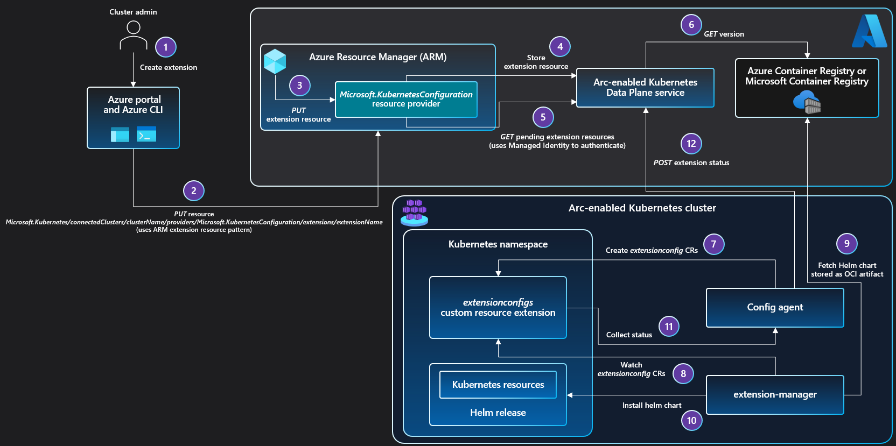

# Cluster extensions

Management services such as Azure Monitor and Azure Defender for Kubernetes or services like Azure App services, Azure Data services can be instantiated on Kubernetes clusters through the Cluster Extensions capability. [Helm charts](https://helm.sh/) help you manage Kubernetes applications by providing the building blocks needed to define, install, and upgrade even the most complex Kubernetes applications. Cluster extension feature builds on top of the packaging components of Helm by providing an Azure Resource Manager driven experience for installation and lifecycle management of instances of the services you intend to enable on your kubernetes cluster. A cluster operator or admin can use the Cluster extensions feature to 

- Install different extensions for the desired functionality and get an inventory of all clusters and the extensions installed on those clusters from Azure interfaces like the Azure portal, CLI, SDK etc. 
- As with any other Azure resource, you can control access to the cluster extension resource using Azure Role Based Access Control (RBAC)
- Use Azure Policy to automate at-scale deployment of cluster extensions across all clusters in your environment. 
- Subscribe to release trains (Eg: preview, stable) for each extension.
- Manage updates by setting up auto-upgrade for extensions or by pinning to a specific version.
- Manage the lifecycle of extensions including updates to extension properties or deletion of one or more extension instances.

An extension can be cluster-scoped or scoped to a namespace. Each extension type (Eg: Azure Monitor, Azure Defender, Azure App services) defines the scope at which they operate on the cluster. 

## Architecture for Azure Arc enabled Kubernetes clusters

The cluster extension instance is created as an extension Azure Resource Manager resource (`Microsoft.KubernetesConfiguration/extensions`) on top of the Azure Arc-enabled Kubernetes resource (represented by `Microsoft.Kubernetes/connectedClusters`) in Azure Resource Manager. Representation in Azure Resource Manager allows you to author a policy that checks for all the Azure Arc-enabled Kubernetes resources with or without a specific cluster extension. Once you've determined which clusters have missing cluster extensions with desired property values, you can remediate these non-compliant resources using Azure Policy.

The `config-agent` running in your cluster monitors and tracks newly created extension resources or updates to existing extension resources on the Azure Arc-enabled Kubernetes resource. The `extensions-manager` component running in your cluster then pulls the Helm chart associated with a cluster extension from Azure Container Registry or Microsoft Container Registry and installs it on the cluster. 

Both the `config-agent` and `extensions-manager` components running in the cluster handle updates for new versions and other operations like extension instance property updates and deletion. These agents use a system-assigned managed identity to securely communicate with the backend service in Azure. 

> [!NOTE]
> * `config-agent` monitors for newly created or updates to existing extension resources on the Azure Arc-enabled Kubernetes resource. Thus, agents require connectivity for the desired state of the extension to be pulled down to the cluster. If agents are unable to connect to Azure, propagation of the desired state to the cluster is delayed.
> * One of the properties you can set on cluster extensions is the ProtectedConfiguration settings. Protected configuration settings for an extension are stored for up to 48 hours in the Azure Arc-enabled Kubernetes services. As a result, if the cluster remains disconnected during the 48 hours after the extension resource was created on Azure, the extension transitions from a `Pending` state to `Failed` state. We advise bringing the clusters online as regularly as possible.

## Next steps

* Use our quickstart to [connect a Kubernetes cluster to Azure Arc](./quickstart-connect-cluster.md).
* [Deploy cluster extensions](./extensions.md) on your Azure Arc-enabled Kubernetes cluster.
