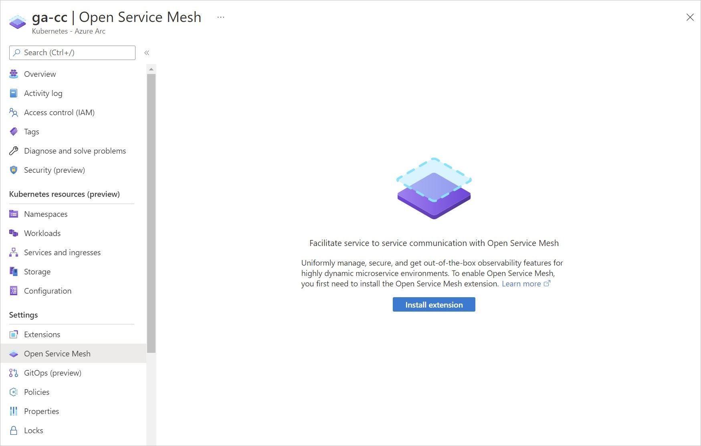
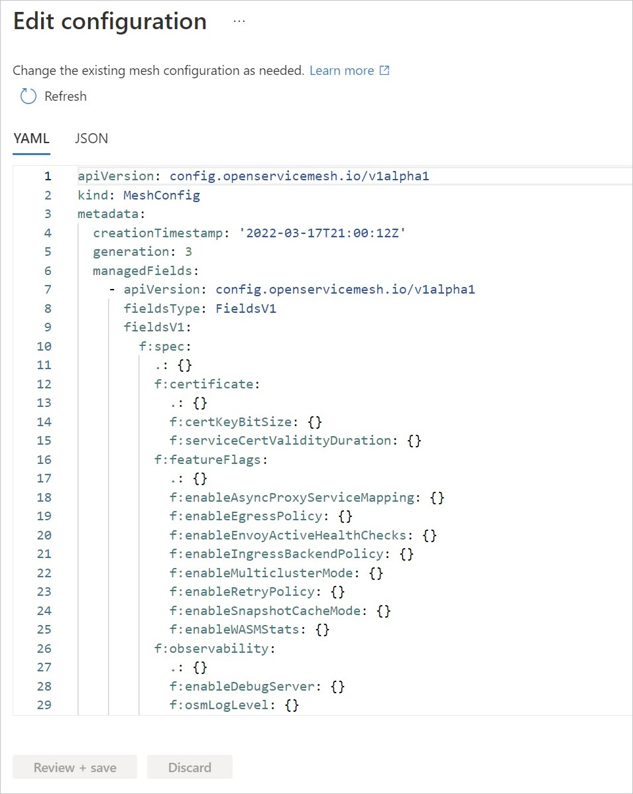
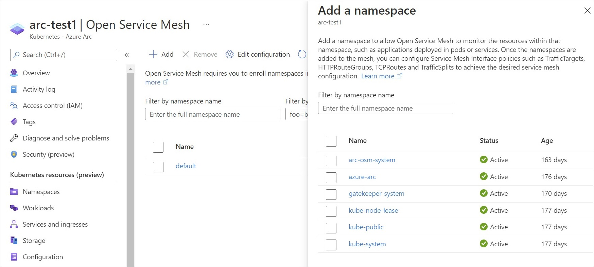
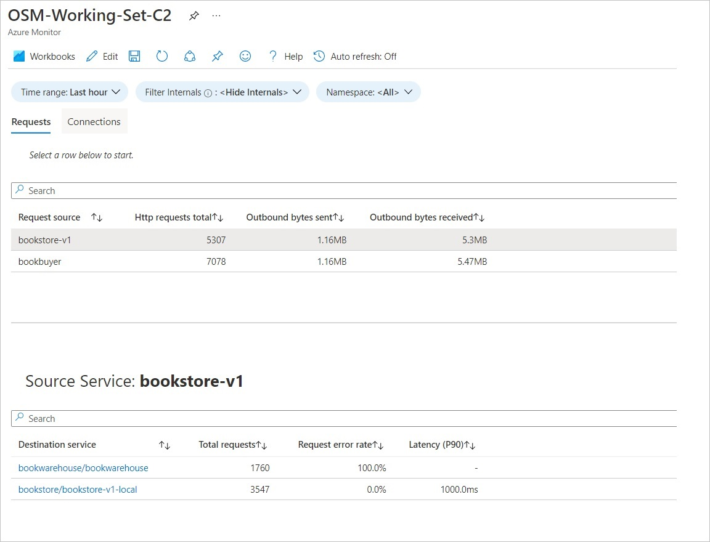

# Azure Arc-enabled Open Service Mesh

[Open Service Mesh (OSM)](https://docs.openservicemesh.io/) is a lightweight, extensible, Cloud Native service mesh that allows users to uniformly manage, secure, and get out-of-the-box observability features for highly dynamic microservice environments.

OSM runs an Envoy-based control plane on Kubernetes, can be configured with [SMI](https://smi-spec.io/) APIs, and works by injecting an Envoy proxy as a sidecar container next to each instance of your application. [Read more](https://docs.openservicemesh.io/#features) on the service mesh scenarios enabled by Open Service Mesh.

All components of Azure Arc-enabled OSM are deployed on availability zones, making them zone redundant.

## Installation options and requirements

Azure Arc-enabled Open Service Mesh can be deployed through Azure portal, Azure CLI, an ARM template, or a built-in Azure policy.

### Prerequisites

- Ensure you have met all the common prerequisites for cluster extensions listed [here](extensions.md#prerequisites).
- Use `az k8s-extension` CLI extension version >= v1.0.4

### Current support limitations

- Only one instance of Open Service Mesh can be deployed on an Azure Arc-connected Kubernetes cluster.
- Support is available for the two most recently released minor versions of Arc-enabled Open Service Mesh. Find the latest version [here](https://github.com/Azure/osm-azure/releases). Supported release versions are appended with notes. Ignore the tags associated with intermediate releases.
- The following Kubernetes distributions are currently supported:
  - AKS (Azure Kubernetes Service) Engine
  - AKS clusters on Azure Stack HCI
  - AKS hybrid clusters provisioned from Azure
  - Cluster API Azure
  - Google Kubernetes Engine
  - Canonical Kubernetes Distribution
  - Rancher Kubernetes Engine
  - OpenShift Kubernetes Distribution
  - Amazon Elastic Kubernetes Service
  - VMware Tanzu Kubernetes Grid
- Azure Monitor integration with Azure Arc-enabled Open Service Mesh is available [in preview with limited support](#monitoring-application-using-azure-monitor-and-applications-insights-preview).

> [!TIP]
> When using this extension with [AKS hybrid clusters provisioned from Azure](extensions.md#aks-hybrid-clusters-provisioned-from-azure-preview) you must set `--cluster-type` to use `provisionedClusters` and also add `--cluster-resource-provider microsoft.hybridcontainerservice` to the command. Installing Azure Arc extensions on AKS hybrid clusters provisioned from Azure is currently in preview.

## Basic installation using Azure portal

To deploy using Azure portal, once you have an Arc connected cluster, go to the cluster's **Open Service Mesh** section.

[](media/tutorial-arc-enabled-open-service-mesh/osm-portal-install.jpg#lightbox)

Select the **Install extension** button to deploy the latest version of the extension.

Alternatively, you can use the CLI experience captured here. For at-scale onboarding, read further in this article about deployment using [ARM template](#install-azure-arc-enabled-osm-using-arm-template) and using [Azure Policy](#install-azure-arc-enabled-osm-using-built-in-policy).

## Basic installation using Azure CLI

The following steps assume that you already have a cluster with a supported Kubernetes distribution connected to Azure Arc. Ensure that your KUBECONFIG environment variable points to the kubeconfig of the Arc-enabled Kubernetes cluster.

Set the environment variables:

```azurecli-interactive
export CLUSTER_NAME=<arc-cluster-name>
export RESOURCE_GROUP=<resource-group-name>
```

If you're using an OpenShift cluster, skip to the [OpenShift installation steps](#install-osm-on-an-openshift-cluster).

Create the extension:

> [!NOTE]
> To pin a specific version of OSM, add the `--version x.y.z` flag to the `create` command. Note that this will set the value for `auto-upgrade-minor-version` to false.

```azurecli-interactive
az k8s-extension create --cluster-name $CLUSTER_NAME --resource-group $RESOURCE_GROUP --cluster-type connectedClusters --extension-type Microsoft.openservicemesh --scope cluster --name osm
```

You should see output similar to this example. It may take 3-5 minutes for the actual OSM helm chart to get deployed to the cluster. Until this deployment happens, `installState` will remain `Pending`.

```json
{
  "autoUpgradeMinorVersion": true,
  "configurationSettings": {},
  "creationTime": "2021-04-29T17:50:11.4116524+00:00",
  "errorInfo": {
    "code": null,
    "message": null
  },
  "extensionType": "microsoft.openservicemesh",
  "id": "/subscriptions/<subscription-id>/resourceGroups/$RESOURCE_GROUP/providers/Microsoft.Kubernetes/connectedClusters/$CLUSTER_NAME/providers/Microsoft.KubernetesConfiguration/extensions/osm",
  "identity": null,
  "installState": "Pending",
  "lastModifiedTime": "2021-04-29T17:50:11.4116525+00:00",
  "lastStatusTime": null,
  "location": null,
  "name": "osm",
  "releaseTrain": "stable",
  "resourceGroup": "$RESOURCE_GROUP",
  "scope": {
    "cluster": {
      "releaseNamespace": "arc-osm-system"
    },
    "namespace": null
  },
  "statuses": [],
  "type": "Microsoft.KubernetesConfiguration/extensions",
  "version": "x.y.z"
}
```

Next, [validate your installation](#validate-installation).

## Custom installations

The following sections describe certain custom installations of Azure Arc-enabled OSM. Custom installations require setting values of OSM by in a JSON file and passing them into `k8s-extension create` CLI command.

### Install OSM on an OpenShift cluster

1. Copy and save the following contents into a JSON file. If you have already created a configuration settings file, add the following line to the existing file to preserve your previous changes.

   ```json
   {
       "osm.osm.enablePrivilegedInitContainer": "true"
   }
   ```

2. [Install OSM with custom values](#setting-values-during-osm-installation).

3. Add the privileged [security context constraint](https://docs.openshift.com/container-platform/4.7/authentication/managing-security-context-constraints.html) to each service account for the applications in the mesh.

   ```azurecli-interactive
   oc adm policy add-scc-to-user privileged -z <service account name> -n <service account namespace>
   ```

It may take 3-5 minutes for the actual OSM helm chart to get deployed to the cluster. Until this deployment happens, `installState` will remain `Pending`.

To ensure that the privileged init container setting doesn't revert to the default, pass in the `"osm.osm.enablePrivilegedInitContainer" : "true"` configuration setting to all subsequent `az k8s-extension create` commands.

### Enable High Availability features on installation

OSM's control plane components are built with High Availability and Fault Tolerance in mind. This section describes how to
enable Horizontal Pod Autoscaling (HPA) and Pod Disruption Budget (PDB) during installation. Read more about the [design
considerations of High Availability on OSM](https://docs.openservicemesh.io/docs/guides/ha_scale/high_availability/).

#### Horizontal Pod Autoscaling (HPA)

HPA automatically scales up or down control plane pods based on the average target CPU utilization (%) and average target
memory utilization (%) defined by the user. To enable HPA and set applicable values on OSM control plane pods during installation, create or
append to your existing JSON settings file as shown here, repeating the key/value pairs for each control plane pod
(`osmController`, `injector`) that you want to enable HPA on.

```json
{
  "osm.osm.<control_plane_pod>.autoScale.enable" : "true",
  "osm.osm.<control_plane_pod>.autoScale.minReplicas" : "<allowed values: 1-10>",
  "osm.osm.<control_plane_pod>.autoScale.maxReplicas" : "<allowed values: 1-10>",
  "osm.osm.<control_plane_pod>.autoScale.cpu.targetAverageUtilization" : "<allowed values 0-100>",
  "osm.osm.<control_plane_pod>.autoScale.memory.targetAverageUtilization" : "<allowed values 0-100>"
}
```

Now, [install OSM with custom values](#setting-values-during-osm-installation).

#### Pod Disruption Budget (PDB)

In order to prevent disruptions during planned outages, control plane pods `osm-controller` and `osm-injector` have a PDB
that ensures there's always at least one pod corresponding to each control plane application.

To enable PDB, create or append to your existing JSON settings file as follows for each desired control plane pod
(`osmController`, `injector`):

```json
{
  "osm.osm.<control_plane_pod>.enablePodDisruptionBudget" : "true"
}
```

Now, [install OSM with custom values](#setting-values-during-osm-installation).

### Install OSM with cert-manager for certificate management

[cert-manager](https://cert-manager.io/) is a provider that can be used for issuing signed certificates to OSM without
the need for storing private keys in Kubernetes. Refer to OSM's [cert-manager documentation](https://docs.openservicemesh.io/docs/guides/certificates/)
and [demo](https://docs.openservicemesh.io/docs/demos/cert-manager_integration/) to learn more.

> [!NOTE]
> Use the commands provided in the OSM GitHub documentation with caution. Ensure that you use the correct namespace in commands or specify with flag `--osm-namespace arc-osm-system`.

To install OSM with cert-manager as the certificate provider, create or append to your existing JSON settings file the `certificateProvider.kind`
value set to cert-manager as shown here. To change from the default cert-manager values specified in OSM documentation,
also include and update the subsequent `certmanager.issuer` lines.

```json
{
  "osm.osm.certificateProvider.kind" : "cert-manager",
  "osm.osm.certmanager.issuerName" : "<issuer name>",
  "osm.osm.certmanager.issuerKind" : "<issuer kind>",
  "osm.osm.certmanager.issuerGroup" : "<issuer group>"
}
```

Now, [install OSM with custom values](#setting-values-during-osm-installation).

### Install OSM with Contour for ingress

OSM provides multiple options to expose mesh services externally using ingress. OSM can use [Contour](https://projectcontour.io/), which
works with the ingress controller installed outside the mesh and provisioned with a certificate to participate in the mesh.
Refer to [OSM's ingress documentation](https://docs.openservicemesh.io/docs/guides/traffic_management/ingress/#1-using-contour-ingress-controller-and-gateway)
and [demo](https://docs.openservicemesh.io/docs/demos/ingress_contour/) to learn more.

> [!NOTE]
> Use the commands provided in the OSM GitHub documentation with caution. Ensure that you use the correct namespace in commands or specify with flag `--osm-namespace arc-osm-system`.
To set required values for configuring Contour during OSM installation, append the following to your JSON settings file:

```json
{
  "osm.osm.osmNamespace" : "arc-osm-system",
  "osm.contour.enabled" : "true",
  "osm.contour.configInline.tls.envoy-client-certificate.name" : "osm-contour-envoy-client-cert", 
  "osm.contour.configInline.tls.envoy-client-certificate.namespace" : "arc-osm-system"
}
```

### Setting values during OSM installation

Any values that need to be set during OSM installation need to be saved to a single JSON file and passed in through the Azure CLI
install command.

After you create a JSON file with applicable values as described in the custom installation sections, set the file path as an environment variable:

```azurecli-interactive
export SETTINGS_FILE=<json-file-path>
```

Run the `az k8s-extension create` command to create the OSM extension, passing in the settings file using the `--configuration-settings-file` flag:

```azurecli-interactive
az k8s-extension create --cluster-name $CLUSTER_NAME --resource-group $RESOURCE_GROUP --cluster-type connectedClusters --extension-type Microsoft.openservicemesh --scope cluster --name osm --configuration-settings-file $SETTINGS_FILE
```

## Install Azure Arc-enabled OSM using ARM template

After connecting your cluster to Azure Arc, create a JSON file with the following format, making sure to update the `<cluster-name>` and `<osm-arc-version>` values:

```json
{
    "$schema": "https://schema.management.azure.com/schemas/2019-04-01/deploymentTemplate.json#",
    "contentVersion": "1.0.0.0",
    "parameters": {
        "ConnectedClusterName": {
            "defaultValue": "<cluster-name>",
            "type": "String",
            "metadata": {
                "description": "The Connected Cluster name."
            }
        },
        "ExtensionInstanceName": {
            "defaultValue": "osm",
            "type": "String",
            "metadata": {
                "description": "The extension instance name."
            }
        },
        "ExtensionVersion": {
            "defaultValue": "<osm-arc-version>",
            "type": "String",
            "metadata": {
                "description": "The extension type version."
            }
        },
        "ExtensionType": {
            "defaultValue": "Microsoft.openservicemesh",
            "type": "String",
            "metadata": {
                "description": "The extension type."
            }
        },
        "ReleaseTrain": {
            "defaultValue": "Stable",
            "type": "String",
            "metadata": {
                "description": "The release train."
            }
        }
    },
    "functions": [],
    "resources": [
        {
            "type": "Microsoft.KubernetesConfiguration/extensions",
            "apiVersion": "2020-07-01-preview",
            "name": "[parameters('ExtensionInstanceName')]",
            "properties": {
                "extensionType": "[parameters('ExtensionType')]",
                "releaseTrain": "[parameters('ReleaseTrain')]",
                "version": "[parameters('ExtensionVersion')]"
            },
            "scope": "[concat('Microsoft.Kubernetes/connectedClusters/', parameters('ConnectedClusterName'))]"
        }
    ]
}
```

Set the environment variables:

```azurecli-interactive
export TEMPLATE_FILE_NAME=<template-file-path>
export DEPLOYMENT_NAME=<desired-deployment-name>
```

Run this command to install the OSM extension:

```azurecli-interactive
az deployment group create --name $DEPLOYMENT_NAME --resource-group $RESOURCE_GROUP --template-file $TEMPLATE_FILE_NAME
```

You should now be able to view the OSM resources and use the OSM extension in your cluster.

## Install Azure Arc-enabled OSM using built-in policy

A built-in policy is available on Azure portal under the **Kubernetes** category: **Azure Arc-enabled Kubernetes clusters should have the Open Service Mesh extension installed**. This policy can be assigned at the scope of a subscription or a resource group.

The default action of this policy is **Deploy if not exists**. However, you can choose to audit the clusters for extension installations by changing the parameters during assignment. You're also prompted to specify the version you wish to install (v1.0.0-1 or higher) as a parameter.

## Validate installation

Run the following command.

```azurecli-interactive
az k8s-extension show --cluster-type connectedClusters --cluster-name $CLUSTER_NAME --resource-group $RESOURCE_GROUP --name osm
```

You should see a JSON output similar to:

```json
{
  "autoUpgradeMinorVersion": true,
  "configurationSettings": {},
  "creationTime": "2021-04-29T19:22:00.7649729+00:00",
  "errorInfo": {
    "code": null,
    "message": null
  },
  "extensionType": "microsoft.openservicemesh",
  "id": "/subscriptions/<subscription-id>/resourceGroups/$RESOURCE_GROUP/providers/Microsoft.Kubernetes/connectedClusters/$CLUSTER_NAME/providers/Microsoft.KubernetesConfiguration/extensions/osm",
  "identity": null,
  "installState": "Installed",
  "lastModifiedTime": "2021-04-29T19:22:00.7649731+00:00",
  "lastStatusTime": "2021-04-29T19:23:27.642+00:00",
  "location": null,
  "name": "osm",
  "releaseTrain": "stable",
  "resourceGroup": "$RESOURCE_GROUP",
  "scope": {
    "cluster": {
      "releaseNamespace": "arc-osm-system"
    },
    "namespace": null
  },
  "statuses": [],
  "type": "Microsoft.KubernetesConfiguration/extensions",
  "version": "x.y.z"
}
```

For more commands that you can use to validate and troubleshoot the deployment of the Open Service Mesh (OSM) extension components on your cluster, see [our troubleshooting guide](extensions-troubleshooting.md#azure-arc-enabled-open-service-mesh)

## OSM controller configuration

OSM deploys a MeshConfig resource `osm-mesh-config` as a part of its control plane in `arc-osm-system` namespace. The purpose of this MeshConfig is to provide the mesh owner/operator the ability to update some of the mesh configurations based on their needs. To view the default values, use the following command.

```azurecli-interactive
kubectl describe meshconfig osm-mesh-config -n arc-osm-system
```

The output shows the default values:

```azurecli-interactive
  Certificate:
    Cert Key Bit Size:               2048
    Service Cert Validity Duration:  24h
  Feature Flags:
    Enable Async Proxy Service Mapping:  false
    Enable Egress Policy:                true
    Enable Envoy Active Health Checks:   false
    Enable Ingress Backend Policy:       true
    Enable Multicluster Mode:            false
    Enable Retry Policy:                 false
    Enable Snapshot Cache Mode:          false
    Enable WASM Stats:                   true
  Observability:
    Enable Debug Server:  false
    Osm Log Level:        info
    Tracing:
      Enable:  false
  Sidecar:
    Config Resync Interval:            0s
    Enable Privileged Init Container:  false
    Log Level:                         error
    Resources:
  Traffic:
    Enable Egress:                          false
    Enable Permissive Traffic Policy Mode:  true
    Inbound External Authorization:
      Enable:              false
      Failure Mode Allow:  false
      Stat Prefix:         inboundExtAuthz
      Timeout:             1s
    Inbound Port Exclusion List:
    Outbound IP Range Exclusion List:
    Outbound Port Exclusion List:
```

For more information, see the [Config API reference](https://docs.openservicemesh.io/docs/api_reference/config/v1alpha1/). Notice that `spec.traffic.enablePermissiveTrafficPolicyMode` is set to `true`. When OSM is in permissive traffic policy mode, [SMI](https://smi-spec.io/) traffic policy enforcement is bypassed. In this mode, OSM automatically discovers services that are a part of the service mesh and programs traffic policy rules on each Envoy proxy sidecar to be able to communicate with these services.

`osm-mesh-config` can also be viewed in the Azure portal by selecting **Edit configuration** in the cluster's Open Service Mesh section.

[](media/tutorial-arc-enabled-open-service-mesh/osm-portal-configuration.jpg#lightbox)

### Making changes to OSM controller configuration

> [!NOTE]
> Values in the MeshConfig `osm-mesh-config` are persisted across upgrades.

Changes to `osm-mesh-config` can be made using the `kubectl patch` command. In the following example, the permissive traffic policy mode is changed to false.

```azurecli-interactive
kubectl patch meshconfig osm-mesh-config -n arc-osm-system -p '{"spec":{"traffic":{"enablePermissiveTrafficPolicyMode":false}}}' --type=merge
```

If an incorrect value is used, validations on the MeshConfig CRD prevent the change with an error message explaining why the value is invalid. For example, this command shows what happens if we patch `enableEgress` to a non-boolean value:

```azurecli-interactive
kubectl patch meshconfig osm-mesh-config -n arc-osm-system -p '{"spec":{"traffic":{"enableEgress":"no"}}}'  --type=merge
# Validations on the CRD will deny this change
The MeshConfig "osm-mesh-config" is invalid: spec.traffic.enableEgress: Invalid value: "string": spec.traffic.enableEgress in body must be of type boolean: "string"
```

Alternatively, to edit `osm-mesh-config` in Azure portal, select **Edit configuration** in the cluster's Open Service Mesh section.

[](media/tutorial-arc-enabled-open-service-mesh/osm-portal-configuration-edit.jpg#lightbox)

## Using Azure Arc-enabled OSM

To start using OSM capabilities, you need to first onboard the application namespaces to the service mesh. Download the OSM CLI from the [OSM GitHub releases page](https://github.com/openservicemesh/osm/releases/). Once the namespaces are added to the mesh, you can configure the SMI policies to achieve the desired OSM capability.

### Onboard namespaces to the service mesh

Add namespaces to the mesh by running the following command:

```azurecli-interactive
osm namespace add <namespace_name>
```

Namespaces can be onboarded from Azure portal as well by selecting **+Add** in the cluster's Open Service Mesh section.

[](media/tutorial-arc-enabled-open-service-mesh/osm-portal-add-namespace.jpg#lightbox)

For more information about onboarding services, see the [Open Service Mesh documentation](https://docs.openservicemesh.io/docs/guides/app_onboarding/#onboard-services).

### Configure OSM with Service Mesh Interface (SMI) policies

You can start with a [sample application](https://docs.openservicemesh.io/docs/getting_started/install_apps/) or use your test environment to try out SMI policies.

> [!NOTE]
> If you use sample applications, ensure that their versions match the version of the OSM extension installed on your cluster. For example, if you are using v1.0.0 of the OSM extension, use the bookstore manifest from release-v1.0 branch of OSM upstream repository.

### Configuring your own Jaeger, Prometheus and Grafana instances

The OSM extension doesn't install add-ons like [Jaeger](https://www.jaegertracing.io/docs/getting-started/), [Prometheus](https://prometheus.io/docs/prometheus/latest/installation/), [Grafana](https://grafana.com/docs/grafana/latest/installation/) and [Flagger](https://docs.flagger.app/). You can integrate OSM with your own running instances of those tools instead. To integrate with your own instances, see the following documentation:

- [BYO-Jaeger instance](https://docs.openservicemesh.io/docs/guides/observability/tracing/#byo-bring-your-own)
- [BYO-Prometheus instance](https://docs.openservicemesh.io/docs/guides/observability/metrics/#prometheus)
- [BYO-Grafana dashboard](https://docs.openservicemesh.io/docs/guides/observability/metrics/#grafana)
- [OSM Progressive Delivery with Flagger](https://docs.flagger.app/tutorials/osm-progressive-delivery)

> [!NOTE]
> Use the commands provided in the OSM GitHub documentation with caution. Ensure that you use the correct namespace name `arc-osm-system` when making changes to `osm-mesh-config`.

## Monitoring application using Azure Monitor and Applications Insights (preview)

Both Azure Monitor and Azure Application Insights help you maximize the availability and performance of your applications and services by delivering a comprehensive solution for collecting, analyzing, and acting on telemetry from your cloud and on-premises environments. Azure Arc-enabled Open Service Mesh has deep integrations into both of these Azure services. This integration provides a seamless Azure experience for viewing and responding to critical KPIs provided by OSM metrics.

[!INCLUDE [preview features note](./includes/preview/preview-callout.md)]

Follow these steps to allow Azure Monitor to scrape Prometheus endpoints for collecting application metrics.

1. Follow the guidance available [here](#onboard-namespaces-to-the-service-mesh) to ensure that the application namespaces that you wish to be monitored are onboarded to the mesh.

2. Expose the Prometheus endpoints for application namespaces.

   ```azurecli-interactive
   osm metrics enable --namespace <namespace1>
   osm metrics enable --namespace <namespace2>
   ```

3. Install the Azure Monitor extension using the guidance available [here](../../azure-monitor/containers/container-insights-enable-arc-enabled-clusters.md?toc=/azure/azure-arc/kubernetes/toc.json).

4. Create a Configmap in the `kube-system` namespace that enables Azure Monitor to monitor your namespaces. For example, create a `container-azm-ms-osmconfig.yaml` with the following to monitor `<namespace1>` and `<namespace2>`:

      ```yaml
      kind: ConfigMap
      apiVersion: v1
      data:
        schema-version: v1
        config-version: ver1
        osm-metric-collection-configuration: |-
          # OSM metric collection settings
          [osm_metric_collection_configuration]
            [osm_metric_collection_configuration.settings]
                # Namespaces to monitor
                monitor_namespaces = ["<namespace1>", "<namespace2>"]
      metadata:
        name: container-azm-ms-osmconfig
        namespace: kube-system
      ```

5. Run the following kubectl command

    ```azurecli-interactive
    kubectl apply -f container-azm-ms-osmconfig.yaml
    ```

It may take up to 15 minutes for the metrics to show up in Log Analytics. You can try querying the InsightsMetrics table.

```azurecli-interactive
InsightsMetrics
| where Name contains "envoy"
| extend t=parse_json(Tags)
| where t.app == "namespace1"
```

### Navigating the OSM dashboard

1. Access your Arc connected Kubernetes cluster using this [link](https://aka.ms/azmon/osmux).
2. Go to Azure Monitor and navigate to the **Reports** tab to access the OSM workbook.
3. Select the time-range & namespace to scope your services.

[](media/tutorial-arc-enabled-open-service-mesh/osm-workbook.jpg#lightbox)

#### Requests tab

The **Requests** tab shows a summary of all the http requests sent via service to service in OSM.

- You can view all the services by selecting the service in the grid.
- You can view total requests, request error rate & P90 latency.
- You can drill down to destination and view trends for HTTP error/success code, success rate, pod resource utilization, and latencies at different percentiles.

#### Connections tab

The **Connections** tab shows a summary of all the connections between your services in Open Service Mesh.

- Outbound connections: total number of connections between Source and destination services.
- Outbound active connections: last count of active connections between source and destination in selected time range.
- Outbound failed connections: total number of failed connections between source and destination service.

## Upgrade to a specific version of OSM

There may be some downtime of the control plane during upgrades. The data plane is only affected during CRD upgrades.

### Supported upgrades

The OSM extension can be upgraded manually across minor and major versions. However, automatic upgrade (if enabled) only works across minor versions.

### Upgrade to a specific OSM version manually

The following command upgrades the OSM-Arc extension to a specific version:

```azurecli-interactive
az k8s-extension update --cluster-name $CLUSTER_NAME --resource-group $RESOURCE_GROUP --cluster-type connectedClusters --release-train stable --name osm --version x.y.z
```

### Enable automatic upgrades

If automatic upgrades aren't enabled by default, the following command can be run to enable them. The current value of `--auto-upgrade-minor-version` can be verified by running the `az k8s-extension show` command as detailed in the [Validate installation](#validate-installation) step.

```azurecli-interactive
az k8s-extension update --cluster-name $CLUSTER_NAME --resource-group $RESOURCE_GROUP --cluster-type connectedClusters --release-train stable --name osm --auto-upgrade-minor-version true
```

## Uninstall Azure Arc-enabled OSM

Use the following command:

```azurecli-interactive
az k8s-extension delete --cluster-type connectedClusters --cluster-name $CLUSTER_NAME --resource-group $RESOURCE_GROUP --name osm -y
```

Verify that the extension instance has been deleted:

```azurecli-interactive
az k8s-extension list --cluster-type connectedClusters --cluster-name $CLUSTER_NAME --resource-group $RESOURCE_GROUP
```

This output should not include OSM. If you do not have any other extensions installed on your cluster, it's just an empty array.

When you use the `az k8s-extension` command to delete the OSM extension, the `arc-osm-system` namespace is not removed, and the actual resources within the namespace (like mutating webhook configuration and osm-controller pod) take around 10 minutes to delete.

> [!NOTE]
> Use the az k8s-extension CLI to uninstall OSM components managed by Arc. Using the OSM CLI to uninstall is not supported by Arc and can result in undesirable behavior.

## Next steps

- Just want to try things out? Get started quickly with an [Azure Arc Jumpstart](https://aka.ms/arc-jumpstart-osm) scenario using Cluster API.
- Get [troubleshooting help for Azure Arc-enabled OSM](extensions-troubleshooting.md#azure-arc-enabled-open-service-mesh).
- - Explore other [extensions for Arc-enabled Kubernetes](extensions-release.md).
