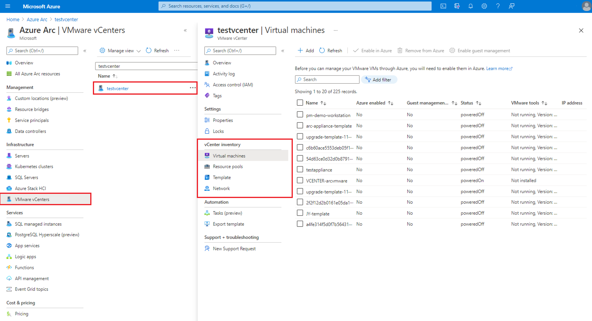

# Remove your VMware vCenter  environment from Azure Arc

In this article, you'll learn how to cleanly remove your VMware vCenter environment from Azure Arc-enabled VMware vSphere. For VMware vSphere environments that you no longer want to manage with Azure Arc-enabled VMware vSphere, follow the steps in the article to:

- Remove guest management from VMware virtual machines
- Remove VMware vSphere resource from Azure Arc
- Remove Arc resource bridge related items in your vCenter

## Remove guest management from VMware virtual machines

To prevent continued billing of Azure management services after you remove the vSphere environment from Azure Arc, you must first cleanly remove guest management from all Arc-enabled VMware vSphere virtual machines where it was enabled.

When you enable guest management on Arc-enabled VMware vSphere virtual machines, the Arc connected machine agent is installed on them.  Once guest management is enabled, you can install VM extensions on them and use Azure management services like the Log Analytics on them.

To cleanly remove guest management, you must follow the steps below to remove any VM extensions from the virtual machine, disconnect the agent, and uninstall the software from your virtual machine. It's important to complete each of the three steps to fully remove all related software components from your virtual machines.

### Step 1: Remove VM extensions

If you have deployed Azure VM extensions to an Azure Arc-enabled VMware vSphere VM, you must uninstall the extensions before disconnecting the agent or uninstalling the software. Uninstalling the Azure Connected Machine agent doesn't automatically remove extensions, and they won't be recognized if you late connect the VM to Azure Arc again.
Uninstall extensions using following steps:

1. Go to [Azure Arc center in Azure portal](https://portal.azure.com/#blade/Microsoft_Azure_HybridCompute/AzureArcCenterBlade/overview)

2. Select **VMware vCenters**.

3. Search and select the vCenter you want to remove from Azure Arc.

    

4. Select **Virtual machines** under **vCenter inventory**.

5. Search and select the virtual machine where you have Guest Management enabled.

6. Select **Extensions**.

7. Select the extensions and select **Uninstall**

### Step 2: Disconnect the agent from Azure Arc

Disconnecting the agent clears the local state of the agent and removes agent information from our systems. To disconnect the agent, sign-in and run the following command as an administrator/root account on the virtual machine.

```powershell
    azcmagent disconnect --force-local-only
```

### Step 3: Uninstall the agent

#### For Windows virtual machines

To uninstall the Windows agent from the machine, do the following:

1. Sign in to the computer with an account that has administrator permissions.
2. In Control Panel, select Programs and Features.
3. In Programs and Features, select Azure Connected Machine Agent, select Uninstall, and then select Yes.
4. Delete the `C:\Program Files\AzureConnectedMachineAgent` folder

#### For Linux virtual machines

To uninstall the Linux agent, the command to use depends on the Linux operating system. You must have `root` access permissions or your account must have elevated rights using sudo.

- For Ubuntu, run the following command:

  ```bash
  sudo apt purge azcmagent
  ```

- For RHEL, CentOS, Oracle Linux run the following command:

    ```bash
    sudo yum remove azcmagent
    ```

- For SLES, run the following command:

     ```bash
    sudo zypper remove azcmagent
    ```

## Remove VMware vSphere resources from Azure

When you enable VMware vSphere resources in Azure, an Azure resource representing them is created. Before you can delete the vCenter resource in Azure, you must delete all the Azure resources that represent your related vSphere resources.

1. Go to [Azure Arc center in Azure portal](https://portal.azure.com/#blade/Microsoft_Azure_HybridCompute/AzureArcCenterBlade/overview)

2. Select **VMware vCenters**.

3. Search and select the vCenter you remove from Azure Arc.

4. Select **Virtual machines** under **vCenter inventory**.

5. Select all the VMs that have **Azure Enabled** value as **Yes**.

6. Select **Remove from Azure**.

    This action will only remove these resource representations from Azure. The resources will continue to remain in your vCenter. 

7. Perform the steps 4,5 and 6 for **Resources pools/clusters/hosts**, **Templates**, **Networks**, and **Datastores**

8. Once the deletion is complete, select **Overview**.

9. Note the **Custom location** and the **Azure Arc Resource bridge** resource in the **Essentials** section.

10. Select **Remove from Azure** to remove the vCenter resource from Azure.

11. Go to the **Custom location** resource and click **Delete**

12. Go to the **Azure Arc Resource bridge** resource and click **Delete**

At this point, all your Arc-enabled VMware vSphere resources are removed from Azure.

## Remove Arc resource bridge related items in your vCenter

During onboarding, to create a connection between your VMware vCenter and Azure, an Azure Arc resource bridge is deployed into your VMware vSphere environment. As the last step, you must delete the resource bridge VM as well the VM template created during the onboarding.

You can find both the virtual machine and the template on the resource pool/cluster/host that you provided during [Azure Arc-enabled VMware vSphere onboarding](quick-start-connect-vcenter-to-arc-using-script.md).

## Next steps

- [Connect the vCenter to Azure Arc again](quick-start-connect-vcenter-to-arc-using-script.md)
