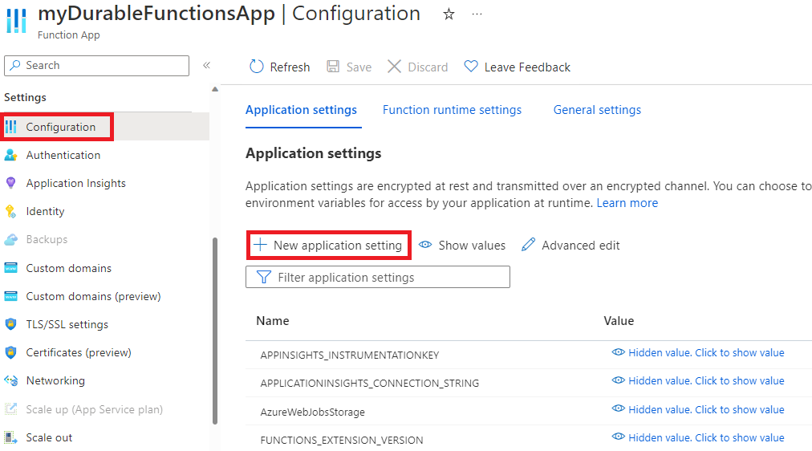
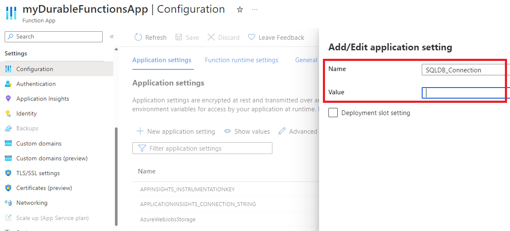

# Configure Durable Functions with the Microsoft SQL Server (MSSQL) storage provider

Durable Functions supports several [storage providers](durable-functions-storage-providers.md), also known as "backends", for storing orchestration and entity runtime state. By default, new projects are configured to use the [Azure Storage provider](durable-functions-storage-providers.md#azure-storage). In this article, we walk through how to configure a Durable Functions app to utilize the [MSSQL storage provider](durable-functions-storage-providers.md#mssql).

> [!NOTE]
> The MSSQL backend was designed to maximize application portability and control over your data. It uses [Microsoft SQL Server](https://www.microsoft.com/sql-server/) to persist all task hub state so that users get the benefits of modern, enterprise-grade DBMS infrastructure. To learn more about when to use the MSSQL storage provider, see the [storage providers](durable-functions-storage-providers.md) documentation.

## Note on data migration

Migration of [Task Hub data](durable-functions-task-hubs.md) across storage providers isn't currently supported. Function apps with existing runtime data will start with a fresh, empty task hub after switching to the MSSQL backend. Similarly, the task hub contents created with MSSQL can't be preserved when switching to a different storage provider.

## Prerequisites

The following steps assume that you're starting with an existing Durable Functions app and are familiar with how to operate it.

In particular, this quickstart assumes that you have already:
1. Created an Azure Functions project on your local machine.
2. Added Durable Functions to your project with an [orchestrator function](durable-functions-bindings.md#orchestration-trigger) and a [client function](durable-functions-bindings.md#orchestration-client) that triggers it.
3. Configured the project for local debugging.

If this isn't the case, we suggest you start with one of the following articles, which provides detailed instructions on how to achieve all the requirements above:

- [Create your first durable function - C#](durable-functions-create-first-csharp.md)
- [Create your first durable function - JavaScript](quickstart-js-vscode.md)
- [Create your first durable function - Python](quickstart-python-vscode.md)
- [Create your first durable function - PowerShell](quickstart-powershell-vscode.md)
- [Create your first durable function - Java](quickstart-java.md)

## Add the Durable Task MSSQL extension (.NET only)

> [!NOTE]
> If your app uses [Extension Bundles](../functions-bindings-register.md#extension-bundles), you should ignore this section as Extension Bundles removes the need for manual Extension management.

You'll need to install the latest version of the MSSQL storage provider Extension on NuGet. This usually means including a reference to it in your `.csproj` file and building the project.

The Extension package to install depends on the .NET worker you're using:
- For the _in-process_ .NET worker, install [`Microsoft.DurableTask.SqlServer.AzureFunctions`](https://www.nuget.org/packages/Microsoft.DurableTask.SqlServer.AzureFunctions).
- For the _isolated_ .NET worker, install [`Microsoft.Azure.Functions.Worker.Extensions.DurableTask.SqlServer`](https://www.nuget.org/packages/Microsoft.Azure.Functions.Worker.Extensions.DurableTask.SqlServer).

You can install the Extension using the following [Azure Functions Core Tools CLI](../functions-run-local.md#install-the-azure-functions-core-tools) command

```cmd
func extensions install --package <package name depending on your worker model> --version <latest version>
```

For more information on installing Azure Functions Extensions via the Core Tools CLI, see [this guide](../functions-run-local.md#install-extensions).

## Set up your Database

> [!NOTE]
> If you already have an MSSQL-compatible database, you may skip this section and its sub-section on setting up a Docker-based local database.

As the MSSQL backend is designed for portability, you have several options to set up your backing database. For example, you can set up an on-premises SQL Server instance, use a fully managed [Azure SQL DB](/azure/azure-sql/database/sql-database-paas-overview), or use any other SQL Server-compatible hosting option.

You can also do local, offline development with [SQL Server Express](https://www.microsoft.com/sql-server/sql-server-downloads) on your local Windows machine or use [SQL Server Docker image](https://hub.docker.com/_/microsoft-mssql-server) running in a Docker container. For ease of setup, we will focus on the latter.

### Set up your local Docker-based SQL Server

To run these steps, you will need a [Docker](https://www.docker.com/products/docker-desktop/) installation on your local machine. Below are PowerShell commands that you can use to set up a local SQL Server database on Docker. Note that PowerShell can be installed on Windows, macOS, or Linux using the installation instructions [here](/powershell/scripting/install/installing-powershell).

```powershell
# primary parameters
$pw        = "yourStrong(!)Password"
$edition   = "Developer"
$port      = 1433
$tag       = "2019-latest"
$dbname    = "DurableDB"
$collation = "Latin1_General_100_BIN2_UTF8"

# pull the image from the Microsoft container registry
docker pull mcr.microsoft.com/mssql/server:$tag

# run the image, providing some basic setup parameters
docker run --name mssql-server -e 'ACCEPT_EULA=Y' -e "SA_PASSWORD=$pw" -e "MSSQL_PID=$edition" -p ${port}:1433 -d mcr.microsoft.com/mssql/server:$tag

# wait a few seconds for the container to start...

# create the database with strict binary collation
docker exec -d mssql-server /opt/mssql-tools/bin/sqlcmd -S . -U sa -P "$pw" -Q "CREATE DATABASE [$dbname] COLLATE $collation"
```

After running these commands, you should have a local SQL Server running on Docker and listening on port `1443`. If port `1443` conflicts with another service, you can re-run these commands after changing the variable `$port` to a different value.

> [!NOTE]
> To stop and delete a running container, you may use `docker stop <containerName>` and `docker rm <containerName>` respectively. You may use these commands to re-create your container, and to stop if after you're done with this quickstart. For more assistance, try `docker --help`.

To validate your database installation, you can query for your new SQL database using the following Docker command:

```powershell
docker exec -it mssql-server /opt/mssql-tools/bin/sqlcmd -S . -U sa -P "$pw" -Q "SELECT name FROM sys.databases"
```

If the database setup completed successfully, you should see the name of your created database (for example, "DurableDB") in the command-line output.

```bash
name

--------------------------------------------------------------
master

tempdb

model

msdb

DurableDB

```

### Add your SQL connection string to local.settings.json

The MSSQL backend needs a connection string to your database. How to obtain a connection string largely depends on your specific MSSQL Server provider. Please review the documentation of your specific provider for information on how to obtain a connection string.

If you used Docker commands above without changing any parameters, your connection string should be:

```
Server=localhost,1433;Database=DurableDB;User Id=sa;Password=yourStrong(!)Password;
```

After obtaining your connection string, add it to a variable in `local.settings.json` so it can be used during local development. 

Below is an example `local.settings.json` assigning the default Docker-based SQL Server's connection string to the variable `SQLDB_Connection`. 


```json
{
  "IsEncrypted": false,
  "Values": {
    "AzureWebJobsStorage": "UseDevelopmentStorage=true", 
    "SQLDB_Connection": "Server=localhost,1433;Database=DurableDB;User Id=sa;Password=yourStrong(!)Password;",
    "FUNCTIONS_WORKER_RUNTIME": "<dependent on your programming language>"
  }
}
```

> [!NOTE]
> The value of `FUNCTIONS_WORKER_RUNTIME` is dependent on your programming language of choice. For more information, please see its [reference docs](../functions-app-settings.md#functions_worker_runtime).

### Update host.json

Edit the storage provider section of the `host.json` file so it sets the `type` to `mssql`. We'll also specify the connection string variable name, `SQLDB_Connection`, under `connectionStringName`. We'll set `createDatabaseIfNotExists` to `true`; this setting creates a database named `DurableDB` if one doesn't already exist, with collation `Latin1_General_100_BIN2_UTF8`.

```json
{
  "version": "2.0",
  "extensions": {
    "durableTask": {
      "storageProvider": {
        "type": "mssql",
        "connectionStringName": "SQLDB_Connection",
        "createDatabaseIfNotExists": true 
        }
    }
  },
  "logging": {
    "logLevel": {
      "DurableTask.SqlServer": "Warning",
      "DurableTask.Core": "Warning"
    }
  }
}    
```

The snippet above is a fairly *minimal* `host.json` example. Later, you may want to consider [additional parameters](https://microsoft.github.io/durabletask-mssql/#/quickstart?id=hostjson-configuration).

### Test locally

Your app is now ready for local development: You can start the Function app to test it. One way to do this is to run `func host start` on your application's root and executing a simple orchestrator Function.

While the function app is running, it updates runtime state in the configured SQL database. You can test this is working as expected using your SQL query interface. For example, in our docker-based local SQL server container, you can view the state of your orchestration instances with the following `docker` command:

```bash
docker exec -it mssql-server /opt/mssql-tools/bin/sqlcmd -S . -d $dbname -U sa -P "$pw"  -Q "SELECT TOP 5 InstanceID, RuntimeStatus, CreatedTime, CompletedTime FROM dt.Instances"
```

After running an orchestration, the previous query should return something like this:

```
InstanceID                           RuntimeStatus        CreatedTime                   CompletedTime
------------------------------------ -------------------- ----------------------------- ----------------------------
9fe1ea9d109341ff923621c0e58f215c     Completed            2022-11-16 21:42:39.1787277   2022-11-16 21:42:42.3993899
```

## Run your app on Azure

To run your app in Azure, you will need a publicly accessible SQL Server instance. You can obtain one by creating an Azure SQL database.

### Create an Azure SQL database

> [!NOTE]
> If you already have an Azure SQL database, or some other publicly accessible SQL Server you would like to use, you may skip to the next section.

You can follow [these](/azure/azure-sql/database/single-database-create-quickstart) instructions to create an Azure SQL database on the portal. When configuring the database, make sure to set the *Database collation* (under _Additional settings_) to `Latin1_General_100_BIN2_UTF8`.

> [!NOTE]
> Microsoft offers a [12-month free Azure subscription account](https://azure.microsoft.com/free/) if you’re exploring Azure for the first time.

You may obtain your Azure SQL database's connection string by navigating to the database's blade in the Azure portal. Then, under Settings, select "Connection strings" and obtain the "ADO.NET" connection string. Make sure to provide your password in the template provided.

Below is an example of the portal view for obtaining the Azure SQL connection string.


In the Azure portal, the connection string will have the database's password removed: it is replaced with `{your_password}`. Replace that segment with the password you used to create the database earlier in this section. If you forgot your password, you may reset it by navigating to the database's blade in the Azure portal, selecting your *Server name* in the "Essentials" view, and clicking "Reset password" in the resulting page. Below are some guiding images.


### Add connection string as an application setting

You need to add your database's connection string as an application setting. To do this through the Azure portal, first go to your Azure Functions App view. Then go under "Configuration", select "New application setting", and there you can assign "SQLDB_Connection" to map to a publicly accessible connection string. Below are some guiding images.




### Deploy

You can now deploy your function app to Azure and run your tests or workload on it. To validate the MSSQL backend is correctly configured, you can query your database for Task Hub data.

For example, with Azure SQL database you can query for your orchestration instances by navigating to your SQL database's blade, clicking Query Editor, authenticating, and then running the following query:

```sql
SELECT TOP 5 InstanceID, RuntimeStatus, CreatedTime, CompletedTime FROM dt.Instances
```

After running a simple orchestrator, you should see at least one result, as shown below:


For more information about the Durable Task MSSQL backend architecture, configuration, and workload behavior, see the [MSSQL storage provider documentation](https://microsoft.github.io/durabletask-mssql/).