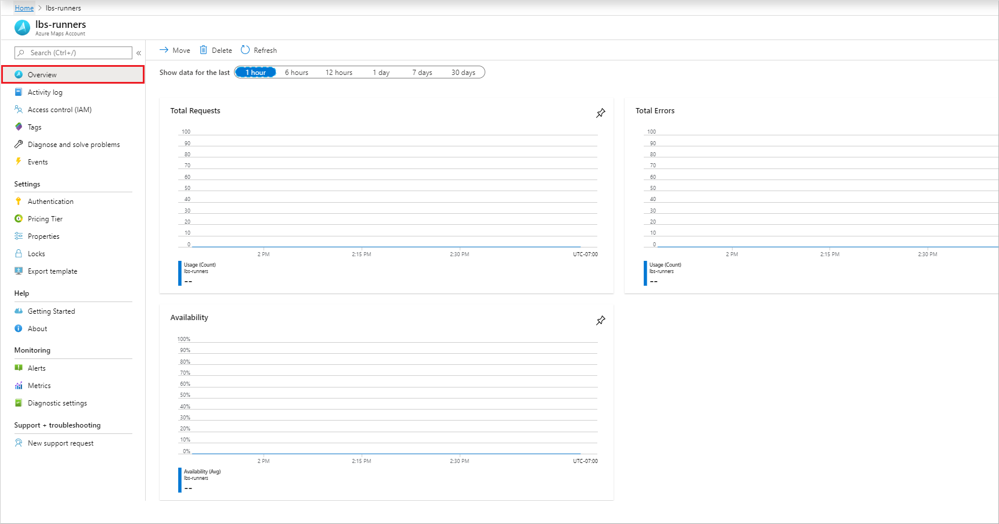
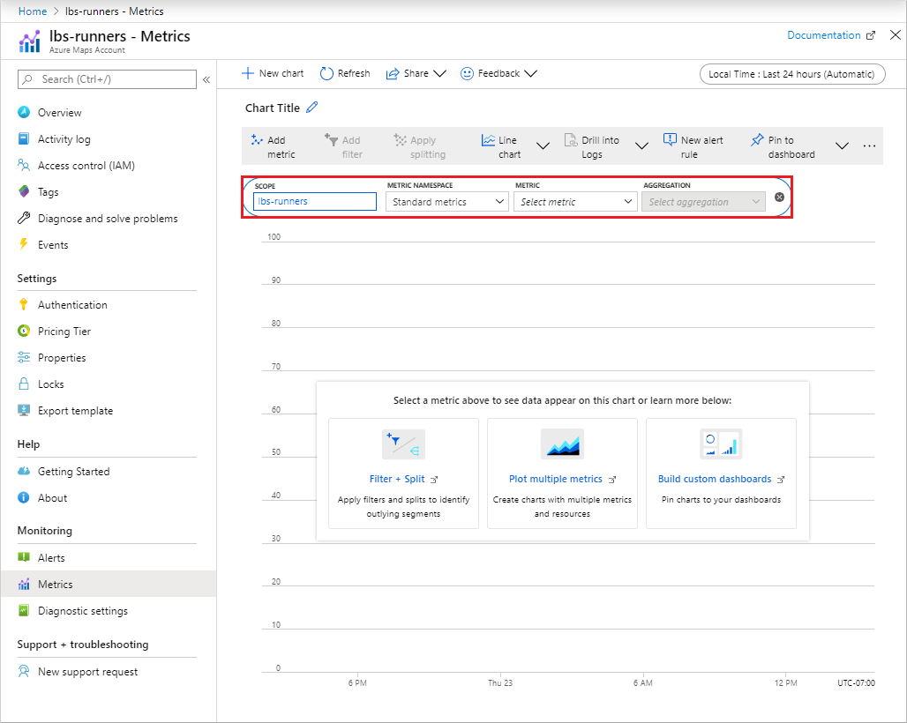
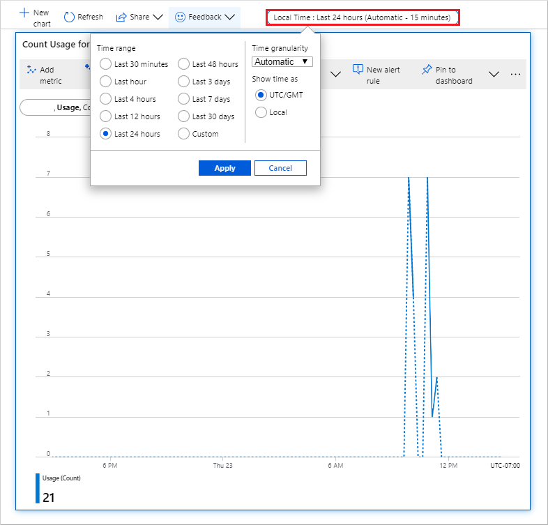
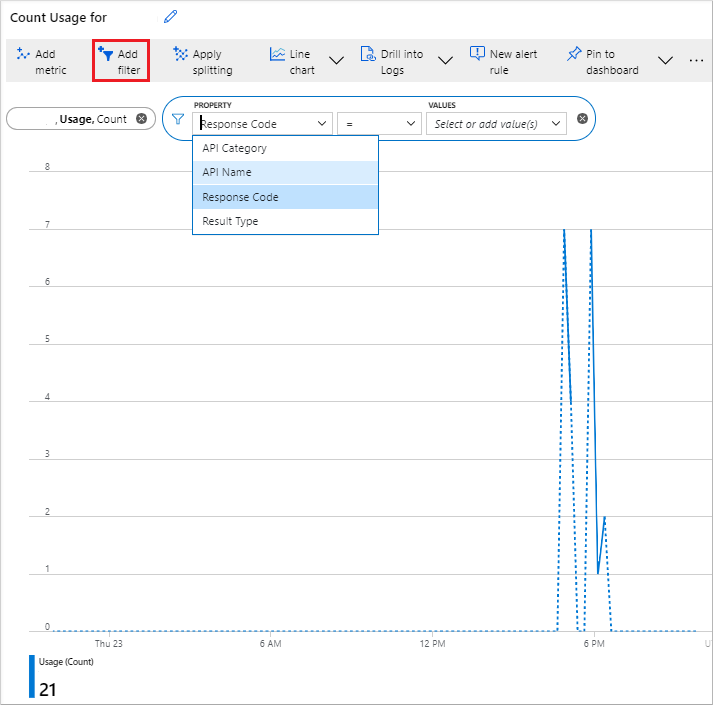
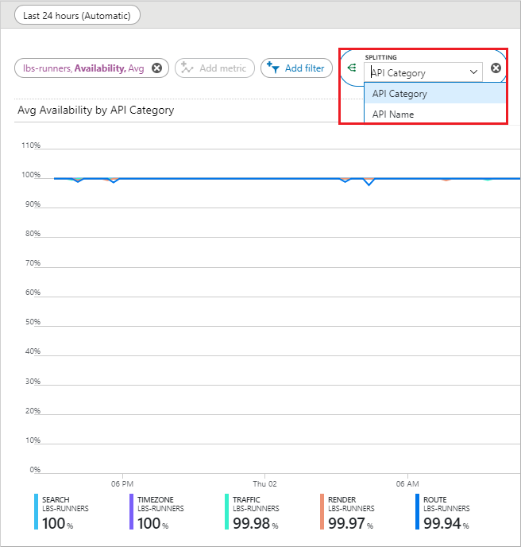

# How to view the Azure Maps API usage
This article shows you how to view the API usage metrics for your Azure Maps account in the [portal](https://portal.azure.com). The metrics are shown in a convenient graph format along a customizable time duration. 

## View metric snapshot 

You can see some common metrics on the **Overview** page of your Maps account. It currently shows *Total Requests*, *Total Errors*, and *Availability* over a selectable time duration. 

Continue to the next section if you need to customize these graphs for your particular analysis.

## View detailed metrics

1. Sign in to your Azure subscription in the [portal](https://portal.azure.com). 

2. Click the **All resources** menu item on the left-hand side and navigate to your *Azure Maps Account*.

3. Once your Maps account is open, click on the **Metrics** menu on the left.

4. On the **Metrics** pane, choose between one of the following:

    1. **Availability**, which shows the *Average* of API availability over a period of time, or 
    2. **Usage**, which shows how the usage *Count* for your account. 

    

5. Once you have selected the metrics, you may select the *Time range* by selecting on the **Last 12 hours (Automatic)** which is the default value. You may also select the *Time granularity*, as well as choose to show the time as *local* or *GMT* in the same drop-down. Click **Apply**.

    
 
6. Once you add your metric, you can then **Add filter** from amongst the properties relevant to that metric, and then select the value of the property that you want to see the graph for. 

    

7. You may also **Apply splitting** for your metric based on your selected metric property. This allows the graph to be split into multiple graphs, one each for each value of that property. For example, in the following picture, the color of each graph corresponds to the property value shown at the bottom of the graph.

    
 
8. You may also observe multiple metrics on the same graph, simply by clicking on the **Add metric** button on top.

## Next steps

Now that you have learned how to track your Azure Maps usage, you may proceed to read more about the APIs you are using with the:

* [Azure Maps REST API documentation](https://docs.microsoft.com/rest/api/maps)
