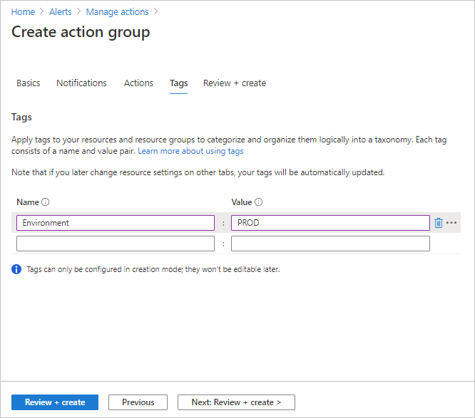
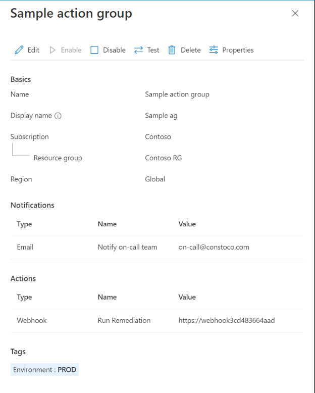
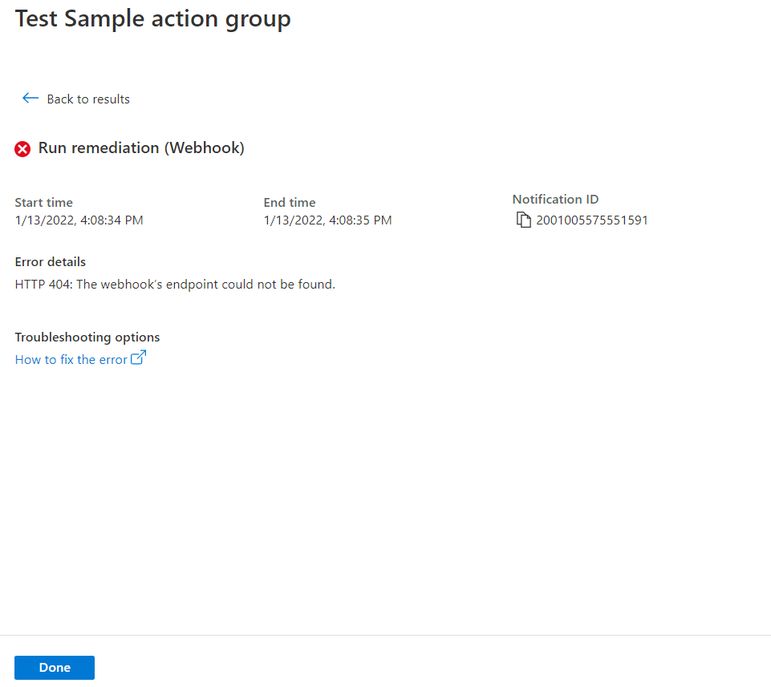
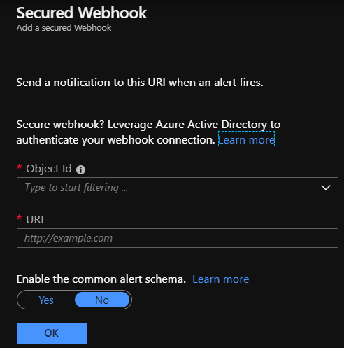

# Create and manage action groups in the Azure portal
An action group is a collection of notification preferences defined by the owner of an Azure subscription. Azure Monitor, Service Health and Azure Advisor alerts use action groups to notify users that an alert has been triggered. Various alerts may use the same action group or different action groups depending on the user's requirements. 

This article shows you how to create and manage action groups in the Azure portal.

Each action is made up of the following properties:

* **Type**: The notification or action performed. Examples include sending a voice call, SMS, email; or triggering various types of automated actions. See types later in this article.
* **Name**: A unique identifier within the action group.
* **Details**: The corresponding details that vary by *type*.

For information on how to use Azure Resource Manager templates to configure action groups, see [Action group Resource Manager templates](./action-groups-create-resource-manager-template.md).

Action Group is **Global** service, therefore there's no dependency on a specific Azure region. Requests from client can be processed by action group service in any region, which means, if one region of service is down, the traffic will be routed and process by other regions automatically. Being a *global service* it helps client not to worry about **disaster recovery**. 

## Create an action group by using the Azure portal

1. In the [Azure portal](https://portal.azure.com), search for and select **Monitor**. The **Monitor** pane consolidates all your monitoring settings and data in one view.

1. Select **Alerts**, then select **Manage actions**.

    
    
1. Select **Add action group**, and fill in the relevant fields in the wizard experience.

    

### Configure basic action group settings

Under **Project details**:

Select the **Subscription** and **Resource group** in which the action group is saved.

Under **Instance details**:

1. Enter an **Action group name**.

1. Enter a **Display name**. The display name is used in place of a full action group name when notifications are sent using this group.

      


### Configure notifications

1. Click the **Next: Notifications >** button to move to the **Notifications** tab, or select the **Notifications** tab at the top of the screen.

1. Define a list of notifications to send when an alert is triggered. Provide the following for each notification:

    a. **Notification type**: Select the type of notification you want to send. The available options are:
      * Email Azure Resource Manager Role - Send an email to users assigned to certain subscription-level ARM roles.
      * Email/SMS/Push/Voice - Send these notification types to specific recipients.
    
    b. **Name**: Enter a unique name for the notification.

    c. **Details**: Based on the selected notification type, enter an email address, phone number, etc.
    
    d. **Common alert schema**: You can choose to enable the [common alert schema](./alerts-common-schema.md), which provides the advantage of having a single extensible and unified alert payload across all the alert services in Azure Monitor.

    
    
### Configure actions

1. Click the **Next: Actions >** button to move to the **Actions** tab, or select the **Actions** tab at the top of the screen.

1. Define a list of actions to trigger when an alert is triggered. Provide the following for each action:

    a. **Action type**: Select Automation Runbook, Azure Function, ITSM, Logic App, Secure Webhook, Webhook.
    
    b. **Name**: Enter a unique name for the action.

    c. **Details**: Based on the action type, enter a webhook URI, Azure app, ITSM connection, or Automation Runbook. For ITSM Action, additionally specify **Work Item** and other fields your ITSM tool requires.
    
    d. **Common alert schema**: You can choose to enable the [common alert schema](./alerts-common-schema.md), which provides the advantage of having a single extensible and unified alert payload across all the alert services in Azure Monitor.
    
    

### Create the action group

1. You can explore the **Tags** settings if you like. This lets you associate key/value pairs to the action group for your categorization and is a feature available for any Azure resource.

    
    
1. Click **Review + create** to review the settings. This will do a quick validation of your inputs to make sure all the required fields are selected. If there are issues, they'll be reported here. Once you've reviewed the settings, click **Create** to provision the action group.
    
    

> [!NOTE]
> When you configure an action to notify a person by email or SMS, they receive a confirmation indicating they have been added to the action group.
### Test an action group in the Azure portal (Preview)

When creating or updating an action group in the Azure portal, you can **test** the action group.
1. After creating an action rule, click on **Review + create**.  Select *Test action group*.

    
    
1. Select the *sample type* and select the notification and action types that you want to test and select **Test**.
    
    

1. If you close the window or select **Back to test setup** while the test is running, the test is stopped, and you won't get test results. 

    

1. When the test is complete either a **Success** or **Failed** test status is displayed. If the test failed, you could select *View details* to get more information.  
    

You can use the information in the **Error details section**, to understand the issue so that you can edit and test the action group again.
To allow you to check the action groups are working as expected before you enable them in a production environment, you'll get email and SMS alerts with the subject: Test.

All the details and links in Test email notifications for the alerts fired are a sample set for reference. 

> [!NOTE]
> You may have a limited number of actions in a test Action Group. See the [rate limiting information](./alerts-rate-limiting.md) article.
>
> You can opt in or opt out to the common alert schema through Action Groups, on the portal. You can [find common schema samples for test action groups for all the sample types](./alerts-common-schema-test-action-definitions.md).
> You can opt in or opt out to the non-common alert schema through Action Groups, on the portal. You can [find non-common schema alert definitions](./alerts-non-common-schema-definitions.md).

## Manage your action groups

After you create an action group, you can view **Action groups** by selecting **Manage actions** from the **Alerts** landing page in **Monitor** pane. Select the action group you want to manage to:

* Add, edit, or remove actions.
* Delete the action group.

## Action-specific information

> [!NOTE]
> See [Subscription Service Limits for Monitoring](../../azure-resource-manager/management/azure-subscription-service-limits.md#azure-monitor-limits) for numeric limits on each of the items below.  

### Automation Runbook
Refer to the [Azure subscription service limits](../../azure-resource-manager/management/azure-subscription-service-limits.md) for limits on Runbook payloads.

You may have a limited number of Runbook actions in an Action Group. 

### Azure app Push Notifications
Enable push notifications to the [Azure mobile app](https://azure.microsoft.com/features/azure-portal/mobile-app/) by providing the email address you use as your account ID when configuring the Azure mobile app.

You may have a limited number of Azure app actions in an Action Group.

### Email
Emails will be sent from the following email addresses. Ensure that your email filtering is configured appropriately
- azure-noreply@microsoft.com
- azureemail-noreply@microsoft.com
- alerts-noreply@mail.windowsazure.com

You may have a limited number of email actions in an Action Group. See the [rate limiting information](./alerts-rate-limiting.md) article.

### Email Azure Resource Manager Role
Send email to the members of the subscription's role. Email will only be sent to **Azure AD user** members of the role. Email won't be sent to Azure AD groups or service principals.

A notification email is sent only to the *primary email* address.

If you aren't receiving Notifications on your *primary email*, then you can try following steps:

1. In Azure portal, go to *Active Directory*.
2. Click on All users (in left pane), you will see list of users (in right pane).
3. Select the user for which you want to review the *primary email* information.

  :::image type="content" source="media/action-groups/active-directory-user-profile.png" alt-text="Example of how to review user profile." border="true":::

4. In User profile under Contact Info if "Email" tab is blank then click on *edit* button on the top and add your *primary email* and hit *save* button on the top.

  :::image type="content" source="media/action-groups/active-directory-add-primary-email.png" alt-text="Example of how to add primary email." border="true":::

You may have a limited number of email actions in an Action Group. See the [rate limiting information](./alerts-rate-limiting.md) article.

While setting up *Email ARM Role*, you need to make sure below three conditions are met:

1. The type of the entity being assigned to the role needs to be **“User”**.
2. The assignment needs to be done at the **subscription** level.
3. The user needs to have an email configured in their **AAD profile**. 

> [!NOTE]
> It can take upto **24 hours** for customer to start receiving notifications after they add new ARM Role to their subscription.

### Event Hub
An event hub action publishes notifications to [Azure Event Hubs](~/articles/event-hubs/event-hubs-about.md). You may then subscribe to the alert notification stream from your event receiver.

### Function
Calls an existing HTTP trigger endpoint in [Azure Functions](../../azure-functions/functions-get-started.md). To handle a request, your endpoint must handle the HTTP POST verb.

When defining the Function action the Function's httptrigger endpoint and access key are saved in the action definition. For example: `https://azfunctionurl.azurewebsites.net/api/httptrigger?code=this_is_access_key`. If you change the access key for the function, you will need to remove and recreate the Function action in the Action Group.

You may have a limited number of Function actions in an Action Group.

### ITSM
ITSM Action requires an ITSM Connection. Learn how to create an [ITSM Connection](./itsmc-overview.md).

You may have a limited number of ITSM actions in an Action Group. 

### Logic App
You may have a limited number of Logic App actions in an Action Group.

### Secure Webhook
The Action Groups Secure Webhook action enables you to take advantage of Azure Active Directory to secure the connection between your action group and your protected web API (webhook endpoint). The overall workflow for taking advantage of this functionality is described below. For an overview of Azure AD Applications and service principals, see [Microsoft identity platform (v2.0) overview](../../active-directory/develop/v2-overview.md).

> [!NOTE]
> Using the webhook action requires that the target webhook endpoint be capable of processing the various JSON payloads emitted by different alert sources.
> If the webhook endpoint is expecting a specific schema (for example Microsoft Teams) you should use the Logic App action to transform the alert schema to meet the target webhook's expectations.

1. Create an Azure AD Application for your protected web API. See [Protected web API: App registration](../../active-directory/develop/scenario-protected-web-api-app-registration.md).
    - Configure your protected API to be [called by a daemon app](../../active-directory/develop/scenario-protected-web-api-app-registration.md#if-your-web-api-is-called-by-a-daemon-app).
    
    > [!NOTE]
    > Your protected web API must be configured to [accept V2.0 access tokens](../../active-directory/develop/reference-app-manifest.md#accesstokenacceptedversion-attribute).
    
2. Enable Action Group to use your Azure AD Application.

    > [!NOTE]
    > You must be a member of the [Azure AD Application Administrator role](../../active-directory/roles/permissions-reference.md#all-roles) to execute this script.
    
    - Modify the PowerShell script's Connect-AzureAD call to use your Azure AD Tenant ID.
    - Modify the PowerShell script's variable $myAzureADApplicationObjectId to use the Object ID of your Azure AD Application.
    - Run the modified script.

    > [!NOTE]
    > Service principle need to be a member of **owner role** of Azure AD application to be able to create or modify the Secure Webhook action in the action group.
    
3. Configure the Action Group Secure Webhook action.
    - Copy the value $myApp.ObjectId from the script and enter it in the Application Object ID field in the Webhook action definition.
    
    

#### Secure Webhook PowerShell Script

```PowerShell
Connect-AzureAD -TenantId "<provide your Azure AD tenant ID here>"
    
# This is your Azure AD Application's ObjectId. 
$myAzureADApplicationObjectId = "<the Object ID of your Azure AD Application>"
    
# This is the Action Group Azure AD AppId
$actionGroupsAppId = "461e8683-5575-4561-ac7f-899cc907d62a"
    
# This is the name of the new role we will add to your Azure AD Application
$actionGroupRoleName = "ActionGroupsSecureWebhook"
    
# Create an application role of given name and description
Function CreateAppRole([string] $Name, [string] $Description)
{
    $appRole = New-Object Microsoft.Open.AzureAD.Model.AppRole
    $appRole.AllowedMemberTypes = New-Object System.Collections.Generic.List[string]
    $appRole.AllowedMemberTypes.Add("Application");
    $appRole.DisplayName = $Name
    $appRole.Id = New-Guid
    $appRole.IsEnabled = $true
    $appRole.Description = $Description
    $appRole.Value = $Name;
    return $appRole
}
    
# Get my Azure AD Application, it's roles and service principal
$myApp = Get-AzureADApplication -ObjectId $myAzureADApplicationObjectId
$myAppRoles = $myApp.AppRoles
$actionGroupsSP = Get-AzureADServicePrincipal -Filter ("appId eq '" + $actionGroupsAppId + "'")

Write-Host "App Roles before addition of new role.."
Write-Host $myAppRoles
    
# Create the role if it doesn't exist
if ($myAppRoles -match "ActionGroupsSecureWebhook")
{
    Write-Host "The Action Group role is already defined.`n"
}
else
{
    $myServicePrincipal = Get-AzureADServicePrincipal -Filter ("appId eq '" + $myApp.AppId + "'")
    
    # Add our new role to the Azure AD Application
    $newRole = CreateAppRole -Name $actionGroupRoleName -Description "This is a role for Action Group to join"
    $myAppRoles.Add($newRole)
    Set-AzureADApplication -ObjectId $myApp.ObjectId -AppRoles $myAppRoles
}
    
# Create the service principal if it doesn't exist
if ($actionGroupsSP -match "AzNS AAD Webhook")
{
    Write-Host "The Service principal is already defined.`n"
}
else
{
    # Create a service principal for the Action Group Azure AD Application and add it to the role
    $actionGroupsSP = New-AzureADServicePrincipal -AppId $actionGroupsAppId
}
    
New-AzureADServiceAppRoleAssignment -Id $myApp.AppRoles[0].Id -ResourceId $myServicePrincipal.ObjectId -ObjectId $actionGroupsSP.ObjectId -PrincipalId $actionGroupsSP.ObjectId
    
Write-Host "My Azure AD Application (ObjectId): " + $myApp.ObjectId
Write-Host "My Azure AD Application's Roles"
Write-Host $myApp.AppRoles
```

### SMS
See the [rate limiting information](./alerts-rate-limiting.md) and [SMS alert behavior](./alerts-sms-behavior.md) for additional important information. 

You may have a limited number of SMS actions in an Action Group.

> [!NOTE]
> If the Azure portal Action Group user interface does not let you select your country/region code, then SMS is not supported for your country/region.  If your country/region code is not available, you can vote to have your country/region added at [user voice](https://feedback.azure.com/d365community/idea/e527eaa6-2025-ec11-b6e6-000d3a4f09d0). In the meantime, a work around is to have your Action Group call a webhook to a third-party SMS provider with support in your country/region.  

Pricing for supported countries/regions is listed in the [Azure Monitor pricing page](https://azure.microsoft.com/pricing/details/monitor/).

**List of Countries where SMS Notification is supported**

| Country Code | Country Name |
|:---|:---|
| 61 | Australia |
| 43 | Austria |
| 32 | Belgium |
| 55 | Brazil |
| 1	|Canada |
| 56 | Chile |
| 86 | China |
| 420 | Czech Republic |
| 45 | Denmark |
| 372 | Estonia |
| 358 | Finland |
| 33 | France |
| 49 | Germany |
| 852 | Hong Kong |
| 91 | India |
| 353 | Ireland |
| 972 | Israel |
| 39 | Italy |
| 81 | Japan |
| 352 | Luxembourg |
| 60 | Malaysia |
| 52 | Mexico |
| 31 | Netherlands |
| 64 | New Zealand |
| 47 | Norway |
| 351 | Portugal |
| 1 | Puerto Rico |
| 40 | Romania |
| 7  | Russia  |
| 65 | Singapore |
| 27 | South Africa |
| 82 | South Korea |
| 34 | Spain |
| 41 | Switzerland |
| 886 | Taiwan |
| 971 | UAE    |
| 44 | United Kingdom |
| 1 | United States |

### Voice
See the [rate limiting information](./alerts-rate-limiting.md) article for additional important behavior.

You may have a limited number of Voice actions in an Action Group.

> [!NOTE]
> If the Azure portal Action Group user interface does not let you select your country/region code, then voice calls are not supported for your country/region. If your country/region code is not available, you can vote to have your country/region added at [user voice](https://feedback.azure.com/d365community/idea/e527eaa6-2025-ec11-b6e6-000d3a4f09d0).  In the meantime, a work around is to have your Action Group call a webhook to a third-party voice call provider with support in your country/region.  
> Only Country code supported today in Azure portal Action Group for Voice Notification is +1(United States). 

Pricing for supported countries/regions is listed in the [Azure Monitor pricing page](https://azure.microsoft.com/pricing/details/monitor/).

### Webhook

> [!NOTE]
> Using the webhook action requires that the target webhook endpoint be capable of processing the various JSON payloads emitted by different alert sources.
> If the webhook endpoint is expecting a specific schema (for example Microsoft Teams) you should use the Logic App action to transform the alert schema to meet the target webhook's expectations.

Webhooks are processed using the following rules
- A webhook call is attempted a maximum of three times.
- The call will be retried if a response is not received within the timeout period or one of the following HTTP status codes is returned: 408, 429, 503 or 504.
- The first call will wait 10 seconds for a response.
- The second and third attempts will wait 30 seconds for a response.
- After the three attempts to call the webhook have failed no Action Group will call the endpoint for 15 minutes.

Please see [Action Group IP Addresses](../app/ip-addresses.md) for source IP address ranges.


## Next steps
* Learn more about [SMS alert behavior](./alerts-sms-behavior.md).  
* Gain an [understanding of the activity log alert webhook schema](./activity-log-alerts-webhook.md).  
* Learn more about [ITSM Connector](./itsmc-overview.md).
* Learn more about [rate limiting](./alerts-rate-limiting.md) on alerts.
* Get an [overview of activity log alerts](./alerts-overview.md), and learn how to receive alerts.  
* Learn how to [configure alerts whenever a service health notification is posted](../../service-health/alerts-activity-log-service-notifications-portal.md).
