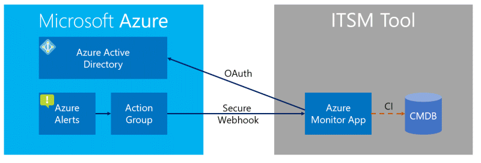

# Connect Azure to ITSM tools by using Secure Export

This article shows you how to configure the connection between your IT Service Management (ITSM) product or service by using Secure Export.

Secure Export is an updated version of [IT Service Management Connector (ITSMC)](./itsmc-overview.md). Both versions allow you to create work items in an ITSM tool when Azure Monitor sends alerts. The functionality includes metric, log, and Activity Log alerts.

ITSMC uses username and password credentials. Secure Export has stronger authentication because it uses Azure Active Directory (Azure AD). Azure AD is Microsoft's cloud-based identity and access management service. It helps users sign in and access internal or external resources. Using Azure AD with ITSM helps to identify Azure alerts (through the Azure AD application ID) that were sent to the external system.

> [!NOTE]
> The ability to connect Azure to ITSM tools by using Secure Export is in preview.

## Secure Export architecture

The Secure Export architecture introduces the following new capabilities:

* **New action group**: Alerts are sent to the ITSM tool through the Secure Webhook action group, instead of the ITSM action group that ITSMC uses.
* **Azure AD authentication**: Authentication occurs through Azure AD instead of username/password credentials.

## Secure Export data flow

The steps of the Secure Export data flow are:

1. Azure Monitor sends an alert that's configured to use Secure Export.
2. The alert payload is sent by a Secure Webhook action to the ITSM tool.
3. The ITSM application checks with Azure AD if the alert is authorized to enter the ITSM tool.
4. If the alert is authorized, the application:
   
   1. Creates a work item (for example, an incident) in the ITSM tool.
   2. Binds the ID of the configuration item (CI) to the customer management database (CMDB).

## Benefits of Secure Export

The main benefits of the integration are:

* **Better authentication**: Azure AD provides more secure authentication without the timeouts that commonly occur in ITSMC.
* **Alerts resolved in the ITSM tool**: Metric alerts implement "fired" and "resolved" states. When the condition is met, the alert state is "fired." When condition is not met anymore, the alert state is "resolved." In ITSMC, alerts can't be resolved automatically. With Secure Export, the resolved state flows to the ITSM tool and so is updated automatically.
* **[Common alert schema](./alerts-common-schema.md)**: In ITSMC, the schema of the alert payload differs based on the alert type. In Secure Export, there's a common schema for all alert types. This common schema contains the CI for all alert types. All alert types will be able to bind their CI with the CMDB.

## Next steps

* [Create ITSM work items from Azure alerts](./itsmc-overview.md)