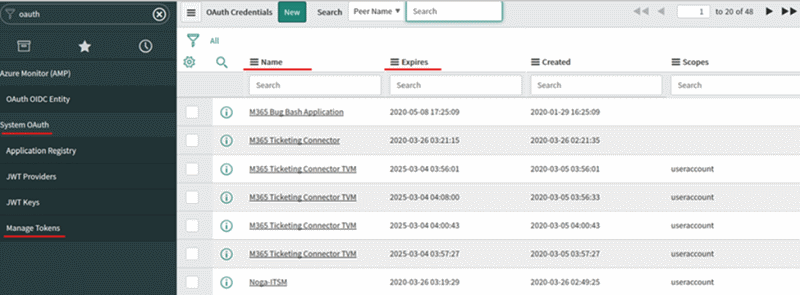
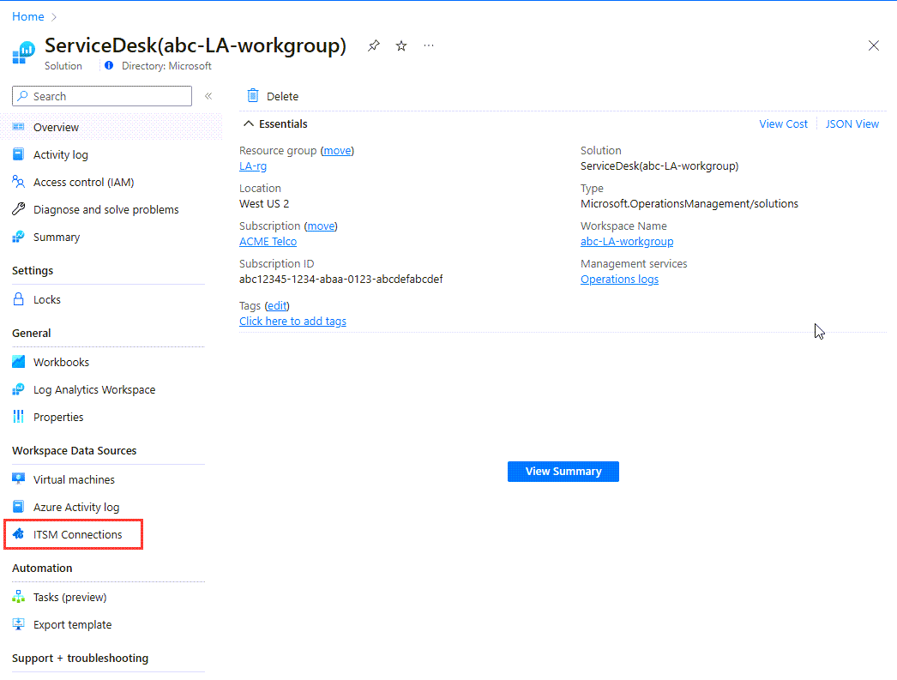
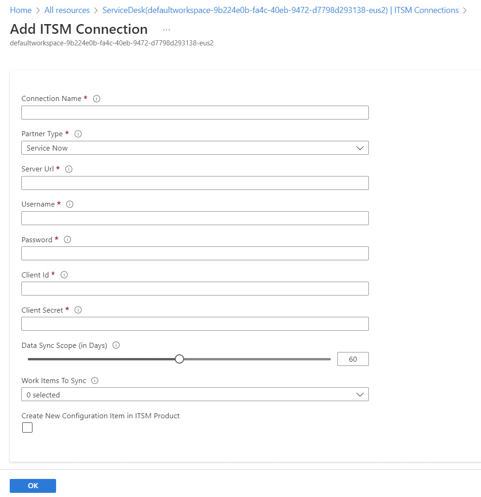

# Connect ServiceNow with IT Service Management Connector

This article shows you how to configure the connection between a ServiceNow instance and the IT Service Management Connector (ITSMC) in Log Analytics, so you can centrally manage your IT Service Management (ITSM) work items.

## Prerequisites
Ensure that you meet the following prerequisites for the connection.

### ITSMC installation

For information about installing ITSMC, see [Add the IT Service Management Connector solution](./itsmc-definition.md#install-it-service-management-connector).

> [!NOTE]
> ITSMC supports only the official software as a service (SaaS) offering from ServiceNow. Private deployments of ServiceNow are not supported.

### OAuth setup

ServiceNow supported versions include Utah, Tokyo, San Diego, Rome, Quebec,  Paris, Orlando, New York, Madrid, London, Kingston, Jakarta, Istanbul, Helsinki, and Geneva.

ServiceNow admins must generate a client ID and client secret for their ServiceNow instance. See the following information as required:

- [Set up OAuth for Utah](https://docs.servicenow.com/bundle/utah-platform-administration/page/administer/security/task/t_SettingUpOAuth.html)
- [Set up OAuth for Tokyo](https://docs.servicenow.com/bundle/tokyo-platform-administration/page/administer/security/task/t_SettingUpOAuth.html)
- [Set up OAuth for San Diego](https://docs.servicenow.com/bundle/sandiego-platform-administration/page/administer/security/task/t_SettingUpOAuth.html)
- [Set up OAuth for Rome](https://docs.servicenow.com/bundle/rome-platform-administration/page/administer/security/task/t_SettingUpOAuth.html)
- [Set up OAuth for Quebec](https://docs.servicenow.com/bundle/quebec-platform-administration/page/administer/security/task/t_SettingUpOAuth.html)
- [Set up OAuth for Paris](https://docs.servicenow.com/bundle/paris-platform-administration/page/administer/security/task/t_SettingUpOAuth.html)

As a part of setting up OAuth, we recommend:

1. [Create an endpoint for clients to access the instance](https://docs.servicenow.com/bundle/rome-platform-administration/page/administer/security/task/t_CreateEndpointforExternalClients.html).

1. Update the lifespan of the refresh token:

   1. On the **ServiceNow** pane, search for **System OAuth**, and then select **Application Registry**. 
   1. Select the name of the OAuth that was defined, and change **Refresh Token Lifespan** to **7,776,000 seconds** (90 days). 
   1. Select **Update**. 

1. Establish an internal procedure to ensure that the connection remains alive. A couple of days before the expected expiration of the refresh token lifespan, perform the following operations:

   1. [Complete a manual sync process for ITSM connector configuration](./itsmc-resync-servicenow.md).

   1. Revoke to the old refresh token. We don't recommend keeping old keys for security reasons. 
   
      1. On the **ServiceNow** pane, search for **System OAuth**, and then select **Manage Tokens**. 
      
      1. Select the old token from the list according to the OAuth name and expiration date.

         
      1. Select **Revoke Access** > **Revoke**.

## Install the user app and create the user role

Use the following procedure to install the ServiceNow user app and create the integration user role for it. You'll use these credentials to make the ServiceNow connection in Azure.

> [!NOTE]
> ITSMC supports only the official user app for Microsoft Log Analytics integration that's downloaded from the ServiceNow store. ITSMC does not support any code ingestion on the ServiceNow side or any application that's not part of the official ServiceNow solution. 

1. Visit the [ServiceNow store](https://store.servicenow.com/sn_appstore_store.do#!/store/application/ab0265b2dbd53200d36cdc50cf961980/1.0.1) and install **User App for ServiceNow and Microsoft OMS Integration** in your ServiceNow instance.
   
   >[!NOTE]
   >As part of the ongoing transition from Microsoft Operations Management Suite (OMS) to Azure Monitor, OMS is now called Log Analytics.     
2. After installation, go to the left navigation bar of the ServiceNow instance, and then search for and select **Microsoft OMS integrator**.  
3. Select **Installation Checklist**.

   The status is displayed as  **Not complete** because the user role is not yet created.

4. In the text box next to **Create integration user**, enter the name for the user who can connect to ITSMC in Azure.
5. Enter the password for this user, and then select **OK**.  

The newly created user is displayed with the default roles assigned:

- personalize_choices
- import_transformer
- x_mioms_microsoft.user
- itil
- template_editor
- view_changer

After you successfully create the user, the status of **Check Installation Checklist** moves to **Completed** and lists the details of the user role created for the app.

> [!NOTE]
> ITSMC can send incidents to ServiceNow without any other modules installed on your ServiceNow instance. If you're using the EventManagement module in your ServiceNow instance and want to create events or alerts in ServiceNow by using the connector, add the following roles to the integration user:
> 
> - evt_mgmt_integration
> - evt_mgmt_operator  

## Create a connection
Use the following procedure to create a ServiceNow connection.

> [!NOTE]
> The alerts that are sent from Azure Monitor can create one of the following elements in ServiceNow: events, incidents, or alerts. 

1. In Azure portal, go to **All Resources** and look for **ServiceDesk(YourWorkspaceName)**.

2. Under **Workspace Data Sources**, select **ITSM Connections**.

   

3. At the top of the right pane, select **Add**.

4. Provide the information as described in the following table, and then select **OK**.

   | **Field** | **Description** |
   | --- | --- |
   | **Connection Name**   | Enter a name for the ServiceNow instance that you want to connect with ITSMC. You use this name later in Log Analytics when you configure ITSM work items and view detailed analytics. |
   | **Partner Type**   | Select **ServiceNow**. |
   | **Server Url**   | Enter the URL of the ServiceNow instance that you want to connect to ITSMC. The URL should point to a supported SaaS version with the suffix *.servicenow.com* (for example `https://XXXXX.service-now.com/`).|
   | **Username**   | Enter the integration username that you created in the ServiceNow app to support the connection to ITSMC.|
   | **Password**   | Enter the password associated with this username. **Note**: The username and password are used for generating authentication tokens only. They're not stored anywhere within the ITSMC service.  |
   | **Client Id**   | Enter the client ID that you want to use for OAuth2 authentication, which you generated earlier. For more information on generating a client ID and a secret, see [Set up OAuth](https://old.wiki/index.php/OAuth_Setup). |
   | **Client Secret**   | Enter the client secret generated for this ID.   |
   | **Data Sync Scope (in Days)** | Enter the number of past days that you want the data from. The limit is 120 days. |
   | **Work Items To Sync**   | Select the ServiceNow work items that you want to sync to Azure Log Analytics, through ITSMC. The selected values are imported into Log Analytics. Options are incidents and change requests.|
   | **Create New Configuration Item in ITSM Product** | Select this option if you want to create the configuration items in the ITSM product. When it's selected, ITSMC creates configuration items (if none exist) in the supported ITSM system. It's disabled by default. |

When you're successfully connected and synced:

- Selected work items from the ServiceNow instance are imported into Log Analytics. You can view the summary of these work items on the **IT Service Management Connector** tile.

- You can create incidents from Log Analytics alerts or log records, or from Azure alerts in this ServiceNow instance.

> [!NOTE]
> ServiceNow has a rate limit for requests per hour. To configure the limit, define **Inbound REST API rate limiting** in the ServiceNow instance.

## Payload structure

The payload that is sent to ServiceNow has a common structure. The structure has a section of `<Description>` that contains all the alert data.

The structure of the payload for all alert types except log search alert is [common schema](./alerts-common-schema.md).

For Log Search Alerts, the structure is:

- Alert  (alert rule name) : \<value>
- Search Query : \<value>
- Search Start Time(UTC) : \<value>
- Search End Time(UTC) : \<value>
- AffectedConfigurationItems : [\<list of impacted configuration items>]

## Next steps

* [ITSM Connector overview](itsmc-overview.md)
* [Create ITSM work items from Azure alerts](./itsmc-definition.md#create-itsm-work-items-from-azure-alerts)
* [Troubleshooting problems in the ITSM Connector](./itsmc-resync-servicenow.md)
