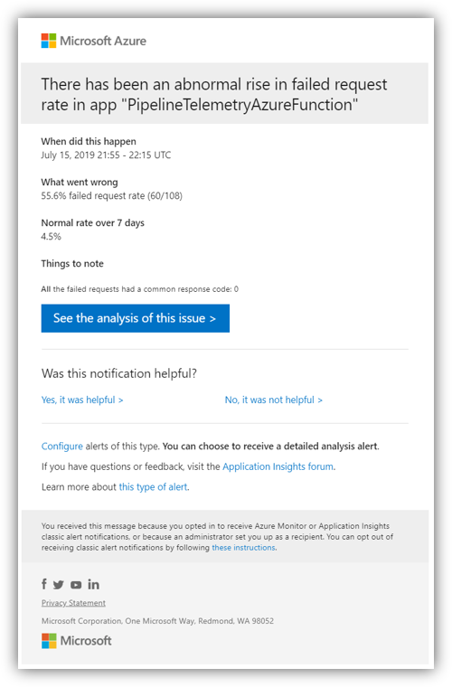

# Smart detection in Application Insights

>[!NOTE]
>You can migrate smart detection on your Application Insights resource to be based on alerts. The migration creates alert rules for the different smart detection modules. After it's created, you can manage and configure these rules like any other Azure Monitor alert rules. You can also configure action groups for these rules to enable multiple methods of taking actions or triggering notification on new detections.
>
> For more information, see [Smart detection alerts migration](./alerts-smart-detections-migration.md).

Smart detection automatically warns you of potential performance problems and failure anomalies in your web application. It performs proactive analysis of the telemetry that your app sends to [Application Insights](../app/app-insights-overview.md). If there's a sudden rise in failure rates or abnormal patterns in client or server performance, you get an alert. This feature needs no configuration. It operates if your application sends enough telemetry.

You can access the detections issued by smart detection from the emails you receive and from the smart detection pane.

## Review your smart detections
You can discover detections in two ways:

* **You receive an email** from Application Insights. Here's a typical example:
  
    
  
    Select **See the analysis of this issue** to see more information in the portal.
* **The smart detection pane** in Application Insights. Under the **Investigate** menu, select **Smart Detection** to see a list of recent detections.

   

Select a detection to view its details.

## What problems are detected?

Smart detection detects and notifies you about various issues:

* [Smart detection - Failure Anomalies](./proactive-failure-diagnostics.md): Notifies if the failure rate goes outside the expected envelope. We use machine learning to set the expected rate of failed requests for your app, correlating with load and other factors.
* [Smart detection - Performance Anomalies](./smart-detection-performance.md): Notifies if response time of an operation or dependency duration is slowing down compared to the historical baseline. It also notifies if we identify an anomalous pattern in response time or page load time.
* **General degradations and issues**: [Trace degradation](./proactive-trace-severity.md), [Memory leak](./proactive-potential-memory-leak.md), [Abnormal rise in Exception volume](./proactive-exception-volume.md), and [Security anti-patterns](./proactive-application-security-detection-pack.md).

The help links in each notification take you to the relevant articles.

## Smart detection email notifications

All smart detection rules, except for rules marked as _preview_, are configured by default to send email notifications when detections are found.

You can configure email notifications for a specific smart detection rule. On the smart detection **Settings** pane, select the rule to open the **Edit rule** pane.

Alternatively, you can change the configuration by using Azure Resource Manager templates. For more information, see [Manage Application Insights smart detection rules by using Azure Resource Manager templates](./proactive-arm-config.md).

## Next steps
These diagnostic tools help you inspect the telemetry from your app:

* [Metric explorer](../essentials/metrics-charts.md)
* [Search explorer](../app/search-and-transaction-diagnostics.md?tabs=transaction-search)
* [Analytics: Powerful query language](../logs/log-analytics-tutorial.md)

Smart detection is automatic, but if you want to set up more alerts, see:

* [Manually configured metric alerts](./alerts-log.md)
* [Availability web tests](/previous-versions/azure/azure-monitor/app/monitor-web-app-availability)
