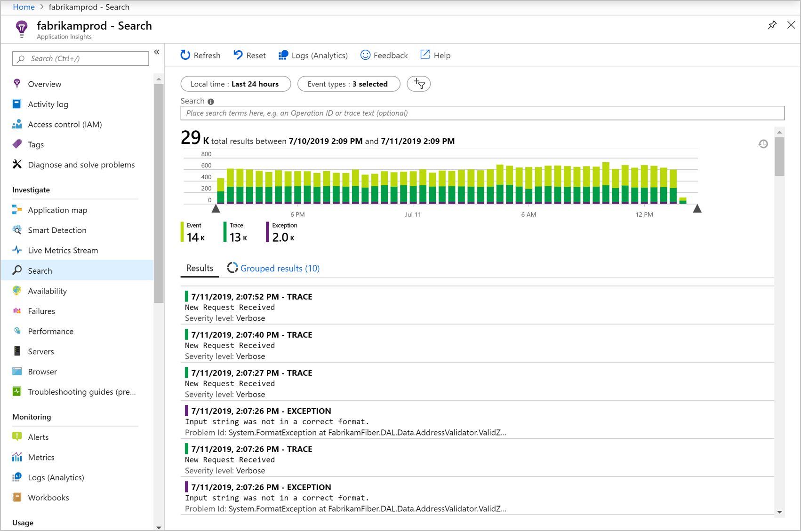
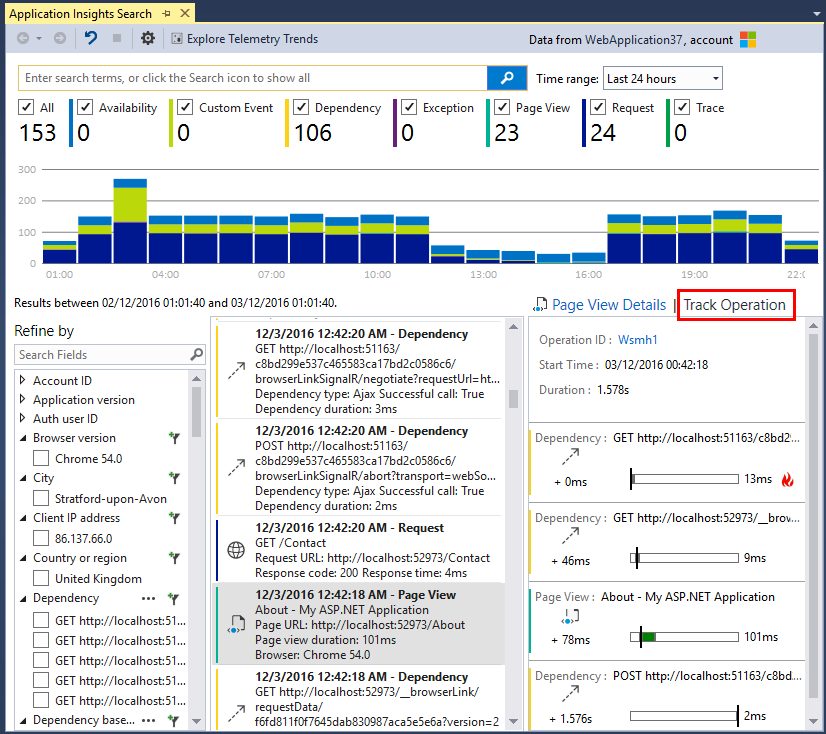
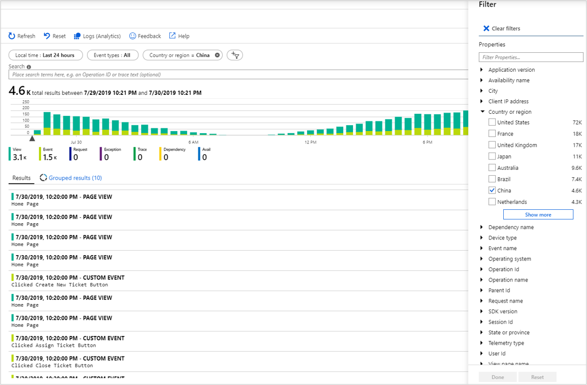
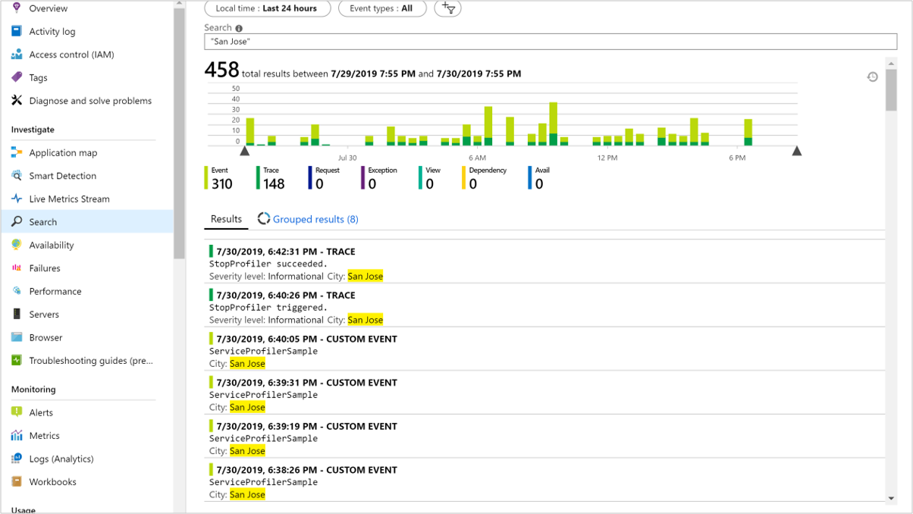
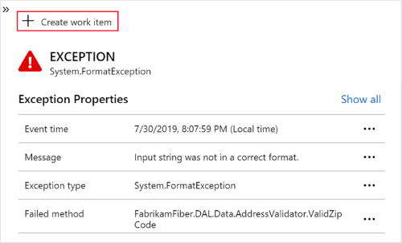

# Use Search in Application Insights

Transaction search is a feature of [Application Insights](./app-insights-overview.md) that you use to find and explore individual telemetry items, such as page views, exceptions, or web requests. You can also view log traces and events that you've coded.

For more complex queries over your data, use [Log Analytics](../logs/log-analytics-tutorial.md).

## Where do you see Search?

You can find **Search** in the Azure portal or Visual Studio.

### In the Azure portal

You can open transaction search from the Application Insights **Overview** tab of your application. You can also select **Search** under **Investigate** on the left menu.

Go to the **Event types** dropdown menu to see a list of telemetry items such as server requests, page views, and custom events that you've coded. At the top of the **Results** list is a summary chart showing counts of events over time.

Back out of the dropdown menu or select **Refresh** to get new events.

### In Visual Studio

In Visual Studio, there's also an **Application Insights Search** window. It's most useful for displaying telemetry events generated by the application that you're debugging. But it can also show the events collected from your published app at the Azure portal.

Open the **Application Insights Search** window in Visual Studio:

The **Application Insights Search** window has features similar to the web portal:

The **Track Operation** tab is available when you open a request or a page view. An "operation" is a sequence of events that's associated with a single request or page view. For example, dependency calls, exceptions, trace logs, and custom events might be part of a single operation. The **Track Operation** tab shows graphically the timing and duration of these events in relation to the request or page view.

## Inspect individual items

Select any telemetry item to see key fields and related items.

The end-to-end transaction details view opens.

## Filter event types

Open the **Event types** dropdown menu and choose the event types you want to see. If you want to restore the filters later, select **Reset**.

The event types are:

* **Trace**: [Diagnostic logs](./asp-net-trace-logs.md) including TrackTrace, log4Net, NLog, and System.Diagnostic.Trace calls.
* **Request**: HTTP requests received by your server application including pages, scripts, images, style files, and data. These events are used to create the request and response overview charts.
* **Page View**: [Telemetry sent by the web client](./javascript.md) used to create page view reports.
* **Custom Event**: If you inserted calls to `TrackEvent()` to [monitor usage](./api-custom-events-metrics.md), you can search them here.
* **Exception**: Uncaught [exceptions in the server](./asp-net-exceptions.md), and the exceptions that you log by using `TrackException()`.
* **Dependency**: [Calls from your server application](./asp-net-dependencies.md) to other services such as REST APIs or databases, and AJAX calls from your [client code](./javascript.md).
* **Availability**: Results of [availability tests](./monitor-web-app-availability.md).

## Filter on property values

You can filter events on the values of their properties. The available properties depend on the event types you selected. Select **Filter**  to start.

Choosing no values of a particular property has the same effect as choosing all values. It switches off filtering on that property.

Notice that the counts to the right of the filter values show how many occurrences there are in the current filtered set.

## Find events with the same property

To find all the items with the same property value, either enter it in the **Search** box or select the checkbox when you look through properties on the **Filter** tab.

## Search the data

> [!NOTE]
> To write more complex queries, open [Logs (Analytics)](../logs/log-analytics-tutorial.md) at the top of the **Search** pane.
>

You can search for terms in any of the property values. This capability is useful if you've written [custom events](./api-custom-events-metrics.md) with property values.

You might want to set a time range because searches over a shorter range are faster.

Search for complete words, not substrings. Use quotation marks to enclose special characters.

| String | *Not* found | Found |
| --- | --- | --- |
| HomeController.About |`home` `controller` `out` | `homecontroller` `about` `"homecontroller.about"`|
|United States|`Uni` `ted`|`united` `states` `united AND states` `"united states"`

You can use the following search expressions:

| Sample query | Effect |
| --- | --- |
| `apple` |Find all events in the time range whose fields include the word "apple". |
| `apple AND banana`  `apple banana` |Find events that contain both words. Use capital "AND", not "and".  Short form. |
| `apple OR banana` |Find events that contain either word. Use "OR", not "or". |
| `apple NOT banana` |Find events that contain one word but not the other. |

## Sampling

If your app generates a large amount of telemetry, and you're using the ASP.NET SDK version 2.0.0-beta3 or later, the adaptive sampling module automatically reduces the volume that's sent to the portal by sending only a representative fraction of events. Events that are related to the same request are selected or deselected as a group so that you can navigate between related events.

Learn about [sampling](./sampling.md).

## Create work item

You can create a bug in GitHub or Azure DevOps with the details from any telemetry item.

Go to the end-to-end transaction detail view by selecting any telemetry item. Then select **Create work item**.

The first time you do this step, you're asked to configure a link to your Azure DevOps organization and project. You can also configure the link on the **Work Items** tab.

## Send more telemetry to Application Insights

In addition to the out-of-the-box telemetry sent by Application Insights SDK, you can:

* Capture log traces from your favorite logging framework in [.NET](./asp-net-trace-logs.md) or [Java](./opentelemetry-enable.md?tabs=java#logs). This means you can search through your log traces and correlate them with page views, exceptions, and other events.

* [Write code](./api-custom-events-metrics.md) to send custom events, page views, and exceptions.

Learn how to [send logs and custom telemetry to Application Insights](./asp-net-trace-logs.md).

## Frequently asked questions

Find answers to common questions.

### How much data is retained?

See the [Limits summary](../service-limits.md#application-insights).

### How can I see POST data in my server requests?

We don't log the POST data automatically, but you can use [TrackTrace or log calls](./asp-net-trace-logs.md). Put the POST data in the message parameter. You can't filter on the message in the same way you can filter on properties, but the size limit is longer.

## Next steps

* [Write complex queries in Analytics](../logs/log-analytics-tutorial.md)
* [Send logs and custom telemetry to Application Insights](./asp-net-trace-logs.md)
* [Set up availability and responsiveness tests](./monitor-web-app-availability.md)
* [Troubleshooting](../faq.yml)
