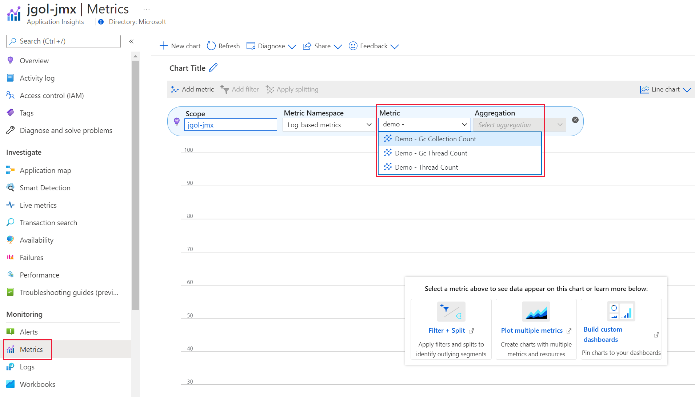

# Configure JMX metrics

Application Insights Java 3.x collects some JMX metrics by default. In many cases, the default option doesn't collect enough. This article describes JMX configuration in detail.

## How do I collect more JMX metrics?

JMX metrics collection can be configured by adding a `jmxMetrics` section to the `applicationinsights.json` file. You can specify the name of the metric the way you want it to appear in the Azure portal in the Application Insights resource. The object name and attribute are required for each of the metrics you want collected.

## How do I know what metrics are available to configure?

You must know the object names and attributes. Those properties are different for various libraries, frameworks, and application servers and are often not well documented. Luckily, it's easy to find exactly what JMX metrics are supported for your particular environment.

To view available metrics, set the self-diagnostics level to `DEBUG` in your `applicationinsights.json` configuration file. For example:

```json
{
  "selfDiagnostics": {
    "level": "DEBUG"
  }
}
```

The available JMX metrics with the object names and attribute names appear in the Application Insights log file.

The output in the log file looks similar to the following example. In some cases, the list can be extensive.
> [!div class="mx-imgBorder"]
> 

## Configuration example

You can configure the agent to collect the metrics that are available. The first one is an example of a nested metric, `LastGcInfo`, which has several properties. You want to capture `GcThreadCount`.

```json
"jmxMetrics": [
      {
        "name": "Demo - GC Thread Count",
        "objectName": "java.lang:type=GarbageCollector,name=PS MarkSweep",
        "attribute": "LastGcInfo.GcThreadCount"
      },
      {
        "name": "Demo - GC Collection Count",
        "objectName": "java.lang:type=GarbageCollector,name=PS MarkSweep",
        "attribute": "CollectionCount"
      },
      {
        "name": "Demo - Thread Count",
        "objectName": "java.lang:type=Threading",
        "attribute": "ThreadCount"
      }
],
```

## Types of collected metrics and available configuration options

We support numeric and Boolean JMX metrics while other types aren't supported and are ignored.

Currently, the wildcards and aggregated attributes aren't supported. For this reason, every attribute `object name`/`attribute` pair must be configured separately.

## Where do I find the JMX metrics in Application Insights?

While your application is running and JMX metrics are collected, you can view them by going to the Azure portal and going to your Application Insights resource. Under the **Metrics** tab, select the dropdown to view the metrics.

> [!div class="mx-imgBorder"]
> 
