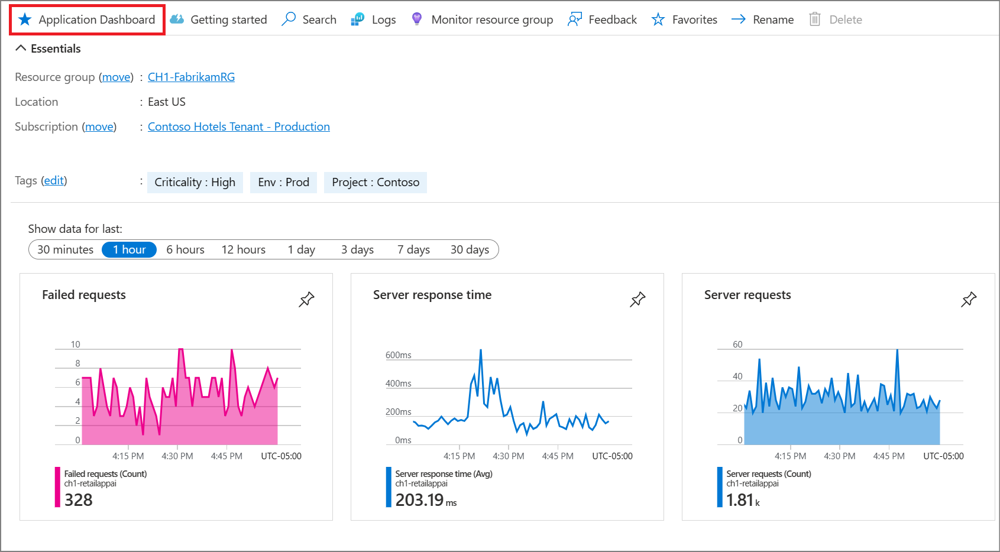

# Application Insights Overview dashboard

Application Insights has always provided a summary overview pane to allow quick, at-a-glance assessment of your application's health and performance. The new **Overview** dashboard provides a faster more flexible experience.

## How do I test out the new experience?

The new **Overview** dashboard now launches by default.

## Better performance

Time range selection has been simplified to a simple one-click interface.

Overall performance has been greatly increased. You have one-click access to popular features like **Search** and **Analytics**. Each default dynamically updating KPI tile provides insight into corresponding Application Insights features. To learn more about failed requests, under **Investigate**, select **Failures**.

## Application dashboard

The application dashboard uses the existing dashboard technology within Azure to provide a fully customizable single pane view of your application health and performance.

To access the default dashboard, select **Application Dashboard** in the upper-left corner.

If this is your first time accessing the dashboard, it opens a default view.

You can keep the default view if you like it. Or you can also add and delete from the dashboard to best fit the needs of your team.

> [!NOTE]
> All users with access to the Application Insights resource share the same **Application Dashboard** experience. Changes made by one user will modify the view for all users.

To go back to the overview experience, select the **Overview** button.

## Troubleshooting

Currently, there's a limit of 30 days of data displayed in a dashboard. If you select a time filter beyond 30 days, or if you select **Configure tile settings** and set a custom time range in excess of 30 days, your dashboard won't display beyond 30 days of data. This is the case even with the default data retention of 90 days. There's currently no workaround for this behavior.

The default **Application Dashboard** is created on demand the first time you select the Application Dashboard button. If you move or rename your Application Insights instance, queries on the dashboard will fail with "Resource not found" errors because the dashboard queries rely on the original resource URI. Delete the default dashboard. On the Application Insights **Overview** resource menu, select **Application Dashboard** again. The default dashboard will be re-created with the new resource name. Make other custom edits to the dashboard as needed.

## Next steps

- [Funnels](./usage-funnels.md)
- [Retention](./usage-retention.md)
- [User flows](./usage-flows.md)
