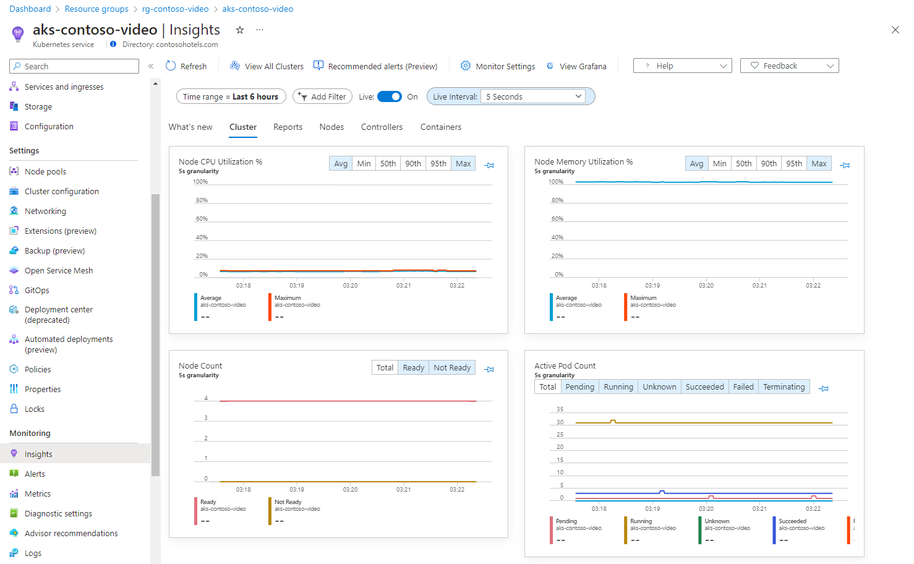
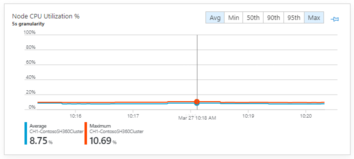

# How to view metrics in real-time

Container insights Live Data (preview) feature allows you to visualize metrics about node and pod state in a cluster in real-time. It emulates direct access to the `kubectl top nodes`, `kubectl get pods –all-namespaces`, and `kubectl get nodes` commands to call, parse, and visualize the data in performance charts that are included with this Insight.

This article provides a detailed overview and helps you understand how to use this feature.

>[!NOTE]
>AKS clusters enabled as [private clusters](https://azure.microsoft.com/updates/aks-private-cluster/) are not supported with this feature. This feature relies on directly accessing the Kubernetes API through a proxy server from your browser. Enabling networking security to block the Kubernetes API from this proxy will block this traffic.

For help with setting up or troubleshooting the Live Data (preview) feature, review our [setup guide](container-insights-livedata-setup.md).

## How it Works

The Live Data (preview) feature directly access the Kubernetes API, and additional information about the authentication model can be found [here](https://kubernetes.io/docs/concepts/overview/kubernetes-api/).

This feature performs a polling operation against the metrics endpoints (including `/api/v1/nodes`, `/apis/metrics.k8s.io/v1beta1/nodes`, and `/api/v1/pods`), which is every five seconds by default. This data is cached in your browser and charted in the four performance charts included in Container insights on the **Cluster** tab by selecting **Go Live (preview)**. Each subsequent poll is charted into a rolling five-minute visualization window.

The polling interval is configured from the **Set interval** drop-down allowing you to set polling for new data every 1, 5, 15 and 30 seconds.

>[!IMPORTANT]
>We recommend setting the polling interval to one second while troubleshooting an issue for a short period of time. These requests may impact the availability and throttling of the Kubernetes API on your cluster. Afterwards, reconfigure to a longer polling interval.

>[!IMPORTANT]
>No data is stored permanently during operation of this feature. All information captured during this session is immediately deleted when you close your browser or navigate away from the feature. Data only remains present for visualization inside the five minute window; any metrics older than five minutes are also permanently deleted.

These charts cannot be pinned to the last Azure dashboard you viewed in live mode.

## Metrics captured

### Node CPU utilization % / Node Memory utilization %

These two performance charts map to an equivalent of invoking `kubectl top nodes` and capturing the results of the **CPU%** and **MEMORY%** columns to the respective chart.

The percentile calculations will function in larger clusters to help identify outlier nodes in your cluster. For example, to understand if nodes are under-utilized for scale down purposes. Utilizing the **Min** aggregation you can see which nodes have low utilization in the cluster. To further investigate, you select the **Nodes** tab and sort the grid by CPU or memory utilization.

This also helps you understand which nodes are being pushed to their limits and if scale-out may be required. Utilizing both the **Max** and **P95** aggregations can help you see if there are nodes in the cluster with high resource utilization. For further investigation, you would again switch to the **Nodes** tab.

### Node count

This performance chart maps to an equivalent of invoking `kubectl get nodes` and mapping the **STATUS** column to a chart grouped by status types.

Nodes are reported either in a **Ready** or **Not Ready** state. They are counted (and a total count is created), and the results of these two aggregations are charted.
For example, to understand if your nodes are falling into failed states. Utilizing the **Not Ready** aggregation you can quickly see the number of nodes in your cluster currently in the **Not Ready** state.

### Active pod count

This performance chart maps to an equivalent of invoking `kubectl get pods –all-namespaces` and maps the **STATUS** column the chart grouped by status types.

>[!NOTE]
>Names of status as interpreted by `kubectl` may not exactly match in the chart.

## Next steps

View [log query examples](container-insights-log-query.md) to see predefined queries and examples to create alerts, visualizations, or perform further analysis of your clusters.
