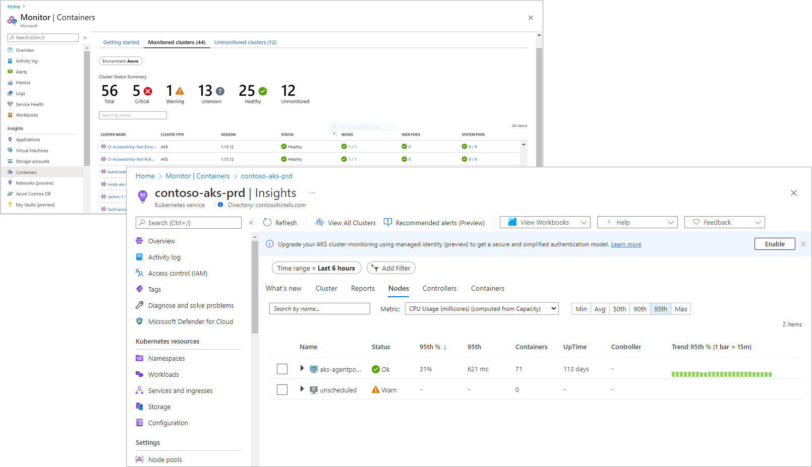

# Container insights overview

Container insights is a feature designed to monitor the performance of container workloads deployed to:

- Managed Kubernetes clusters hosted on [Azure Kubernetes Service (AKS)](../../aks/intro-kubernetes.md).
- Self-managed Kubernetes clusters hosted on Azure using [AKS Engine](https://github.com/Azure/aks-engine).
- [Azure Container Instances](../../container-instances/container-instances-overview.md).
- Self-managed Kubernetes clusters hosted on [Azure Stack](/azure-stack/user/azure-stack-kubernetes-aks-engine-overview) or on-premises.
- [Azure Arc-enabled Kubernetes](../../azure-arc/kubernetes/overview.md).

Container insights supports clusters running the Linux and Windows Server 2019 operating system. The container runtimes it supports are Moby and any CRI-compatible runtime such as CRI-O and ContainerD. Docker is no longer supported as a container runtime as of September 2022. For more information about this deprecation, see the [AKS release notes][aks-release-notes].

>[!NOTE]
> Container insights support for Windows Server 2022 operating system is in public preview.

Monitoring your containers is critical, especially when you're running a production cluster, at scale, with multiple applications.

Container insights gives you performance visibility by collecting memory and processor metrics from controllers, nodes, and containers that are available in Kubernetes through the Metrics API. After you enable monitoring from Kubernetes clusters, metrics and Container logs are automatically collected for you through a containerized version of the Log Analytics agent for Linux. Metrics are sent to the [metrics database in Azure Monitor](../essentials/data-platform-metrics.md). Log data is sent to your [Log Analytics workspace](../logs/log-analytics-workspace-overview.md).

:::image type="content" source="media/container-insights-overview/azmon-containers-architecture-01.png" lightbox="media/container-insights-overview/azmon-containers-architecture-01.png" alt-text="Overview diagram of Container insights" border="false":::

## Features of Container insights

Container insights deliver a comprehensive monitoring experience to understand the performance and health of your Kubernetes cluster and container workloads. You can:

- Identify resource bottlenecks by identifying AKS containers running on the node and their average processor and memory utilization.
- Identify processor and memory utilization of container groups and their containers hosted in Azure Container Instances.
- View the controller's or pod's overall performance by identifying where the container resides in a controller or a pod.
- Review the resource utilization of workloads running on the host that are unrelated to the standard processes that support the pod.
- Identify capacity needs and determine the maximum load that the cluster can sustain by understanding the behavior of the cluster under average and heaviest loads.
- Configure alerts to proactively notify you or record when CPU and memory utilization on nodes or containers exceed your thresholds, or when a health state change occurs in the cluster at the infrastructure or nodes health rollup.
- Integrate with [Prometheus](https://prometheus.io/docs/introduction/overview/) to view application and workload metrics it collects from nodes and Kubernetes by using [queries](container-insights-log-query.md) to create custom alerts and dashboards and perform detailed analysis.
- Monitor container workloads [deployed to AKS Engine](https://github.com/Azure/aks-engine) on-premises and [AKS Engine on Azure Stack](/azure-stack/user/azure-stack-kubernetes-aks-engine-overview).
- Monitor container workloads [deployed to Azure Arc-enabled Kubernetes](../../azure-arc/kubernetes/overview.md).

The following video provides an intermediate-level deep dive to help you learn about monitoring your AKS cluster with Container insights. The video refers to *Azure Monitor for Containers*, which is the previous name for *Container insights*.

> [!VIDEO https://www.youtube.com/embed/XEdwGvS2AwA]

## Access Container insights

You can access Container insights in the Azure portal from Azure Monitor or directly from the selected AKS cluster. The Azure Monitor menu gives you the global perspective of all the containers that are deployed and monitored. This information allows you to search and filter across your subscriptions and resource groups. You can then drill into Container insights from the selected container. Access Container insights for a particular AKS container directly from the AKS page.

## Differences between Windows and Linux clusters

The main differences in monitoring a Windows Server cluster compared to a Linux cluster include:

- Windows doesn't have a Memory RSS metric, and as a result it isn't available for Windows nodes and containers. The [Working Set](/windows/win32/memory/working-set) metric is available.
- Disk storage capacity information isn't available for Windows nodes.
- Only pod environments are monitored, not Docker environments.
- With the preview release, a maximum of 30 Windows Server containers are supported. This limitation doesn't apply to Linux containers.

## Next steps

To begin monitoring your Kubernetes cluster, review [Enable Container insights](container-insights-onboard.md) to understand the requirements and available methods to enable monitoring.

<!-- LINKS - external -->
[aks-release-notes]: https://github.com/Azure/AKS/releases