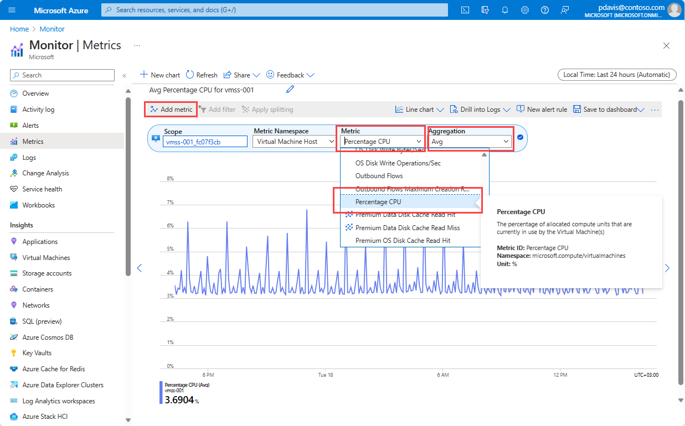
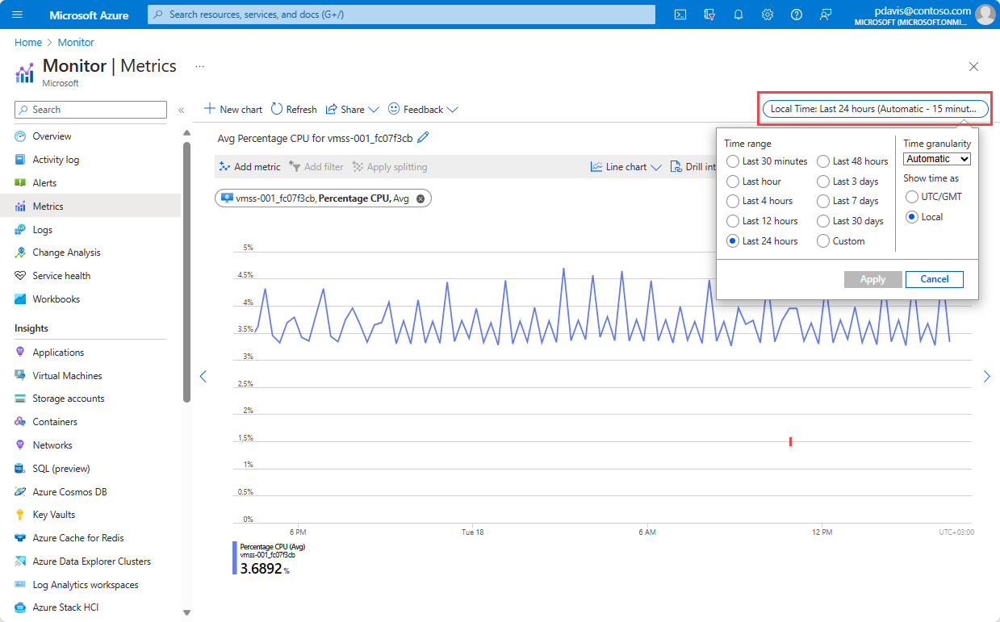

# Get started with metrics explorer

Azure Monitor metrics explorer is a component of the Azure portal that you can use to plot charts, visually correlate trends, and investigate spikes and dips in metrics' values. Use metrics explorer to investigate the health and utilization of your resources.

## Create a metrics chart

Create a metric chart using the following steps:

- Open the Metrics explorer

- [Pick a resource and a metric](#create-your-first-metric-chart) and you see a basic chart.  

- [Select a time range](#select-a-time-range) that's relevant for your investigation.

- [Apply dimension filters and splitting](#apply-dimension-filters-and-splitting). The filters and splitting allow you to analyze which segments of the metric contribute to the overall metric value and identify possible outliers.

- Use [advanced settings](#advanced-chart-settings) to customize the chart before you pin it to dashboards. [Configure alerts](../alerts/alerts-metric-overview.md) to receive notifications when the metric value exceeds or drops below a threshold.
-  Add more metrics to the chart. You can also [view multiple resources in the same view](./metrics-dynamic-scope.md).

## Create your first metric chart

1. Open the metrics explorer from the monitor overview page, or from the monitoring section of any resource.

    :::image type="content" source="./media/metrics-getting-started/metrics-menu.png" alt-text="A screenshot showing the monitoring page menu.":::

1. Select the **Select a scope** button to open the resource scope picker. You can use the picker to select the resource you want to see metrics for. When you opened the metrics explorer from the resource's menu, the scope is populated for you. 

    To learn how to view metrics across multiple resources, see [View multiple resources in Azure Monitor metrics explorer](./metrics-dynamic-scope.md).

    > 

1. For some resources, you must pick a namespace. The namespace is a way to organize metrics so that you can easily find them. For example, storage accounts have separate namespaces for storing metrics for files, tables, blobs, and queues. Most resource types have only one namespace.

1. Select a metric from a list of available metrics.

1. Select the metric aggregation. Available aggregations include minimum, maximum, the average value of the metric, or a count of the number of samples. For more information on aggregations, see [Advanced features of Metrics Explorer](../essentials/metrics-charts.md#aggregation).  

     

> [!TIP]
> Select **Add metric** and repeat these steps to see multiple metrics plotted in the same chart. For multiple charts in one view, select **Add chart**.

## Select a time range

> [!NOTE]
> [Most metrics in Azure are stored for 93 days](../essentials/data-platform-metrics.md#retention-of-metrics). You can query no more than 30 days' worth of data on any single chart. You can [pan](metrics-charts.md#pan) the chart to view the full retention. The 30-day limitation doesn't apply to [log-based metrics](../app/pre-aggregated-metrics-log-metrics.md#log-based-metrics).

By default, the chart shows the most recent 24 hours of metrics data. Use the **time picker** panel to change the time range, zoom in, or zoom out on your chart.

> [!TIP]
> Use the **time brush** to investigate an interesting area of the chart like a spike or a dip. Select an area on the chart and the chart zooms in to show more detail for the selected area.

## Apply dimension filters and splitting

[Filtering](../essentials/metrics-charts.md#filters) and [splitting](../essentials/metrics-charts.md#apply-splitting) are powerful diagnostic tools for the metrics that have dimensions. These features show how various metric segments or dimensions affect the overall value of the metric. You can use them to identify possible outliers. For example 

- **Filtering** lets you choose which dimension values are included in the chart. For example, you might want to show successful requests when you chart the *server response time* metric. You apply the filter on the *success of request* dimension.
- **Splitting** controls whether the chart displays separate lines for each value of a dimension or aggregates the values into a single line. For example, you can see one line for an average CPU usage across all server instances, or you can see separate lines for each server. The image blow shows splitting a Virtual Machine Scale Set to see each virtual machine separately.

:::image type="content" source="./media/metrics-getting-started/split-metrics.png" alt-text="{alt-text}":::

For examples that have filtering and splitting applied, see [Metric chart examples](../essentials/metric-chart-samples.md). The article shows the steps that were used to configure the charts.

## Share your metric chart

Share your metric chart in any of the following ways: See the following instructions on how to share information from your metric charts by using Excel, a link, or a workbook.

+ Download to Excel. Select **Share** > **Download to Excel**. Your download starts immediately.
+ Share a link. Select **Share** > **Copy link**. You should get a notification that the link was copied successfully.
+ Send to workbook Select **Share** > **Send to Workbook**. In the **Send to Workbook** window, you can send the metric chart to a new or existing workbook.
+ Pin to Grafana. Select **Share** > **Pin to Grafana**. In the **Pin to Grafana** window, you can send the metric chart to a new or existing Grafana dashboard.

:::image type="content" source="media/metrics-getting-started/share.png" alt-text="Screenshot that shows the share dropdown menu." lightbox="media/metrics-getting-started/share.png" :::

## Advanced chart settings

You can customize the chart style and title, and modify advanced chart settings. When you're finished with customization, pin the chart to a dashboard or save it to a workbook. You can also configure metrics alerts. See [Advanced features of Metrics Explorer](../essentials/metrics-charts.md) to learn about these and other advanced features of Azure Monitor metrics explorer.

## Next steps

* [Learn about advanced features of metrics explorer](../essentials/metrics-charts.md)
* [Viewing multiple resources in metrics explorer](./metrics-dynamic-scope.md)
* [Troubleshooting metrics explorer](metrics-troubleshoot.md)
* [See a list of available metrics for Azure services](./metrics-supported.md)
* [See examples of configured charts](../essentials/metric-chart-samples.md)
