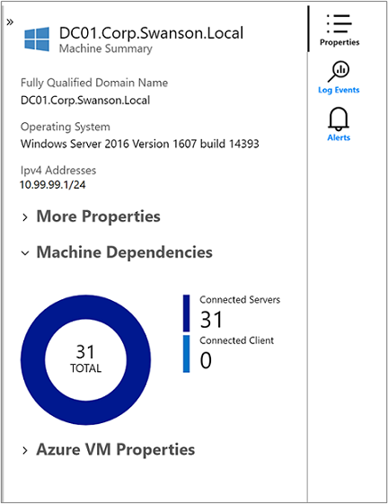
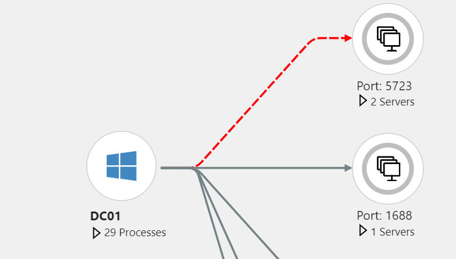
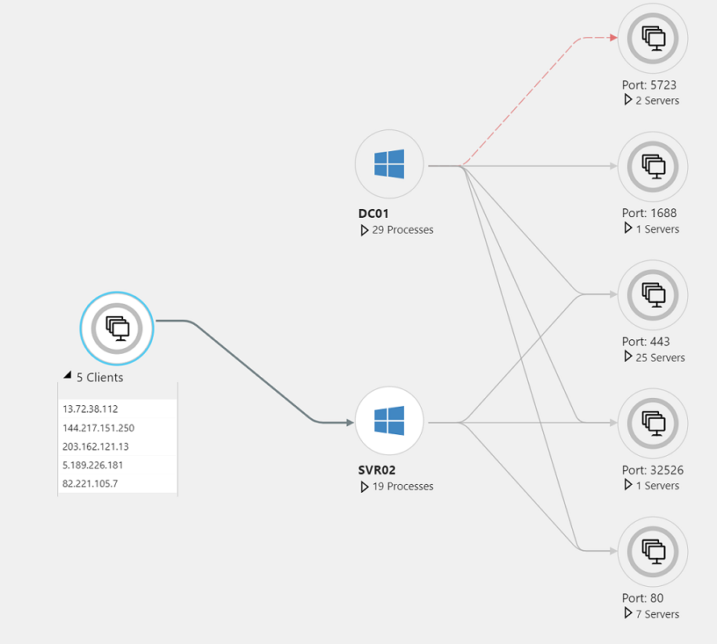
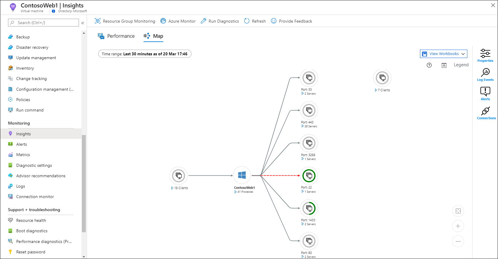
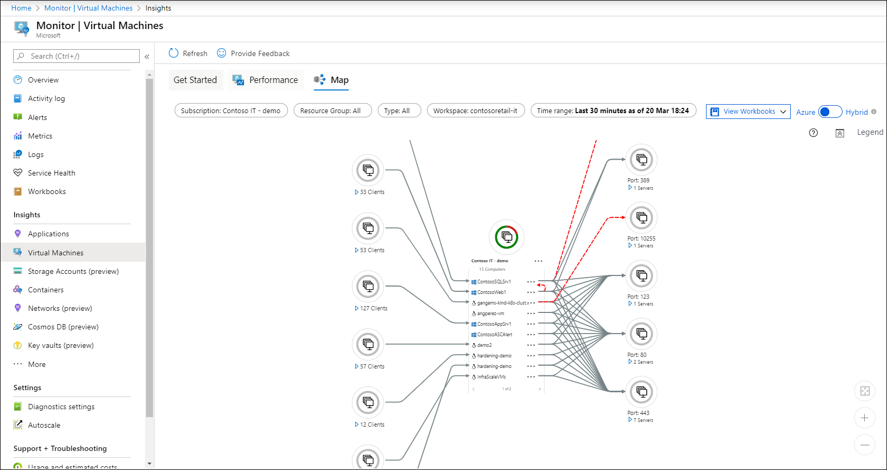

# Using Azure Monitor for VMs (Preview) Map to understand application components
Viewing the discovered application components on Windows and Linux virtual machines running in Azure your environment can be observed in two ways with Azure Monitor for VMs, from a virtual machine directly or across groups of VMs from Azure Monitor. 

This article will help you understand the experience between the two perspectives and how to use the Map feature. For information about configuring Azure Monitor for VMs, see [Enable Azure Monitor for VMs](vminsights-onboard.md).

## Sign in to Azure
Sign in to the Azure portal at [https://portal.azure.com](https://portal.azure.com).

## Introduction to Map experience
Before diving into viewing Map for a single virtual machine or group of VMs, it's important we provide a brief introduction to the feature so you understand how the information is presented and what the visualizations represent.  

Whether you select the Map feature directly from a VM or from Azure Monitor, it presents a consistent experience.  The only difference is from Azure Monitor you can see all the members of a multi-tier application or cluster in one map.

Maps visualizes the VMs dependencies by discovering running processes with active network connections between servers, inbound and outbound connection latency, and ports across any TCP-connected architecture over a specified time range.  Expanding a VM shows process details and only those processes that communicate with the VM are shown. The count of front-end clients that connect into the virtual machine is indicated with the Client Group. The count of back-end servers the VM connects to are indicated on the Server Port Groups. Expand a Server Port Group to see the detailed list of servers connected over that port.  

When you click on the virtual machine, the **Properties** pane is expanded on the right to show the properties of the item selected, such as system information reported by the operating system, properties of the Azure VM, and a doughnut summarizing the discovered connections. 

On the right-side of the pane, click on the **Log Events** icon to switch focus of the pane to show a list of tables that collected data from the VM has sent to Log Analytics and is available for querying.  Clicking on any one of the record types listed will open the **Logs** page to view the results for that type with a pre-configured query filtered against the specific virtual machine.  

Close *Logs** and return to the **Properties** pane and select **Alerts** to view alerts that alerts raised for the VM from health criteria. Map integrates with Azure Alerts to show fired alerts for the selected server in the selected time range. The server displays an icon if there are current alerts, and the Machine Alerts pane lists the alerts. 

To enable the Map feature to display relevant alerts, create an alert rule that fires for a specific computer. To create proper alerts:
- Include a clause to group by computer (for example, **by Computer interval 1 minute**).
- Choose to alert based on metric measurement.

For more information about Azure Alerts and creating alert rules, see [Unified Alerts in Azure Monitor](../../monitoring-and-diagnostics/monitoring-overview-alerts.md)

The **Legend** option in the upper right-hand corner describes the symbols and roles on a map.  To zoom in for a closer look at your map and move the it around, the Zoom controls at the bottom right-hand side of the page sets the zoom level and fit the page to the size of the current page.  

## Connection metrics
The **Connections** pane displays standard connectivity metrics for the selected connection from the VM over the TCP port. The metrics include response time, requests per minute, traffic throughput, and links.  

  

### Failed connections
Failed connections are shown in the map for processes and computers, with a dashed red line indicating that a client system is failing to reach a process or port. Failed connections are reported from any system with the dependency agent if that system is the one attempting the failed connection. Map measures this process by observing TCP sockets that fail to establish a connection. This failure could result from a firewall, a misconfiguration in the client or server, or a remote service being unavailable.

Understanding failed connections can help with troubleshooting, migration validation, security analysis, and understanding the overall architecture of the service. Failed connections are sometimes harmless, but they often point directly to a problem, such as a failover environment suddenly becoming unreachable, or two application tiers being unable to communicate with each other after a cloud migration.

### Client Groups
Client Groups on the map represent client machines that have connections into the mapped machine. A single Client Group represents the clients for an individual process or machine.

To see the monitored clients and IP addresses of the systems in a Client Group, select the group. The contents of the group are listed beneath the group.  

If the group includes monitored and un-monitored clients, you can select the appropriate section of the doughnut chart on the group to filter the clients.

### Server Port Groups
Server Port Groups represent server ports on servers that have inbound connections from the mapped machine. The group contains the server port and a count of the number of servers with connections to that port. Select the group to see the individual servers and connections listed. 

  

If the group includes monitored and un-monitored servers, you can select the appropriate section of the doughnut chart on the group to filter the servers.

## View Map directly from a virtual machine 

To access Azure Monitor for VMs directly from a virtual machine, perform the following.

1. In the Azure portal, select **Virtual Machines**. 
2. From the list, choose a VM and in the **Monitoring** section choose **Insights (preview)**.  
3. Select the **Map** tab.

Map visualizes the VMs dependencies, that is running process groups and processes with active network connections, over a specified time range.  By default, the map shows the last 30 minutes.  Using the **TimeRange** selector in the upper left-hand corner, you can query for historical time ranges of up to one hour to show how dependencies looked in the past (for example, during an incident or before a change occurred).  

## View Map from Azure Monitor
From Azure Monitor, the Map feature provides a global view of your virtual machines and their dependencies.  To access the Map feature from Azure Monitor, perform the following. 

1. In the Azure portal, select **Monitor**. 
2. Choose **Virtual Machines (preview)** in the **Insights** section.
3. Select the **Map** tab.

From the **Workspace** selector at the top of the page, if you have more than one Log Analytics workspace, choose the workspace that is enabled with the solution and has virtual machines reporting to it. The **Group** selector will return subscriptions, resource groups, [computer groups](../../log-analytics/log-analytics-computer-groups.md), and VM scale sets of computers related to the selected workspace. Your selection only applies to the Map feature and does not carry over to Performance or Map.

By default, the map shows the last 30 minutes. Using the **TimeRange** selector, you can query for historical time ranges of up to one hour to show how dependencies looked in the past (for example, during an incident or before a change occurred).   

## Next steps
To learn how to use the health feature, see [View Azure VM Health](vminsights-health.md), or to identify bottlenecks and overall utilization with your VMs performance, see [View Azure Monitor for VMs Performance](vminsights-performance.md). 
