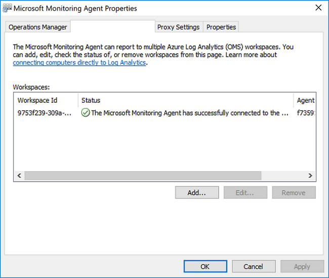
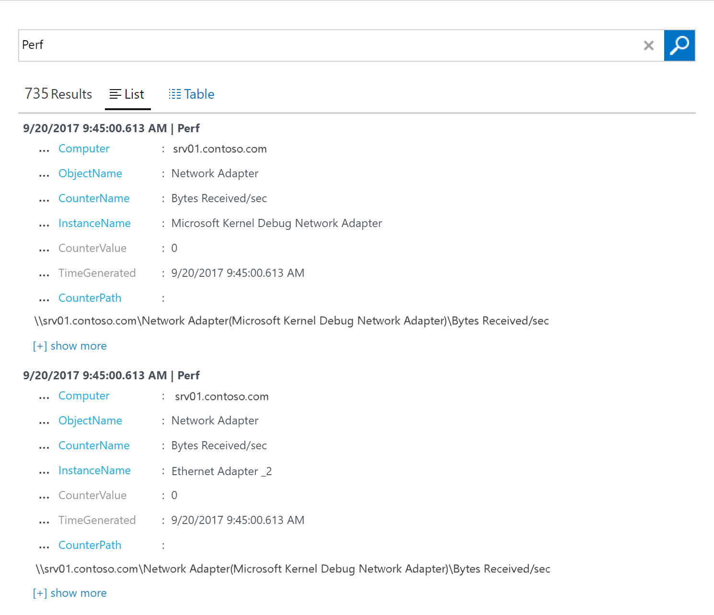

# Configure Log Analytics agent for Windows computers in a hybrid environment
[Azure Log Analytics](../../azure-monitor/platform/agent-windows.md) can collect data directly from your physical or virtual Windows computers in your datacenter or other cloud environment into a single repository for detailed analysis and correlation.  This quickstart shows you how to configure and collect data from your Windows computer with a few easy steps.  For Azure Windows VMs, see the following topic [Collect data about Azure Virtual Machines](../../azure-monitor/learn/quick-collect-azurevm.md).  

To understand the supported configuration, review [supported Windows operating systems](../../azure-monitor/platform/log-analytics-agent.md#supported-windows-operating-systems) and [network firewall configuration](../../azure-monitor/platform/log-analytics-agent.md#network-firewall-requirements).
 
If you don't have an Azure subscription, create a [free account](https://azure.microsoft.com/free/?WT.mc_id=A261C142F) before you begin.

## Log in to Azure portal
Log in to the Azure portal at [https://portal.azure.com](https://portal.azure.com). 

## Create a workspace
1. In the Azure portal, click **All services**. In the list of resources, type **Log Analytics**. As you begin typing, the list filters based on your input. Select **Log Analytics**.       
2. Click **Create**, and then select choices for the following items:

  * Provide a name for the new **Log Analytics Workspace**, such as *DefaultLAWorkspace*. 
  * Select a **Subscription** to link to by selecting from the drop-down list if the default selected is not appropriate.
  * For **Resource Group**, select an existing resource group that contains one or more Azure virtual machines.  
  * Select the **Location** your VMs are deployed to.  For additional information, see which [regions Log Analytics is available in](https://azure.microsoft.com/regions/services/).  
  * If you are creating a workspace in a new subscription created after April 2, 2018, it will automatically use the *Per GB* pricing plan and the option to select a pricing tier will not be available.  If you are creating a workspace for an existing subscription created before April 2, or to subscription that was tied to an existing EA enrollment, select your preferred pricing tier.  For additional information about the particular tiers, see [Log Analytics Pricing Details](https://azure.microsoft.com/pricing/details/log-analytics/).

           

3. After providing the required information on the **Log Analytics Workspace** pane, click **OK**.  

While the information is verified and the workspace is created, you can track its progress under **Notifications** from the menu. 

## Obtain workspace ID and key
Before installing the Microsoft Monitoring Agent for Windows, you need the workspace ID and key for your Log Analytics workspace.  This information is required by the setup wizard to properly configure the agent and ensure it can successfully communicate with Log Analytics.  

1. In the Azure portal, click **All services** found in the upper left-hand corner. In the list of resources, type **Log Analytics**. As you begin typing, the list filters based on your input. Select **Log Analytics**.
2. In your list of Log Analytics workspaces, select *DefaultLAWorkspace* created earlier.
3. Select **Advanced settings**.       
4. Select **Connected Sources**, and then select **Windows Servers**.   
5. The value to the right of **Workspace ID** and **Primary Key**. Copy and paste both into your favorite editor.   

## Install the agent for Windows
The following steps install and configure the agent for Log Analytics in Azure and Azure Government cloud using setup for the Microsoft Monitoring Agent on your computer.  

1. On the **Windows Servers** page, select the appropriate **Download Windows Agent** version to download depending on the processor architecture of the Windows operating system.
2. Run Setup to install the agent on your computer.
2. On the **Welcome** page, click **Next**.
3. On the **License Terms** page, read the license and then click **I Agree**.
4. On the **Destination Folder** page, change or keep the default installation folder and then click **Next**.
5. On the **Agent Setup Options** page, choose to connect the agent to Azure Log Analytics and then click **Next**.   
6. On the **Azure Log Analytics** page, perform the following:
   1. Paste the **Workspace ID** and **Workspace Key (Primary Key)** that you copied earlier.  If the computer should report to a Log Analytics workspace in Azure Government cloud, select **Azure US Government** from the **Azure Cloud** drop-down list.  
   2. If the computer needs to communicate through a proxy server to the Log Analytics service, click **Advanced** and provide the URL and port number of the proxy server.  If your proxy server requires authentication, type the username and password to authenticate with the proxy server and then click **Next**.  
7. Click **Next** once you have completed providing the necessary configuration settings.     
8. On the **Ready to Install** page, review your choices and then click **Install**.
9. On the **Configuration completed successfully** page, click **Finish**.

When complete, the **Microsoft Monitoring Agent** appears in **Control Panel**. You can review your configuration and verify that the agent is connected to Log Analytics. When connected, on the **Azure Log Analytics** tab, the agent displays a message stating: **The Microsoft Monitoring Agent has successfully connected to the Microsoft Log Analytics service.**   

## Collect event and performance data
Log Analytics can collect events from the Windows event log and performance counters that you specify for longer term analysis and reporting, and take action when a particular condition is detected.  Follow these steps to configure collection of events from the Windows event log, and several common performance counters to start with.  

1. In the Azure portal, click **More services** found on the lower left-hand corner. In the list of resources, type **Log Analytics**. As you begin typing, the list filters based on your input. Select **Log Analytics**.
2. Select **Advanced settings**.      
3. Select **Data**, and then select **Windows Event Logs**.  
4. You add an event log by typing in the name of the log.  Type **System** and then click the plus sign **+**.  
5. In the table, check the severities **Error** and **Warning**.   
6. Click **Save** at the top of the page to save the configuration.
7. Select **Windows Performance Data** to enable collection of performance counters on a Windows computer. 
8. When you first configure Windows Performance counters for a new Log Analytics workspace, you are given the option to quickly create several common counters. They are listed with a checkbox next to each.  .  Click **Add the selected performance counters**.  They are added and preset with a ten second collection sample interval.  
9. Click **Save** at the top of the page to save the configuration.

## View data collected
Now that you have enabled data collection, lets run a simple log search example to see some data from the target computer.  

1. In the Azure portal, under the selected workspace, click the **Log Search** tile.  
2. On the Log Search pane, in the query field type `Perf` and then hit enter or click the search button to the right of the query field.      For example, the query in the following image returned 735 Performance records.   

## Clean up resources
When no longer needed, you can remove the agent from the Windows computer and delete the Log Analytics workspace.  

To remove the agent, perform the following steps.

1. Open **Control Panel**.
2. Open **Programs and Features**.
3. In **Programs and Features**, select **Microsoft Monitoring Agent** and click **Uninstall**.

To delete the workspace, select the Log Analytics workspace you created earlier and on the resource page click **Delete**.   

## Next steps
Now that you are collecting operational and performance data from your on-premises Linux computer, you can easily begin exploring, analyzing, and taking action on data that you collect for *free*.  

To learn how to view and analyze the data, continue to the tutorial.   

> [!div class="nextstepaction"]
> [View or analyze data in Log Analytics](tutorial-viewdata.md)
