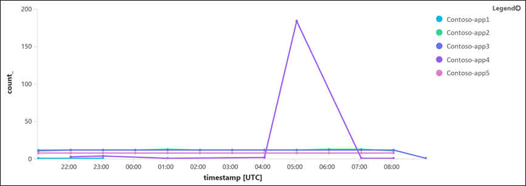

# Perform cross-resource log searches in Log Analytics  

Previously with Azure Log Analytics, you could only analyze data from within the current workspace, and it limited your ability to query across multiple workspaces defined in your subscription.  Additionally, you could only search telemetry items collected from your web-based application with Application Insights directly in Application Insights or from Visual Studio.  This also made it a challenge to natively analyze operational and application data together.   

Now you can query not only across multiple Log Analytics workspaces, but also data from a specific Application Insights app in the same resource group, another resource group, or another subscription. This provides you with a system-wide view of your data.  You can only perform these types of queries in [Log Analytics](portals.md#log-analytics-page). The number of resources (Log Analytics workspaces and Application Insights app) that you can include in a single query is limited to 100. 

## Querying across Log Analytics workspaces and from Application Insights
To reference another workspace in your query, use the [*workspace*](https://docs.microsoft.com/azure/log-analytics/query-language/workspace-expression) identifier, and for an app from Application Insights, use the [*app*](https://docs.microsoft.com/azure/log-analytics/query-language/app-expression) identifier.  

### Identifying workspace resources
The following examples demonstrate queries across Log Analytics workspaces to return summarized counts of logs from the Update table on a workspace named *contosoretail-it*. 

Identifying a workspace can be accomplished one of several ways:

* Resource name - is a human-readable name of the workspace, sometimes referred to as *component name*. 

    `workspace("contosoretail-it").Update | count`
 
    >[!NOTE]
    >Identifying a workspace by name assumes uniqueness across all accessible subscriptions. If you have multiple applications with the specified name, the query fails because of the ambiguity. In this case, you must use one of the other identifiers.

* Qualified name - is the “full name” of the workspace, composed of the subscription name, resource group, and component name in this format: *subscriptionName/resourceGroup/componentName*. 

    `workspace('contoso/contosoretail/contosoretail-it').Update | count `

    >[!NOTE]
    >Because Azure subscription names are not unique, this identifier might be ambiguous. 
    >

* Workspace ID - A workspace ID is the unique, immutable, identifier assigned to each workspace represented as a globally unique identifier (GUID).

    `workspace("b459b4u5-912x-46d5-9cb1-p43069212nb4").Update | count`

* Azure Resource ID – the Azure-defined unique identity of the workspace. You use the Resource ID when the resource name is ambiguous.  For workspaces, the format is: */subscriptions/subscriptionId/resourcegroups/resourceGroup/providers/microsoft.OperationalInsights/workspaces/componentName*.  

    For example:
    ``` 
    workspace("/subscriptions/e427519-5645-8x4e-1v67-3b84b59a1985/resourcegroups/ContosoAzureHQ/providers/Microsoft.OperationalInsights/workspaces/contosoretail-it").Update | count
    ```

### Identifying an application
The following examples return a summarized count of requests made against an app named *fabrikamapp* in Application Insights. 

Identifying an application in Application Insights can be accomplished with the *app(Identifier)* expression.  The *Identifier* argument specifies the app using one of the following:

* Resource name - is a human readable name of the app, sometimes referred to as the *component name*.  

    `app("fabrikamapp")`

* Qualified name - is the “full name” of the app, composed of the subscription name, resource group, and component name in this format: *subscriptionName/resourceGroup/componentName*. 

    `app("AI-Prototype/Fabrikam/fabrikamapp").requests | count`

     >[!NOTE]
    >Because Azure subscription names are not unique, this identifier might be ambiguous. 
    >

* ID - the app GUID of the application.

    `app("b459b4f6-912x-46d5-9cb1-b43069212ab4").requests | count`

* Azure Resource ID - the Azure-defined unique identity of the app. You use the Resource ID when the resource name is ambiguous. The format is: */subscriptions/subscriptionId/resourcegroups/resourceGroup/providers/microsoft.OperationalInsights/components/componentName*.  

    For example:
    ```
    app("/subscriptions/b459b4f6-912x-46d5-9cb1-b43069212ab4/resourcegroups/Fabrikam/providers/microsoft.insights/components/fabrikamapp").requests | count
    ```

### Performing a query across multiple resources
You can query multiple resources from any of your resource instances, these can be workspaces and apps combined.
    
Example for query across two workspaces:    

```
union Update, workspace("contosoretail-it").Update, workspace("b459b4u5-912x-46d5-9cb1-p43069212nb4").Update
| where TimeGenerated >= ago(1h)
| where UpdateState == "Needed"
| summarize dcount(Computer) by Classification
```

## Using cross-resource query for multiple resources
When using cross-resource queries to correlate data from multiple Log Analytics and Application Insights resources, the query can become complex and difficult to maintain. You should leverage [functions in Log Analytics](../../azure-monitor/log-query/functions.md) to separate the query logic from the scoping of the query resources, which simplifies the query structure. The following example demonstrates how you can monitor multiple Application Insights resources and visualize the count of failed requests by application name. 

Create a query like the following that references the scope of Application Insights resources. The `withsource= SourceApp` command adds a column that designates the application name that sent the log. [Save the query as function](../../azure-monitor/log-query/functions.md#create-a-function) with the alias _applicationsScoping_.

```Kusto
// crossResource function that scopes my Application Insights resources
union withsource= SourceApp
app('Contoso-app1').requests, 
app('Contoso-app2').requests,
app('Contoso-app3').requests,
app('Contoso-app4').requests,
app('Contoso-app5').requests
```


You can now [use this function](../../azure-monitor/log-query/functions.md#use-a-function) in a cross-resource query like the following. The function alias _applicationsScoping_ returns the union of the requests table from all the defined applications. The query then filters for failed requests and visualizes the trends by application. The _parse_ operator is optional in this example. It extracts the application name from _SourceApp_ property.

```Kusto
applicationsScoping 
| where timestamp > ago(12h)
| where success == 'False'
| parse SourceApp with * '(' applicationName ')' * 
| summarize count() by applicationName, bin(timestamp, 1h) 
| sort by count_ desc 
| render timechart
```


## Next steps

Review the [Log Analytics log search reference](https://docs.microsoft.com/azure/log-analytics/query-language/kusto) to view all of the query syntax options available in Log Analytics.    
