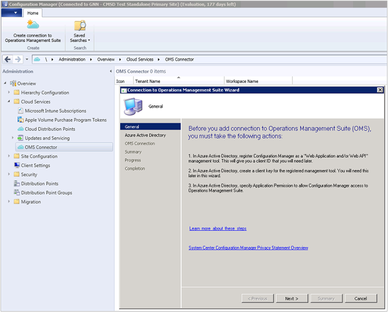
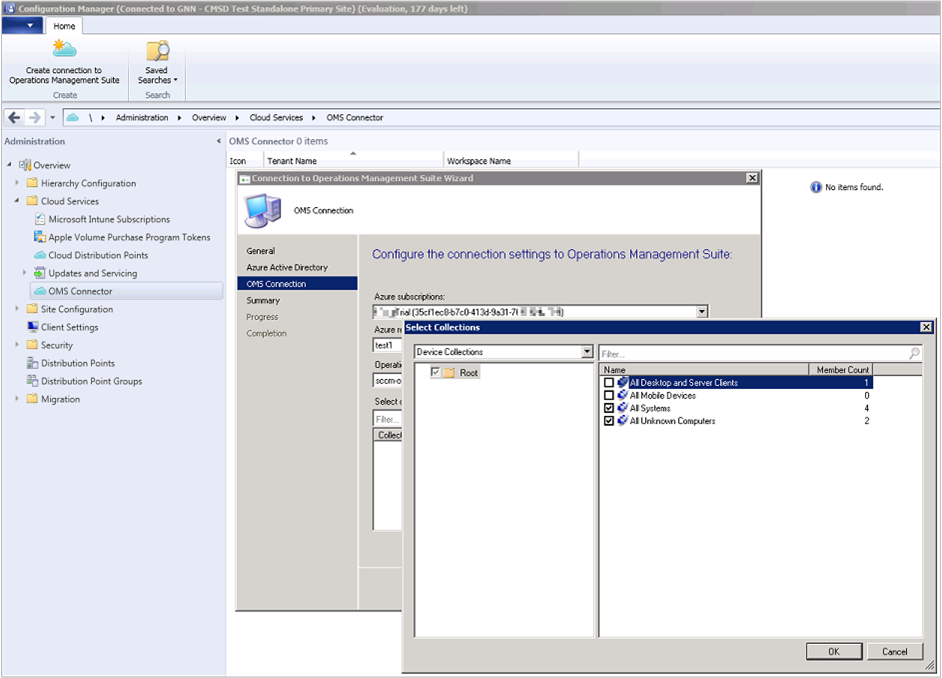

# Connect Configuration Manager to Log Analytics
You can connect your System Center Configuration Manager environment to Azure Log Analytics to sync device collection data and reference these collections in Log Analytics and Azure Automation.  

## Prerequisites

Log Analytics supports System Center Configuration Manager current branch, version 1606 and higher.  

## Configuration overview
The following steps summarize the steps to configure Configuration Manager integration with Log Analytics.  

1. In the Azure portal, register Configuration Manager as a Web Application and/or Web API app, and ensure that you have the client ID and client secret key from the registration from Azure Active Directory. See [Use portal to create Active Directory application and service principal that can access resources](../../active-directory/develop/howto-create-service-principal-portal.md) for detailed information about how to accomplish this step.
2. In the Azure portal, [grant Configuration Manager (the registered web app) with permission to access Log Analytics](#grant-configuration-manager-with-permissions-to-log-analytics).
3. In Configuration Manager, [add a connection using the Add OMS Connection Wizard](#add-an-oms-connection-to-configuration-manager).
4. In Configuration Manager, [update the connection properties](#update-oms-connection-properties) if the password or client secret key ever expires or is lost.
5. [Download and install the Microsoft Monitoring Agent](#download-and-install-the-agent) on the computer running the Configuration Manager service connection point site system role. The agent sends Configuration Manager data to the Log Analytics workspace.
6. In Log Analytics, [import collections from Configuration Manager](#import-collections) as computer groups.
7. In Log Analytics, view data from Configuration Manager as [computer groups](../../azure-monitor/platform/computer-groups.md).

You can read more about connecting Configuration Manager to Log Analytics at [Sync data from Configuration Manager to the Microsoft Log Analytics](https://technet.microsoft.com/library/mt757374.aspx).

## Grant Configuration Manager with permissions to Log Analytics
In the following procedure, you grant the *Contributor* role in your Log Analytics workspace to the AD application and service principal you created earlier for Configuration Manager.  If you do not already have a workspace, see [Create a workspace in Azure Log Analytics](../../azure-monitor/learn/quick-create-workspace.md) before proceeding.  This allows Configuration Manager to authenticate and connect to your Log Analytics workspace.  

> [!NOTE]
> You must specify permissions in Log Analytics for Configuration Manager. Otherwise, you receive an error message when you use the configuration wizard in Configuration Manager.
>

1. In the Azure portal, click **All services** found in the upper left-hand corner. In the list of resources, type **Log Analytics**. As you begin typing, the list filters based on your input. Select **Log Analytics**.       
2. In your list of Log Analytics workspaces, select the workspace to modify.
3. From the left pane, select **Access control (IAM)**.
4. In the Access control (IAM) page, click **Add role assignment** and the **Add role assignment** pane appears.
5. In the **Add role assignment** pane, under the **Role** drop-down list select the **Contributor** role.  
6. Under the **Assign access to** drop-down list, select the Configuration Manager application created in AD earlier, and then click **OK**.  

## Download and install the agent
Review the article [Connect Windows computers to the Log Analytics service in Azure](../../azure-monitor/platform/agent-windows.md) to understand the methods available for installing the Microsoft Monitoring Agent on the computer hosting the Configuration Manager service connection point site system role.  

## Add a Log Analytics connection to Configuration Manager
In order to add Log Analytics connection, your Configuration Manager environment must have a [service connection point](https://technet.microsoft.com/library/mt627781.aspx) configured for online mode.

1. In the **Administration** workspace of Configuration Manager, select **OMS Connector**. This opens the **Add Log Analytics Connection Wizard**. Select **Next**.

   >[!NOTE]
   >OMS is now referred to as Log Analytics.
   
2. On the **General** screen, confirm that you have done the following actions and that you have details for each item, then select **Next**.

   1. In the Azure portal, you've registered Configuration Manager as a Web Application and/or Web API app, and that you have the [client ID from the registration](../../active-directory/develop/quickstart-v1-add-azure-ad-app.md).
   2. In the Azure portal, you've created an app secret key for the registered app in Azure Active Directory.  
   3. In the Azure portal, you've provided the registered web app with permission to access Log Analytics.  
      
3. On the **Azure Active Directory** screen, configure your connection settings to Log Analytics by providing your **Tenant**, **Client ID**, and **Client Secret Key**, then select **Next**.  
   
4. If you accomplished all the other procedures successfully, then the information on the **OMS Connection Configuration** screen will automatically appear on this page. Information for the connection settings should appear for your **Azure subscription**, **Azure resource group**, and **Operations Management Suite Workspace**.  
   
5. The wizard connects to the Log Analytics service using the information you've input. Select the device collections that you want to sync with the service and then click **Add**.  
   
6. Verify your connection settings on the **Summary** screen, then select **Next**. The **Progress** screen shows the connection status, then should **Complete**.

> [!NOTE]
> You must connect the top-tier site in your hierarchy to Log Analytics. If you connect a standalone primary site to Log Analytics and then add a central administration site to your environment, you have to delete and recreate the connection within the new hierarchy.
>
>

After you have linked Configuration Manager to Log Analytics, you can add or remove collections, and view the properties of the connection.

## Update Log Analytics connection properties
If a password or client secret key ever expires or is lost, you'll need to manually update the Log Analytics connection properties.

1. In Configuration Manager, navigate to **Cloud Services**, then select **OMS Connector** to open the **OMS Connection Properties** page.
2. On this page, click the **Azure Active Directory** tab to view your **Tenant**, **Client ID**, **Client secret key expiration**. **Verify** your **Client secret key** if it has expired.

## Import collections
After you've added a Log Analytics connection to Configuration Manager and installed the agent on the computer running the Configuration Manager service connection point site system role, the next step is to import collections from Configuration Manager in Log Analytics as computer groups.

After you have completed initial configuration to import device collections from your hierarchy, the collection membership information is retrieved every 3 hours to keep the membership current. You can choose to disable this at any time.

1. In the Azure portal, click **All services** found in the upper left-hand corner. In the list of resources, type **Log Analytics**. As you begin typing, the list filters based on your input. Select **Log Analytics**.
2. In your list of Log Analytics workspaces, select the workspace Configuration Manager is registered with.  
3. Select **Advanced settings**.       
4. Select **Computer Groups** and then select **SCCM**.  
5. Select **Import Configuration Manager collection memberships** and then click **Save**.  
   

## View data from Configuration Manager
After you've added a Log Analytics connection to Configuration Manager and installed the agent on the computer running the Configuration Manager service connection point site system role, data from the agent is sent to Log Analytics. In Log Analytics, your Configuration Manager collections appear as [computer groups](../../azure-monitor/platform/computer-groups.md). You can view the groups from the **Configuration Manager** page under **Settings\Computer Groups**.

After the collections are imported, you can see how many computers with collection memberships have been detected. You can also see the number of collections that have been imported.

When you click either one, Search opens, displaying either all of the imported groups or all computers that belong to each group. Using [Log Search](../../azure-monitor/log-query/log-query-overview.md), you can start in-depth analysis of Configuration Manager data.

## Next steps
* Use [Log Search](../../azure-monitor/log-query/log-query-overview.md) to view detailed information about your Configuration Manager data.
