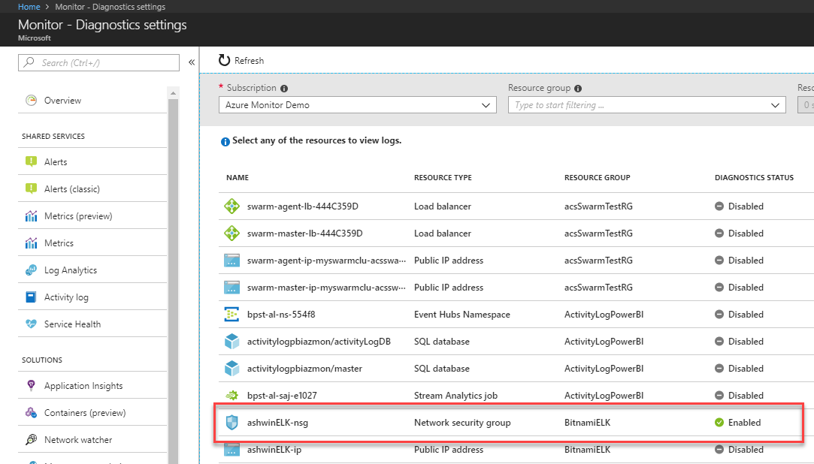
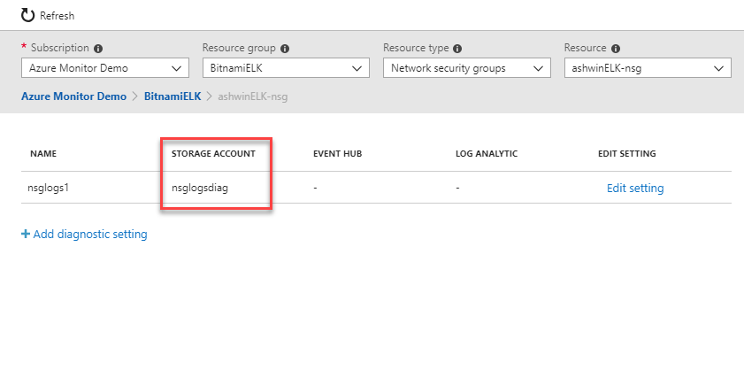

# Prepare for format change to Azure Monitor diagnostic logs archived to a storage account

> [!WARNING]
> If you are sending [Azure resource diagnostic logs or metrics to a storage account using resource diagnostic settings](./../../azure-monitor/platform/archive-diagnostic-logs.md) or [activity logs to a storage account using log profiles](./../../azure-monitor/platform/archive-activity-log.md), the format of the data in the storage account will change to JSON Lines on Nov. 1, 2018. The instructions below describe the impact and how to update your tooling to handle the new format. 
>
> 

## What is changing

Azure Monitor offers a capability that enables you to send resource diagnostic data and activity log data into an Azure storage account, Event Hubs namespace, or into Log Analytics. In order to address a system performance issue, on **November 1, 2018 at 12:00 midnight UTC** the format of log data send to blob storage will change. If you have tooling that is reading data out of blob storage, you need to update your tooling to understand the new data format.

* On Thursday, November 1, 2018 at 12:00 midnight UTC, the blob format will change to be [JSON Lines](http://jsonlines.org/). This means each record will be delimited by a newline, with no outer records array and no commas between JSON records.
* The blob format changes for all diagnostic settings across all subscriptions at once. The first PT1H.json file emitted for November 1 will use this new format. The blob and container names remain the same.
* Setting a diagnostic setting between now and November 1 continues to emit data in the current format until November 1.
* This change will occur at once across all public cloud regions. The change will not occur in Azure China, Azure Germany, or Azure Government clouds yet.
* This change impacts the following data types:
  * [Azure resource diagnostic logs](./../../azure-monitor/platform/archive-diagnostic-logs.md) ([see list of resources here](./../../azure-monitor/platform/tutorial-dashboards.md))
  * [Azure resource metrics being exported by diagnostic settings](./../../azure-monitor/platform/diagnostic-logs-overview.md#diagnostic-settings)
  * [Azure Activity log data being exported by log profiles](./../../azure-monitor/platform/archive-activity-log.md)
* This change does not impact:
  * Network flow logs
  * Azure service logs not made available through Azure Monitor yet (for example, Azure App Service diagnostic logs, storage analytics logs)
  * Routing of Azure diagnostic logs and activity logs to other destinations (Event Hubs, Log Analytics)

### How to see if you are impacted

You are only impacted by this change if you:
1. Are sending log data to an Azure storage account using a resource diagnostic setting, and
2. Have tooling that depends on the JSON structure of these logs in storage.
 
To identify if you have resource diagnostic settings that are sending data to an Azure storage account, you can navigate to the **Monitor** section of the portal, click on **Diagnostic Settings**, and identify any resources that have **Diagnostic Status** set to **Enabled**:



If Diagnostic Status is set to enabled, you have an active diagnostic setting on that resource. Click on the resource to see if any diagnostic settings are sending data to a storage account:



If you do have resources sending data to a storage account using these resource diagnostic settings, the format of the data in that storage account will be impacted by this change. Unless you have custom tooling that operates off of these storage accounts, the format change will not impact you.

### Details of the format change

The current format of the PT1H.json file in Azure blob storage uses a JSON array of records. Here is a sample of a KeyVault log file now:

```json
{
	"records": [
		{
			"time": "2016-01-05T01:32:01.2691226Z",
			"resourceId": "/SUBSCRIPTIONS/361DA5D4-A47A-4C79-AFDD-XXXXXXXXXXXX/RESOURCEGROUPS/CONTOSOGROUP/PROVIDERS/MICROSOFT.KEYVAULT/VAULTS/CONTOSOKEYVAULT",
			"operationName": "VaultGet",
			"operationVersion": "2015-06-01",
			"category": "AuditEvent",
			"resultType": "Success",
			"resultSignature": "OK",
			"resultDescription": "",
			"durationMs": "78",
			"callerIpAddress": "104.40.82.76",
			"correlationId": "",
			"identity": {
				"claim": {
					"http://schemas.microsoft.com/identity/claims/objectidentifier": "d9da5048-2737-4770-bd64-XXXXXXXXXXXX",
					"http://schemas.xmlsoap.org/ws/2005/05/identity/claims/upn": "live.com#username@outlook.com",
					"appid": "1950a258-227b-4e31-a9cf-XXXXXXXXXXXX"
				}
			},
			"properties": {
				"clientInfo": "azure-resource-manager/2.0",
				"requestUri": "https://control-prod-wus.vaultcore.azure.net/subscriptions/361da5d4-a47a-4c79-afdd-XXXXXXXXXXXX/resourcegroups/contosoresourcegroup/providers/Microsoft.KeyVault/vaults/contosokeyvault?api-version=2015-06-01",
				"id": "https://contosokeyvault.vault.azure.net/",
				"httpStatusCode": 200
			}
		},
        {
			"time": "2016-01-05T01:33:56.5264523Z",
			"resourceId": "/SUBSCRIPTIONS/361DA5D4-A47A-4C79-AFDD-XXXXXXXXXXXX/RESOURCEGROUPS/CONTOSOGROUP/PROVIDERS/MICROSOFT.KEYVAULT/VAULTS/CONTOSOKEYVAULT",
			"operationName": "VaultGet",
			"operationVersion": "2015-06-01",
			"category": "AuditEvent",
			"resultType": "Success",
			"resultSignature": "OK",
			"resultDescription": "",
			"durationMs": "83",
			"callerIpAddress": "104.40.82.76",
			"correlationId": "",
			"identity": {
				"claim": {
					"http://schemas.microsoft.com/identity/claims/objectidentifier": "d9da5048-2737-4770-bd64-XXXXXXXXXXXX",
					"http://schemas.xmlsoap.org/ws/2005/05/identity/claims/upn": "live.com#username@outlook.com",
					"appid": "1950a258-227b-4e31-a9cf-XXXXXXXXXXXX"
				}
			},
			"properties": {
				"clientInfo": "azure-resource-manager/2.0",
				"requestUri": "https://control-prod-wus.vaultcore.azure.net/subscriptions/361da5d4-a47a-4c79-afdd-XXXXXXXXXXXX/resourcegroups/contosoresourcegroup/providers/Microsoft.KeyVault/vaults/contosokeyvault?api-version=2015-06-01",
				"id": "https://contosokeyvault.vault.azure.net/",
				"httpStatusCode": 200
			}
		}
	]
}
```

The new format uses [JSON lines](http://jsonlines.org/), where each event is a line and the newline character indicates a new event. Here is what the above sample will look like in the PT1H.json file after the change:

```json
{"time": "2016-01-05T01:32:01.2691226Z","resourceId": "/SUBSCRIPTIONS/361DA5D4-A47A-4C79-AFDD-XXXXXXXXXXXX/RESOURCEGROUPS/CONTOSOGROUP/PROVIDERS/MICROSOFT.KEYVAULT/VAULTS/CONTOSOKEYVAULT","operationName": "VaultGet","operationVersion": "2015-06-01","category": "AuditEvent","resultType": "Success","resultSignature": "OK","resultDescription": "","durationMs": "78","callerIpAddress": "104.40.82.76","correlationId": "","identity": {"claim": {"http://schemas.microsoft.com/identity/claims/objectidentifier": "d9da5048-2737-4770-bd64-XXXXXXXXXXXX","http://schemas.xmlsoap.org/ws/2005/05/identity/claims/upn": "live.com#username@outlook.com","appid": "1950a258-227b-4e31-a9cf-XXXXXXXXXXXX"}},"properties": {"clientInfo": "azure-resource-manager/2.0","requestUri": "https://control-prod-wus.vaultcore.azure.net/subscriptions/361da5d4-a47a-4c79-afdd-XXXXXXXXXXXX/resourcegroups/contosoresourcegroup/providers/Microsoft.KeyVault/vaults/contosokeyvault?api-version=2015-06-01","id": "https://contosokeyvault.vault.azure.net/","httpStatusCode": 200}}
{"time": "2016-01-05T01:33:56.5264523Z","resourceId": "/SUBSCRIPTIONS/361DA5D4-A47A-4C79-AFDD-XXXXXXXXXXXX/RESOURCEGROUPS/CONTOSOGROUP/PROVIDERS/MICROSOFT.KEYVAULT/VAULTS/CONTOSOKEYVAULT","operationName": "VaultGet","operationVersion": "2015-06-01","category": "AuditEvent","resultType": "Success","resultSignature": "OK","resultDescription": "","durationMs": "83","callerIpAddress": "104.40.82.76","correlationId": "","identity": {"claim": {"http://schemas.microsoft.com/identity/claims/objectidentifier": "d9da5048-2737-4770-bd64-XXXXXXXXXXXX","http://schemas.xmlsoap.org/ws/2005/05/identity/claims/upn": "live.com#username@outlook.com","appid": "1950a258-227b-4e31-a9cf-XXXXXXXXXXXX"}},"properties": {"clientInfo": "azure-resource-manager/2.0","requestUri": "https://control-prod-wus.vaultcore.azure.net/subscriptions/361da5d4-a47a-4c79-afdd-XXXXXXXXXXXX/resourcegroups/contosoresourcegroup/providers/Microsoft.KeyVault/vaults/contosokeyvault?api-version=2015-06-01","id": "https://contosokeyvault.vault.azure.net/","httpStatusCode": 200}}
```

This new format enables Azure Monitor to push log files using [append blobs](https://docs.microsoft.com/rest/api/storageservices/understanding-block-blobs--append-blobs--and-page-blobs#about-append-blobs), which are more efficient for continuously appending new event data.

## How to update

You only need to make updates if you have custom tooling that ingests these log files for further processing. If you are making use of an external log analytics or SIEM tool, we recommend [using event hubs to ingest this data instead](https://azure.microsoft.com/blog/use-azure-monitor-to-integrate-with-siem-tools/). Event hubs integration is easier in terms of processing logs from many services and bookmarking location in a particular log.

Custom tools should be updated to handle both the current format and the JSON Lines format described above. This will ensure that when data starts to appear in the new format, your tools do not break.

## Next steps

* Learn about [archiving resource diagnostic logs to a storage account](./../../azure-monitor/platform/archive-diagnostic-logs.md)
* Learn about [archiving activity log data to a storage account](./../../azure-monitor/platform/archive-activity-log.md)

