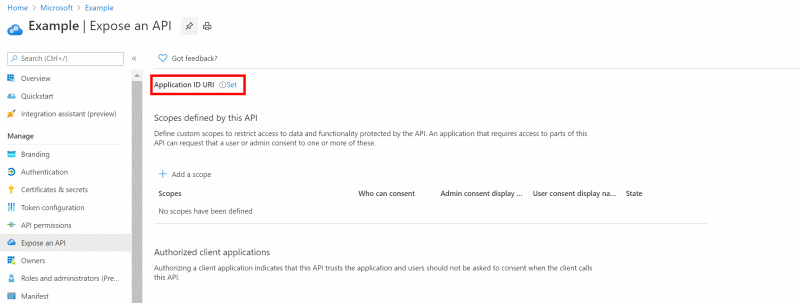
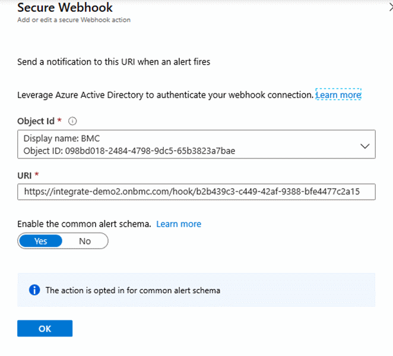

# Connect Azure to ITSM tools using Secure Export

[!div class="mx-imgBorder"]

This article provides information about how to configure the connection between your ITSM product/service using Secure Export.

Secure Export is and updated version of [ITSMC](./itsmc-overview.md) (IT Service Management). Both versions allow you to create work items in an ITSM tool when Azure Monitor alerts fire. The functionality includes metric, log and activity log alerts.

[ITSMC](./itsmc-overview.md) uses user and password credentials, while Secure Export has stronger authentication because it is uses Azure Active Directory (Azure AD). Azure Active Directory (Azure AD) is Microsoft’s cloud-based identity and access management service. It helps users sign in and access internal or external resources. Using Azure AD with ITSM helps to identify Azure alerts (using the Azure AD application ID) that were sent to the external system.

> [!NOTE]
> The Connect Azure to ITSM tools using Secure Export is in preview

## Secure Export Architecture

The secure export architecture introduces the following new capabilities:

* **New Action Group** - Alerts are sent to the ITSM tool using the secure webhook action group (instead of ITSM Action Group using in ITSMC).
* **Azure AD authentication** - Authentication occurs using Azure AD instead of user/password credentials.

## Secure Export Data Flow

The Secure Export data flow steps are:

1) An alert which is configured to use secure export fires in Azure Monitor
2) The alert payload is sent a by secure webhook action to the ITSM tool.
3) The ITSM application checks with Azure AD if the alert is authorized to enter the ITSM tool.
4) If the alert is authorized the application:
    1) Creates a work item (e.g. incident) in the ITSM tool.
    2) Binds the configuration Item (CI) ID to the customer management database (CMDB).

## Connection with BMC Helix

Secure export supports BMC Helix. Some benefits of the integration are:

* **Better authentication** – Azure AD provides more secure authentication without the timeouts that commonly occur in ITSMC.
* **Alerts resolved in ITSM tool** – Metric alerts implement a "fired" and "resolved" state. When the condition is met, the alert state is "Fired". When condition is not met anymore, the alert state is "Resolved". In ITSMC, alerts could not be resolved automatically. With secure export, the resolved state flows to the ITSM tool and so updates automatically.
* **[Common Schema allows](https://docs.microsoft.com/azure/azure-monitor/platform/alerts-common-schema)** – In ITSMC, the schema of the alert payload differed based on the alert type. In secure export, we a common schema for all alert types. This new common schema contains the CI for all alert types. By that all alert types will be able to bind their CI with the CMDB.

Start using the ITSM Connector with these steps:

1. Register your app with Azure Active Directory.
2. Create a secure webhook action group.
3. Configure your partner environment.

## Register with Azure Active Directory

Follow these steps to register Azure AD Application with Azure Active Directory

1) [Azure AD creation](https://docs.microsoft.com/azure/active-directory/develop/quickstart-register-app)
2) In the Azure Active Directory select “expose application”
3) Select Set on the Application ID URI

4) Click save.

## Create a Secure Webhook action group

Once you have your Azure AD registered, you can create work item(s) in your ITSM tool based on Azure alerts, by using the Secure Webhook Action in Action Groups.
Action Groups provide a modular and reusable way of triggering actions for your Azure Alerts. You can use Action Groups with metric alerts, Activity Log alerts and Azure Log Analytics alerts in Azure portal.
To learn more about action groups, see [Create and manage action groups in the Azure portal](https://docs.microsoft.com/azure/azure-monitor/platform/action-groups).
Use the following procedure:

In BMC Helix environment:

1. Log in to Integration Studio.
2. Search for the Create Incident from Azure Alerts flow.
3. Copy the WebHook URL.

To add a webhook to an action, follow the instructions for a secure webhook:

1. In the [Azure portal](https://portal.azure.com/), search for and select **Monitor**. The **Monitor** pane consolidates all your monitoring settings and data in one view.
2. Select **Alerts** then select **Manage actions**.
3. Select [Add action group](https://docs.microsoft.com/azure/azure-monitor/platform/action-groups#create-an-action-group-by-using-the-azure-portal), and fill in the fields.
4. Enter a name in the **Action group name** box, and enter a name in the **Short name** box. The short name is used in place of a full action group name when notifications are sent using this group.
5. Select **Secured Webhook**
6. Select edit details. The following image shows a sample secured webhook action:
    1. Select the right object ID of the Azure Active Directory that you registered
    2. Paste the in URI field the WebHook URL  that you copied from the "BMC Helix environment"
    3. Set **Common Alert Schema** to **Yes**. 
7. The following image shows a sample secured webhook action configuration:

## Configure partner environment

### Connect BMC Helix to Azure Monitor

The following section provides details about how to connect your BMC Helix product and secure export in Azure.

### Prerequisites

Ensure the following prerequisites are met:

* Azure AD is registered.
* You the supported version of BMC Helix Multi-Cloud Service Management: 20.02 version or later

To configure the BMC Helix connection:

1) [Enabling prebuilt integration with Azure Monitor for version 20.2](https://docs.bmc.com/docs/multicloud/enabling-prebuilt-integration-with-azure-monitor-879728195.html)

2) As a part of the configuration of the connection in the BMC Helix, go into your integration BMC instance and follow the instructions:

1. Select **catalog**
2. Select **Azure alerts**
3. Select **connectors**
4. Select **configuration**
5. Select **add new connection** configuration
6. Fill the information for the configuration section.
    1. **Name** - Make up your own
    2. **Authorization type** - NONE
    3. **Description**-  Make up your own
    4. **Site**- Cloud
    5. **Number of instances** -  2 – default value
    6. **Check** -  selected by default and enable usage
    7. Azure tenant ID, Azure application ID are taken from the application that were defined in “Created Azure Active Directory” step.

## Next steps

* [Create ITSM work items from Azure alerts](./itsmc-overview.md#create-itsm-work-items-from-azure-alerts)
