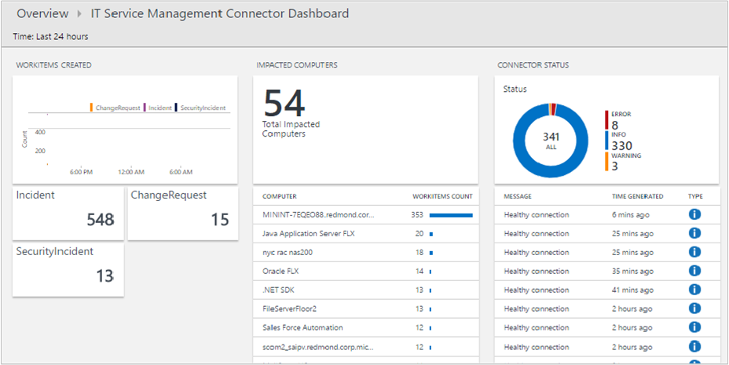

# Troubleshooting problems in ITSM Connector

This article discusses common problems in ITSM Connector and how to troubleshoot them.

Azure Monitor alerts proactively notify you when important conditions are found in your monitoring data. They allow you to identify and address issues before the users of your system notice them. For more information on alerting, see Overview of alerts in Microsoft Azure.
The customer can select how they want to be notified on the alert whether it is by mail, SMS, Webhook or even to automate a solution. Another option to be notified is using ITSM.
ITSM gives you the option to send the alerts to external ticketing system such as ServiceNow.

## Visualize and analyze the incident and change request data

Depending on your configuration when you set up a connection, ITSMC can sync up to 120 days of incident and change request data. The log record schema for this data is provided in the [Additional information Section](./itsmc-synced-data.md) of this article.

You can visualize the incident and change request data by using the ITSMC dashboard:

The dashboard also provides information about connector status, which you can use as a starting point to analyze problems with the connections.

In order to get more information about the dashboard investigation, see [Error Investigation using the dashboard](./itsmc-dashboard.md).

### Service map

You can also visualize the incidents synced against the affected computers in Service Map.

Service Map automatically discovers the application components on Windows and Linux systems and maps the communication between services. It allows you to view your servers as you think of them: as interconnected systems that deliver critical services. Service Map shows connections between servers, processes, and ports across any TCP-connected architecture. Other than the installation of an agent, no configuration is required. For more information, see [Using Service Map](../insights/service-map.md).

If you're using Service Map, you can view the service desk items created in ITSM solutions, as shown here:

## Troubleshoot ITSM connections

- If a connection fails to connect to the ITSM system and you get an **Error in saving connection** message, take the following steps:
   - For ServiceNow, Cherwell, and Provance connections:  
     - Ensure that you correctly entered  the user name, password, client ID, and client secret  for each of the connections.  
     - Ensure that you have sufficient privileges in the corresponding ITSM product to make the connection.  
   - For Service Manager connections:  
     - Ensure that the web app is successfully deployed and that the hybrid connection is created. To verify the connection is successfully established with the on-premises Service Manager computer, go to the web app URL as described in the documentation for making the [hybrid connection](./itsmc-connections-scsm.md#configure-the-hybrid-connection).  

- If Log Analytics alerts fire but work items aren't created in the ITSM product, if configuration items aren't created/linked to work items, or for other information, see these resources:
   -  ITSMC: The solution shows a [summary of connections](itsmc-dashboard.md), work items, computers, and more. Select the tile that has the **Connector Status** label. Doing so takes you to **Log Search** with the relevant query. Look at log records with a `LogType_S` of `ERROR` for more information.
   You can see details about the messages in the table - [here](itsmc-dashboard-errors.md).
   - **Log Search** page: View the errors and related information directly by using the query `*ServiceDeskLog_CL*`.

## Common Symptoms - how should it be resolved?

The list below contain common symptoms and how should it be resolved:

* **Symptom**: Duplicate work items are created

    **Cause**: the cause can be one of the two options:
    * More than one ITSM action are defined for the alert.
    * Alert is resolved.

    **Resolution**: There can be two solutions:
    * Make sure that you have a single ITSM action group per alert.
    * ITSM Connector does not support matching work items status update when an alert is resolved. A new resolved work item is created.
* **Symptom**: Work items are not created

    **Cause**: There can be couple of reasons for this symptom:
    * Code modification in ServiceNow side
    * Permissions misconfiguration
    * ServiceNow rate limits are too high/low
    * Refresh token is expired
    * ITSM Connector was deleted

    **Resolution**: You can check the [dashboard](itsmc-dashboard.md) and review the errors in the connector status section. Review the [common errors](itsmc-dashboard-errors.md) and find out how to resolve the error.

* **Symptom**: Unable to create ITSM Action for Action Group

    **Cause**:Newly created ITSM Connector has yet to finish the initial Sync.

    **Resolution**: you can review the [common UI errors](itsmc-dashboard-errors.md#ui-common-errors) and find out how to resolve the error.