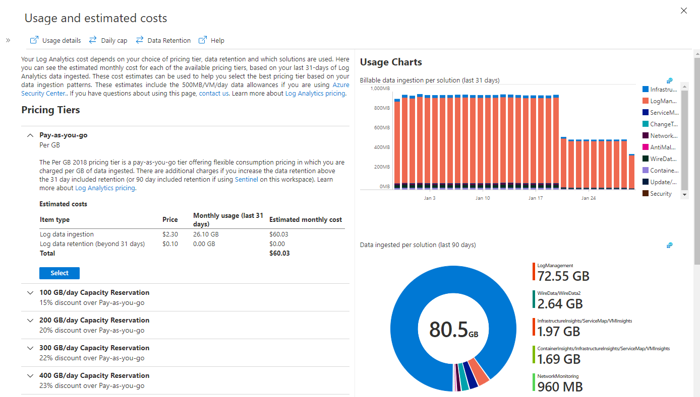
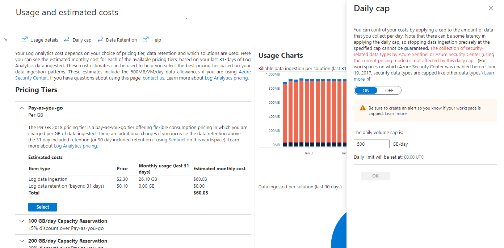
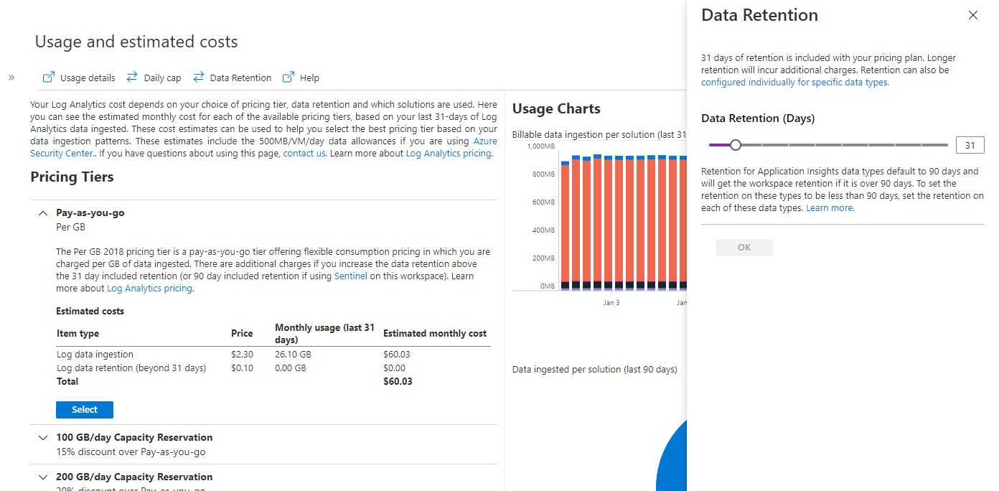
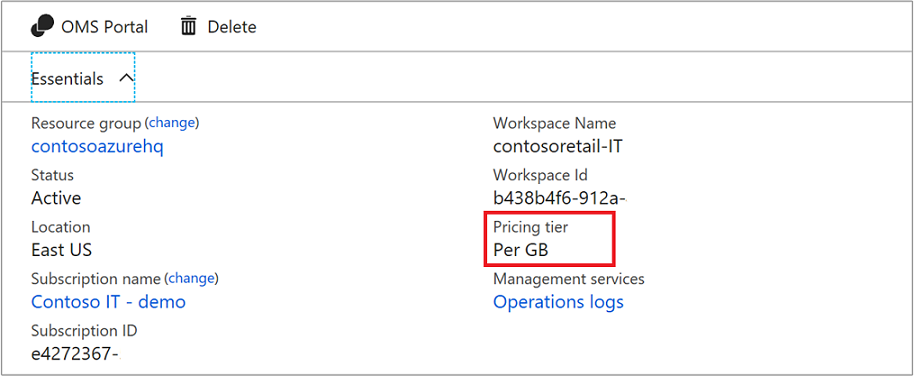

 
# Manage usage and costs for Log Analytics

> [!NOTE]
> This article describes how to control your costs in Log Analytics by setting the data retention period.  Refer to the following articles for related information.
> - [Analyze data usage in Log Analytics](manage-cost-storage.md) describes how to analyze and alert on your data usage.
> - [Monitoring usage and estimated costs](usage-estimated-costs.md) describes how to view usage and estimated costs across multiple Azure monitoring features for different pricing models. It also describes how to change your pricing model.

Log Analytics is designed to scale and support collecting, indexing, and storing massive amounts of data per day from any source in your enterprise or deployed in Azure.  While this may be a primary driver for your organization, cost-efficiency is ultimately the underlying driver. To that end, its important to understand that the cost of a Log Analytics workspace isn't just based on the volume of data collected, it is also dependent on the plan selected, and how long you chose to store data generated from your connected sources.  

In this article we review how you can proactively monitor data volume and storage growth, and define limits to control those associated costs. 

The cost of data can be considerable depending on the following factors: 

- Volume of data generated and ingested to the workspace 
    - Number of management solutions enabled
    - Number of systems monitored
    - Type of data collected from each monitored resource 
- The length of time you decide to retain your data 

## Understand your workspace's usage and estimated cost
Log Analytics makes it easy to understand what the costs are likely be based on recent usage patterns.  To do this, use  **Log Analytics Usage and Estimated Costs**  to review and analyze data usage. The shows how much data is collected by each solution, how much data is being retained and an estimate of your costs 
based on the amount of data ingested and any additional retention beyond the included amount.

To explore your data in more detail, click on the icon at the top right of either of the charts on the **Usage and Estimated Costs** page. Now you can work with this query to explore more details of your usage.  

From the **Usage and Estimated Costs** page you can review your data volume for the month. This includes all the data received and retained in your Log Analytics workspace.  Click **Usage details** from the top of the page to view the usage dashboard with information on data volume trends by source, computers and offering. To view and set a daily cap or to modify the retention period, click **Data volume management**.
 
Log Analytics charges are added to your Azure bill. You can see details of your Azure bill under the Billing section of the Azure portal or in the [Azure Billing Portal](https://account.windowsazure.com/Subscriptions).  

## Daily cap
You can configure a daily cap and limit the daily ingestion for your workspace, but use care as your goal should not be to hit the daily limit.  Otherwise, you lose data for the remainder of the day, which can impact other Azure services and solutions whose functionality may depend on up-to-date data being available in the workspace.  As a result, your ability to observe and receive alerts when the health conditions of resources supporting IT services are impacted.  The daily cap is intended to be used as a way to manage the unexpected increase in data volume from your managed resources and stay within your limit, or when you want to simply limit unplanned charges for your workspace.  

When the daily limit is reached, the collection of billable data types stops for the rest of the day. A warning banner appears across the top of the page for the selected Log Analytics workspace and an operation event is sent to the *Operation* table under **LogManagement** category. Data collection resumes after the reset time defined under *Daily limit will be set at*. We recommend defining an alert rule based on this operation event, configured to notify when the daily data limit has been reached. 

### Identify what daily data limit to define 
Review [Log Analytics Usage and estimated costs](usage-estimated-costs.md) to understand the data ingestion trend and what is the daily volume cap to define. It should be considered with care, since you won’t be able to monitor your resources after the limit is reached. 

### Manage the maximum daily data volume 
The following steps describe how to configure a limit to manage the volume of data that Log Analytics will ingest per day.  

1. From your workspace, select **Usage and estimated costs** from the left pane.
2. On the **Usage and estimated costs** page for the selected workspace, click **Data volume management** from the top of the page. 
5. Daily cap is **OFF** by default – click **ON** to enable it, and then set the data volume limit in GB/day.   

### Alert when daily cap reached
While we present a visual cue in the Azure portal when your data limit threshold is met, this behavior doesn't necessarily align to how you manage operational issues requiring immediate attention.  To receive an alert notification, you can create a new alert rule in Azure Monitor.  To learn more, see [how to create, view and manage alerts](alerts-metric.md).      

To get you started, here are the recommended settings for the alert:

* Target: Select your Log Analytics resource
* Criteria: 
   * Signal name: Custom log search
   * Search query: Operation | where Detail has 'OverQuota'
   * Based on: Number of results
   * Condition: Greater than
   * Threshold: 0
   * Period: 5 (minutes)
   * Frequency: 5 (minutes)
* Alert rule name: Daily data limit reached
* Severity: Warning (Sev 1)

Once alert is defined and the limit is reached, an alert is triggered and performs the response defined in the Action Group. It can notify your team via email and text messages, or automate actions using webhooks, Automation runbooks or [integrating with an external ITSM solution](itsmc-overview.md#create-itsm-work-items-from-azure-alerts). 

## Change the data retention period 
The following steps describe how to configure how long log data is kept by in your workspace.
 
1. From your workspace, select **Usage and estimated costs** from the left pane.
2. On the **Usage and estimated costs** page, click **Data volume management** from the top of the page.
5. On the pane, move the slider to increase or decrease the number of days and then click **OK**.  If you are on the *free* tier, you will not be able to modify the data retention period and you need to upgrade to the paid tier in order to control this setting.   

## Legacy pricing tiers

Customers with an Enterprise Agreement signed prior to July 1, 2018 or who already created a Log Analytics workspace in a subscription, you still have access to the *Free* plan. If your subscription is not tied to an existing EA enrollment, the *Free* tier is not available when you create a workspace in a new subscription after April 2, 2018.  Data is limited to 7 days retention for the *Free* tier.  For the legacy *Standalone* or *Per Node* tiers, as well as the current 2018 single pricing tier , data collected is available for the last 31 days. The *Free* tier has 500 MB daily ingestion limit, and if you find that you consistently exceed the amounts allowed volume, you can change your workspace to another plan to collect data beyond this limit. 

> [!NOTE]
> To use the entitlements that come from purchasing OMS E1 Suite, OMS E2 Suite or OMS Add-On for System Center, choose the Log Analytics *Per Node* pricing tier.

## Changing pricing tier

If your Log Analytics workspace has access to legacy pricing tiers, to change between legacy pricing tiers:

1. In the Azure portal, from the Log Analytics subscriptions pane, select a workspace.

2. From the workspace pane, under **General**, select **Pricing tier**.  

3. Under **Pricing tier**, select a pricing tier and then click **Select**.  
    

If you want to move your workspace into the current pricing tier, you need to [change your subscription's monitoring pricing model in Azure Monitor](https://docs.microsoft.com/en-us/azure/azure-monitor/platform/usage-estimated-costs#moving-to-the-new-pricing-model) which will change the pricing tier of all workspaces in that subscription.

> [!NOTE]
> If your workspace is linked to an Automation account, before you can select the *Standalone (Per GB)* pricing tier you must delete any **Automation and Control** solutions and unlink the Automation account. In the workspace blade, under **General**, click **Solutions** to see and delete solutions. To unlink the Automation account, click the name of the Automation account on the **Pricing tier** blade.

## Troubleshooting why Log Analytics is no longer collecting data
If you are on the legacy Free pricing tier and have sent more than 500 MB of data in a day, data collection stops for the rest of the day. Reaching the daily limit is a common reason that Log Analytics stops collecting data, or data appears to be missing.  Log Analytics creates an event of type Operation when data collection starts and stops. Run the following query in search to check if you are reaching the daily limit and missing data: 

`Operation | where OperationCategory == 'Data Collection Status' `

When data collection stops, the OperationStatus is Warning. When data collection starts, the OperationStatus is Succeeded. The following table describes reasons that data collection stops and a suggested action to resume data collection:  

|Reason collection stops| Solution| 
|-----------------------|---------|
|Daily limit of legacy Free pricing tier  reached |Wait until the following day for collection to automatically restart, or change to a paid pricing tier.|
|Daily cap of your workspace was reached|Wait for collection to automatically restart, or increase the daily data volume limit described in [manage the maximum daily data volume](#manage-the-maximum-daily-volume). The daily cap reset time is shows on the **Data volume management** page. |
|Azure subscription is in a suspended state due to:  Free trial ended  Azure pass expired  Monthly spending limit reached (for example on an MSDN or Visual Studio subscription)|Convert to a paid subscription  Remove limit, or wait until limit resets|

To be notified when data collection stops, use the steps described in *Create daily data cap* alert to be notified when data collection stops and follow the steps Use the steps described in add actions to alert rules configure an e-mail, webhook, or runbook action for the alert rule. 

## Troubleshooting why usage is higher than expected
Higher usage is caused by one, or both of:
- More data than expected being sent to Log Analytics
- More nodes than expected sending data to Log Analytics

### Data volume 
On the **Usage and Estimated Costs** page, the *Data ingestion per solution* chart shows the total volume of data sent and how much is being sent by each solution. This allows you to determine trends such as whether the overall data usage (or usage by a particular solution) is growing, remaining steady or decreasing. The query used to generate this is

`Usage| where TimeGenerated > startofday(ago(31d))| where IsBillable == true
| summarize TotalVolumeGB = sum(Quantity) / 1024 by bin(TimeGenerated, 1d), Solution| render barchart`

Note that the clause "where IsBillable = true" filters out data types from certain solutions for which there is no ingestion charge. 

You can drill in further to see data trends for specific data types, for example if you want to study the data due to IIS logs:

`Usage| where TimeGenerated > startofday(ago(31d))| where IsBillable == true
| where DataType == "W3CIISLog"
| summarize TotalVolumeGB = sum(Quantity) / 1024 by bin(TimeGenerated, 1d), Solution| render barchart`

### Nodes sending data

To understand the number of computers (nodes) reporting data each day in the last month, use

`Heartbeat | where TimeGenerated > startofday(ago(31d))
| summarize dcount(Computer) by bin(TimeGenerated, 1d)    
| render timechart`

To get a list of computers sending **billed data types** (some data types are free), leverage the `_IsBilled` property:

`union withsource = tt * 
| where _IsBillable == true 
| extend computerName = tolower(tostring(split(Computer, '.')[0]))
| where computerName != ""
| summarize TotalVolumeBytes=sum(_BilledSize) by computerName`

Use these `union withsource = tt *` queries sparingly as scans across data data typres are expensive to execute. 

This can be extended to return the count of computers per hour that are sending billed data types:

`union withsource = tt * 
| where _IsBillable == true 
| extend computerName = tolower(tostring(split(Computer, '.')[0]))
| where computerName != ""
| summarize dcount(computerName) by bin(TimeGenerated, 1h) | sort by TimeGenerated asc`

To see the **size** of billable events ingested per computer, use the `_BilledSize` property which provides the size in bytes:

`union withsource = tt * 
| where _IsBillable == true 
| summarize Bytes=sum(_BilledSize) by  Computer | sort by Bytes nulls last `

This query replaces the old way of querying this with the Usage data type. 

To see the **count** of events ingested per computer, use

`union withsource = tt *
| summarize count() by Computer | sort by count_ nulls last`

To see the count of billable events ingested per computer, use 

`union withsource = tt * 
| where _IsBillable == true 
| summarize count() by Computer  | sort by count_ nulls last`

If you want to see counts for billable data types are sending data to a specific computer, use:

`union withsource = tt *
| where Computer == "computer name"
| where _IsBillable == true 
| summarize count() by tt | sort by count_ nulls last `

> [!NOTE]
> Some of the fields of the Usage data type, while still in the schema, have been deprecated and will their values are no longer populated. 
> These are **Computer** as well as fields related to ingestion (**TotalBatches**, **BatchesWithinSla**, **BatchesOutsideSla**, **BatchesCapped** and **AverageProcessingTimeMs**.

To dig deeper into the source of data for a particular data type, here are some useful example queries:

+ **Security** solution
  - `SecurityEvent | summarize AggregatedValue = count() by EventID`
+ **Log Management** solution
  - `Usage | where Solution == "LogManagement" and iff(isnotnull(toint(IsBillable)), IsBillable == true, IsBillable == "true") == true | summarize AggregatedValue = count() by DataType`
+ **Perf** data type
  - `Perf | summarize AggregatedValue = count() by CounterPath`
  - `Perf | summarize AggregatedValue = count() by CounterName`
+ **Event** data type
  - `Event | summarize AggregatedValue = count() by EventID`
  - `Event | summarize AggregatedValue = count() by EventLog, EventLevelName`
+ **Syslog** data type
  - `Syslog | summarize AggregatedValue = count() by Facility, SeverityLevel`
  - `Syslog | summarize AggregatedValue = count() by ProcessName`
+ **AzureDiagnostics** data type
  - `AzureDiagnostics | summarize AggregatedValue = count() by ResourceProvider, ResourceId`

### Tips for reducing data volume

Some suggestions for reducing the volume of logs collected include:

| Source of high data volume | How to reduce data volume |
| -------------------------- | ------------------------- |
| Security events            | Select [common or minimal security events](https://blogs.technet.microsoft.com/msoms/2016/11/08/filter-the-security-events-the-oms-security-collects/)   Change the security audit policy to collect only needed events. In particular, review the need to collect events for   - [audit filtering platform](https://technet.microsoft.com/library/dd772749(WS.10).aspx)   - [audit registry](https://docs.microsoft.com/previous-versions/windows/it-pro/windows-server-2008-R2-and-2008/dd941614(v%3dws.10))  - [audit file system](https://docs.microsoft.com/previous-versions/windows/it-pro/windows-server-2008-R2-and-2008/dd772661(v%3dws.10))  - [audit kernel object](https://docs.microsoft.com/previous-versions/windows/it-pro/windows-server-2008-R2-and-2008/dd941615(v%3dws.10))  - [audit handle manipulation](https://docs.microsoft.com/previous-versions/windows/it-pro/windows-server-2008-R2-and-2008/dd772626(v%3dws.10))  - audit removable storage |
| Performance counters       | Change [performance counter configuration](data-sources-performance-counters.md) to:   - Reduce the frequency of collection   - Reduce number of performance counters |
| Event logs                 | Change [event log configuration](data-sources-windows-events.md) to:   - Reduce the number of event logs collected   - Collect only required event levels. For example, do not collect *Information* level events |
| Syslog                     | Change [syslog configuration](data-sources-syslog.md) to:   - Reduce the number of facilities collected   - Collect only required event levels. For example, do not collect *Info* and *Debug* level events |
| AzureDiagnostics           | Change resource log collection to:   - Reduce the number of resources send logs to Log Analytics   - Collect only required logs |
| Solution data from computers that don't need the solution | Use [solution targeting](../insights/solution-targeting.md) to collect data from only required groups of computers. |

### Getting node counts 

If you are on "Per node (OMS)" pricing tier, then you are charged based on the number of nodes and solutions you use, the number of Insights and Analytics nodes for which you are being billed will be shown in table on the **Usage and Estimated Cost** page.  

To see the number of distinct Security nodes, you can use the query:

`union
(
    Heartbeat
    | where (Solutions has 'security' or Solutions has 'antimalware' or Solutions has 'securitycenter')
    | project Computer
),
(
    ProtectionStatus
    | where Computer !in~
    (
        (
            Heartbeat
            | project Computer
        )
    )
    | project Computer
)
| distinct Computer
| project lowComputer = tolower(Computer)
| distinct lowComputer
| count`

To see the number of distinct Automation nodes, use the query:

` ConfigurationData 
 | where (ConfigDataType == "WindowsServices" or ConfigDataType == "Software" or ConfigDataType =="Daemons") 
 | extend lowComputer = tolower(Computer) | summarize by lowComputer 
 | join (
     Heartbeat 
       | where SCAgentChannel == "Direct"
       | extend lowComputer = tolower(Computer) | summarize by lowComputer, ComputerEnvironment
 ) on lowComputer
 | summarize count() by ComputerEnvironment | sort by ComputerEnvironment asc`

## Create an alert when data collection is higher than expected
This section describes how to create an alert if:
- Data volume exceeds a specified amount.
- Data volume is predicted to exceed a specified amount.

Azure Alerts support [log alerts](alerts-unified-log.md) that use search queries. 

The following query has a result when there is more than 100 GB of data collected in the last 24 hours:

`union withsource = $table Usage | where QuantityUnit == "MBytes" and iff(isnotnull(toint(IsBillable)), IsBillable == true, IsBillable == "true") == true | extend Type = $table | summarize DataGB = sum((Quantity / 1024)) by Type | where DataGB > 100`

The following query uses a simple formula to predict when more than 100 GB of data will be sent in a day: 

`union withsource = $table Usage | where QuantityUnit == "MBytes" and iff(isnotnull(toint(IsBillable)), IsBillable == true, IsBillable == "true") == true | extend Type = $table | summarize EstimatedGB = sum(((Quantity * 8) / 1024)) by Type | where EstimatedGB > 100`

To alert on a different data volume, change the 100 in the queries to the number of GB you want to alert on.

Use the steps described in [create a new log alert](alerts-metric.md) to be notified when data collection is higher than expected.

When creating the alert for the first query -- when there is more than 100 GB of data in 24 hours, set the:  

- **Define alert condition** specify your Log Analytics workspace as the resource target.
- **Alert criteria** specify the following:
   - **Signal Name** select **Custom log search**
   - **Search query** to `union withsource = $table Usage | where QuantityUnit == "MBytes" and iff(isnotnull(toint(IsBillable)), IsBillable == true, IsBillable == "true") == true | extend Type = $table | summarize DataGB = sum((Quantity / 1024)) by Type | where DataGB > 100`
   - **Alert logic** is **Based on** *number of results* and **Condition** is *Greater than* a **Threshold** of *0*
   - **Time period** of *1440* minutes and **Alert frequency** to every *60* minutes since the usage data only updates once per hour.
- **Define alert details** specify the following:
   - **Name** to *Data volume greater than 100 GB in 24 hours*
   - **Severity** to *Warning*

Specify an existing or create a new [Action Group](action-groups.md) so that when the log alert matches criteria, you are notified.

When creating the alert for the second query -- when it is predicted that there will be more than 100 GB of data in 24 hours, set the:

- **Define alert condition** specify your Log Analytics workspace as the resource target.
- **Alert criteria** specify the following:
   - **Signal Name** select **Custom log search**
   - **Search query** to `union withsource = $table Usage | where QuantityUnit == "MBytes" and iff(isnotnull(toint(IsBillable)), IsBillable == true, IsBillable == "true") == true | extend Type = $table | summarize EstimatedGB = sum(((Quantity * 8) / 1024)) by Type | where EstimatedGB > 100`
   - **Alert logic** is **Based on** *number of results* and **Condition** is *Greater than* a **Threshold** of *0*
   - **Time period** of *180* minutes and **Alert frequency** to every *60* minutes since the usage data only updates once per hour.
- **Define alert details** specify the following:
   - **Name** to *Data volume expected to greater than 100 GB in 24 hours*
   - **Severity** to *Warning*

Specify an existing or create a new [Action Group](action-groups.md) so that when the log alert matches criteria, you are notified.

When you receive an alert, use the steps in the following section to troubleshoot why usage is higher than expected.

## Next steps
* See [Log searches in Log Analytics](../log-query/log-query-overview.md) to learn how to use the search language. You can use search queries to perform additional analysis on the usage data.
* Use the steps described in [create a new log alert](alerts-metric.md) to be notified when a search criteria is met.
* Use [solution targeting](../insights/solution-targeting.md) to collect data from only required groups of computers.
* To configure an effective security event collection policy, review [Azure Security Center filtering policy](../../security-center/security-center-enable-data-collection.md).
* Change [performance counter configuration](data-sources-performance-counters.md).
* To modify your event collection settings, review [event log configuration](data-sources-windows-events.md).
* To modify your syslog collection settings, review [syslog configuration](data-sources-syslog.md).

