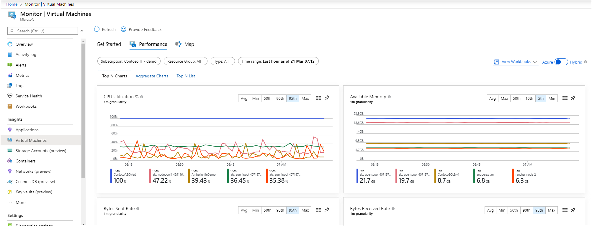
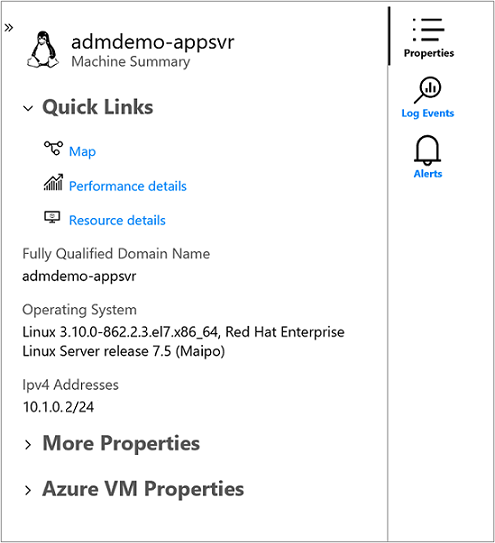
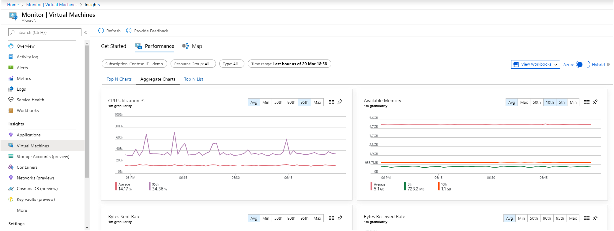
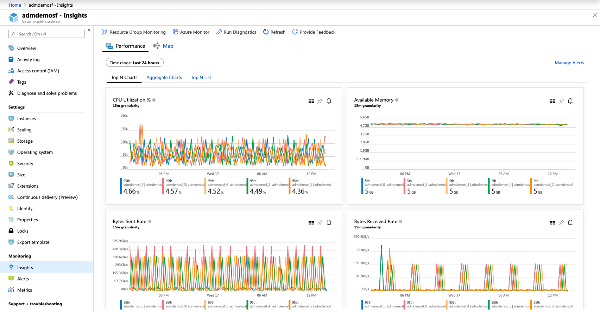

# How to chart performance with VM insights

VM insights includes a set of performance charts that target several key performance indicators (KPIs) to help you determine how well a virtual machine is performing. The charts show resource utilization over a period of time so you can identify bottlenecks, anomalies, or switch to a perspective listing each machine to view resource utilization based on the metric selected. While there are numerous elements to consider when dealing with performance, VM insights monitors key operating system performance indicators related to processor, memory, network adapter, and disk utilization. Performance complements the health monitoring feature and helps expose issues that indicate a possible system component failure, support tuning and optimization to achieve efficiency, or support capacity planning.  

## Limitations
Following are limitations in performance collection with VM insights.

- **Available memory** is not available in all Linux versions including Red Hat Linux (RHEL) 6 and CentOS 6. It will be available in Linux versions that use [kernel version 3.14](http://www.man7.org/linux/man-pages/man1/free.1.html) or higher. It may be available in some kernel versions between 3.0 and 3.14.
- Metrics are only available for data disks on Linux virtual machines using XFS filesystem or EXT filesystem family (EXT2, EXT3, EXT4).

## Multi-VM perspective from Azure Monitor

From Azure Monitor, the Performance feature provides a view of all monitored VMs deployed across workgroups in your subscriptions or in your environment. To access from Azure Monitor, perform the following steps. 

1. In the Azure portal, select **Monitor**. 
2. Choose **Virtual Machines** in the **Solutions** section.
3. Select the **Performance** tab.

On the **Top N Charts** tab, if you have more than one Log Analytics workspace, choose the workspace enabled with the solution from the **Workspace** selector at the top of the page. The **Group** selector will return subscriptions, resource groups, [computer groups](../logs/computer-groups.md), and virtual machine scale sets of computers related to the selected workspace that you can use to further filter results presented in the charts on this page and across the other pages. Your selection only applies to the Performance feature and does not carry over to Health or Map.  

By default, the charts show the last 24 hours. Using the **TimeRange** selector, you can query for historical time ranges of up to 30 days to show how performance looked in the past.

The five capacity utilization charts shown on the page are:

* CPU Utilization % - shows the top five machines with the highest average processor utilization 
* Available Memory - shows the top five machines with the lowest average amount of available memory 
* Logical Disk Space Used % - shows the top five machines with the highest average disk space used % across all disk volumes 
* Bytes Sent Rate - shows the top five machines with highest average of bytes sent 
* Bytes Receive Rate - shows the top five machines with highest average of bytes received 

Clicking on the pin icon at the upper right-hand corner of any one of the five charts will pin the selected chart to the last Azure dashboard you last viewed.  From the dashboard, you can resize and reposition the chart. Selecting the chart from the dashboard will redirect you to VM insights and load the correct scope and view.  

Clicking on the icon located to the left of the pin icon on any one of the five charts opens the **Top N List** view.  Here you see the resource utilization for that performance metric by individual VM in a list view and which machine is trending highest.  

When you click on the virtual machine, the **Properties** pane is expanded on the right to show the properties of the item selected, such as system information reported by the operating system, properties of the Azure VM, etc. Clicking on one of the options under the **Quick Links** section will redirect you to that feature directly from the selected VM.  

Switch to the **Aggregated Charts** tab to view the performance metrics filtered by average or percentiles measures.  

The following capacity utilization charts are provided:

* CPU Utilization % - defaults showing the average and top 95th percentile 
* Available Memory - defaults showing the average, top 5th, and 10th percentile 
* Logical Disk Space Used % - defaults showing the average and 95th percentile 
* Bytes Sent Rate - defaults showing average bytes sent 
* Bytes Receive Rate - defaults showing average bytes received

You can also change the granularity of the charts within the time range by selecting **Avg**, **Min**, **Max**, **50th**, **90th**, and **95th** in the percentile selector.

To view the resource utilization by individual VM in a list view and see which machine is trending with highest utilization, select the **Top N List** tab.  The **Top N List** page shows the top 20 machines sorted by the most utilized by 95th percentile for the metric *CPU Utilization %*.  You can see more machines by selecting **Load More**, and the results expand to show the top 500 machines. 

>[!NOTE]
>The list cannot show more than 500 machines at a time.  
>

To filter the results on a specific virtual machine in the list, enter its computer name in the **Search by name** textbox.  

If you would rather view utilization from a different performance metric, from the **Metric** drop-down list select **Available Memory**, **Logical Disk Space Used %**, **Network Received Byte/s**, or **Network Sent Byte/s** and the list updates to show utilization scoped to that metric.  

Selecting a virtual machine from the list opens the **Properties** panel on the right-side of the page and from here you can select **Performance detail**.  The **Virtual Machine Detail** page opens and is scoped to that VM, similar in experience when accessing VM Insights Performance directly from the Azure VM.  

## View performance directly from an Azure VM

To access directly from a virtual machine, perform the following steps.

1. In the Azure portal, select **Virtual Machines**. 
2. From the list, choose a VM and in the **Monitoring** section choose **Insights**.  
3. Select the **Performance** tab. 

This page not only includes performance utilization charts, but also a table showing for each logical disk discovered, its capacity, utilization, and total average by each measure.  

The following capacity utilization charts are provided:

* CPU Utilization % - defaults showing the average and top 95th percentile 
* Available Memory - defaults showing the average, top 5th, and 10th percentile 
* Logical Disk Space Used % - defaults showing the average and 95th percentile 
* Logical Disk IOPS - defaults showing the average and 95th percentile
* Logical Disk MB/s - defaults showing the average and 95th percentile
* Max Logical Disk Used % - defaults showing the average and 95th percentile
* Bytes Sent Rate - defaults showing average bytes sent 
* Bytes Receive Rate - defaults showing average bytes received

Clicking on the pin icon at the upper right-hand corner of any one of the charts pins the selected chart to the last Azure dashboard you viewed. From the dashboard, you can resize and reposition the chart. Selecting the chart from the dashboard redirects you to VM insights and loads the performance detail view for the VM.  

## View performance directly from an Azure virtual machine scale set

To access directly from an Azure virtual machine scale set, perform the following steps.

1. In the Azure portal, select **Virtual machine scale sets**.
2. From the list, choose a VM and in the **Monitoring** section choose **Insights** to view the **Performance** tab.

This page loads the Azure Monitor performance view, scoped to the selected scale set. This enables you to see the Top N Instances in the scale set across the set of monitored metrics, view the aggregate performance across the scale set, and see the trends for selected metrics across the individual instances n the scale set. Selecting an instance from the list view lets you load it's map or navigate into a detailed performance view for that instance.

Clicking on the pin icon at the upper right-hand corner of any one of the charts pins the selected chart to the last Azure dashboard you viewed. From the dashboard, you can resize and reposition the chart. Selecting the chart from the dashboard redirects you to VM insights and loads the performance detail view for the VM.  

>[!NOTE]
>You can also access a detailed performance view for a specific instance from the Instances view for your scale set. Navigate to **Instances** under the **Settings** section, and then choose **Insights**.

## Next steps

- Learn how to use [Workbooks](vminsights-workbooks.md) that are included with VM insights to further analyze performance and network metrics.  

- To learn about discovered application dependencies, see [View VM insights Map](vminsights-maps.md).
