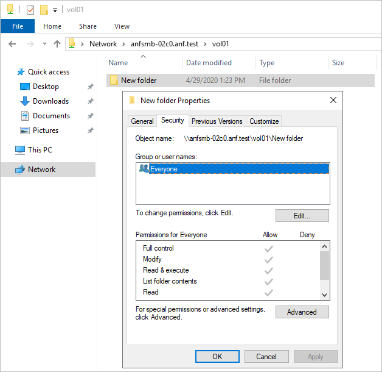

# Create an SMB volume for Azure NetApp Files

Azure NetApp Files supports creating volumes using NFS (NFSv3 and NFSv4.1), SMB3, or dual protocol (NFSv3 and SMB). A volume's capacity consumption counts against its pool's provisioned capacity. This article shows you how to create an SMB3 volume.

## Before you begin 
You must have already set up a capacity pool.   
[Set up a capacity pool](azure-netapp-files-set-up-capacity-pool.md)   
A subnet must be delegated to Azure NetApp Files.  
[Delegate a subnet to Azure NetApp Files](azure-netapp-files-delegate-subnet.md)

## Configure Active Directory connections 

Before creating an SMB volume, you need to create an Active Directory connection. If you haven't configured Active Directory connections for Azure NetApp files, follow instructions described in [Create and manage Active Directory connections](create-active-directory-connections.md).

## Add an SMB volume

1. Click the **Volumes** blade from the Capacity Pools blade. 

    

2. Click **+ Add volume** to create a volume.  
    The Create a Volume window appears.

3. In the Create a Volume window, click **Create** and provide information for the following fields under the Basics tab:   
    * **Volume name**      
        Specify the name for the volume that you are creating.   

        A volume name must be unique within each capacity pool. It must be at least three characters long. You can use any alphanumeric characters.   

        You can't use `default` or `bin` as the volume name.

    * **Capacity pool**  
        Specify the capacity pool where you want the volume to be created.

    * **Quota**  
        Specify the amount of logical storage that is allocated to the volume.  

        The **Available quota** field shows the amount of unused space in the chosen capacity pool that you can use towards creating a new volume. The size of the new volume must not exceed the available quota.  

    * **Throughput (MiB/S)**   
        If the volume is created in a manual QoS capacity pool, specify the throughput you want for the volume.   

        If the volume is created in an auto QoS capacity pool, the value displayed in this field is (quota x service level throughput).   

    * **Virtual network**  
        Specify the Azure virtual network (VNet) from which you want to access the volume.  

        The VNet you specify must have a subnet delegated to Azure NetApp Files. The Azure NetApp Files service can be accessed only from the same VNet or from a VNet that is in the same region as the volume through VNet peering. You can also access the volume from  your on-premises network through Express Route.   

    * **Subnet**  
        Specify the subnet that you want to use for the volume.  
        The subnet you specify must be delegated to Azure NetApp Files. 
        
        If you haven't delegated a subnet, you can click **Create new** on the Create a Volume page. Then in the Create Subnet page, specify the subnet information, and select **Microsoft.NetApp/volumes** to delegate the subnet for Azure NetApp Files. In each VNet, only one subnet can be delegated to Azure NetApp Files.   
 
        
    
        

    * If you want to apply an existing snapshot policy to the volume, click **Show advanced section** to expand it, specify whether you want to hide the snapshot path, and select a snapshot policy in the pull-down menu. 

        For information about creating a snapshot policy, see [Manage snapshot policies](azure-netapp-files-manage-snapshots.md#manage-snapshot-policies).

        

4. Click **Protocol** and complete the following information:  
    * Select **SMB** as the protocol type for the volume. 
    * Select your **Active Directory** connection from the drop-down list.
    * Specify the name of the shared volume in  **Share name**.

    

5. Click **Review + Create** to review the volume details.  Then click **Create** to create the SMB volume.

    The volume you created appears in the Volumes page. 
 
    A volume inherits subscription, resource group, location attributes from its capacity pool. To monitor the volume deployment status, you can use the Notifications tab.

## Control access to an SMB volume  

Access to an SMB volume is managed through permissions.  

### Share permissions  

By default, a new volume has the **Everyone / Full Control** share permissions. Members of the Domain Admins group can change the share permissions by using Computer Management on the computer account that is used for the Azure NetApp Files volume.

 
 

### NTFS file and folder permissions  

You can set permissions for a file or folder by using the **Security** tab of the object's properties in the Windows SMB client.
 
 

## Next steps  

* [Mount or unmount a volume for Windows or Linux virtual machines](azure-netapp-files-mount-unmount-volumes-for-virtual-machines.md)
* [Resource limits for Azure NetApp Files](azure-netapp-files-resource-limits.md)
* [SMB FAQs](./azure-netapp-files-faqs.md#smb-faqs)
* [Troubleshoot SMB or dual-protocol volumes](troubleshoot-dual-protocol-volumes.md)
* [Learn about virtual network integration for Azure services](../virtual-network/virtual-network-for-azure-services.md)
* [Install a new Active Directory forest using Azure CLI](/windows-server/identity/ad-ds/deploy/virtual-dc/adds-on-azure-vm)
