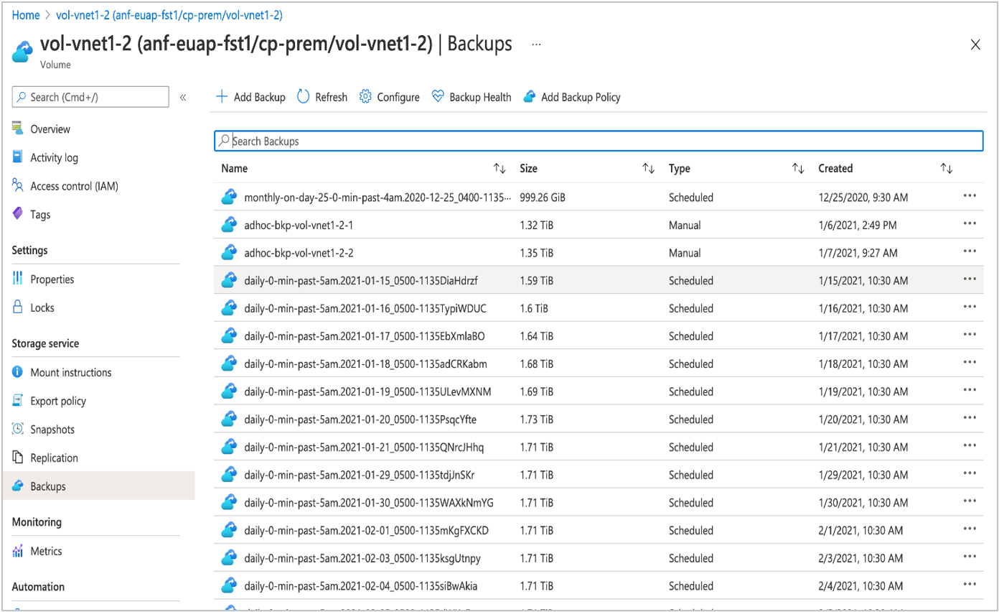

# Search backups of Azure NetApp Files volumes

The names used for snapshots are preserved when the snapshots are backed up. Snapshot names include the prefix `daily`, `weekly`, or `monthly`. They also include the timestamp when the snapshot was created.

If a volume is deleted, its backups are still retained. The backups are listed in the associated NetApp accounts, under the Backups section. This list includes all backups within the subscription (across NetApp accounts) in the region. It can be used to restore a backup to a volume in another NetApp account under the same subscription.

>[!IMPORTANT]
>All existing backups must be migrated to backup vaults. You can search for backups, but you will not be able to perform any operations on a backup until the backup has been migrated to a backup vault. For more information about this procedure, see [Manage a backup vault](backup-vault-manage.md).

## Search backups at volume level    <!-- will this still work -->

You can display and search backups at the volume level:

1. Select **Volumes**.

1. If you have migrated to a backup vault, navigate to **Backup Vault**. Select the backup vault.
    If you have not yet migrated to a backup vault, navigate to **Backups**.   
    The **Type** column shows whether the backup is generated by a *Scheduled* (policy-based) or a *manual* backup.

3. In the **Search Backups** field, enter the backup name that you want to search for.  

    A partial search is supported; you don’t have to specify the entire backup name. The search filters the backups based on the search string.

    

## Next steps  

* [Understand Azure NetApp Files backup](backup-introduction.md)
* [Requirements and considerations for Azure NetApp Files backup](backup-requirements-considerations.md)
* [Resource limits for Azure NetApp Files](azure-netapp-files-resource-limits.md)
* [Configure policy-based backups](backup-configure-policy-based.md)
* [Configure manual backups](backup-configure-manual.md)
* [Manage backup policies](backup-manage-policies.md)
* [Restore a backup to a new volume](backup-restore-new-volume.md)
* [Disable backup functionality for a volume](backup-disable.md)
* [Delete backups of a volume](backup-delete.md)
* [Volume backup metrics](azure-netapp-files-metrics.md#volume-backup-metrics)
* [Azure NetApp Files backup FAQs](faq-backup.md)
