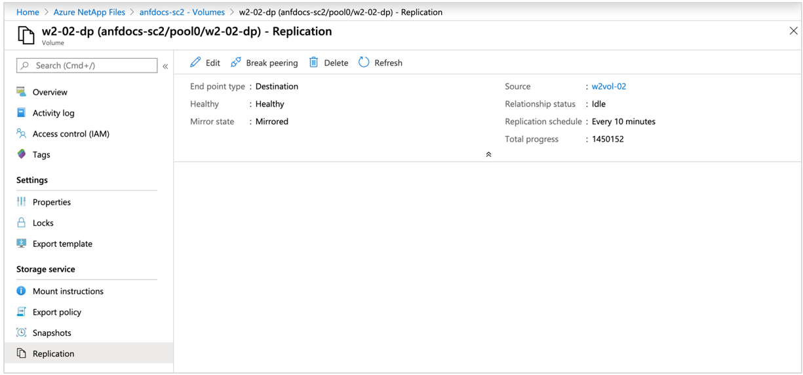

# Display health status of replication relationship 

You can view replication status on the source volume or the destination volume.  

## Display replication status

1. From either the source volume or the destination volume, click **Replication** under Storage Service for either volume.

    The following replication status and health information is displayed:  
    * **End point type** – Identifies whether the volume is the source or destination of replication.
    * **Health** – Displays the health status of the replication relationship.
    * **Mirror state** – Shows one of the following values:
        * *Uninitialized*:  
            This is the initial and default state when a peering relationship is created. The state remains uninitialized until the initialization completes successfully.
        * *Mirrored*:   
            The destination volume has been initialized and is ready to receive mirroring updates.
        * *Broken*:   
            This is the state after you break the peering relationship. The destination volume is `‘RW’` and snapshots are present.
    * **Relationship status** – Shows one of the following values: 
        * *Idle*:  
            No transfer operation is in progress and future transfers are not disabled.
        * *Transferring*:  
            A transfer operation is in progress and future transfers are not disabled.
    * **Replication schedule** – Shows how frequently incremental mirroring updates will be performed when the initialization (baseline copy) is complete.

    * **Total progress** -- Shows the total amount of cumulative bytes transferred over the lifetime of the relationship. This amount is the actual bytes transferred, and it might differ from the logical space that the source and destination volumes report.  

    

> [!NOTE] 
> Replication relationship shows health status as *unhealthy* if previous replication jobs are not complete. This status is a result of large volumes being transferred with a lower transfer window (for example, a ten-minute transfer time for a large volume). In this case, the relationship status shows *transferring* and health status shows *unhealthy*.

## Next steps  

* [Cross-region replication](cross-region-replication-introduction.md)
* [Manage disaster recovery](cross-region-replication-manage-disaster-recovery.md)
* [Resize a cross-region replication destination volume](azure-netapp-files-resize-capacity-pools-or-volumes.md#resize-a-cross-region-replication-destination-volume)
* [Volume replication metrics](azure-netapp-files-metrics.md#replication)
* [Delete volume replications or volumes](cross-region-replication-delete.md)
* [Troubleshoot cross-region replication](troubleshoot-cross-region-replication.md)

