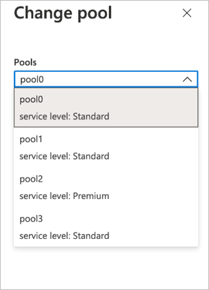

# Dynamically change the service level of a volume

You can change the service level of an existing volume by moving the volume to another capacity pool that uses the [service level](azure-netapp-files-service-levels.md) you want for the volume. This in-place service-level change for the volume does not require that you migrate data. It also does not impact access to the volume.  

This functionality enables you to meet your workload needs on demand.  You can change an existing volume to use a higher service level for better performance, or to use a lower service level for cost optimization. For example, if the volume is currently in a capacity pool that uses the *Standard* service level and you want the volume to use the *Premium* service level, you can move the volume dynamically to a capacity pool that uses the *Premium* service level.  

The capacity pool that you want to move the volume to must already exist. The capacity pool can contain other volumes.  If you want to move the volume to a brand-new capacity pool, you need to [create the capacity pool](azure-netapp-files-set-up-capacity-pool.md) before you move the volume.  

## Considerations

* After the volume is moved to another capacity pool, you will no longer have access to the previous volume activity logs and volume metrics. The volume will start with new activity logs and metrics under the new capacity pool.

* If you move a volume to a capacity pool of a higher service level (for example, moving from *Standard* to *Premium* or *Ultra* service level), you must wait at least seven days before you can move that volume *again* to a capacity pool of a lower service level (for example, moving from *Ultra* to *Premium* or *Standard*).  

## Register the feature

The feature to move a volume to another capacity pool is currently in preview. If you are using this feature for the first time, you need to register the feature first.

If you have multiple Azure subscriptions, ensure that you are registering for the intended subscription by using the ['Set-AzContext'](/powershell/module/az.accounts/set-azcontext) command. <!-- GitHub #74191 --> 

1. Register the feature: 

    ```azurepowershell-interactive
    Register-AzProviderFeature -ProviderNamespace Microsoft.NetApp -FeatureName ANFTierChange
    ```

2. Check the status of the feature registration: 

    > [!NOTE]
    > The **RegistrationState** may be in the `Registering` state for up to 60 minutes before changing to `Registered`. Wait until the status is **Registered** before continuing.

    ```azurepowershell-interactive
    Get-AzProviderFeature -ProviderNamespace Microsoft.NetApp -FeatureName ANFTierChange
    ```
You can also use [Azure CLI commands](/cli/azure/feature) `az feature register` and `az feature show` to register the feature and display the registration status. 
 
## Move a volume to another capacity pool

1.	On the Volumes page, right-click the volume whose service level you want to change. Select **Change Pool**.

    

2. In the Change pool window, select the capacity pool you want to move the volume to. 

    

3.	Click **OK**.


## Next steps  

* [Service levels for Azure NetApp Files](azure-netapp-files-service-levels.md)
* [Create a capacity pool](azure-netapp-files-set-up-capacity-pool.md)
* [Troubleshoot issues for changing the capacity pool of a volume](troubleshoot-capacity-pools.md#issues-when-changing-the-capacity-pool-of-a-volume)
