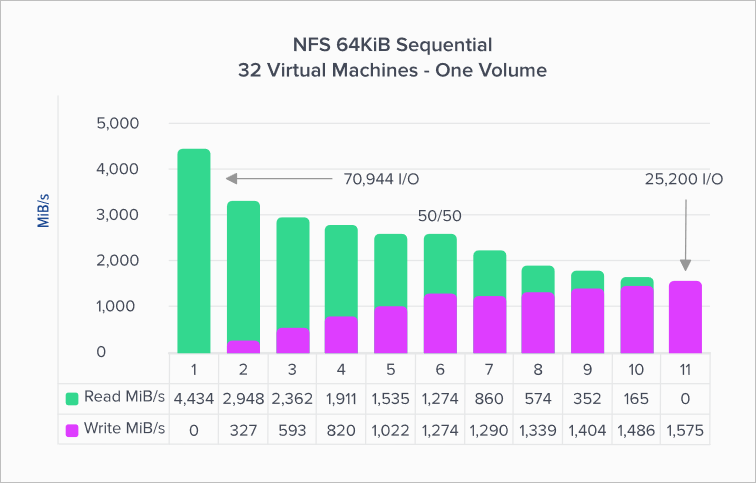
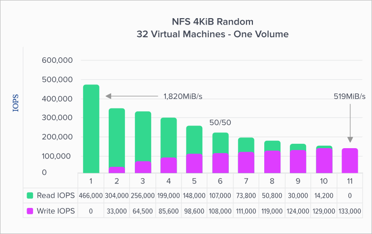
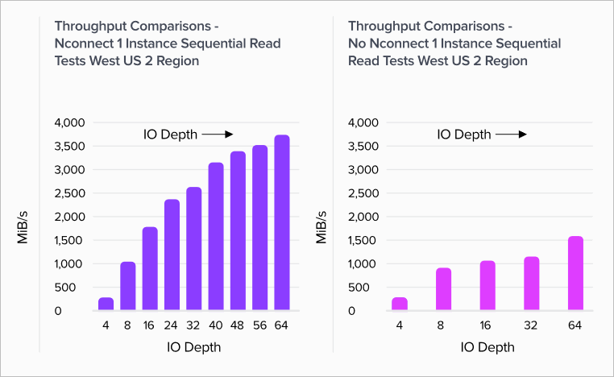
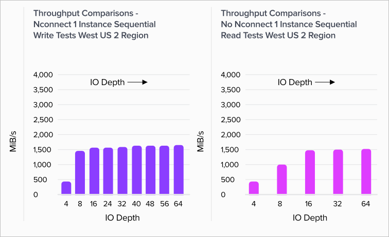
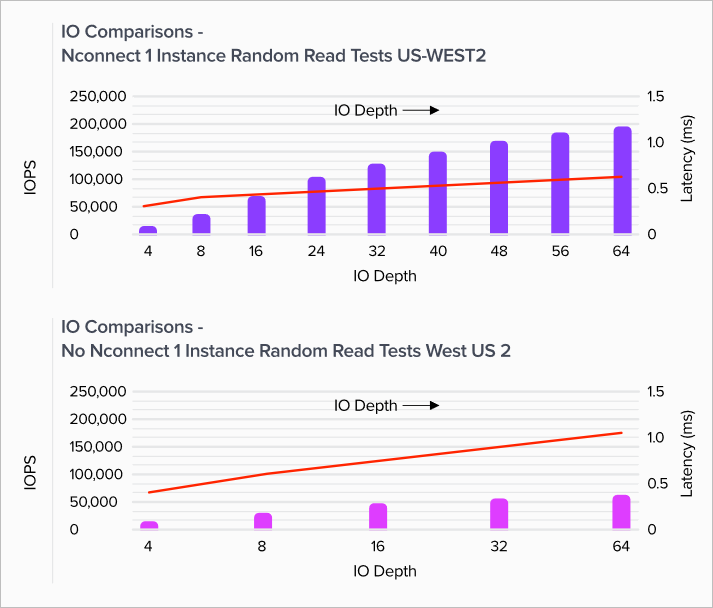
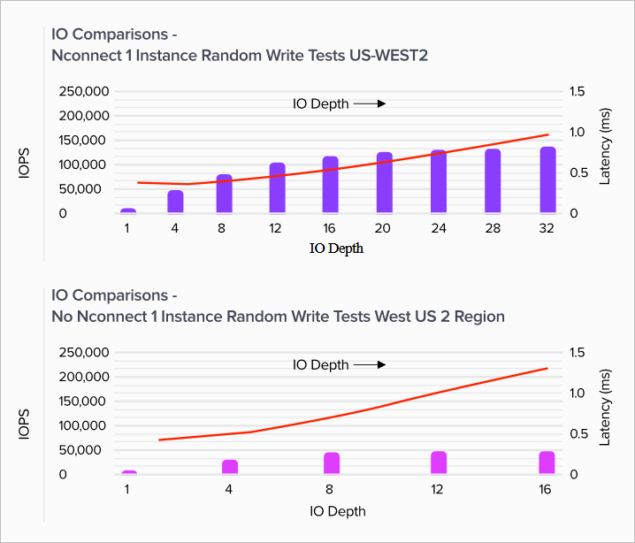

# Azure NetApp Files performance benchmarks for Linux

This article describes performance benchmarks Azure NetApp Files delivers for Linux.

## Linux scale-out

This section describes performance benchmarks of Linux workload throughput and workload IOPS.

### Linux workload throughput  

The graph below represents a 64-kibibyte (KiB) sequential workload and a 1 TiB working set. It shows that a single Azure NetApp Files volume can handle between ~1,600 MiB/s pure sequential writes and ~4,500 MiB/s pure sequential reads.  

The graph illustrates decreases in 10% at a time, from pure read to pure write. It demonstrates what you can expect when using varying read/write ratios (100%:0%, 90%:10%, 80%:20%, and so on).

  

### Linux workload IOPS  

The following graph represents a 4-kibibyte (KiB) random workload and a 1 TiB working set. The graph shows that an Azure NetApp Files volume can handle between ~130,000 pure random writes and ~460,000 pure random reads.  

This graph illustrates decreases in 10% at a time, from pure read to pure write. It demonstrates what you can expect when using varying read/write ratios (100%:0%, 90%:10%, 80%:20%, and so on).

  

## Linux scale-up  

The graphs in this section show the validation testing results for the client-side mount option with NFSv3. For more information, see [`nconnect` section of Linux mount options](performance-linux-mount-options.md#nconnect).

The graphs compare the advantages of `nconnect` to a non-`connected` mounted volume. In the graphs, FIO generated the workload from a single D32s_v4 instance in the us-west2 Azure region using a 64-KiB sequential workload – the largest I/O size supported by Azure NetApp Files at the time of the testing represented here. Azure NetApp Files now supports larger I/O sizes. For more details, see [`rsize` and `wsize` section of Linux mount options](performance-linux-mount-options.md#rsize-and-wsize).

### Linux read throughput  

The following graphs show 64-KiB sequential reads of ~3,500 MiB/s reads with `nconnect`, roughly 2.3X non-`nconnect`.

  

### Linux write throughput  

The following graphs show sequential writes. They indicate that `nconnect` has no noticeable benefit for sequential writes. 1,500 MiB/s is roughly both the sequential write volume upper limit and the D32s_v4 instance egress limit.

  

### Linux read IOPS  

The following graphs show 4-KiB random reads of ~200,000 read IOPS with `nconnect`, roughly 3X non-`nconnect`.

  

### Linux write IOPS  

The following graphs show 4-KiB random writes of ~135,000 write IOPS with `nconnect`, roughly 3X non-`nconnect`.

  

## Next steps

- [Azure NetApp Files: Getting the Most Out of Your Cloud Storage](https://cloud.netapp.com/hubfs/Resources/ANF%20PERFORMANCE%20TESTING%20IN%20TEMPLATE.pdf?hsCtaTracking=f2f560e9-9d13-4814-852d-cfc9bf736c6a%7C764e9d9c-9e6b-4549-97ec-af930247f22f)
