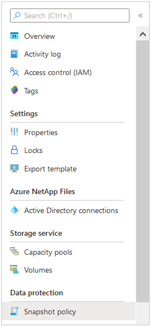
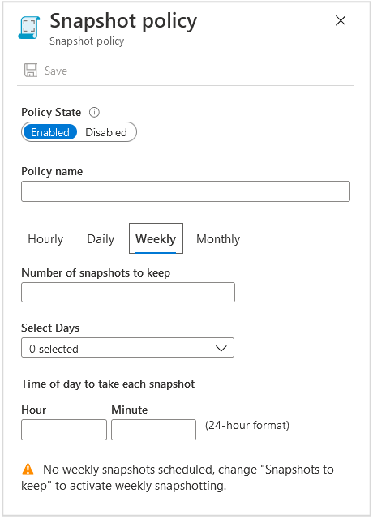
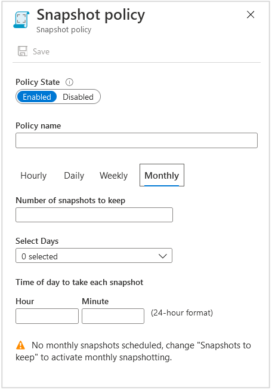
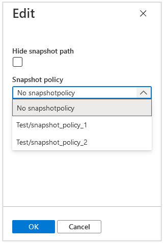

# Manage snapshot policies in Azure NetApp Files

[Snapshots](snapshots-introduction.md) enable point-in-time recovery of volumes. You can schedule for [volume snapshots](snapshots-introduction.md) to be taken automatically by using snapshot policies. You can also modify a snapshot policy as needed, or delete a snapshot policy that you no longer need.  

## Create a snapshot policy 

A snapshot policy enables you to specify the snapshot creation frequency in hourly, daily, weekly, or monthly cycles. You also need to specify the maximum number of snapshots to retain for the volume.  

1.	From the NetApp Account view, select **Snapshot policy**.

    

2.	In the Snapshot Policy window, set Policy State to **Enabled**. 

3.	Select the **Hourly**, **Daily**, **Weekly**, or **Monthly** tab to create hourly, daily, weekly, or monthly snapshot policies. Specify the **Number of snapshots to keep**.  

    > [!IMPORTANT] 
    > For *monthly* snapshot policy definition, be sure to specify a day that will work for all intended months.  If you intend for the monthly snapshot configuration to work for all months in the year, pick a day of the month between 1 and 28.  For example, if you specify `31` (day of the month), the monthly snapshot configuration is skipped for the months that have less than 31 days. 
    > 
        
    > [!NOTE] 
    > Using [policy-based backups for Azure NetApp Files](backup-configure-policy-based.md#configure-a-backup-policy) might affect the number of snapshots to keep. Backup policies involve snapshot policies. And Azure NetApp Files prevents you from deleting the latest backup.
    
    See [Resource limits for Azure NetApp Files](azure-netapp-files-resource-limits.md) about the maximum number of snapshots allowed for a volume. 

    The following example shows hourly snapshot policy configuration. 

    

    The following example shows daily snapshot policy configuration.

    

    The following example shows weekly snapshot policy configuration.

    

    The following example shows monthly snapshot policy configuration.

     

4.	Select **Save**.  

If you need to create additional snapshot policies, repeat Step 3.
The policies you created appear in the Snapshot policy page.

If you want a volume to use the snapshot policy, you need to [apply the policy to the volume](snapshots-manage-policy.md#apply-a-snapshot-policy-to-a-volume). 

## Apply a snapshot policy to a volume

If you want a volume to use a snapshot policy that you created, you need to apply the policy to the volume. 

You cannot apply a snapshot policy to a destination volume in cross-region replication.  

1.	Go to the **Volumes** page, right-click the volume that you want to apply a snapshot policy to, and select **Edit**.

     

2.	In the Edit window, under **Snapshot policy**, select a policy to use for the volume. Select **OK** to apply the policy.  

     

## Modify a snapshot policy 

You can modify an existing snapshot policy to change the policy state, snapshot frequency (hourly, daily, weekly, or monthly), or number of snapshots to keep.

>[!IMPORTANT]
>When modifying a snapshot policy, make note of the naming format. Snapshots created with policies modified before March 2022 will have a long name, for example `daily-0-min-past-1am.2022-11-03_0100`, while snapshots created with policies after March 2022 will have a shorter name, for example `daily.2022-11-29_0100`.
>
> If your snapshot policy is creating snapshots using the long naming convention, modifications to the snapshot policy will not be applied to existing snapshots. The snapshots created with the previous schedule will not be deleted or overwritten by the new schedule. You will have to manually delete the old snapshots.
>
> If your snapshot policy is creating snapshots using the short naming convention, policy modifications will be applied to the existing snapshots. 
 
1.	From the NetApp Account view, select **Snapshot policy**.

2.	Right-click the snapshot policy you want to modify, then select **Edit**.

     

3.	Make the changes in the Snapshot Policy window that appears, then select **Save**. 

4.  You will receive a prompt asking you to confirm that you want to update the Snapshot Policy. Select **Yes** to confirm your choice. 

## Delete a snapshot policy 

You can delete a snapshot policy that you no longer want to keep.   

1.	From the NetApp Account view, select **Snapshot policy**.

2.	Right-click the snapshot policy you want to modify, then select **Delete**.

     

3.	Select **Yes** to confirm that you want to delete the snapshot policy.   

     

## Next steps

* [Troubleshoot snapshot policies](troubleshoot-snapshot-policies.md)
* [Resource limits for Azure NetApp Files](azure-netapp-files-resource-limits.md)
* [Learn more about snapshots](snapshots-introduction.md)
