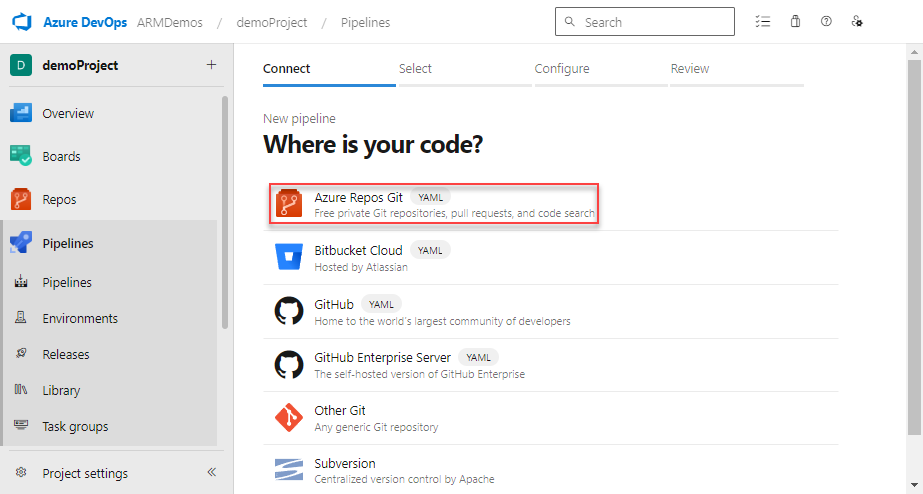

# Quickstart: Integrate Bicep with Azure Pipelines

This quickstart shows you how to integrate Bicep files with Azure Pipelines for continuous integration and continuous deployment (CI/CD).

It provides a short introduction to the pipeline task you need for deploying a Bicep file. If you want more detailed steps on setting up the pipeline and project, see [Deploy Azure resources by using Bicep and Azure Pipelines](/training/paths/bicep-azure-pipelines/).

## Prerequisites

If you don't have an Azure subscription, [create a free account](https://azure.microsoft.com/free/) before you begin.

You need an Azure DevOps organization. If you don't have one, [create one for free](/azure/devops/pipelines/get-started/pipelines-sign-up). If your team already has an Azure DevOps organization, make sure you're an administrator of the Azure DevOps project that you want to use.

You need to have configured a [service connection](/azure/devops/pipelines/library/connect-to-azure) to your Azure subscription. The tasks in the pipeline execute under the identity of the service principal. For steps to create the connection, see [Create a DevOps project](../templates/deployment-tutorial-pipeline.md#create-a-devops-project).

You need a [Bicep file](./quickstart-create-bicep-use-visual-studio-code.md) that defines the infrastructure for your project. This file is in a repository.

## Create pipeline

1. From your Azure DevOps organization, select **Pipelines** and **New pipeline**.

   

1. Specify where your code is stored.

   

1. Select the repository that has the code for your project.

   

1. Select **Starter pipeline** for the type of pipeline to create.

   

## Deploy Bicep files

You can use Azure Resource Group Deployment task or Azure CLI task to deploy a Bicep file.

### Use Azure Resource Group Deployment task

Replace your starter pipeline with the following YAML. It creates a resource group and deploys a Bicep file by using an [Azure Resource Group Deployment task](/azure/devops/pipelines/tasks/deploy/azure-resource-group-deployment):

```yml
trigger:
- master

name: Deploy Bicep files

variables:
  vmImageName: 'ubuntu-latest'

  azureServiceConnection: '<your-connection-name>'
  resourceGroupName: 'exampleRG'
  location: '<your-resource-group-location>'
  templateFile: './main.bicep'
pool:
  vmImage: $(vmImageName)

steps:
- task: AzureResourceManagerTemplateDeployment@3
  inputs:
    deploymentScope: 'Resource Group'
    azureResourceManagerConnection: '$(azureServiceConnection)'
    action: 'Create Or Update Resource Group'
    resourceGroupName: '$(resourceGroupName)'
    location: '$(location)'
    templateLocation: 'Linked artifact'
    csmFile: '$(templateFile)'
    overrideParameters: '-storageAccountType Standard_LRS'
    deploymentMode: 'Incremental'
    deploymentName: 'DeployPipelineTemplate'
```

For the descriptions of the task inputs, see [Azure Resource Group Deployment task](/azure/devops/pipelines/tasks/deploy/azure-resource-group-deployment).

Select **Save**. The build pipeline automatically runs. Go back to the summary for your build pipeline, and watch the status.

### Use Azure CLI task

Replace your starter pipeline with the following YAML. It creates a resource group and deploys a Bicep file by using an [Azure CLI task](/azure/devops/pipelines/tasks/deploy/azure-cli):

```yml
trigger:
- master

name: Deploy Bicep files

variables:
  vmImageName: 'ubuntu-latest'

  azureServiceConnection: '<your-connection-name>'
  resourceGroupName: 'exampleRG'
  location: '<your-resource-group-location>'
  templateFile: 'main.bicep'
pool:
  vmImage: $(vmImageName)

steps:
- task: AzureCLI@2
  inputs:
    azureSubscription: $(azureServiceConnection)
    scriptType: bash
    scriptLocation: inlineScript
    useGlobalConfig: false
    inlineScript: |
      az --version
      az group create --name $(resourceGroupName) --location $(location)
      az deployment group create --resource-group $(resourceGroupName) --template-file $(templateFile)
```

For the descriptions of the task inputs, see [Azure CLI task](/azure/devops/pipelines/tasks/reference/azure-cli-v2). When using the task on air-gapped cloud, you must set the `useGlobalConfig` property of the task to `true`. The default value is `false`.

Select **Save**. The build pipeline automatically runs. Go back to the summary for your build pipeline, and watch the status.

## Clean up resources

When the Azure resources are no longer needed, use the Azure CLI or Azure PowerShell to delete the quickstart resource group.

# [CLI](#tab/CLI)

```azurecli
az group delete --name exampleRG
```

# [PowerShell](#tab/PowerShell)

```azurepowershell
Remove-AzResourceGroup -Name exampleRG
```

---

## Next steps

> [!div class="nextstepaction"]
> [Deploy Bicep files by using GitHub Actions](deploy-github-actions.md)
