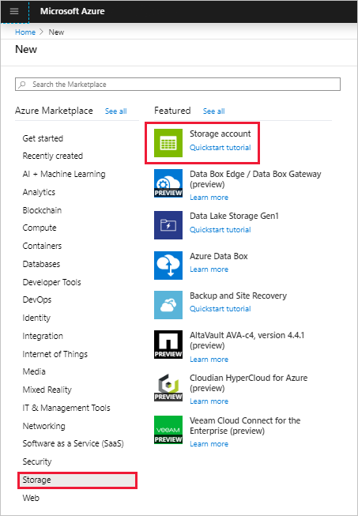
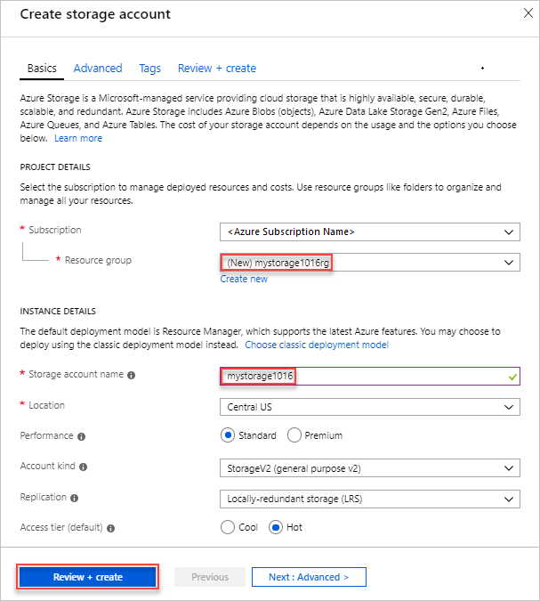
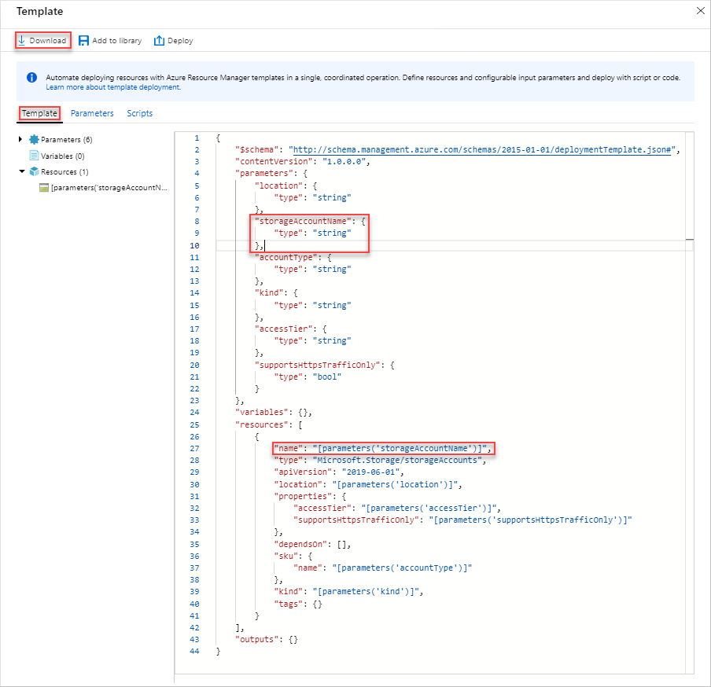
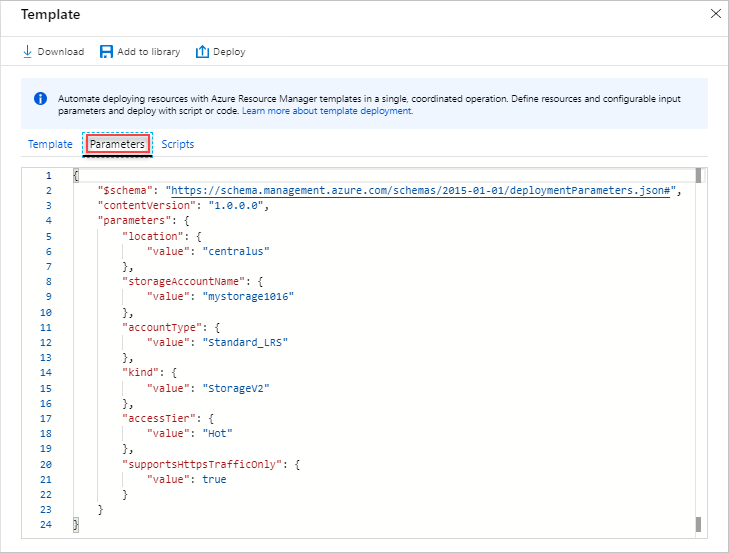
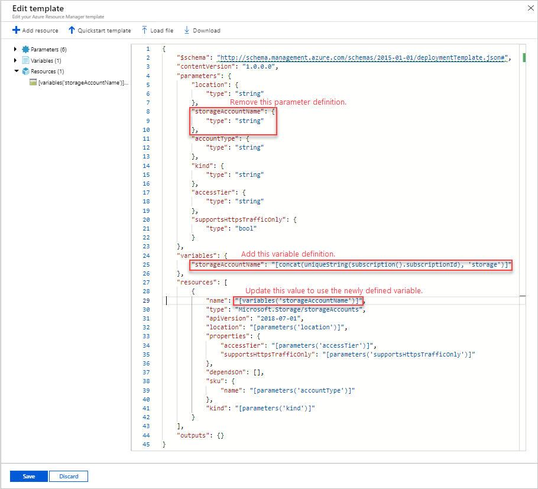
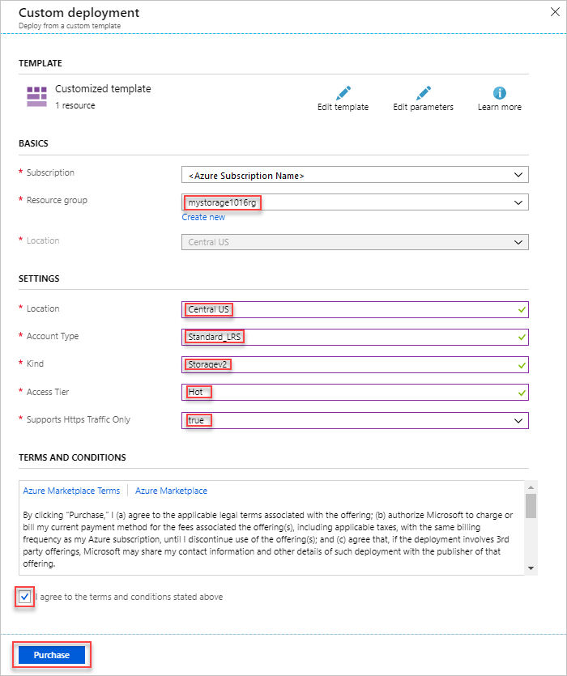

---
title: Create and deploy an Azure Resource Manager template by using the Azure portal | Microsoft Docs
description: Learn how to create your first Azure Resource Manager template using the Azure portal, and how to deploy it.
services: azure-resource-manager
documentationcenter: ''
author: mumian
manager: dougeby
editor: tysonn

ms.service: azure-resource-manager
ms.workload: multiple
ms.tgt_pltfrm: na
ms.devlang: na
ms.date: 08/22/2018
ms.topic: quickstart
ms.author: jgao

---

# Quickstart: Create and deploy Azure Resource Manager templates by using the Azure portal

Learn how to create your first Azure Resource Manager template by generating one using the Azure portal, and how to edit and deploy the template from the portal.

Resource Manager templates are JSON files that define the resources you need to deploy for your solution. To create a template, you don't have to always start from scratch. In this tutorial, you learn how to generate a template from the Azure portal. You can then customize the template and deploy it.

The instructions in this tutorial create an Azure Storage account. You can use the same process to create other Azure resources.

If you don't have an Azure subscription, [create a free account](https://azure.microsoft.com/free/) before you begin.

## Generate a template using the portal

In this section, you create a storage account using the Azure portal. Before you deploy the storage account, you have the option to explore the template generated by the portal based on your configurations. You can save the template and reuse it in the future.

1. Sign in to the [Azure portal](https://portal.azure.com).
2. Select **Create a resource** > **Storage** > **Storage account - blob, file, table, queue**.

    
3. Enter the following information. Make sure to select **Automation options** instead of **Create** in the next step, so you can see the template before it is deployed.

    - **Name**: give your storage account a unique name. On the screenshot, the name is *mystorage0626*.
    - **Resource group**: create a new Azure resource group with the name of your choice. On the screenshot, the resource group name is *mystorage0626rg*.

    You can use the default values for the rest of the properties.

    

    > [!NOTE]
    > Some of the exported templates require some edits before you can deploy them.

4. Select **Automation options** at the bottom of the screen. The portal shows the template on the **Template** tab:

    

    The main pane shows the template. It is a JSON file with four top-level elements. For more information, see [Understand the structure and syntax of Azure Resource Manager Templates](./resource-group-authoring-templates.md)

    Under the **Parameter** element, there are five parameters defined. To see the values you provide during deployment, select the **Parameters** tab.

    

    These values are what you configured in the previous section. Using both the template and the parameters files, you can create an Azure storage account.

5. On the top of the tabs, there are three menu items:

    - **Download**: Download the template and the parameters file to your local computer.
    - **Add to library**: Add the template to the library to be reused in the future.
    - **Deploy**: Deploy the Azure storage account to Azure.

    In this tutorial, you use the **Add to library** option.

6. Select **Add to library**.
7. Enter **Name** and **Description**, and then select **Save**.

> [!NOTE]
> The template library feature is in preview. Most people choose to save their templates to local computer or a public storage such as Github.  

## Edit and deploy the template

In this section, you open the saved template from the template library, edit the template inside the portal, and deploy the revised template. To edit a more complex template, consider using [Visual Studio Code](./resource-manager-quickstart-create-templates-use-visual-studio-code.md) which provides richer edit functionalities.

Azure requires that each Azure service has a unique name. The deployment fails if you enter a storage account name that already exists. To avoid this issue, you can use a template function call uniquestring() to generate a unique storage account name.

1. In the Azure portal, select **All services** from the left menu, enter **template** in the filter box, and then select **Template (PREVIEW)**.

    
2. Select the template you saved in the last section. The name used on the screenshot is *mystorage0626*.
3. Select **Edit**, and then select **Template added**.

    

4. Add a **variables** element, and then add one variable as shown in the following screenshot:

    ```json
    "variables": {
        "storageAccountName": "[concat(uniquestring(resourceGroup().id), 'standardsa')]"
    },
    ```
    

    Two functions are used here: *concat()* and *uniqueString()*. The uniqueString() is helpful for creating a unique name for a resource.

5. Remove the **name** parameter highlighted in the previous screenshot.
6. Update the name element of the **Microsoft.Storage/storageAccounts** resource to use the newly defined variable instead of the parameter:

    ```json
    "name": "[variables('storageAccountName')]",
    ```

    The final template shall look like:

    ```json
    {
        "$schema": "https://schema.management.azure.com/schemas/2015-01-01/deploymentTemplate.json#",
        "contentVersion": "1.0.0.0",
        "parameters": {
            "location": {
                "type": "string"
            },
            "accountType": {
                "type": "string"
            },
            "kind": {
                "type": "string"
            },
            "httpsTrafficOnlyEnabled": {
                "type": "bool"
            }
        },
        "variables": {
            "storageAccountName": "[concat(uniquestring(resourceGroup().id), 'standardsa')]"
        },
        "resources": [
            {
                "apiVersion": "2018-02-01",
                "name": "[variables('storageAccountName')]",
                "location": "[parameters('location')]",
                "type": "Microsoft.Storage/storageAccounts",
                "sku": {
                    "name": "[parameters('accountType')]"
                },
                "kind": "[parameters('kind')]",
                "properties": {
                    "supportsHttpsTrafficOnly": "[parameters('httpsTrafficOnlyEnabled')]",
                    "encryption": {
                        "services": {
                            "blob": {
                                "enabled": true
                            },
                            "file": {
                                "enabled": true
                            }
                        },
                        "keySource": "Microsoft.Storage"
                    }
                },
                "dependsOn": []
            }
        ]
    }
    ```
7. Select **OK**, and then select **Save** to save the changes.
8. Select **Deploy**.
9. Enter the following values:

    - **Subscription**: select your Azure subscription.
    - **Resource group**: name your resource group with a unique name.
    - **Location**: select a location for the resource group.
    - **Location**: select a location for the storage account.  You can use the same location as the resource group.
    - **Account Type**: Enter **Standard_LRS** for this quickstart.
    - **Kind**: Enter **Storage** for this quickstart.
    - **Https Traffic Only Enabled**.  Select **false** for this quickstart.
    - **I agree to the terms and conditions stated above**: (select)

    Here is a screenshot of a sample deployment:

    

10. Select **Purchase**.
11. Select the bell icon (notifications) from the top of the screen to see the deployment status.

    

12. Select **Go to resource group** from the notification pane. You shall see a screen similar to:

    

    You can see the deployment status was successful, and there is only one storage account in the resource group. The storage account name is a unique string generated by the template. To learn more about using Azure storage accounts, see [Quickstart: Upload, download, and list blobs using the Azure portal](../storage/blobs/storage-quickstart-blobs-portal.md).

## Clean up resources

When the Azure resources are no longer needed, clean up the resources you deployed by deleting the resource group.

1. In the Azure portal, select **Resource group** on the left menu.
2. Enter the resource group name in the **Filter by name** field.
3. Select the resource group name.  You shall see the storage account in the resource group.
4. Select **Delete resource group** in the top menu.

## Next steps

In this tutorial, you learned how to generate a template from the Azure portal, and how to deploy the template using the portal. The template used in this Quickstart is a simple template with one Azure resource. When the template is complex, it is easier to use Visual Studio Code or Visual Studio to develop the template.

> [!div class="nextstepaction"]
> [Create templates by using Visual Studio Code](./resource-manager-quickstart-create-templates-use-visual-studio-code.md)
